# 双类 JWT 详细设计

> 后端基座与服务化地基 · 07 认证与服务身份 · 02 双类 JWT · 详细设计

[文档首页](../../../../../../文档首页.md) › [02 双类 JWT](../07_认证与服务身份_02_双类%20JWT.md) › 详细设计　|　[父任务：认证与服务身份](../../07_认证与服务身份.md) · [本阶段需求](../../../../需求/07_需求_认证与服务身份.md) · [排期计划](../../../../计划/01_计划_后端基座与服务化地基.md)

## 1. 概述 <a id="overview"></a>

- **目标**：交付**双类 JWT 的签发与校验机制**——**用户 JWT（`aud=api`）由 Keycloak 签发**（realm 补 audience mapper），**服务 JWT（`aud=service`，短时 + scope + 服务标识）由 BMS 自签**（自持非对称密钥、按需签发）；公钥经 **JWKS** 分发（`/.well-known/jwks.json`）；按 `aud` 分流校验（`exp` / `iss` / `aud` 全校验），实现 `aud` 隔离（用户 token 调内部服务被拒）与「外部 access token 不透传内部」（服务间出站剥离入站 `Authorization`、改附服务 JWT）。
- **依据**：《[架构设计 · 认证与会话](../../../../../../设计/架构设计/14_架构设计_子系统_认证与会话.md)》「服务身份与服务间认证」节；《[架构设计 · API 网关与边缘](../../../../../../设计/架构设计/36_架构设计_子系统_API网关与边缘.md)》「安全边界」节；《[架构设计 · 性能与安全](../../../../../../设计/架构设计/31_架构设计_性能与安全.md)》「服务间安全」节；《[架构设计 · 服务间通信与一致性](../../../../../../设计/架构设计/37_架构设计_子系统_服务间通信与一致性.md)》「服务身份」节；《[微服务演进规划](../../../../../../规划/微服务演进规划.md)》「技术选型」；知识档案《[微服务 · 安全与认证](../../../../../../资料/知识档案/微服务/08_微服务_安全与认证.md)》；需求 [07-2](../../../../需求/07_需求_认证与服务身份.md#r07-2)；前置任务 [07_01 详细设计](../../07_认证与服务身份_01_OIDC%20IdP%20接入/设计/01_详细设计_01_OIDC%20IdP%20接入.md)。
- **范围（本任务）**：
  1. **受众与类型口径**：登记 `aud=api`（用户）/ `aud=service`（服务）常量；服务 JWT 类型 `typ=service`、服务标识 `service`、租户 `tenant`（可选）扩展 claims。
  2. **服务 JWT 自签**：`bms_core/oauth/` 新增 `service_token` 能力域（`BaseServiceTokenIssuer` + `JwtServiceTokenIssuer`，joserfc 签 RS256/ES256），按需签发短时服务 JWT（能力方法，不暴露 HTTP token 端点）。
  3. **JWKS 分发**：由签发域生成标准 JWKS 文档，`identity` 服务宿主根路径 `GET /.well-known/jwks.json`（免鉴权、豁免租户 / 边缘）；多密钥并行、按 `kid` 命中，支持密钥轮换新旧并行验证。
  4. **统一校验内核**：`oauth` 新增 `token_verifier` 能力域（`BaseTokenVerifier.verify(token, *, audience) -> VerifiedToken`，新增 `VerifiedToken` 契约），按期望受众分流——`service` → 本地 JWKS + 本地 issuer；`api` → Keycloak JWKS + IdP issuer（复用 07_01 `idp` 客户端与 JWKS 助手）；`aud` / `iss` / `exp` 不符即拒。
  5. **外部 token 不透传**：`servicecall` 出站增强——剥离入站 `Authorization`，按目标服务签发服务 JWT 并附 `Authorization: Bearer`；开关 `[service_client].options.attach_service_token`（dev 默认关）。
  6. **Keycloak realm 声明**：`deploy/keycloak/bms-realm.json` 客户端 `bms-backend` 补 `aud=api` audience protocol mapper + 护栏单测。
  7. **配置与装配**：`[service_token]` / `[token_verifier]` 配置节；`PLUGIN_WIRINGS` / `register_platform_plugins` 纳管；`get_service_token_issuer` / `get_token_verifier` 依赖导出。
- **不含（明确归口，见第 8 节）**：网关 `openid-connect` 接线与 `ROUTE_HEADERS_SET` 身份注入（07_03）；服务 JWT 校验替换 `[edge].provider` 与内部服务入站鉴权接线（07_03）；OAuth2 token 端点（client_credentials）与 client 注册 / 限流 / 审计（阶段十开放接口）；完整登录链路与用户 JWT 签发映射（阶段六，含 tenant mapper）；真实服务注册与 scope 白名单（阶段十）；mTLS（K8s 阶段）。

## 2. 现状与差距 <a id="gap"></a>

| 关注点 | 现状（07_01 交付后） | 差距（本任务目标） |
| --- | --- | --- |
| 双类 JWT 受众口径 | 无 `aud=api` / `aud=service` 常量与分流 | 登记受众 / 类型常量；按期望受众分流校验 |
| 服务 JWT 签发 | 无；`oauth` 仅占位 `NullOAuthServer`（固定占位令牌、不签发） | 真实 `service_token`（joserfc 自签 RS256/ES256 + 配置化多密钥） |
| JWKS 分发 | 仅客户端侧 JWKS 获取与校验（`idp/jwks.py`） | 自签侧 JWKS 文档生成 + `/.well-known/jwks.json` 端点 |
| 统一校验 | `idp.verify_token`（仅外部 IdP 票据，`aud` 由调用方给） | `token_verifier` 按 `aud` 分流（本地 / IdP 两源），返回 `VerifiedToken` |
| 外部 token 不透传 | `ServiceRequest.headers` 原样出站（注释「服务身份 JWT 注入随 07_03」） | 出站剥离入站 `Authorization`、改附自签服务 JWT |
| realm 声明 | `bms-backend` 无 audience mapper（`aud` 仅 `account`） | 补 `aud=api` audience mapper + 护栏单测 |
| 配置与装配 | 无 `[service_token]` / `[token_verifier]` 分区 | 两配置节 + 两能力接线 + 依赖导出 + 根路径豁免 |

## 3. 交付物清单 <a id="tree"></a>

```text
backend/
├── libs/bms_core/src/bms_core/
│   ├── oauth/
│   │   ├── token.py                           # 新：TOKEN_AUDIENCE_API / TOKEN_AUDIENCE_SERVICE / SERVICE_TOKEN_TYPE
│   │   │                                      #      / DEFAULT_SERVICE_TOKEN_TTL / DEFAULT_SERVICE_TOKEN_ISSUER
│   │   │                                      #      / ServiceTokenSpec + BaseServiceTokenIssuer + get_service_token_issuer
│   │   ├── keys.py                            # 新：TokenKey（kid/algorithm/公私钥）+ JWKS 文档 / JWK Set 构建（joserfc）
│   │   ├── jwt.py                             # 新：JwtServiceTokenIssuer（自签服务 JWT）+ JwtServiceTokenIssuerFactory
│   │   ├── verify.py                          # 新：VerifiedToken + BaseTokenVerifier + UnifiedTokenVerifier
│   │   │                                      #      + UnifiedTokenVerifierFactory + get_token_verifier
│   │   ├── null.py                            # 改：NullServiceTokenIssuer / NullTokenVerifier
│   │   └── __init__.py                        # 改：域说明（签发 + 校验 + JWKS）
│   ├── core/config.py                         # 改：TokenKeySettings / ServiceTokenSettings + Settings.service_token / token_verifier
│   ├── core/assembly.py                       # 改：PLUGIN_WIRINGS 增 service_token / token_verifier；登记 jwt / unified 工厂
│   ├── api/deps.py                            # 改：导出 get_service_token_issuer / get_token_verifier
│   ├── servicecall/base.py                    # 改：ServiceCallPolicy 增 scopes（签发 scope 来源）
│   ├── servicecall/http.py                    # 改：注入签发者；出站剥 Authorization + 附服务 JWT
│   ├── db/tenant.py                           # 改：DEFAULT_EXEMPT_PATHS 增 /.well-known/jwks.json
│   └── oauth/base.py                          # 改：域说明补「服务身份签发 / 校验」口径（不改既有契约）
├── services/identity/src/bms_identity/
│   ├── api/wellknown.py                       # 新：GET /.well-known/jwks.json（免鉴权、纯 JWKS 文档）
│   ├── api/router.py                          # 改：聚合含 wellknown 路由
│   └── main.py                                # 改：service_routers 含 wellknown.router
├── config.toml                                # 改：[service_token] / [token_verifier]；[tenant] / [edge] 豁免路径补 jwks
└── deploy/.env.example                        # 改：BMS_SERVICE_TOKEN__KEYS 占位说明（私钥不入库不入镜像）

deploy/keycloak/bms-realm.json                 # 改：bms-backend 补 aud=api audience protocol mapper

backend/libs/bms_core/tests/servicecall/test_servicecall.py   # 改：出站剥 Authorization + 附服务 JWT 断言
backend/services/identity/tests/oauth/
├── test_service_token.py                      # 新：签发 / JWKS / 轮换 / 配置 / 部署件护栏
├── test_token_verifier.py                     # 新：aud 分流 / 隔离 / api 经 IdP / service 经本地
└── test_wellknown_jwks.py                     # 新：JWKS 路由装配与响应

bms文档/
├── 后端基类清单.md                             # 改：oauth 行补 service_token / token_verifier / VerifiedToken；§10 继承链
├── 设计/架构设计/04_架构设计_后端基础类体系.md   # 改：oauth 能力域登记（服务身份签发 / 校验 + JWKS）
├── 规范/后端开发规范.md                         # 改：§3.1 增「服务间身份与服务 JWT 必须走基座」强制条
├── 规范/部署发布规范.md                         # 改：增「服务 JWT 密钥与 JWKS 分发」检查项
├── 项目/02_后端基座与服务化地基/…
│   ├── 计划/01_计划_后端基座与服务化地基.md      # 改：§1 台账/§2 已完成/§3 移除 07_02/§4 甘特
│   ├── 任务/07_认证与服务身份/07_认证与服务身份.md  # 改：子任务表状态与完成日期
│   ├── 任务/07_…_02_…/                          # 改：任务状态/完成日期 + 实施/测试记录
│   └── 任务/07_…_03_… 任务文档                  # 改：补「前置契约（已交付）」（签发 / 校验 / JWKS 接线点）
└── 资料/开发服务器/linux/Keycloak部署使用说明.md  # 改：audience mapper 与 realm 重导入口径

test/
└── scripts/kiwi/cases|exports/…                 # 新：本任务用例登记输入与回读
```

## 4. 领域设计 <a id="design"></a>

### 4.1 双类 JWT 职责划分与受众口径 <a id="audience"></a>

| 类 | 受众 `aud` | 类型 `typ` | 签发方 `iss` | 校验源 | 用途 |
| --- | --- | --- | --- | --- | --- |
| 用户 JWT | `api` | （IdP 缺省） | Keycloak issuer（如 `http://<idp-host>:8090/realms/bms`） | Keycloak JWKS（经 `idp` 客户端） | 用户经网关访问业务 API |
| 服务 JWT | `service` | `service` | BMS 自配 issuer（默认 `bms`） | BMS 自签 JWKS（本地密钥集） | 服务间东西向直连调用 |

- **常量**（`oauth/token.py`）：`TOKEN_AUDIENCE_API = "api"`、`TOKEN_AUDIENCE_SERVICE = "service"`、`SERVICE_TOKEN_TYPE = "service"`、`DEFAULT_SERVICE_TOKEN_ISSUER = "bms"`、`DEFAULT_SERVICE_TOKEN_TTL = 300`。
- **隔离口径**：受众是「期望输入」而非从票据自读——校验方声明期望受众，内核按受众选定 JWKS 与 issuer；用户 token（`aud=api`、`iss=Keycloak`）以 `service` 期望校验时，本地 JWKS 选键失败 / `iss` 不符 → `AuthError`（20001），**用户 token 直调内部服务被拒**。

### 4.2 服务 JWT 自签能力域 <a id="service-token"></a>

**契约** `bms_core/oauth/token.py`：

```text
oauth/token.py
├── TOKEN_AUDIENCE_API / TOKEN_AUDIENCE_SERVICE / SERVICE_TOKEN_TYPE
├── DEFAULT_SERVICE_TOKEN_ISSUER / DEFAULT_SERVICE_TOKEN_TTL
├── ServiceTokenSpec（frozen dataclass，BaseObject）：service / scopes / tenant / ttl
├── BaseServiceTokenIssuer（BasePluggable，key = plugin_key = "service_token"）
│     ├── 抽象 issue(spec) -> OAuthToken（access_token 为紧凑 JWT；expires_in / scopes 回填）
│     ├── 抽象 jwks() -> Mapping[str, object]（标准 JWKS 文档）
│     └── 抽象 verify(token) -> IdentityClaims（本地 JWKS 验签 + iss == 本地 issuer；供校验内核复用）
└── get_service_token_issuer(request) -> BaseServiceTokenIssuer
```

**claims 固定契约**（服务 JWT）：

| claim | 值 | 说明 |
| --- | --- | --- |
| `iss` | `[service_token].issuer` | 默认 `bms`（可配稳定 URI） |
| `sub` | `spec.service` | 服务标识（如 `platform`） |
| `aud` | `service` | 服务受众（常量） |
| `exp` | `now + ttl` | 有效期（默认 300s） |
| `iat` | `now` | 签发时间 |
| `jti` | 随机 | 令牌 id（撤销 / 追溯预留） |
| `scope` | 空格分隔 | 由 `spec.scopes` 拼接 |
| `typ` | `service` | 扩展：令牌类型 |
| `service` | `spec.service` | 扩展：服务标识（与 `sub` 同值，显式可读） |
| `tenant` | `spec.tenant` | 扩展（可选）：租户编码 |

**真实实现** `bms_core/oauth/jwt.py`：

| 成员 | 语义 |
| --- | --- |
| `JwtServiceTokenIssuer`（`plugin_name = "jwt"`） | 构造注入 `issuer` / `ttl` / `active_kid` / `keys: Mapping[str, TokenKey]` / `algorithm` 白名单；`issue` 经 joserfc 按 `active_kid` 选私钥签 JWT；`jwks` 输出全部公钥；`verify` 经本地 JWKS 验签 + `iss` / `aud=service` 校验 |
| `JwtServiceTokenIssuerFactory`（`plugin_key = "service_token"`） | 读 `[service_token]`；构造 `JwtServiceTokenIssuer`（keys 空集允许构造——校验方才需要公钥，签发时无私钥才拒） |

- **算法白名单**：签发与验签只接受 **`RS256` / `ES256`**（复用 `idp/jwks.DEFAULT_ALGORITHMS`），禁对称算法防签名绕过。
- **时间容差**：复用 `idp/jwks.DEFAULT_LEEWAY`（30s），容忍时钟偏差。

### 4.3 密钥管理与 JWKS 文档 <a id="keys"></a>

**`bms_core/oauth/keys.py`**：

- `TokenKey`（frozen dataclass，`BaseObject`）：`kid` / `algorithm`（RS256 / ES256）/ `public_key`（PEM，可入配置）/ `private_key`（PEM，**只经环境变量 / Secret 注入**）；提供 `jwk()`（公钥 JWK 字典，含 `kid` / `alg` / `use=sig`）与 `to_joserfc_key()`（导入为 joserfc 密钥对象，私钥优先、缺私钥回落公钥）。
- `build_jwks(keys) -> {"keys": [公钥 JWK, ...]}`：标准 JWKS 文档（只含公钥，按 `kid` 排序，确定性输出）。
- `to_key_set(keys)`：构造 joserfc `KeySet`（验签用，含全部密钥）。
- **多密钥并行 / 轮换**：`keys` 为 **`kid → TokenKey` 映射**（kid 为键，天然支持按 `kid` 并行）；`active_kid` 指定当前签名密钥；JWKS 输出全部公钥，验签按票据 `kid` 命中——轮换时新旧公钥并存（旧密钥保留在 `keys` 中即可并行验证），淘汰旧密钥后其签发票据自然失效。

**配置形态**（`[service_token]`，非敏感项；私钥经环境变量）：

```toml
[service_token]
# 签发实现选择（插件化；空串 = null 占位；jwt = 真实自签实现）
provider = "jwt"
# 自签 issuer（服务 JWT 的 iss）
issuer = "bms"
# 服务 JWT 有效期（秒）
ttl_seconds = 300
# 当前签名密钥 kid（须在 keys 中且持有私钥）
active_kid = ""
# 签发 / 验签密钥集（kid → {algorithm, public_key, private_key}）
# 公钥 PEM 可入本配置；私钥 PEM 一律经环境变量注入（如
#   BMS_SERVICE_TOKEN__KEYS='{"k1":{"algorithm":"RS256","public_key":"...","private_key":"..."}}'
# 或按键位 BMS_SERVICE_TOKEN__KEYS__k1__PRIVATE_KEY），不入 Git / 不入镜像 / 不落日志。
keys = {}
```

- `TokenKeySettings`（`BaseSettings`）：`algorithm = "RS256"` / `public_key = ""` / `private_key = ""`；`ServiceTokenSettings(PluginSelection)` 追加 `issuer` / `ttl_seconds` / `active_kid` / `keys: dict[str, TokenKeySettings]`。
- **开发 / 测试**：以内存生成密钥对（joserfc `RSAKey.generate_key` / `ECKey.generate_key`）或环境变量注入，测试不落盘、不硬编码私钥；mjbk 冒烟按《Keycloak 部署使用说明》生成密钥对注入 `deploy/.env`（已 gitignore）。

### 4.4 JWKS 分发端点 <a id="jwks-endpoint"></a>

- **形态**：`GET /.well-known/jwks.json`（标准 JWKS 文档，**无鉴权、无统一响应包体**）；由 **`identity` 服务**宿主（认证与身份服务，与 07_01 idp 客户端同域）。
- **路由**：`bms_identity/api/wellknown.py::router`（`BaseRouter(key="wellknown", prefix="/.well-known", default_responses=False)`），`GET /jwks.json` 取 `request.app.state.service_token.jwks()` 直接返回（`service_token` 未接真实实现 / 无密钥时返回 `{"keys": []}`）。
- **暴露口径**：**直连宿主端口**（不经 APISIX 业务路由；JWKS 属公开基础设施端点，内部服务与网关可直达取用，避免网关认证环路）；K8s 阶段平移为 `.well-known` 路由 / ConfigMap。
- **豁免**：加入 `[tenant].exempt_paths` 与 `[edge].exempt_paths`（不解析租户、不参与边缘旁路拒绝），`DEFAULT_EXEMPT_PATHS` 同步。

### 4.5 统一校验内核 <a id="verifier"></a>

**契约** `bms_core/oauth/verify.py`：

```text
oauth/verify.py
├── VerifiedToken（frozen dataclass，BaseObject）：subject / token_type / audience / issuer / scopes
│     / service / tenant / expires_at / issued_at / token_id / payload
├── BaseTokenVerifier（BasePluggable，key = plugin_key = "token_verifier"）
│     └── 抽象 verify(token, *, audience) -> VerifiedToken
├── UnifiedTokenVerifier（plugin_name = "unified"）：按期望受众分流校验
└── get_token_verifier(request) -> BaseTokenVerifier
```

**分流逻辑**（`UnifiedTokenVerifier.verify`）：

| 期望受众 | 校验源 | 校验项 | 产物映射 |
| --- | --- | --- | --- |
| `service` | `service_token`（本地 JWKS + 本地 issuer） | 签名 / `exp` / `iss == [service_token].issuer` / `aud` 命中 `service` | `service=sub` / `tenant` / `scopes`（`scope` 拆分） |
| `api` | `identity_provider`（Keycloak JWKS，复用 `verify_token`） | 签名 / `exp` / `iss == [identity_provider].issuer` / `aud` 命中 `api` | `subject` / `scopes`；`service` 空 |
| 其它 | — | 未登记受众 | `ParamError`（10001） |

- 失败语义：验签 / 过期 / `iss` 不符 / `aud` 不符 → **`AuthError`（20001 / 401）**；IdP JWKS 不可达 → **`ServiceUnavailableError`（10007 / 503）**；配置缺失 → `ConfigError`（40001）。
- `null` 实现（`oauth/null.py`）：`NullTokenVerifier.verify` 返回占位 `VerifiedToken`（占位期不验签、恒定通过，语义与其余 null 实现一致）。

### 4.6 服务间出站换券（外部 token 不透传） <a id="outbound"></a>

**`servicecall` 出站增强**：

- `ServiceCallPolicy` 增 `scopes: tuple[str, ...] = ()`（本调用所需 scope，作为签发服务 JWT 的 scope 来源）。
- `HttpServiceClient` 构造注入可选 `BaseServiceTokenIssuer` 与开关 `attach_service_token: bool`：
  - **无条件剥离**出站头中的 `Authorization`（大小写不敏感）——**外部 access token / 用户 token 一律不透传内部**；
  - 开关开启且签发者就绪时：按 `ServiceTokenSpec(service=request.service, scopes=policy.scopes)` 签发服务 JWT，附 `Authorization: Bearer <token>`；签发者未就绪 / 开关关闭则仅剥除不透传，不带服务身份（调用方可显式处理）。
- 装配工厂 `HttpServiceClientFactory`：读 `[service_client].options.attach_service_token`（默认 `false`，dev 关、prod 开）；解析 `service_token` 插件注入。
- 口径：服务间调用**不经网关**、只经公开契约；调用侧限流 / 熔断 / 降级不变。

### 4.7 Keycloak realm 声明变更 <a id="realm"></a>

`deploy/keycloak/bms-realm.json` 客户端 `bms-backend` 增 `protocolMappers`：

| mapper | 类型 | 配置 | 目的 |
| --- | --- | --- | --- |
| `aud-api` | `oidc-audience-mapper` | `included.custom.audience = "api"`、`access.token.claim = true` | 用户 JWT `aud` 含 `api`，网关与后端按 `aud=api` 校验 |

- 声明式入 Git（无明文密钥）；护栏单测断言 mapper 存在且受众为 `api`。
- **重导入口径**：`--import-realm` 对**已存在 realm 跳过**；mjbk 存量 realm 需按《Keycloak 部署使用说明》执行一次 `kc.sh import --override`（或删除重建），新环境启动即生效——写入部署说明与测试记录。

### 4.8 配置与装配 <a id="config"></a>

- `Settings` 增 `service_token: ServiceTokenSettings` / `token_verifier: PluginSelection`；`config.toml` 增 `[service_token]`（§4.3）与 `[token_verifier]`（`provider = "unified"`）。
- `PLUGIN_WIRINGS` 增 `PluginWiring("service_token", BaseServiceTokenIssuer, "service_token", "service_token")` 与 `PluginWiring("token_verifier", BaseTokenVerifier, "token_verifier", "token_verifier")`。
- `_NULL_MODULES` 不变（`bms_core.oauth.null` 已在册，新增两个 null 类自动登记）。
- `register_platform_plugins` 增 `register_plugin("service_token", "jwt", JwtServiceTokenIssuerFactory(settings))` 与 `register_plugin("token_verifier", "unified", UnifiedTokenVerifierFactory(settings))`。
- `api/deps.py` 导出 `get_service_token_issuer` / `get_token_verifier`。

### 4.9 K8s 平移口径 <a id="k8s"></a>

| 单机（本任务） | K8s 阶段 | 说明 |
| --- | --- | --- |
| 自签密钥经 `.env` / 环境变量注入 | K8s Secret | 凭据外部化平移；签发私钥只在签发侧 |
| `/.well-known/jwks.json` 直连宿主端口 | Service / Ingress（`.well-known` 路由） | JWKS 分发语义不变 |
| 服务 JWT 应用层身份 | Linkerd 自动 mTLS（传输层身份） | 两层互补；应用层 `aud` 隔离不变 |
| 出站剥 `Authorization` + 附服务 JWT | 网格身份（可选叠加） | 「外部 token 不透传」不变 |

## 5. 失败分支与边界 <a id="failures"></a>

| 场景 | 处理 |
| --- | --- |
| 用户 token（`aud=api`）调内部服务（期望 `service`） | 本地 JWKS 选键失败 / `iss` 不符 → `AuthError`（20001 / 401） |
| 服务 token（`aud=service`）当用户 token（期望 `api`） | IdP JWKS 验签失败 / `iss` 不符 → `AuthError`（20001 / 401） |
| 票据过期 / `exp` 超容差 | `AuthError`（20001 / 401） |
| `aud` 未命中期望受众 | `AuthError`（20001 / 401） |
| 期望受众非 `api` / `service` | `ParamError`（10001） |
| 签名算法非白名单（HS256 等） | `AuthError`（20001 / 401），签发侧拒绝非白名单算法 |
| `kid` 未命中（密钥轮换） | 本地验签：JWKS 含全部公钥，按 `kid` 命中；未命中 → `AuthError`；IdP 侧沿用 07_01「强制刷新一次」 |
| 未配置签名私钥即签发 | `ConfigError`（40001）；构造不拒（校验方只需公钥） |
| `active_kid` 不在 `keys` / 无私钥 | 签发 `ConfigError`（40001），启动不阻 |
| `[service_token].provider` 空 / 未配密钥 | `null` 占位：`issue` 返回占位令牌、`jwks` 空集、`verify` 占位通过（占位语义） |
| IdP（Keycloak）JWKS 不可达 | `ServiceUnavailableError`（10007 / 503） |
| 出站携带用户 / 外部 `Authorization` | 剥离，不透传内部；开关开启时改附服务 JWT |
| 签发者未就绪而出站开关开 | 仅剥除不透传，不带服务身份（不整体失败） |
| 网关旁路 / 内部服务入站鉴权接线 | 归 07_03（本任务交付校验内核与出站机制，不接网关与入站依赖） |
| 达梦 / 三库方言 | 不涉及（JWT 签发校验不直连数据库） |

## 6. 测试设计与验收映射 <a id="tests"></a>

用例先登记 Kiwi TCMS（本任务登记 **1 条策展用例**，多条断言共用同一 `kiwi_id`，编号以平台回读为准，见第 9 节）。

| 用例 / 文件 | 类型 | 断言要点 |
| --- | --- | --- |
| `services/identity/tests/oauth/test_service_token.py` | 单元 | 常量与契约（`ServiceTokenSpec` / `OAuthToken` 回填）；`JwtServiceTokenIssuer` 签发 JWT 含固定 + 扩展 claims（`typ/service/tenant/scope`）且 `aud=service` / `iss` 正确；`jwks` 只含公钥、按 `kid` 命中；**多密钥轮换并行验证**（旧 kid 票据在新 JWKS 下仍通过、淘汰后拒绝）；`active_kid` 缺私钥 / 未配 → `ConfigError`；算法白名单；`[service_token]` 配置解析（keys 字典 + 环境变量私钥）；装配解析到 `JwtServiceTokenIssuer` |
| `services/identity/tests/oauth/test_token_verifier.py` | 单元 | `UnifiedTokenVerifier` 按受众分流：`service` 经本地 JWKS 通过并回填 `VerifiedToken`（service / tenant / scopes）；`api` 经 MockTransport 的 IdP 通过；**aud 隔离**（用户 token 以 `service` 期望被拒、服务 token 以 `api` 期望被拒）；过期 / `iss` 不符 / 签名错 → `AuthError`；受众非法 → `ParamError`；IdP 不可达 → `ServiceUnavailableError`；`get_token_verifier` 解析 |
| `services/identity/tests/oauth/test_wellknown_jwks.py` | 单元（装配） | `identity` 应用可启动、`GET /.well-known/jwks.json` 返回 `{"keys":[...]}` 公钥集（含 `kid` / `alg`）、无统一响应包体；无密钥时返回空集；豁免租户 / 边缘（路径不触发租户解析拒绝） |
| `libs/bms_core/tests/servicecall/test_servicecall.py` | 单元 | 出站**剥离入站 `Authorization`**（大小写不敏感）；开关开启 + 签发者就绪 → 附 `Authorization: Bearer <服务 JWT>`（MockTransport 断言请求头）；开关关闭 → 不带服务身份 |
| `services/identity/tests/oauth/test_service_token.py`（部署件护栏） | 单元 | `deploy/keycloak/bms-realm.json` 客户端 `bms-backend` 含 `aud-api` audience mapper（`included.custom.audience == "api"`）且无明文密钥 |
| 装配 / 回归 | 单元 | `PLUGIN_WIRINGS` / `_NULL_MODULES` / `Settings` 完整；既有全量 `pytest` / `ruff` / `pyright` / 基座校验全绿（无行为回归） |
| mjbk 真实冒烟 | 集成（人工留痕） | 生成密钥对注入 `deploy/.env` → 拉起 identity 服务 → `curl /.well-known/jwks.json` 公钥可达 → 服务 JWT 签验通过；Keycloak 重导入 realm（含 `aud=api`）→ 真实用户令牌经 `token_verifier`（`audience=api`）通过、以 `service` 期望被拒 |

验收映射：

| 完成标准（需求 07-2） | 验证方式 |
| --- | --- |
| 双类 JWT 可签发与校验 | 服务 JWT 自签（`JwtServiceTokenIssuer`）+ 用户 JWT 经 IdP（`UnifiedTokenVerifier` api 分流）单测 + mjbk 冒烟 |
| `aud` 区分生效（用户 token 调内部服务被拒） | `UnifiedTokenVerifier` aud 隔离用例；mjbk 用户令牌以 `service` 期望被拒 |
| 密钥轮换可并行验证 | `jwks` 多密钥 + 轮换用例；mjbk JWKS 端点公钥集 |
| 外部 token 不透传内部 | `servicecall` 出站剥 `Authorization` 用例 |
| 校验通过 | `pytest` / `ruff` / `pyright` / `check-base` / `check-backend-base` / `check-service-boundaries` / `check-status` 全绿 |

## 7. 登记落点 <a id="registry-writeback"></a>

| 落点 | 内容 |
| --- | --- |
| 《后端基类清单》 | oauth 行补 `service_token` / `token_verifier` 能力域、`JwtServiceTokenIssuer`、`UnifiedTokenVerifier`、`VerifiedToken` / `ServiceTokenSpec` 契约；§10 继承链补两条 |
| 《架构设计 · 后端基础类体系》 | oauth 能力域登记补「服务身份签发 / 统一校验 / JWKS 分发」语义与落点 |
| 《后端开发规范》 | §3.1 增「服务间身份与服务 JWT 必须走基座（签发 `service_token` / 校验 `token_verifier`）；禁自签 JWT、禁透传外部 token；自签密钥经环境变量」强制条 |
| 《部署发布规范》 | 增「服务 JWT 密钥与 JWKS 分发」检查项（私钥外部化、`active_kid`、JWKS 端点豁免） |
| 《Keycloak 部署使用说明》 | 增 audience mapper 与 realm 重导入（`import --override`）口径 |
| 计划 | §1 工时台账与计数；§2 已完成表（07_02 行）；§3 移除 07_02；§4 甘特调整 |
| 任务 / 父任务 | 状态与完成日期两处一致（需求文档不承载进度） |
| 下游任务文档 | 07_03 补「前置契约（已交付）」：`service_token` / `token_verifier` / `VerifiedToken` / JWKS 端点 / `aud` 常量 / 出站换券，及 `[edge].provider` 替换与 `ROUTE_HEADERS_SET` 接线点 |
| Kiwi TCMS / 测试资产仓 | 登记本任务用例并回读编号；`test/scripts/kiwi/cases|exports/` 对应文件 |
| 实施 / 测试记录 | 任务目录 `实施/`、`测试/` 各一份 |

## 8. 边界与开放项 <a id="boundary"></a>

- **归 07_03**：网关 `openid-connect` 接线（APISIX 按 Keycloak issuer/JWKS 校验用户 JWT）与 `ROUTE_HEADERS_SET` 注入真实 claims；后端服务入站服务 JWT 校验（替换 `[edge].provider`，复用 `token_verifier`）；`require_auth` 切真实用户体系。
- **归阶段六**：完整登录链路（回调 / state 与 nonce / PKCE）与用户 JWT 的租户等 claims 映射（Keycloak mappers / 用户上下文）；JIT 建号。
- **归阶段十**：OAuth2 token 端点（client_credentials）与 `sys_client` 注册、scope 白名单、按 client 限流与调用审计；`oauth_server` 真实实现（复用本任务签发内核）。
- **开放项（性能）**：出站按调用即时签发服务 JWT（RSA 签名开销毫秒级）；后续可加「按服务 + scope 缓存至 `exp` 前」优化（不改契约）。
- **开放项（密钥治理）**：私钥经环境变量 / Secret 注入；Vault / KMS 托管随运维阶段；密钥生成与轮换流程写入部署说明。
- **开放项（realm 重导入）**：存量 realm 变更需 `import --override`（破坏性、需确认）；新环境启动即生效。
- **不改**：`oauth` 既有 `BaseOAuthServer` / `BaseScopeChecker` 契约与 `GRANT_TYPES` 等常量、`idp` 既有契约、服务内 `/api/v1` 前缀与响应体、既有 Kiwi 用例号（46 / 2179）。

```mermaid
flowchart LR
    A["Kiwi 用例登记（先登记后编码）"] --> B["契约与内核（oauth/token+keys+jwt+verify+null）"]
    B --> C["配置与装配（ServiceTokenSettings / 两 wiring / 工厂登记 / deps）"]
    C --> D["JWKS 端点（identity /.well-known/jwks.json + 豁免）"]
    D --> E["出站换券（servicecall policy+client+factory）"]
    E --> F["realm audience mapper + 部署件护栏"]
    F --> G["用例编码 + 门禁全绿"]
    G --> H["mjbk 真实冒烟（JWKS / 服务 JWT / Keycloak 用户令牌）"]
    H --> I["登记回写 + 实施/测试记录 + 提交"]
    I --> J["07_03 前置契约标注 + 偏差遗留闭环"]
```

## 9. 实施步骤 <a id="steps"></a>



1. 读《[KiwiTCMS 部署使用说明](../../../../../../资料/开发服务器/linux/KiwiTCMS部署使用说明.md)》「用例约定」节，登记本任务用例并**回读编号**（输入文件落 `test/scripts/kiwi/cases/`；先登记后编码）。
2. 新增 `bms_core/oauth/token.py`、`keys.py`、`jwt.py`、`verify.py`；改 `oauth/null.py` / `oauth/base.py` / `oauth/__init__.py`。
3. 改 `core/config.py`（`TokenKeySettings` / `ServiceTokenSettings` / `Settings` 两字段）；`core/assembly.py`（两 wiring + 两工厂登记）；`api/deps.py`（两提供者导出）；`config.toml`（`[service_token]` / `[token_verifier]` / 豁免路径）。
4. 新增 `bms_identity/api/wellknown.py`；改 `api/router.py` / `main.py`；改 `db/tenant.py`（`DEFAULT_EXEMPT_PATHS`）。
5. 改 `servicecall/base.py`（`ServiceCallPolicy.scopes`）与 `servicecall/http.py`（出站换券）+ `core/assembly.py::HttpServiceClientFactory`。
6. 改 `deploy/keycloak/bms-realm.json`（audience mapper）+ `deploy/.env.example`（密钥占位）+ `资料/开发服务器/linux/Keycloak部署使用说明.md`。
7. 用例：`test_service_token.py` / `test_token_verifier.py` / `test_wellknown_jwks.py` / `test_servicecall.py`；既有全量回归。
8. 门禁：`uv run pytest -q --cov=bms_core --cov-branch` / `ruff check` / `ruff format --check` / `pyright`；`check-base` / `check-backend-base` / `check-service-boundaries` / `check-status` / `check-preflight --fast` 全绿。
9. **mjbk 真实冒烟**（远程操作，先读部署说明）：生成密钥对注入 `.env` → 拉起 identity 服务 → JWKS 端点 → 服务 JWT 签验；Keycloak 重导入 realm → 真实用户令牌 `aud=api` 校验通过 / 以 `service` 期望被拒；留痕到测试记录。
10. 登记回写 + 实施 / 测试记录 + 代码与文档分开提交 + 07_03 前置契约标注与偏差遗留闭环。

关键命令：

```bash
cd backend
uv run pytest -q --cov=bms_core --cov-branch
uv run ruff check . && uv run ruff format --check . && uv run pyright
uv run python -m ops.gateway_config check   # 确认网关生成件无漂移（本任务不改网关）
# 仓库根
python3 scripts/tools/base-check/check-base.py
python3 scripts/tools/base-check/check-backend-base.py
python3 scripts/tools/base-check/check-service-boundaries.py
python3 scripts/tools/check-docs/check-status.py
python3 scripts/tools/preflight/check-preflight.py --fast
```

## 10. 决策记录（对齐记录） <a id="align"></a>

| # | 事项 | 结论（逐项确认） |
| --- | --- | --- |
| 1 | 双类 JWT 签发主体 | **用户 JWT = Keycloak**（realm audience mapper）；**服务 JWT = BMS 自签** |
| 2 | 能力域落点 | 扩展 `bms_core/oauth/` |
| 3 | JOSE 引擎 | 复用 **joserfc**（已在依赖内，与 07_01 验签同引擎；BSD-3） |
| 4 | JWKS 分发 | 根路径 `/.well-known/jwks.json`，由 **identity 服务宿主**（免鉴权、豁免租户 / 边缘） |
| 5 | 服务 JWT 签发入口 | 仅能力方法，不加 HTTP token 端点（OAuth2 端点归阶段十） |
| 6 | 密钥管理 | `[service_token].keys`（**kid → 密钥映射**）+ `active_kid`；私钥经环境变量注入；JWKS 输出全部公钥、按 `kid` 命中、新旧并行 |
| 7 | 统一校验内核 | `token_verifier` + **新增 `VerifiedToken` 契约**；按受众分流（service→本地、api→IdP） |
| 8 | 契约划分 | `service_token`（签发 + JWKS）+ `token_verifier`（校验）；`oauth_server` 保持占位 |
| 9 | 服务 JWT claims | 标准 + 扩展 `typ="service"` / `service` / `tenant`（可选） |
| 10 | 用户 JWT 校验配置 | 复用 `[identity_provider]` + 代码常量 `aud=api` |
| 11 | TTL / scope | `ttl_seconds` 默认 300；scope 调用方传 |
| 12 | realm 声明 | 本任务补 `aud=api` audience mapper + 护栏单测 |
| 13 | 出站换券 | 扩 `service_client`：剥入站 `Authorization` + 附服务 JWT；`options.attach_service_token` 开关（dev 默认关） |
| 14 | 验证深度 | 本机单测 + 装配 + mjbk 真实冒烟 |
| 15 | `iss` 默认 | `bms`（可配） |

## 11. 参考文档 <a id="ref"></a>

- [架构设计 · 认证与会话](../../../../../../设计/架构设计/14_架构设计_子系统_认证与会话.md)「服务身份与服务间认证」「开放接口鉴权」节
- [架构设计 · API 网关与边缘](../../../../../../设计/架构设计/36_架构设计_子系统_API网关与边缘.md)「安全边界」节
- [架构设计 · 性能与安全](../../../../../../设计/架构设计/31_架构设计_性能与安全.md)「服务间安全」节
- [架构设计 · 服务间通信与一致性](../../../../../../设计/架构设计/37_架构设计_子系统_服务间通信与一致性.md)「服务身份」节
- [微服务演进规划](../../../../../../规划/微服务演进规划.md)「技术选型」「服务化地基要求与门禁（S4）」节
- [知识档案 · 微服务 · 安全与认证](../../../../../../资料/知识档案/微服务/08_微服务_安全与认证.md)
- [需求 07-2：双类 JWT](../../../../需求/07_需求_认证与服务身份.md#r07-2)
- [07_01 OIDC IdP 接入详细设计](../../07_认证与服务身份_01_OIDC%20IdP%20接入/设计/01_详细设计_01_OIDC%20IdP%20接入.md)
- [04_02 边缘认证与请求净化详细设计](../../04_API网关与边缘/04_API网关与边缘_02_边缘认证与请求净化/设计/01_详细设计_02_边缘认证与请求净化.md)
- [后端基类清单](../../../../../../后端基类清单.md)
- [joserfc 文档 · JWT / JWK](https://jose.authlib.org/en/dev/guide/jwt/)
- [Keycloak · Protocol mappers（audience）](https://www.keycloak.org/docs/latest/server_admin/#_protocol-mappers)
- [KiwiTCMS 部署使用说明](../../../../../../资料/开发服务器/linux/KiwiTCMS部署使用说明.md)「用例约定」节

> 本文档依《[文档生成规范](../../../../../../规范/文档生成规范.md)》编写 · 关键决策逐项确认
