# 网关认证接线与服务身份实施记录

> 后端基座与服务化地基 · 07 认证与服务身份 · 03 网关认证接线与服务身份 · 实施记录

[文档首页](../../../../../../文档首页.md) › [03 网关认证接线与服务身份](../07_认证与服务身份_03_网关认证接线与服务身份.md) › 实施记录　|　[详细设计](../设计/03_详细设计_01_网关认证接线与服务身份.md) · [测试记录](../测试/03_测试_01_网关认证接线与服务身份.md)

## 1. 实施信息 

| 项 | 值 |
| --- | --- |
| 任务 | [03 网关认证接线与服务身份](../07_认证与服务身份_03_网关认证接线与服务身份.md) |
| 对应需求 | [07-3](../../../../需求/07_需求_认证与服务身份.md#r07-3) |
| 详细设计 | [03_详细设计_01_网关认证接线与服务身份](../设计/03_详细设计_01_网关认证接线与服务身份.md) |
| 实施日期 | 2026-09-23 |
| 实施人 | minjian |
| 实施环境 | 开发机（Ubuntu，Python 3.14.4 / uv）；真实冒烟于开发服务器 mjbk（Docker：APISIX 3.18.0 / Keycloak 26.7.4 + 开发机 identity 服务） |
| 提交 | 工作区约定：提交 / 推送需用户指令（本轮未提交） |
| 结论 | 完成 |

```mermaid
flowchart LR
    A["Kiwi 用例登记（2181，先登记后编码）"] --> B["身份头契约扩展（X-User-Subject / EdgeIdentity.subject）"]
    B --> C["ServiceJwtEdgeTrust + 工厂 + 装配 + [gateway] 配置"]
    C --> D["require_auth 门控真实化"]
    D --> E["认证端点 /auth/introspect（换发网关服务 JWT）+ 豁免"]
    E --> F["网关生成器 forward-auth + 限流维度 + 重生成 apisix.yaml"]
    F --> G["用例编码 + 门禁全绿 + 契约快照"]
    G --> H["mjbk 真实冒烟（网关认证 / 旁路拒绝 / 服务 JWT / 限流维度）"]
    H --> I["登记回写 + 实施 / 测试记录"]
    I --> J["上游开放项回写 + 下游前置契约标注 + 偏差遗留闭环"]
```

## 2. 实施概览 

## 3. 实施过程 

1. **Kiwi 用例登记（先登记后编码）**：登记 1 条策展用例（网关认证接线 / 身份头注入 / 服务 JWT 信任 / 旁路防护），平台回读编号 **2181**；登记输入 `test/scripts/kiwi/cases/2026-09-23_阶段二07-03_网关认证接线与服务身份.json`，回读 `exports/2026-09-23_阶段二07-03_登记回读.json`。
2. **身份头契约扩展**：`edge/headers.py` 新增 `X-User-Subject` 并纳入 `IDENTITY_HEADERS` / `STRIPPED_HEADERS`；`edge/base.py::EdgeIdentity` 增 `subject` 字段与解析；`api/middleware.py` 的剥除 / 注入清单同步（客户端伪造一律剥除）。
3. **服务身份信任真实化**：新增 `edge/service_jwt.py`（`ServiceJwtEdgeTrust`（`plugin_name=service_jwt`）+ `ServiceJwtEdgeTrustFactory`）——读入站 `Authorization: Bearer`，经 `BaseServiceTokenIssuer.verify` 本地 JWKS 验签服务 JWT（`aud=service`），通过即信任并合并身份头 + claims；`[service_token].provider` 为空时工厂拒绝装配（fail-closed）；`core/assembly.py` 登记 `service_jwt` 工厂（`marker` 保留可回退）。
4. **配置与装配**：`core/config.py` 增 `GatewaySettings`（`service_identity` / `token_ttl_seconds` / `public_paths`）与 `Settings.gateway`；`TenantSettings.exempt_paths` 缺省补 `/api/v1/auth/introspect`；`config.toml` 的 `[edge].provider` 由空切 `service_jwt`、`[edge]` / `[tenant]` 豁免路径补 introspect、新增 `[gateway]` 节。
5. **授权下沉真实化**：`api/base.py::require_auth` 改为按 `[edge].require_gateway_identity` 门控——开启时取可信身份（`require_edge_identity`，缺失 401）、关闭时放行（dev / 单测不破坏）；调用面 `Depends(require_auth)` 零改动。
6. **认证内部端点**：新增 `bms_identity/api/auth.py`（`GET|POST /api/v1/auth/introspect`）——按 `X-Forwarded-Uri` + `[gateway].public_paths` 判公开路径；受保护路径经 `UnifiedTokenVerifier`（`aud=api`）校验用户 JWT 后返回契约身份头并换发短时网关服务 JWT（`aud=service`，`sub=gateway`）；失败 401 / 503；`router.py` 聚合。
7. **网关接线（声明式生成）**：`services/gateway_catalog.py` 新增 `forward_auth_plugin()`（`forward-auth` 转调 `http://{GATEWAY_AUTH_HOST}:8000/api/v1/auth/introspect`，`request_headers=[Authorization]`、`upstream_headers=[Authorization, X-User-Subject, X-User-Id, X-Tenant-Id, X-User-Scopes]`、`status_on_error=503`）并落每条服务路由与登录路由；`limit-count` 改 `var_combination`（`$remote_addr $http_x_tenant_id $http_x_user_subject`）；`deploy/compose/gateway.yml` 透传 `GATEWAY_AUTH_HOST`；`deploy/.env.example` 增占位；`ops.gateway_config render` 重生成 `deploy/gateway/apisix.yaml`。
8. **契约快照**：新增 introspect 端点后 `ops.contract_snapshot export` 重生成 `deploy/contracts/identity.json`。
9. **用例与门禁**：新增 `libs/bms_core/tests/edge/test_service_jwt.py`、`services/identity/tests/auth/test_introspect.py`；改 `test_edge.py` / `test_gateway_catalog.py` / `test_middleware.py` / `services/platform/tests/api/test_router_base.py`；全量 `pytest` / `ruff` / `pyright` / 基座校验 / 预检全绿。
10. **mjbk 真实冒烟**：见 §5 与测试记录。
11. **登记回写与记录**：见 §6 与测试记录。

## 4. 问题与处置 

| 问题 | 现象 | 处置 |
| --- | --- | --- |
| APISIX 无 `$jwt_claim_*` 变量 | 04_02 预留的 `ROUTE_HEADERS_SET = {"X-User-Id": "$jwt_claim_sub"}` 写法在 APISIX 3.18 不可用（变量清单无 JWT claims 变量；`openid-connect` 仅产 `X-Userinfo` / `X-ID-Token`） | 改用 `forward-auth` 转调认证服务内部端点，身份头由认证服务按契约产出、网关 `upstream_headers` 注入；`ROUTE_HEADERS_SET` 保留为空（决策确认 #1） |
| 网关服务 JWT 换发链路 | 后端要「只信服务 JWT」，网关须持有服务身份 | 认证服务在校验用户 JWT 后换发短时网关服务 JWT（`sub=gateway`），网关经 `forward-auth.upstream_headers` 覆盖上游 `Authorization`（真机实测覆盖生效、用户 token 不透传） |
| 占位验签 = 恒定信任风险 | `[service_token].provider` 为空（`NullServiceTokenIssuer.verify` 恒定通过）会让 `service_jwt` 信任全部 Bearer | 工厂在该 provider 为空时拒绝装配（`PluginError`）；`config.toml` 默认 `[service_token].provider = "jwt"` |
| Keycloak `sub` 为 UUID 与 `EdgeIdentity.user_id`（int）不兼容 | 直接塞 `X-User-Id` 会被解析为 None、丢失用户标识 | 新增 `X-User-Subject` / `EdgeIdentity.subject`（加法）；`X-User-Id` 保留内部数字 id 待阶段六映射 |
| 限流用户维度取值 | 设计初稿用 `$http_x_user_id`，但该头阶段六才填充，当前维度空转 | 用户维度改取当前可用的 `$http_x_user_subject`（真机实测键含主体）；设计决策 #11 回写 |
| forward-auth 环境变量替换 | `apisix.yaml` 的 `${{GATEWAY_AUTH_HOST:=identity}}` 需容器进程环境可见 | `deploy/compose/gateway.yml` 增 `GATEWAY_AUTH_HOST: ${GATEWAY_AUTH_HOST:-identity}` 透传；非 Compose 环境经 `deploy/.env` 覆盖 |
| 契约快照漂移 | 新增 introspect 端点后 `test_contract_snapshot` 失败 | `uv run python -m ops.contract_snapshot export` 重生成 `deploy/contracts/identity.json` |
| `require_auth` 签名变更 | 由 `() -> None` 改 `(request: Request) -> None`，既有直调测试失败 | 更新 `services/platform/tests/api/test_router_base.py`（放行 / 门控两例） |
| 冒烟期身份服务可达性 | APISIX 容器无法直达开发机（dev 机 ufw 仅放行 22 / 8081） | 临时放行 mjbk→开发机 8000（`ufw allow from <mjbk> to any port 8000`），冒烟完成即删除；正式形态为服务容器化后 Compose DNS `/ K8s Service` |

## 5. 验证结果 

| 验证项 | 命令 / 操作 | 结果 |
| --- | --- | --- |
| 全量用例 | `uv run pytest -q` | **1262 passed / 37 skipped** |
| 新增模块覆盖率 | `uv run pytest libs/bms_core/tests/edge services/identity/tests/auth … --cov=bms_core.edge --cov=bms_core.services.gateway_catalog --cov=bms_identity.api.auth --cov-branch` | `bms_core.edge` / `gateway_catalog.py` / `api/auth.py` 语句 + 分支 **100%** |
| 静态检查 | `uv run ruff check .` / `ruff format --check .` / `uv run pyright` | 全通过（0 error） |
| 契约快照 | `uv run python -m ops.contract_snapshot check` | 9 个启用服务零漂移 |
| 基座校验 | `check-base.py` / `check-backend-base.py` / `check-service-boundaries.py` / `check-status.py` | 全通过 |
| 本地预检 | `python3 scripts/tools/preflight/check-preflight.py --fast` | 全部通过 |

**mjbk 真实冒烟证据**（APISIX 3.18.0 standalone；Keycloak realm `bms` 用户令牌；identity 服务经开发机承载）：

| 场景 | 操作 | 结果 |
| --- | --- | --- |
| 认证服务真实令牌 | identity 起服务（`BMS_SERVICE_TOKEN__KEYS` 注入），`GET /.well-known/jwks.json` | 200，返回公钥 `kid=k1 / alg=RS256` |
| 用户 JWT 校验 | `client_credentials` 取 Keycloak 令牌 → `GET /api/v1/auth/introspect`（`aud=api`） | 200；`X-User-Subject`=真实 `sub`、`X-User-Scopes=profile,email`、`Authorization`=网关服务 JWT |
| 网关服务 JWT | 用 identity 公钥验签网关服务 JWT | 通过（`iss=bms` / `sub=gateway` / `aud=service` / `typ=service`） |
| 受保护路径无凭证（经网关） | `GET /api/platform/v1/ping`（无 token） | **401** |
| 公开路径无凭证（经网关） | `GET /api/identity/v1/auth/login` | **200** |
| 受保护路径带用户令牌 + 伪造头（经网关） | 带 `Authorization` + `X-User-Subject: forged` / `X-User-Id: 999` / `X-Gateway-Identity: forged` 到 whoami 上游 | 上游 `Authorization`=网关服务 JWT（用户 token 覆盖）、`X-User-Subject`=真实 sub、`X-User-Scopes=profile,email`、`X-Gateway-Identity=bms-edge`；伪造 `X-User-Id` / 伪造主体被剥除 |
| 限流维度 | 请求后查共享 Redis 限流键 | 键含 `X-User-Subject`（用户维度生效）；响应带 `X-RateLimit-*` |
| 旁路（后端信任）| `ServiceJwtEdgeTrust`：无 / 伪造服务 JWT 不信任；有效服务 JWT 信任；用户 token（`aud=api`）以 `service` 期望被拒 | 单元用例覆盖（真实令牌路径同源，见测试记录） |

## 6. 登记回写 

| 落点 | 内容 |
| --- | --- |
| 《后端基类清单》 | edge 行补 `ServiceJwtEdgeTrust`（服务 JWT 信任）与 `X-User-Subject` / `EdgeIdentity.subject`；§10 继承链 |
| 《架构设计 · 后端基础类体系》 | edge 能力域登记补「服务身份信任（服务 JWT 校验）」语义与落点 |
| 《后端开发规范》 | §3.1 增「内部服务入站必须校验服务身份」强制条 |
| 《部署发布规范》 | 增「网关认证接线（forward-auth）与服务 JWT 密钥 / JWKS」检查项 |
| 《APISIX 部署使用说明》 | 增 forward-auth 接线、执行次序与实测结论 |
| 《Keycloak 部署使用说明》 | 增用户 JWT 经网关校验（`aud=api`）口径 |
| 计划 | §1 计数与工时；§2 已完成表新增 07_03；§3 移除 07_03；§4 甘特调整 |
| 任务 / 父任务 | 任务 03 状态与完成日期；父任务子任务表一致 |
| 上游任务文档 | 04_02 设计开放项回写（`$jwt_claim_*` 作废、改 forward-auth）；07_03 任务文档前置契约闭环 |
| 下游任务文档 | 10_01 阶段验收登记本任务交付点 |
| Kiwi TCMS | 用例 **2181** |
| 测试资产仓 | `test/scripts/kiwi/cases/2026-09-23_阶段二07-03_网关认证接线与服务身份.json` 与 `exports/2026-09-23_阶段二07-03_登记回读.json` |
| 实施 / 测试记录 | 本文件与[测试记录](../测试/03_测试_01_网关认证接线与服务身份.md) |

## 7. 偏差与遗留 

- **偏差（已登记）**：① **网关认证由 `openid-connect` 改 `forward-auth` 转调认证服务**（APISIX 无 `$jwt_claim_*`、`openid-connect` 仅产 `X-Userinfo`；04_02 预留写法作废），身份头改由 `forward-auth.upstream_headers` 注入、`ROUTE_HEADERS_SET` 保留为空——已回写设计与 04_02 设计开放项；② **限流用户维度取 `X-User-Subject`**（`X-User-Id` 待阶段六），设计决策 #11；③ 认证服务真实冒烟以「开发机承载 + `GATEWAY_AUTH_HOST` 覆盖」进行（服务未容器化），`deploy/compose/gateway.yml` 已补环境变量透传。以上不改变对外身份头契约（仅为加法 / 接线实现）。
- **契约变更（消费方为零）**：`EdgeIdentity` 新增 `subject` 字段、身份头新增 `X-User-Subject`、`require_auth` 签名与语义、`GatewaySettings` / `[gateway]`、identity 新增内部端点；消费方 10_01 与后续认证阶段已可对接。
- **遗留（归口）**：① 完整登录链路与用户 JWT 租户等 claims 映射 / `X-User-Id` 内部数字 id 填充 / JIT 建号 → **阶段六**；② 细粒度权限码（`require_permission` 接入）→ **阶段七**；③ 认证端点独立鉴权（内网令牌 / mTLS）与 `forward-auth` 平移 ext_authz、Linkerd 自动 mTLS → **K8s / 运维阶段**；④ 票据校验结果缓存与网关服务 JWT 缓存优化 → **性能阶段**；⑤ `oauth_server` 真实实现 → **阶段十**。
- **不改**：04_02 剥除 / 标记配置结构与既有身份头语义；服务内 `/api/v1` 前缀与响应体；既有 Kiwi 用例号（46 / 2165 / 2166 / 2167 / 2178 / 2179 / 2180）；`oauth` / `idp` 既有契约。

> 依《[文档生成规范](../../../../../../规范/文档生成规范.md)》编写 · 与《测试记录》配套
