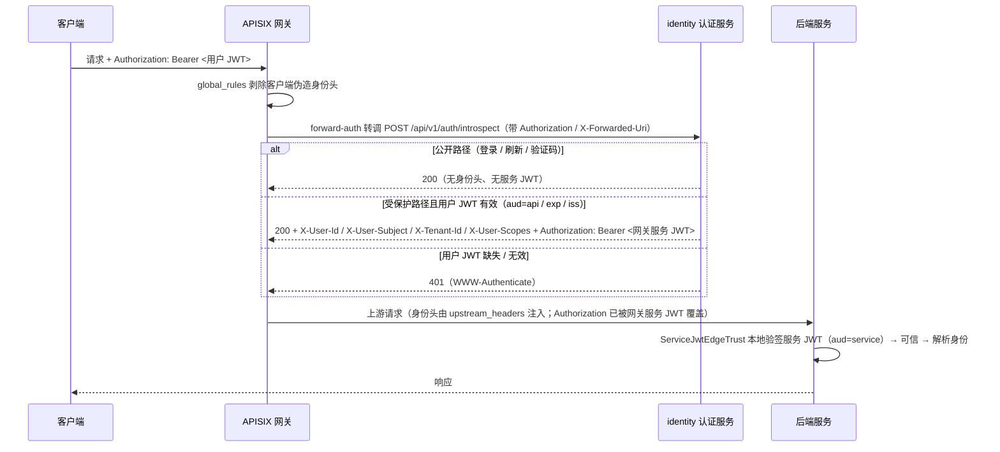

# 网关认证接线与服务身份详细设计

> 后端基座与服务化地基 · 07 认证与服务身份 · 03 网关认证接线与服务身份 · 详细设计

[文档首页](../../../../../../文档首页.md) › [03 网关认证接线与服务身份](../07_认证与服务身份_03_网关认证接线与服务身份.md) › 详细设计　|　[父任务：认证与服务身份](../../07_认证与服务身份.md) · [本阶段需求](../../../../需求/07_需求_认证与服务身份.md) · [排期计划](../../../../计划/01_计划_后端基座与服务化地基.md)

## 1. 概述 <a id="overview"></a>

- **目标**：把「网关统一认证 + 后端只授权」从机制接线到真实：外部用户 JWT 由网关转认证服务**按 `aud=api` 全校验**（签名 / `exp` / `iss` / `aud`），校验通过后**网关换发一枚短时服务 JWT（`aud=service`）**并把网关注入的可信用户身份头透传下游；后端以**服务 JWT 校验**（`ServiceJwtEdgeTrust`）判定可信来源——**只有携带有效服务 JWT 的流量才被信任**，直连伪造身份头（含伪造网关标记）一律拒绝；服务间东西向调用同样校验服务 JWT。同步完成请求净化衔接、`require_auth` 由占位切真实（可门控）、限流维度扩展（用户 / 租户）与 K8s mTLS 演进预留。
- **依据**：《[架构设计 · API 网关与边缘](../../../../../../设计/架构设计/36_架构设计_子系统_API网关与边缘.md)》「安全边界」节；《[架构设计 · 认证与会话](../../../../../../设计/架构设计/14_架构设计_子系统_认证与会话.md)》「服务身份与服务间认证」节；《[架构设计 · 性能与安全](../../../../../../设计/架构设计/31_架构设计_性能与安全.md)》「服务间安全」节；知识档案《[微服务 · 安全与认证](../../../../../../资料/知识档案/微服务/08_微服务_安全与认证.md)》；需求 [07-3](../../../../需求/07_需求_认证与服务身份.md#r07-3)；前置任务 [07_01 详细设计](../../07_认证与服务身份_01_OIDC IdP 接入/设计/01_详细设计_01_OIDC IdP 接入.md)、[07_02 详细设计](../../07_认证与服务身份_02_双类 JWT/设计/02_详细设计_01_双类 JWT.md)、[04_02 详细设计](../../../04_API网关与边缘/04_API网关与边缘_02_边缘认证与请求净化/设计/01_详细设计_02_边缘认证与请求净化.md)。
- **范围（本任务）**：
  1. **网关认证接线（forward-auth → 认证服务）**：网关对每条服务路由挂 `forward-auth`，转调 `identity` 服务内部校验端点；认证端点按 `aud=api` 全校验用户 JWT、判定公开路径（登录 / 刷新 / 验证码免认证），校验通过后返回契约身份头并**换发网关服务 JWT**，网关按 `upstream_headers` 注入上游请求。
  2. **后端服务身份信任真实化**：新增 `bms_core/edge/service_jwt.py::ServiceJwtEdgeTrust`（本地 JWKS 验签服务 JWT，`aud=service`），`[edge].provider` 默认由 `marker` 切为 `service_jwt`；`marker` 保留注册可回退。
  3. **请求净化衔接与旁路防护**：沿用 04_02 的 `global_rules::edge-sanitize` 剥除客户端伪造身份头；后端只信任服务 JWT 承载的流量，直连伪造 `X-Gateway-Identity` / `X-User-Id` 因无有效服务 JWT 被拒（`require_gateway_identity` 开）。
  4. **授权下沉真实化**：`require_auth` 由恒定放行改为**按 `[edge].require_gateway_identity` 门控**——开启时要求可信身份（缺失 401），关闭时保持放行（dev / 本机单测不受影响）。
  5. **身份头契约加法扩展**：新增 `X-User-Subject`（外部主体）与 `EdgeIdentity.subject`（Keycloak `sub` 为 UUID，与 `user_id`（int）不兼容）；`X-User-Id` 保留为内部数字用户 id（阶段六映射后填充）。
  6. **限流维度扩展**：注入身份头后 `limit-count` 由「真实客户端 IP」扩为 `var_combination`（`$remote_addr` + `$http_x_tenant_id` + `$http_x_user_subject`）。
  7. **配置与装配**：`[gateway]` 配置节（公开路径 / 网关服务标识 / 服务 JWT 时长）；`Settings.gateway`；网关生成器新增 `forward-auth` 插件与配置；identity 新增内部校验端点 `POST /api/v1/auth/introspect`（豁免租户 / 边缘）。
- **不含（明确归口，见第 8 节）**：完整登录链路（授权码回调 / state / PKCE）与用户 JWT 租户等 claims 映射（阶段六）；RBAC 权限码（阶段七）；OAuth2 token 端点与 `oauth_server` 真实实现（阶段十）；Linkerd 自动 mTLS（K8s 阶段）；生产 TLS / 域名（部署阶段）。

## 2. 现状与差距 <a id="gap"></a>

| 关注点 | 现状（07_02 / 04_02 交付后） | 差距（本任务目标） |
| --- | --- | --- |
| 网关用户 JWT 校验 | `ROUTE_PLUGINS` 为空，认证插件未启用；`ROUTE_HEADERS_SET` 预留空钩子 | 网关经 `forward-auth` 转认证服务按 `aud=api` 全校验 |
| 网关身份头注入 | 仅置网关标记 `X-Gateway-Identity`；`$jwt_claim_*` 预留写法不可用（APISIX 无该变量） | 认证服务返回契约身份头，网关 `upstream_headers` 注入 |
| 网关服务身份 | 无；北南向无「来自网关」的密码学证明 | 认证服务换发短时网关服务 JWT，网关附给上游 |
| 后端信任判定 | `[edge].provider` 空（占位 `NullEdgeTrust`）/ `marker`（非密钥标记，可伪造） | 新增 `service_jwt` 真实实现并默认启用 |
| 内部服务入站校验 | 服务 JWT 仅用于出站换券（07_02），入站未校验 | 后端对入站服务 JWT 本地验签（`aud=service`） |
| 授权下沉 | `require_auth` 恒定放行；`require_edge_identity` 未被路由使用 | `require_auth` 按旁路开关门控真实可信身份 |
| 外部用户主体 | `EdgeIdentity.user_id`（int）与 Keycloak `sub`（UUID）不兼容 | 新增 `X-User-Subject` / `EdgeIdentity.subject`（加法） |
| 限流维度 | 按真实客户端 IP（`remote_addr`） | 注入身份后扩为用户 / 租户维度 |
| 公开路径免认证 | 无（网关未认证） | 认证端点按 `X-Forwarded-Uri` + `[gateway].public_paths` 判定 |

## 3. 交付物清单 <a id="tree"></a>

```text
backend/
├── libs/bms_core/src/bms_core/
│   ├── edge/
│   │   ├── headers.py                          # 改：USER_SUBJECT_HEADER = "X-User-Subject" + 纳入身份头 / 剥除清单
│   │   ├── base.py                             # 改：EdgeIdentity.subject + from_headers 解析主体头 + 域说明
│   │   └── service_jwt.py                      # 新：ServiceJwtEdgeTrust（plugin_name=service_jwt）+ 工厂
│   ├── core/config.py                          # 改：GatewaySettings + Settings.gateway
│   ├── core/assembly.py                        # 改：register_plugin("edge", "service_jwt", ServiceJwtEdgeTrustFactory)
│   ├── api/base.py                             # 改：require_auth 按 [edge].require_gateway_identity 门控真实身份
│   └── services/gateway_catalog.py             # 改：forward-auth 插件 + 限流 var_combination；常量与 URI 环境变量
├── services/identity/src/bms_identity/
│   ├── api/auth.py                             # 新：POST /api/v1/auth/introspect（内部校验 + 身份头 + 换发网关服务 JWT）
│   ├── api/router.py                           # 改：聚合含 auth 路由
│   └── main.py                                 # 改：service_routers 含 auth.router
├── config.toml                                 # 改：[edge].provider = "service_jwt"；[gateway]；豁免路径补 introspect
└── deploy/.env.example                         # 改：GATEWAY_AUTH_URI 等占位说明

deploy/gateway/apisix.yaml                       # 改：重生成（forward-auth + var_combination 限流 + 标记）
deploy/contracts/identity.json                   # 改：重生成（新增 introspect 端点）

backend/libs/bms_core/tests/
├── edge/test_edge.py                            # 改：subject / from_headers / 默认 provider 切 service_jwt
├── edge/test_service_jwt.py                     # 新：服务 JWT 信任实现与工厂
├── services/test_gateway_catalog.py             # 改：forward-auth 插件 + var_combination 限流
└── api/test_middleware.py                       # 改：subject 头剥除 / 注入

backend/services/identity/tests/auth/            # 新：内部校验端点（公开路径 / 校验通过 / 失败 / 换发服务 JWT）
└── test_introspect.py

bms文档/
├── 后端基类清单.md                                # 改：edge 行补 ServiceJwtEdgeTrust / subject；§10 继承链
├── 设计/架构设计/04_架构设计_后端基础类体系.md      # 改：edge 能力域登记（服务 JWT 信任）
├── 规范/后端开发规范.md                            # 改：§3.1 增「服务间入站必须校验服务身份」强制条
├── 规范/部署发布规范.md                            # 改：网关认证接线与 forward-auth 检查项
├── 资料/开发服务器/linux/APISIX部署使用说明.md      # 改：forward-auth 接线与实测结论
├── 资料/开发服务器/linux/Keycloak部署使用说明.md    # 改：用户 JWT 经网关校验实测口径
└── 项目/02_后端基座与服务化地基/…
    ├── 计划/01_计划_后端基座与服务化地基.md         # 改：§1 台账 / §2 已完成 / §3 移除 07_03 / §4 甘特
    ├── 任务/07_认证与服务身份/07_认证与服务身份.md   # 改：子任务表状态与完成日期
    └── 任务/07_…_03_…/                            # 改：任务状态 / 完成日期 + 实施 / 测试记录

test/
└── scripts/kiwi/cases|exports/…                 # 新：本任务用例登记输入与回读
```

## 4. 领域设计 <a id="design"></a>

### 4.1 端到端认证时序与职责划分 <a id="flow"></a>



- **职责边界**：网关（APISIX）负责**边缘强制**（无凭证 / 无效凭证即拒）与**传输层替换**（外部 access token 不透传，改附网关服务 JWT）；`identity` 负责**票据校验与身份声明**（复用 `UnifiedTokenVerifier`）；后端只负责**信任判定与授权**（`ServiceJwtEdgeTrust` + `require_auth`），不重复用户认证。
- **关键取舍（与 04_02 预留写法的偏差）**：APISIX 无 `$jwt_claim_*` 变量、`openid-connect` 仅产出 `X-Userinfo` / `X-ID-Token`，故改用 `forward-auth`（K8s 平移为 ext_authz）——身份头由认证服务按契约产出、网关 `upstream_headers` 注入；`ROUTE_HEADERS_SET` 保留为空钩子（不再用于本任务）。本偏差在设计定稿时登记、回写 04_02 设计开放项。

### 4.2 认证服务内部校验端点 <a id="introspect"></a>

**`bms_identity/api/auth.py`**（`BaseRouter(key="auth", prefix="/auth")`，挂 `/api/v1`）：

| 端点 | 语义 |
| --- | --- |
| `POST /api/v1/auth/introspect` | 网关内部调用（不经网关路由）：按 `X-Forwarded-Uri` 判公开路径；受保护路径校验用户 JWT（`aud=api`）后返回身份头并换发网关服务 JWT；`default_responses=False`（自定义 401 / 503） |

**判定与响应契约**：

| 输入 | 处理 | 响应 |
| --- | --- | --- |
| `X-Forwarded-Uri` 命中 `[gateway].public_paths`（前缀匹配） | 公开路径，免认证 | `200`，无身份头（不回传 Authorization） |
| 非公开路径 + 有效 `Authorization: Bearer <用户 JWT>`（`verify(token, audience=api)`） | 校验通过 | `200` + `X-User-Id` / `X-User-Subject` / `X-Tenant-Id`（有则）/ `X-User-Scopes` + `Authorization: Bearer <网关服务 JWT>` |
| 非公开路径 + 缺失 / 无效 / 过期用户 JWT（`AuthError`） | 拒绝 | `401` + `WWW-Authenticate: Bearer error="invalid_token"` |
| IdP JWKS 不可达（`ServiceUnavailableError`） | 依赖降级 | `503`（网关 `status_on_error` 同值，fail-closed） |

- **身份头回填**：`X-User-Subject = VerifiedToken.subject`；`X-User-Id` 暂不产出（内部数字用户 id 待阶段六外部身份映射；Gateway 不注入该头即后端解析为 None）；`X-Tenant-Id = VerifiedToken.tenant`（有则）；`X-User-Scopes = ",".join(VerifiedToken.scopes)`。
- **网关服务 JWT 换发**：`ServiceTokenSpec(service=[gateway].service_identity（默认 "gateway"）, scopes=("gateway",), tenant=VerifiedToken.tenant, ttl=[gateway].token_ttl_seconds（默认 60）)`，经 `JwtServiceTokenIssuer.issue` 签发；凭证校验用 `get_token_verifier`（`audience=api`）与 `get_service_token_issuer`。
- **安全口径**：该端点仅供内网网关调用（不经网关业务路由、豁免租户 / 边缘）；网关与认证服务同网段（Compose / K8s 内网），端点真实性依赖网络隔离（K8s 阶段 mTLS 强化，见 §8 开放项）。

### 4.3 网关认证接线（声明式配置生成） <a id="gateway"></a>

**`bms_core/services/gateway_catalog.py` 扩展**（保持**仅标准库 + 服务目录**可导入，CI 精简环境可跑）：

- 新增常量与工厂：
  - `FORWARD_AUTH_PLUGIN = "forward-auth"`；
  - `AUTH_INTROSPECT_PATH = "/api/v1/auth/introspect"`（与 identity 路由同源常量）；
  - `AUTH_UPSTREAM_HOST = env_var("GATEWAY_AUTH_HOST", "identity")`、`AUTH_UPSTREAM_PORT`（字面量整数，真机实测优先，见失败分支）；
  - `AUTH_REQUEST_HEADERS = ("Authorization",)`、`AUTH_UPSTREAM_HEADERS = ("Authorization", USER_SUBJECT_HEADER, USER_ID_HEADER, TENANT_ID_HEADER, USER_SCOPES_HEADER)`、`AUTH_CLIENT_HEADERS = ("WWW-Authenticate",)`、`AUTH_TIMEOUT_MS`、`AUTH_STATUS_ON_ERROR = 503`。
- `_forward_auth_plugin()`：产出 `forward-auth` 配置（`uri` = `http://{GATEWAY_AUTH_HOST}:8000/api/v1/auth/introspect`、`request_method: GET`、`request_headers` / `upstream_headers` / `client_headers`、`timeout`、`status_on_error`）。
- `render_routes()` / `render_login_routes()`：在 `plugins` 合并 `_forward_auth_plugin()`（**认证敏感登录路由也挂**——由认证端点判定公开路径，保证登录 / 刷新仍可达）；`proxy-rewrite.headers.set` 继续置网关标记 `X-Gateway-Identity`。
- `rate_limit_plugin()`：默认改 `key_type="var_combination"`、`key="$remote_addr $http_x_tenant_id $http_x_user_subject"`（用户 / 租户维度；用户维度取当前可用的入站主体 `X-User-Subject`），保留入参可覆盖。
- **确定性不变**：同服务目录 → 同文本；`ops/gateway_config.py render|check` 零漂移口径不变。

生成件形态（节选）：

```yaml
routes:
  - id: route-platform
    uris: ['/api/platform/v1', '/api/platform/v1/*']
    upstream_id: platform
    plugins:
      proxy-rewrite:
        regex_uri: ['^/api/platform/v1(.*)$', '/api/v1$1']
        headers:
          set:
            X-Gateway-Identity: bms-edge
      forward-auth:
        uri: 'http://${{GATEWAY_AUTH_HOST:=identity}}:8000/api/v1/auth/introspect'
        request_method: GET
        request_headers: [Authorization]
        upstream_headers: [Authorization, X-User-Subject, X-User-Id, X-Tenant-Id, X-User-Scopes]
        client_headers: [WWW-Authenticate]
        timeout: 3000
        status_on_error: 503
      limit-count:
        count: 300
        time_window: 60
        key_type: var_combination
        key: '$remote_addr $http_x_tenant_id $http_x_user_subject'
        # …（redis 共享计数不变）
```

> 插件执行次序（按 APISIX 优先级）：`rewrite` 相位 `global_rules::edge-sanitize`（剥伪造头）→ `proxy-rewrite`（置标记）→ `access` 相位 `forward-auth`（priority 2002，注入身份头 + 覆盖 Authorization）→ `limit-count`（priority 1002，按注入后的身份维度计数）。

> **真机实测结论（mjbk，2026-09-23）**：`forward-auth` 在 standalone 声明式配置下生效——受保护路径无凭证 401、公开路径 200；校验通过时上游收到 `Authorization: Bearer <网关服务 JWT>`（客户端用户 token 已被覆盖、不透传）、`X-User-Subject` / `X-User-Scopes` 为真实 Keycloak claims，客户端伪造的 `X-User-Id` / `X-User-Subject` / `X-Gateway-Identity` 被剥除；`limit-count` 的 `var_combination` 键含 `X-User-Subject`（用户维度生效）。网关服务 JWT 经 identity `/…/.well-known/jwks.json` 公钥验签通过（`iss=bms` / `sub=gateway` / `aud=service`）。

### 4.4 后端服务身份信任实现 <a id="service-jwt"></a>

**`bms_core/edge/service_jwt.py`**：

```text
edge/service_jwt.py
├── ServiceJwtEdgeTrust(BaseEdgeTrust)（plugin_name = "service_jwt"）
│     ├── __init__(*, issuer: BaseServiceTokenIssuer)
│     └── evaluate(headers) -> EdgeTrustDecision
│           1) 取 Authorization（Bearer）；缺失 / 非 Bearer → 不信任
│           2) issuer.verify(token)（本地 JWKS，校验签名 / exp / iss / aud=service）
│           3) 失败（AuthError）→ 不信任（reason 记因）
│           4) 成功 → 按身份头解析 EdgeIdentity，并以 claim 补 service_identity（sub）/ tenant
└── ServiceJwtEdgeTrustFactory（plugin_key = "edge"、plugin_name = "service_jwt"）
      ├── 解析 [service_token] 实例（provider 空 → 拒绝装配：安全 fail-closed）
      └── 构造 ServiceJwtEdgeTrust(issuer=...)
```

- **信任口径**：**唯一依据**是「携带有效服务 JWT」——不再信任可伪造的 `X-Gateway-Identity` 标记；直连后端伪造标记 + 身份头（无有效服务 JWT）→ `trusted=False`，`require_gateway_identity` 开时 401。
- **身份解析**：`EdgeIdentity` 由身份头（`X-User-Subject` / `X-Tenant-Id` / `X-User-Scopes` / `X-User-Id`）+ 服务 JWT claims 合并；`service_identity = claims.subject`（北南向为 `gateway`、东西向为调用方服务标识）；`tenant` 以服务 JWT claim 为准、缺省回落身份头。
- **空实现防护**：`[service_token].provider` 为空（null 占位，`verify` 恒定通过）时工厂**拒绝构造**（`PluginError`），避免「占位验签 = 恒定信任」的安全漏洞；`[edge].provider` 切 `service_jwt` 后须有真实服务 JWT 配置（`config.toml` 默认 `[service_token].provider = "jwt"`）。
- `MarkerEdgeTrust`（04_02）保留注册、可按配置回退；`NullEdgeTrust` 仍为 `[edge].provider` 空串缺省。

### 4.5 身份头契约扩展 <a id="headers"></a>

| 头 | 类型 | 语义 | 变更 |
| --- | --- | --- | --- |
| `X-User-Id` | 内部数字用户 id | 阶段六外部身份映射后填充 | 不变（本任务不注入） |
| `X-User-Subject` | 外部主体（字符串） | Keycloak `sub`（UUID），阶段六前唯一用户标识 | **新增（加法）** |
| `X-Tenant-Id` | 租户编码 | 网关注入、后端信任 | 不变 |
| `X-User-Scopes` | scope 集合（逗号分隔） | 网关注入、后端信任 | 不变 |
| `X-Service-Identity` | 服务身份 | 服务间调用；本任务由服务 JWT 推导 | 不变 |
| `X-Gateway-Identity` | 网关标记（非密钥） | 结构占位 + 诊断；**不作信任唯一依据** | 语义收敛（不再是信任依据） |

- `EdgeIdentity` 增 `subject: str | None`（加法，冻结数据契约）；`from_headers` 同步解析 `X-User-Subject`。
- `USER_SUBJECT_HEADER` 纳入 `IDENTITY_HEADERS` / `STRIPPED_HEADERS`：客户端伪造一律剥除（网关 `global_rules` + 后端中间件各一遍）。

### 4.6 授权下沉（require_auth 真实化） <a id="require-auth"></a>

`bms_core/api/base.py::require_auth(request: Request) -> None`：

1. 取 `request.app.state.settings.edge.require_gateway_identity`；未开启（dev / test）→ 直接放行（占位语义保留，调用面零改动）。
2. 开启 → 调 `require_edge_identity(request)`：请求态 `edge_identity` 缺失（未认证 / 旁路）→ `AuthError`（20001 / 401）；存在 → 放行（**只授权、不重复认证**）。
3. 细粒度权限码仍归 `require_permission`（阶段七）。

- 说明：`EdgeGuardMiddleware` 在旁路开关开启时已就地 401（更早、更省），`require_auth` 是**路由级兜底**并完成「由占位切真实用户体系」的语义切换。

### 4.7 配置与装配 <a id="config"></a>

**`config.toml`**：

```toml
[edge]
provider = "service_jwt"        # 由 marker 切真实服务 JWT 校验（marker 保留可回退）
require_gateway_identity = false # dev/test 关；prod 开
exempt_paths = [..., "/api/v1/auth/introspect"]

[gateway]
# 网关认证接线（转发 / 换发口径；凭据归 [identity_provider] / [service_token]，此处只放非敏感接线参数）
service_identity = "gateway"    # 网关换发服务 JWT 的 service 标识（服务 JWT 的 sub）
token_ttl_seconds = 60          # 网关服务 JWT 有效期（秒；短时）
# 公开路径（免认证，网关外部路径形态，前缀匹配）——认证端点据此放行前置端点
public_paths = [
  "/api/identity/v1/auth/login",
  "/api/identity/v1/auth/refresh",
  "/api/identity/v1/captcha",
]
```

- `GatewaySettings(PluginSelection)`（`service_identity` / `token_ttl_seconds` / `public_paths`）；`Settings.gateway`。
- `core/assembly.py`：`register_plugin("edge", "service_jwt", ServiceJwtEdgeTrustFactory(settings))`（`PLUGIN_WIRINGS` 的 `edge` 行已存在，无需新增接线）。
- `[tenant].exempt_paths` 与 `[edge].exempt_paths` 均补 `/api/v1/auth/introspect`（认证端点自身不解析租户、不参与旁路拒绝）。
- 网关生成器侧仅经**环境变量**取值（`GATEWAY_AUTH_HOST`，默认 `identity`），保持 CI 精简环境可运行；不在网关注入任何 IdP 密钥。

### 4.8 K8s 平移口径 <a id="k8s"></a>

| 单机（本任务） | K8s 阶段 | 说明 |
| --- | --- | --- |
| `forward-auth` 转调 `identity:8000` | ext_authz / Envoy Gateway | 语义一致（授权子请求） |
| 网关换发服务 JWT（应用层身份） | Linkerd 自动 mTLS（传输层身份） | 两层互补；`aud` 隔离不变 |
| `upstream_headers` 注入契约身份头 | Ingress / Gateway API 请求头改写 | 头契约不变 |
| 内部端点依赖网络隔离 | NetworkPolicy + mTLS | 端点真实性由传输层强化 |

## 5. 失败分支与边界 <a id="failures"></a>

| 场景 | 处理 |
| --- | --- |
| 无 `Authorization` 访问受保护路径 | 认证端点 401；网关透传 401（`WWW-Authenticate`）；后端不会收到 |
| 用户 JWT 签名 / 过期 / `iss` / `aud` 不符 | `UnifiedTokenVerifier` → `AuthError`（20001）→ 认证端点 401 |
| 公开路径（登录 / 刷新 / 验证码）无 token | 认证端点 200、无身份头；请求正常放行 |
| IdP JWKS 不可达 | `ServiceUnavailableError`（10007）→ 认证端点 503；网关 `status_on_error: 503`（fail-closed） |
| 认证服务不可达 | 网关 `forward-auth` 报错 → `status_on_error` 503（fail-closed） |
| 客户端伪造 `X-User-Id` / `X-User-Subject` / `X-Service-Identity` / `X-Gateway-Identity` | 网关 `global_rules` 剥除；后端 `EdgeGuardMiddleware` 再剥一遍；直连伪造无有效服务 JWT → 不信任 |
| 直连后端（旁路），伪造标记 + 身份头 | 无有效服务 JWT → `trusted=False`；`require_gateway_identity` 开 → 401（真实旁路防护） |
| 服务间调用携带有效服务 JWT（`aud=service`） | 可信；`service_identity` 取 JWT `sub`；用户身份头按需透传 |
| 服务间调用错带用户 JWT（`aud=api`） | 本地 JWKS 验签失败 / `iss` 不符 → `AuthError` → 不信任 → 401（`aud` 隔离） |
| `[service_token].provider` 空 / 无公钥 | `ServiceJwtEdgeTrustFactory` 拒绝装配（启动失败，fail-closed）；或验签失败不信任 |
| 网关服务 JWT 无签名私钥 | 认证端点签发 `ConfigError`（40001）→ 500 / 503；须经环境变量注入私钥（部署说明登记） |
| 限流 key 维度头缺失（公开路径 / 直连） | `var_combination` 中该段为空，仍按 `$remote_addr` 计数（不整体失败） |
| `upstream_headers` 覆盖 Authorization 的实际行为 | 真机实测确认；若不覆盖则改用 `proxy-rewrite.headers.set` 以 `$http_x_...` 变量映射（回退路径，见开放项） |
| forward-auth 的 auth 子请求 body 处理 | `request_method: GET`，不缓冲请求体（避免大 body 开销） |
| 达梦 / 三库方言 | 不涉及（网关与信任判定不直连数据库） |

## 6. 测试设计与验收映射 <a id="tests"></a>

用例先登记 Kiwi TCMS（本任务登记 **1 条策展用例**，多条断言共用同一 `kiwi_id`，编号以平台回读为准，见第 9 节）。

| 用例 / 文件 | 类型 | 断言要点 |
| --- | --- | --- |
| `libs/bms_core/tests/edge/test_service_jwt.py` | 单元 | 有效服务 JWT → 信任 + 身份（subject / tenant / scopes / service_identity）；无 / 非 Bearer / 无效 / 用户 JWT（aud=api）→ 不信任；工厂在 `[service_token].provider` 空时拒绝（`PluginError`）、有效时构造成功 |
| `libs/bms_core/tests/edge/test_edge.py` | 单元 | `EdgeIdentity.subject` 解析（含大小写不敏感 / 缺失为 None）；`USER_SUBJECT_HEADER` 在剥除清单；默认 provider 切 `service_jwt`（装配解析） |
| `libs/bms_core/tests/services/test_gateway_catalog.py` | 单元 | 每条服务路由与登录路由含 `forward-auth`（uri / request_headers / upstream_headers / status_on_error）；`proxy-rewrite` 仍置标记；`limit-count` 为 `var_combination` + 身份维度；确定性；`ROUTE_HEADERS_SET` 空默认 |
| `libs/bms_core/tests/ops/test_gateway_config.py` | 单元 | `render` / `check` 对含 `forward-auth` 的生成件零漂移、篡改拦截 |
| `libs/bms_core/tests/api/test_middleware.py` | 单元 | `X-User-Subject` 剥除 / 信任注入；`ServiceJwtEdgeTrust` 下无服务 JWT 时旁路拒绝 |
| `libs/bms_core/tests/api/test_router_base.py` | 单元 | `require_auth`：开关关恒放行；开关开 + 无身份 401、有身份放行 |
| `services/identity/tests/auth/test_introspect.py` | 单元（装配） | 公开路径 → 200 无身份头；有效用户 JWT → 200 + 契约身份头 + `Authorization: Bearer <服务 JWT>`（验签通过、`aud=service`）；缺失 / 无效 → 401；结果身份头与 `VerifiedToken` 一致 |
| `services/platform/tests/crosscut/test_plugin_registration.py` 等装配回归 | 单元 | `[edge]` / `[gateway]` 纳装配；`PLUGIN_WIRINGS` / `_NULL_MODULES` 完整；应用可启动、探针可访问 |
| `test_contract_snapshot` / 契约快照 | 单元 | `identity` OpenAPI 增 introspect 端点后重生成、零漂移 |
| mjbk 真实冒烟 | 集成（人工留痕） | 起 APISIX + Keycloak + identity（+ 一个真实后端服务）：① 无 token 受保护路径 → 401；② 有效用户 JWT → 上游收到契约身份头且 `Authorization` 为网关服务 JWT（非用户 token）；③ 公开路径无 token → 200；④ 直连后端伪造身份头 → 401；⑤ 服务 JWT 直连 → 通过；⑥ 限流 key 含租户 / 用户维度 |
| 既有全量回归 | 单元 + 集成 | 全量 `pytest` / `ruff` / `pyright` / 基座校验全绿（无行为回归） |

验收映射：

| 完成标准（需求 07-3） | 验证方式 |
| --- | --- |
| 网关认证后请求携带可信身份、后端仅做授权 | forward-auth 接线单测 + 生成件零漂移；introspect 单测；mjbk 用户 JWT 经网关到达上游携带身份头 |
| 服务间调用经服务身份校验 | `ServiceJwtEdgeTrust` 单测（有效 / 无效 / `aud` 隔离）；mjbk 服务 JWT 直连通过 |
| 网关旁路（伪造身份）被拒 | 后端信任实现 + `require_gateway_identity` 用例；mjbk 直连伪造身份头 401 |
| 用例覆盖 | Kiwi 策展用例 + 单元 / 装配 / 集成用例 |
| 校验通过 | `pytest` / `ruff` / `pyright` / `check-base` / `check-backend-base` / `check-service-boundaries` / `check-status` 全绿 |

## 7. 登记落点 <a id="registry-writeback"></a>

| 落点 | 内容 |
| --- | --- |
| 《后端基类清单》 | edge 行补 `ServiceJwtEdgeTrust`（服务 JWT 信任）+ `X-User-Subject` / `EdgeIdentity.subject`；§10 继承链 |
| 《架构设计 · 后端基础类体系》 | edge 能力域登记补「服务身份信任（服务 JWT 校验）」语义与落点 |
| 《后端开发规范》 | §3.1 增「内部服务入站必须校验服务身份（服务 JWT）；禁以北南向标记头作为唯一信任依据；禁透传外部 access token」强制条 |
| 《部署发布规范》 | 增「网关认证接线（forward-auth）与服务 JWT 密钥 / JWKS」检查项（fail-closed、私钥外部化） |
| 《APISIX 部署使用说明》 | 增 forward-auth 接线、执行次序与实测结论（含 Authorization 覆盖 / 插件优先级） |
| 《Keycloak 部署使用说明》 | 增用户 JWT 经网关校验（`aud=api`）实测口径 |
| 计划 | §1 工时台账与计数；§2 已完成表（07_03 行）；§3 移除 07_03；§4 甘特调整 |
| 任务 / 父任务 | 状态与完成日期两处一致（需求文档不承载进度） |
| 上游任务文档 | 04_02 设计开放项回写（`$jwt_claim_*` 写法作废、改 forward-auth）；07_03 任务文档前置契约闭环 |
| 下游任务文档 | 10_01 阶段验收登记本任务交付点（网关认证 / 服务身份） |
| Kiwi TCMS / 测试资产仓 | 登记本任务用例并回读编号；`test/scripts/kiwi/cases|exports/` 对应文件 |
| 实施 / 测试记录 | 任务目录 `实施/`、`测试/` 各一份 |

## 8. 边界与开放项 <a id="boundary"></a>

- **归阶段六**：完整登录链路（授权码回调 / state / nonce / PKCE）与用户 JWT 的租户等 claims 映射（Keycloak mappers）、`X-User-Id` 内部数字用户 id 填充（外部身份映射 / JIT 建号）。
- **归阶段七**：RBAC 权限码细粒度校验（`require_permission`）。
- **归阶段十**：OAuth2 token 端点（client_credentials）与 `oauth_server` 真实实现（可复用网关换发内核）。
- **归 K8s 阶段**：Linkerd 自动 mTLS（传输层身份，与应用层服务 JWT 互补）；`forward-auth` 平移为 ext_authz。
- **开放项（认证端点真实性）**：`/api/v1/auth/introspect` 依赖内网隔离，未做网关侧独立鉴权；生产可加内网令牌 / mTLS（运维 / K8s 阶段）。
- **开放项（forward-auth 行为实测）**：`upstream_headers` 对 `Authorization` 的覆盖、`status_on_error` 与插件优先级须 mjbk 实测；不符则按 §5 回退（`proxy-rewrite` 变量映射）并回写本设计与部署说明。
- **开放项（性能）**：每请求一次认证子调用；后续可加票据校验结果缓存（按 `jti` / TTL）优化（不改契约）。
- **开放项（网关服务 JWT 粒度）**：按请求签发；后续可加「网关服务 JWT 短期缓存至 `exp` 前」优化（不改契约）。
- **不改**：04_02 的剥除 / 标记配置结构与既有身份头语义；服务内 `/api/v1` 前缀与响应体；既有 Kiwi 用例号（46 / 2165 / 2166 / 2167 / 2178 / 2179 / 2180）；`oauth` / `idp` 既有契约。

```mermaid
flowchart LR
    A["Kiwi 用例登记（先登记后编码）"] --> B["身份头契约扩展（X-User-Subject / EdgeIdentity.subject）"]
    B --> C["ServiceJwtEdgeTrust + 工厂 + 装配 + [gateway] 配置"]
    C --> D["require_auth 门控真实化"]
    D --> E["认证端点 /auth/introspect（换发网关服务 JWT）+ 豁免"]
    E --> F["网关生成器 forward-auth + 限流维度；重生成 apisix.yaml"]
    F --> G["用例编码 + 门禁全绿 + 契约快照"]
    G --> H["mjbk 真实冒烟（网关认证 / 旁路拒绝 / 服务 JWT）"]
    H --> I["登记回写 + 实施 / 测试记录 + 提交"]
    I --> J["上游开放项回写 + 下游前置契约标注 + 偏差遗留闭环"]
```

## 9. 实施步骤 <a id="steps"></a>



1. 读《[KiwiTCMS 部署使用说明](../../../../../../资料/开发服务器/linux/KiwiTCMS部署使用说明.md)》「用例约定」节，登记本任务用例并**回读编号**（输入文件落 `test/scripts/kiwi/cases/`；先登记后编码）。
2. `edge/headers.py` / `edge/base.py`（`X-User-Subject` + `EdgeIdentity.subject`）；新增 `edge/service_jwt.py`；`core/assembly.py` 登记工厂。
3. `core/config.py`（`GatewaySettings` / `Settings.gateway`）+ `config.toml`（`[edge].provider` / `[gateway]` / 豁免路径）；`api/base.py::require_auth`。
4. identity 新增 `api/auth.py`（introspect）+ `router.py` / `main.py` 聚合；`deploy/.env.example`。
5. `services/gateway_catalog.py`（forward-auth + var_combination）；`uv run python -m ops.gateway_config render` 重生成 `deploy/gateway/apisix.yaml`；重生成契约快照 `deploy/contracts/identity.json`。
6. 用例：`edge/test_service_jwt.py` / 改 `test_edge.py` / 改 `test_gateway_catalog.py` / 改 `test_middleware.py` / 改 `test_router_base.py` / 新增 `identity/tests/auth/test_introspect.py`；既有全量回归。
7. 门禁：`uv run pytest -q --cov=bms_core --cov-branch` / `ruff check` / `ruff format --check` / `pyright`；`check-base` / `check-backend-base` / `check-service-boundaries` / `check-status` / `check-preflight --fast` 全绿。
8. **mjbk 真实冒烟**（远程操作，先读部署说明）：起 APISIX + Keycloak + identity（+ 真实后端）；验证无凭证 401、有效用户 JWT 身份头与网关服务 JWT、公开路径放行、直连伪造 401、服务 JWT 直连通过、限流维度；留痕到测试记录。
9. 登记回写 + 实施 / 测试记录 + 代码与文档分开提交；04_02 开放项回写、10_01 前置契约标注与偏差遗留闭环。

关键命令：

```bash
cd backend
uv run python -m ops.gateway_config render      # 重生成 deploy/gateway/apisix.yaml
uv run python -m ops.gateway_config check       # 零漂移校验
uv run python -m ops.contract_snapshot export   # 重生成 deploy/contracts/identity.json
uv run pytest -q --cov=bms_core --cov-branch
uv run ruff check . && uv run ruff format --check . && uv run pyright
# 仓库根
python3 scripts/tools/base-check/check-base.py
python3 scripts/tools/base-check/check-backend-base.py
python3 scripts/tools/base-check/check-service-boundaries.py
python3 scripts/tools/check-docs/check-status.py
python3 scripts/tools/preflight/check-preflight.py --fast
```

## 10. 决策记录（对齐记录） <a id="align"></a>

| # | 事项 | 结论（逐项确认） |
| --- | --- | --- |
| 1 | 网关认证接线方式 | **forward-auth 转 identity 内部校验端点**（APISIX 无 `$jwt_claim_*`、openid-connect 仅产 `X-Userinfo`；04_02 预留写法作废） |
| 2 | 后端可信来源依据 | **网关持服务 JWT 向内部证明**（identity 换发短时网关服务 JWT），后端只信有效服务 JWT |
| 3 | `require_auth` 切换语义 | **按 `[edge].require_gateway_identity` 门控**（开启要求可信身份 401、关闭放行） |
| 4 | 服务间信任实现落点 | **新增 `ServiceJwtEdgeTrust`**（`plugin_name = "service_jwt"`），`marker` 保留可回退 |
| 5 | 限流维度扩展 | **纳入**：`limit-count` 改 `var_combination`（`$remote_addr` + 租户 + 用户） |
| 6 | 网关认证配置来源 | **新增 `[gateway]` 配置节**（公开路径 / 网关服务标识 / 服务 JWT 时长；IdP 凭据仍归 `[identity_provider]`、私钥归 `[service_token]`） |
| 7 | 外部用户主体承载 | **新增 `X-User-Subject` + `EdgeIdentity.subject`**（加法）；`X-User-Id` 留内部数字 id 待阶段六 |
| 8 | 公开路径免认证判定 | **identity 端点按 `X-Forwarded-Uri` + `[gateway].public_paths` 判定**（策略集中于认证服务） |
| 9 | `[edge].provider` 默认值 | **默认切 `service_jwt`**（真实实现） |
| 10 | 验证深度 | 本机单测 + 装配 + **mjbk 真实冒烟** |
| 11 | 限流用户维度取值 | 用户维度取**当前可用的 `X-User-Subject`**（网关注入的外部主体；`X-User-Id` 待阶段六填充），不空等 |

## 11. 参考文档 <a id="ref"></a>

- [架构设计 · API 网关与边缘](../../../../../../设计/架构设计/36_架构设计_子系统_API网关与边缘.md)「边缘功能」「安全边界」节
- [架构设计 · 认证与会话](../../../../../../设计/架构设计/14_架构设计_子系统_认证与会话.md)「服务身份与服务间认证」节
- [架构设计 · 性能与安全](../../../../../../设计/架构设计/31_架构设计_性能与安全.md)「服务间安全」节
- [知识档案 · 微服务 · 安全与认证](../../../../../../资料/知识档案/微服务/08_微服务_安全与认证.md)
- [需求 07-3：网关认证接线与服务身份校验](../../../../需求/07_需求_认证与服务身份.md#r07-3)
- [07_01 OIDC IdP 接入详细设计](../../07_认证与服务身份_01_OIDC IdP 接入/设计/01_详细设计_01_OIDC IdP 接入.md)
- [07_02 双类 JWT 详细设计](../../07_认证与服务身份_02_双类 JWT/设计/02_详细设计_01_双类 JWT.md)
- [04_02 边缘认证与请求净化详细设计](../../../04_API网关与边缘/04_API网关与边缘_02_边缘认证与请求净化/设计/01_详细设计_02_边缘认证与请求净化.md)
- [后端基类清单](../../../../../../后端基类清单.md)
- [APISIX · forward-auth 插件](https://apisix.apache.org/docs/apisix/plugins/forward-auth/)
- [APISIX · 插件执行生命周期与优先级](https://apisix.apache.org/docs/apisix/terminology/plugin/)
- [KiwiTCMS 部署使用说明](../../../../../../资料/开发服务器/linux/KiwiTCMS部署使用说明.md)「用例约定」节

> 本文档依《[文档生成规范](../../../../../../规范/文档生成规范.md)》编写 · 关键决策逐项确认
