# 父-子流水线实施记录

> 后端基座与服务化地基 · 09 多服务CI-CD与契约门禁 · 01 父-子流水线 · 实施记录

[文档首页](../../../../../../文档首页.md) › [01 父-子流水线](../09_多服务CI-CD与契约门禁_01_父-子流水线.md) › 01 实施　|　[详细设计](../设计/01_详细设计_01_父-子流水线.md) · [测试记录](../测试/01_测试_01_父-子流水线.md)

## 1. 实施信息 

| 项 | 值 |
| --- | --- |
| 任务 | [01 父-子流水线](../09_多服务CI-CD与契约门禁_01_父-子流水线.md) |
| 对应需求 | [09-1](../../../../需求/09_需求_多服务CI-CD与契约门禁.md#r09-1) |
| 详细设计 | [01_详细设计_01_父-子流水线](../设计/01_详细设计_01_父-子流水线.md) |
| 实施日期 | 2026-09-24 |
| 实施人 | minjian |
| 实施环境 | 开发机（Ubuntu，Python 3.14.4 / uv 0.12.7）；真实构建冒烟与流水线运行于开发服务器 mjbk（Docker 29.7.2 containerd 镜像存储 / GitLab CE 19.2.1 / runner 19.2.1，concurrent=4） |
| 提交 | 设计与文档 / 代码与配置 / 修复分开提交（`docs(09_01)` / `feat(09_01)` / `fix(09_01)`） |
| 结论 | 完成（工时按 10h 交付；本地门禁全绿 + mjbk 真实构建扫描冒烟 + 真实流水线验收通过） |

```mermaid
flowchart LR
    A["Kiwi 用例登记（2184，先登记后编码）"] --> B["父流水线：trigger 调度层 + backend-test 规则收窄 + 移除单体镜像 job"]
    B --> C["子流水线模板：test / build / release（度量 + Trivy + resource_group）"]
    C --> D["backend/Dockerfile + .dockerignore + 镜像档开关"]
    D --> E["测试隔离缺陷修复（core 子集自足登记）"]
    E --> F["CI 配置护栏用例 + 预检扩展"]
    F --> G["本地门禁全绿 + CI Lint"]
    G --> H["mjbk 真实构建 / 容器 / 扫描冒烟"]
    H --> I["真实流水线验收（调度隔离 / 构建发布 / 度量）"]
    I --> J["登记回写 + 实施/测试记录 + 提交"]
```

## 2. 实施概览 

## 3. 实施过程 

1. **Kiwi 用例登记**：登记一条策展用例（平台骨架 / P2 / CONFIRMED / 自动化）并回读编号 **2184**（输入 `test/scripts/kiwi/cases/2026-09-24_阶段二09-01_父子流水线.json`，结果 `exports/2026-09-24_阶段二09-01_父子流水线_登记结果.json`）；先登记后编码。
2. **父流水线改造**（`.gitlab-ci.yml`）：`stages` 增 `trigger` 调度层；新增 9 个服务 trigger job（`.trigger-service` 锚点：`include: local` 公共模板 + `strategy: depend`；`variables.SERVICE` 指定服务；规则为 MR 全量 / main 按 `backend/services/{svc}/**/*` / 其他分支 `compare_to: refs/heads/main` 兜底）；`backend-test` 全量测试规则收窄为共享 / 工作区路径（`backend/libs`、`backend/ops`、`backend/alembic`、`config*.toml`、`pyproject.toml`、`uv.lock`、`deploy/**`、`.gitlab-ci.yml`）；移除 `backend-image` 与 `container-scanning`（由子流水线按服务构建 / 扫描取代）。
3. **服务子流水线公共模板**（`deploy/ci/templates/backend-service.yml`）：`workflow` 只放行 `parent_pipeline`；三阶段——`service-test`（`test -n "$SERVICE"` / `test -d` 前置 + `cd backend && uv sync --frozen` + `cd services/$SERVICE` 工程级 pytest + `--cov=bms_$SERVICE --cov-fail-under=70`）、`service-build`（`docker build --provenance=false --build-arg SERVICE -f backend/Dockerfile backend/`，标签 `$CI_COMMIT_SHORT_SHA`）、`service-release`（`resource_group: bms-release-$SERVICE`、`interruptible: false`、push + Trivy 扫描 + `after_script` 度量推送）；模板自包含 `REGISTRY_*` / `PUSHGATEWAY_URL` 变量。
4. **服务运行镜像**（`backend/Dockerfile` + `backend/.dockerignore`）：`ARG SERVICE` 参数化；工作区元数据 + `alembic.ini`（基座向上搜工程根）+ `config*.toml`（配置基线 / 分层）；两层 `uv sync --frozen`（第三方依赖层 → 成员源码层，`--no-install-workspace --package` 组合实测可用）；`apt` 清华源 + `apt-get upgrade`（系统包安全更新）与运行时移除 pip（消除 base 镜像自带包扫描洞）；`HEALTHCHECK` + `CMD python -m bms_${SERVICE}`。
5. **镜像档开关**：创建 `deploy/ci/verify/image`（P3 激活；build / release 以该档守卫，删档即关）。
6. **测试隔离缺陷修复**：`libs/bms_core/tests/core/test_service_catalog_startup.py` 模块级自足登记 platform 目录读取器（`register_catalog_reader("platform", read_catalog)`，幂等），使 core 工程级 / 子集运行不再依赖全量运行的导入顺序（原 9 条失败归零）。
7. **CI 配置护栏用例**：`libs/bms_core/tests/ops/test_ci_pipeline.py`（Kiwi 2184）——服务目录 ↔ trigger job 集合、父规则（共享路径且不含服务路径 / 单体 job 已移除 / stages）、子模板结构（三阶段 / resource_group / 不可中断 / 镜像名 / Trivy / 度量）、常量同源、镜像档与 Dockerfile 就位、前端镜像脚本内前置判定。
8. **本地预检扩展**：`scripts/tools/preflight/check-preflight.py` 的 CI 配置自检覆盖 `deploy/ci/templates/*.yml`（YAML 解析）。
9. **门禁**：全量 `pytest`（1300 passed / 37 skipped，覆盖率 95.16%）+ 10 个工程级范围 + `ruff check` / `ruff format --check` / `pyright`（0 error）+ 基座 / 边界 / 状态校验 + `check-preflight`（非 fast）+ GitLab CI Lint API（父配置与子模板均 valid）全绿。
10. **mjbk 真实冒烟**：同步 `backend/` → `docker build --provenance=false --build-arg SERVICE=platform` 真实构建 → 容器 `-p 18001:8000` 挂迁移库启动：`/healthz` 200 `{"status":"ok","service":"platform","version":"0.1.0"}`、容器 `healthy`、`/readyz` 503（缺 Redis，符合预期）；Trivy 0.74.0 扫描 **0 个 CRITICAL/HIGH**；`docker push` 与 Pushgateway 推送均实测通过。
11. **真实流水线验收**（推送 `07947c1b` / `1ffca061` / `01e8fe0a`，详见测试记录）：子流水线 test / build / release 全绿；Registry 镜像 `bms-platform:07947c1b`；`bms_release_total{service="platform",result="success"}` 可查；共享变更流水线 0 个服务子流水线（bridges=0）。
12. **登记回写与记录**：规范 / 规划 / 部署说明 / README / 计划 / 任务 / 父任务；实施与测试记录；代码与文档分开提交。

## 4. 问题与处置 

| 问题 | 现象 | 处置 |
| --- | --- | --- |
| `docker push` 报 `blob unknown`（关键） | mjbk 实测推送镜像最后报 `error from registry: blob unknown to registry`；同镜像加 `--provenance=false` 重建后推送成功 | 根因＝BuildKit 默认 attestation（provenance）清单不被 GitLab Registry 接受；构建命令固定加 `--provenance=false`（模板 / Dockerfile 注释 / GitLab 说明排障均已登记） |
| 镜像启动报「未找到 backend/ 工程根」 | 容器内 `bms_core.db.migration._find_backend_root` 向上搜 `alembic.ini` 失败 | Dockerfile 补 `COPY alembic.ini`；同时补 `config*.toml`（配置校验 `Field required` 的另一现场） |
| 镜像扫描 CRITICAL/HIGH 阻断 | 首扫报 43 条 OS 包 + pip vendored msgpack / setuptools（均为 base 镜像自带） | Dockerfile 增「apt 清华源 + `apt-get upgrade`」与「运行时移除 pip」；复扫 0 条（Debian 13.7） |
| Trivy 漏洞库不可达 | 默认 `mirror.gcr.io` 在 mjbk 不可达；NJU 镜像缺 `aquasec` 组织仓；DaoCloud 未在白名单 | 改用 `TRIVY_DB_REPOSITORY=ghcr.nju.edu.cn/aquasecurity/trivy-db:2`（实测可用）+ `trivy-cache` 卷持久化（免每次重下）；镜像清单登记 `aquasec/trivy:0.74.0` 并预拉 |
| 前端镜像空跑失败（首推流水线红） | 镜像档开启后 `frontend-image` 被放行，但 `frontend/apps/desktop/Dockerfile` 未就绪 → `failed to read dockerfile`；补 `exists` 双路径后仍运行（实测 `rules:exists` 多模式为「任一命中」） | 改为**脚本内 `test -f` 前置判定跳过**（档位语义保持：删档即关）；`fix(09_01)` 提交后流水线 352 全绿 |
| 自动缺陷单（流水线失败副作用） | 首推与修复推各生成一条 `[自动缺陷]` Issue（#41 / #42） | 均按配置缺口归因评论并关闭（非产品缺陷），记录于测试记录 |
| runner 并发数文档不符 | 实测 `concurrent = 4`（文档曾记 2） | 《GitLab部署使用说明》校正（两处） |
| Pushgateway 样例清理口径 | 08_02 记录「需停容器删卷」；本次实测组删除可用 | `curl -X DELETE .../metrics/job/bms-ci` 返回 202 即清空，已补入《可观测性栈部署使用说明》排障 |
| 镜像层缓存组合语义 | 不确定 `--no-install-workspace --package` 组合 | 本地临时目录实测两步流程可用（第二步装入目标服务 + 共享库），按设计落地 |

## 5. 验证结果 

| 验证项 | 命令 / 操作 | 结果 |
| --- | --- | --- |
| 全量用例 | `uv run pytest -q --cov=... --cov-fail-under=70` | **1300 passed / 37 skipped**，覆盖率 **95.16%**（≥70%） |
| 工程级范围 | 10 个 root（`libs/bms_core` + 9 服务）各 `uv run pytest -q` | 全通过（core 749 passed / platform 336 / identity 85 / …，缺陷修复后无失败） |
| 静态检查 | `ruff check` / `ruff format --check` / `pyright` | 全通过（pyright 0 error） |
| 基座 / 边界 / 状态 | `check-base` / `check-backend-base(+--self-test)` / `check-service-boundaries(+--self-test)` / `boundary_metrics` / `check-status` / `gateway_config check` / `contract_snapshot check` / `event_contracts check` | 全通过 |
| 本地预检 | `check-preflight.py`（非 fast，含 CI Lint API） | 全部通过 |
| CI 配置 Lint | GitLab CI Lint API（`.gitlab-ci.yml` 与子模板分别） | 均 valid / 0 errors / 0 warnings |
| mjbk 真实构建 | `docker build --provenance=false --build-arg SERVICE=platform -f Dockerfile .` | 构建成功（两层 uv sync 缓存生效） |
| mjbk 容器冒烟 | `docker run -p 18001:8000` + 迁移库挂载 | `/healthz` 200、容器 `healthy`；`/readyz` 503（缺 Redis，预期） |
| mjbk 镜像扫描 | `trivy image --severity CRITICAL,HIGH --ignore-unfixed` | **0 条**（Debian 13.7；pip 已移除） |
| Registry 推送 | `docker push`（真实流水线 release job） | 成功：`bms-platform:07947c1b` |
| 阶段度量 | 真实流水线 release `after_script` | `bms_release_total{service="platform",result="success"} 1` 可查 |
| 真实流水线 | 349 / 351 / 352（详见测试记录） | 子流水线全绿；共享变更 0 服务子流水线；修复后父流水线全绿 |

## 6. 登记回写 

| 落点 | 内容 |
| --- | --- |
| 《部署发布规范》 | 「镜像与版本」补服务镜像命名 / 按服务构建发布 / 公共模板跨项目固定完整 SHA；「检查清单」补两条 |
| 《测试规范》§13 | CI 执行策略表补「服务子流水线（按变更路径调度）」行，重验证层镜像行改按服务 |
| 《开发部署规划》§7 | 分层流水线补「父-子流水线」条；重验证层镜像口径改按服务（单体 `bms-backend` 退役） |
| 《GitLab部署使用说明》 | runner `concurrent` 2 → 4（两处）；排障补 `blob unknown` 根因与子流水线排查两条 |
| 《可观测性栈部署使用说明》 | 「告警与阶段度量」补真实推送落点；排障补阶段度量组删除端点；实测结论补 CI 推送验证 |
| 《后端 README》 | 服务运行镜像本地构建 / 运行命令（`--provenance=false --build-arg SERVICE=…`） |
| 镜像清单（`scripts/tools/docker/镜像清单.txt`） | 补 `aquasec/trivy:0.74.0`（固定 tag） |
| 计划 | §1 台账与计数；§2 已完成（09_01 行）；§3 移除 09_01；§4 甘特；§7 第 29 项发布度量推送侧闭环 |
| 任务 / 父任务 | 状态与完成日期两处一致（需求文档不承载进度） |
| Kiwi TCMS / 测试资产仓 | 用例 **2184** 登记并回读；输入与结果落 `test/scripts/kiwi/cases|exports/` |
| 实施 / 测试记录 | 本记录与[测试记录](../测试/01_测试_01_父-子流水线.md) |
| 架构节点 | 语义不变（32 §8 父-子流水线、33 §9 按服务发布已述）；实现细节落本记录与 CI 配置，不回改架构语义 |

## 7. 偏差与遗留 

| # | 事项 | 归口 |
| --- | --- | --- |
| 1 | Compose 服务编排与 Prometheus 抓取 / blackbox 探针目标切 `{service_key}:8000`（本任务只产出可运行镜像与发布链路） | 09_02 |
| 2 | 不可变标签策略（语义化版本 / 禁 latest / 留存）、一键回滚、健康门禁、发布留痕 | 09_02 |
| 3 | 共享 / 工作区变更后服务镜像重建口径（本任务口径为不自动拉起服务子流水线，镜像随下次服务变更重建） | 09_02 发布流程评估 |
| 4 | 构建失败是否计入发布度量（当前只统计进入 release 环节的发布） | 09_02 发布流程定案（变更需回写 08_02 面板说明） |
| 5 | 父流水线手动取消连带取消子流水线（`interruptible: false` 只挡自动取消） | 09_02 评估（如发布改经独立流水线） |
| 6 | Trivy DB 缓存加速（已加 `trivy-cache` 卷与国内镜像；DB 新鲜度检查仍走网络） | 运维阶段 |
| 7 | 服务镜像非 root 运行与多阶段瘦身 | 运维阶段 |
| 8 | 镜像内仓库根相对资产（`deploy/boundaries` 例外白名单）落点——容器内 `BACKEND_ROOT.parent/deploy/...` 缺省不存在（当前例外 0 条，行为一致） | 09_02（编排时经 `BMS_DATA_OWNERSHIP__EXCEPTIONS_FILE` 注入或随编排挂载） |
| 9 | `docker build` attestation 关闭口径（`--provenance=false`）对既有 CI 基础镜像 push best-effort 问题同样适用（04_01 遗留的 registry 排查线索） | 后续（本次只覆盖服务子流水线；如需可回补 `build-base.sh`） |

> 本文档依《[文档生成规范](../../../../../../规范/文档生成规范.md)》编写
