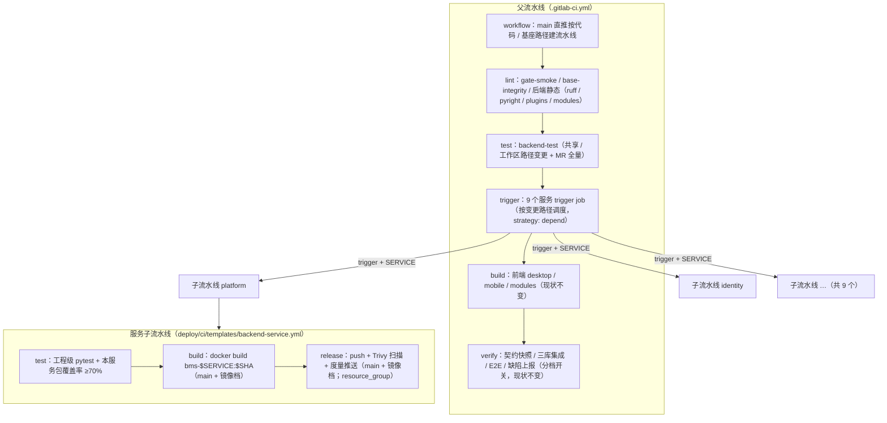

# 父-子流水线详细设计

> 后端基座与服务化地基 · 09 多服务CI-CD与契约门禁 · 01 父-子流水线 · 详细设计

[文档首页](../../../../../../文档首页.md) › [01 父-子流水线](../09_多服务CI-CD与契约门禁_01_父-子流水线.md) › 详细设计　|　[父任务：多服务CI-CD与契约门禁](../../09_多服务CI-CD与契约门禁.md) · [本阶段需求](../../../../需求/09_需求_多服务CI-CD与契约门禁.md) · [排期计划](../../../../计划/01_计划_后端基座与服务化地基.md)

## 1. 概述 <a id="overview"></a>

- **目标**：把单体 CI 升级为**父-子流水线**——父流水线按变更路径（`rules:changes`）调度、`trigger` 拉起服务子流水线；子流水线只**测试 / 构建 / 发布该服务**（镜像与版本按服务独立）；公共模板经 `include` 抽取（跨项目固定完整 SHA）；`resource_group` 防同服务并发发布打架。使服务化地基 S7「服务独立发布成功率」可度量、可验收。
- **依据**：《[架构设计 · 测试与质量](../../../../../../设计/架构设计/32_架构设计_测试与质量.md)》「CI 流水线」节（父-子流水线形态、main 分支镜像构建 + 扫描）；《[架构设计 · 部署与运维](../../../../../../设计/架构设计/33_架构设计_部署与运维.md)》「版本与发布管理」节（按服务构建与独立发布、镜像 / 版本按服务独立）；《[部署发布规范](../../../../../../规范/部署发布规范.md)》「镜像与版本」「发布流程」节；《[微服务演进规划](../../../../../../规划/微服务演进规划.md)》「服务化地基要求与门禁」（S7）；需求 [09-1](../../../../需求/09_需求_多服务CI-CD与契约门禁.md#r09-1)；前置契约 08_02（阶段度量 Pushgateway 通道与 `bms_release_total{service,result}` 口径）、02_03（多服务工程与运行入口）、06_01 / 06_02（服务目录与每服务库键）。
- **范围（本任务）**：
  1. **父流水线改造**：新增 `trigger` 调度层，9 个已启用服务各一个 trigger job（静态模板 + `SERVICE` 变量 + `strategy: depend`），按变更路径调度；`backend-test` 全量测试规则收窄到共享 / 工作区路径；单体 `backend-image` 与 `container-scanning` 由按服务构建 / 扫描取代。
  2. **服务子流水线公共模板**：`deploy/ci/templates/backend-service.yml`——test（工程级测试 + 本服务包覆盖率 ≥70%）→ build（按服务镜像）→ release（推送 Registry + Trivy 扫描 + 发布度量推送），`resource_group` 串行化同服务发布。
  3. **服务运行镜像**：`backend/Dockerfile`（`ARG SERVICE` 参数化，锁文件一致、非目标服务源码不入镜像）。
  4. **公共模板复用口径**：本仓 `include: local`；跨项目（产品仓库）引用固定**完整 SHA** 的口径写入《部署发布规范》。
  5. **发布度量推送**：release job 按 `bms_release_total{service,result}` 口径推送 Pushgateway（08_02 通道，数据末尾换行；不可达不阻断发布结论）。
  6. **既有测试隔离缺陷修复**：`test_service_catalog_startup` 依赖 platform 装配期登记目录读取器，工程级 / 子集运行 9 条失败——改为用例自足登记，使「工程级范围」测试可独立运行（子流水线前置）。
  7. **CI 配置一致性护栏**：新增 CI 配置断言用例（服务目录 ↔ trigger job ↔ 模板 ↔ Dockerfile 四处一致）+ 本地预检扩展。
- **不含（明确归口，见第 8 节）**：Compose 服务编排与 Prometheus 抓取 / blackbox 探针目标切 `{service_key}:8000`（**09_02**，随部署 / 回滚 / 健康门禁）；不可变标签策略（语义化版本 / 禁 latest / 留存）、一键回滚、健康门禁、发布留痕（**09_02**）；契约门禁与契约破坏数推送（**09_03**）；前端 desktop / mobile / modules job 群（保持现状，不套「服务」概念）；镜像非 root 运行与瘦身（运维阶段）。

## 2. 现状与差距 <a id="gap"></a>

| 关注点 | 现状（08_02 交付后） | 差距（本任务目标） |
| --- | --- | --- |
| 流水线形态 | 单体 `.gitlab-ci.yml`（34KB）：后端全量测试 + 前端 job 群 + 重验证层同一条流水线 | 父-子流水线：父调度 + 9 服务子流水线 |
| 变更调度 | `backend/**` 任一变更即跑后端全量（含全部服务测试） | 服务变更只跑该服务子流水线；共享变更跑全量 |
| 服务镜像 | 单体 `backend-image`（P3 档未开、`backend/Dockerfile` 不存在）；`container-scanning` 扫 `bms-backend` | 按服务镜像 `bms-{service}:$CI_COMMIT_SHORT_SHA` + 每服务 Trivy 扫描 |
| 公共模板 | 无（单体 YAML，无法复用） | `deploy/ci/templates/` 抽取 + 跨项目固定完整 SHA 口径 |
| 并发发布 | 无保护 | `resource_group: bms-release-$SERVICE` |
| 发布度量 | 通道与口径已就位（Pushgateway + `bms_release_total`），无真实推送 | release job 真实推送 success / failure |
| 服务级测试 | 全量聚合跑（覆盖率整体 ≥70%）；工程级范围有 9 条失败（core 子集） | 服务子流水线工程级测试 + 本服务包覆盖率 ≥70%；core 子集缺陷修复 |
| 镜像档开关 | `deploy/ci/verify/image` 未创建（P3 待开） | 随本任务创建（子流水线 build / release 以该档守卫） |

## 3. 交付物清单 <a id="tree"></a>

```text
.gitlab-ci.yml                                        # 改：+trigger 调度层；backend-test 规则收窄；移除 backend-image / container-scanning
deploy/ci/
├── templates/backend-service.yml                     # 新：服务子流水线公共模板（test / build / release）
└── verify/image                                      # 新：镜像档开关（P3 激活；删档即关）
backend/
├── Dockerfile                                        # 新：服务运行镜像（ARG SERVICE 参数化）
├── .dockerignore                                     # 新：构建上下文瘦身（*.db / 缓存 / 基准脚本）
└── libs/bms_core/tests/
    ├── core/test_service_catalog_startup.py          # 改：自足登记 platform 目录读取器（工程级 / 子集运行可独立）
    └── ops/test_ci_pipeline.py                       # 新：CI 父-子流水线配置断言（Kiwi 用例）

scripts/tools/preflight/check-preflight.py            # 改：CI 配置自检覆盖子流水线模板（YAML 解析）

bms文档/
├── 规范/部署发布规范.md                               # 改：「镜像与版本」补服务镜像命名 / 子流水线 / 跨项目固定 SHA 口径
├── 规范/测试规范.md                                   # 改：§13 CI 执行策略补父-子流水线
├── 规划/开发部署规划.md                               # 改：§7 分层流水线口径更新（父子流水线 + 按服务构建发布）
├── 资料/开发服务器/linux/GitLab部署使用说明.md         # 改：runner 实测并发数校正 + 父子流水线排障
├── 资料/开发服务器/linux/可观测性栈部署使用说明.md      # 改：「告警与阶段度量」节补 CI 真实推送落点（一句）
└── 项目/02_后端基座与服务化地基/
    ├── 计划/01_计划_后端基座与服务化地基.md            # 改：§1 台账 / §2 已完成 / §3 移除 09_01 / §4 甘特 / §7 归口
    ├── 任务/09_多服务CI-CD与契约门禁/09_多服务CI-CD与契约门禁.md   # 改：子任务表状态
    └── 任务/09_…_01_父-子流水线/                        # 改：任务状态 / 完成日期 + 设计 / 实施 / 测试记录

test/scripts/kiwi/cases|exports/…                      # 新：本任务用例登记输入与回读（测试资产仓）
```

## 4. 领域设计 <a id="design"></a>

### 4.1 流水线总体形态 <a id="shape"></a>



- **调度口径**：`backend/services/{svc}/**` 变更 → 只拉起该服务子流水线；`backend/libs/**`、`backend/ops/**`、`backend/alembic/**`、`backend/config*.toml`、`backend/pyproject.toml`、`backend/uv.lock`、`deploy/**`、`.gitlab-ci.yml` 变更 → 父流水线全量测试（`backend-test`），不拉起服务子流水线（服务镜像随下次服务变更或 09_02 发布流程重建，见第 8 节开放项）。
- **测试分工**：服务子流水线跑**本服务工程级测试**（`cd backend/services/{svc} && uv run pytest`，只跑本服务 tests）；共享 / 工作区变更由父流水线**全量聚合测试**兜底（含跨包用例，如 core 测试引 platform 模型）。静态检查（ruff / pyright / 插件装配 / 服务目录）是仓库级检查，留父流水线按 `backend/**` / `deploy/**` 放行（服务变更时同样覆盖该服务源码）。
- **前端**：desktop / mobile / modules job 群保持现状（前端不套「服务」概念，09 需求针对微服务）。

### 4.2 父流水线改造 <a id="parent"></a>

**阶段**：新增 `trigger` 调度层（在 `test` 之后、`build` 之前）——父流水线的快速门禁（lint / 共享全量测试）先过，再拉起子流水线；父流水线以 `strategy: depend` 等待子流水线终态，子流水线失败即父流水线失败（`.post` 缺陷上报链路不变）。

```yaml
stages:
  - prepare
  - lint
  - test
  - trigger
  - build
  - verify
```

**服务 trigger job**（9 个，公共部分走 YAML 锚点；`SERVICE` 为服务标识，取自服务目录 `enabled_service_keys()`）：

```yaml
.trigger-service: &trigger-service
  stage: trigger
  trigger:
    include:
      - local: deploy/ci/templates/backend-service.yml
    strategy: depend

trigger-platform:
  <<: *trigger-service
  variables:
    SERVICE: platform
  rules:
    # MR 流水线：全量门禁（恢复 MR 流程后生效；当前 workflow 未放行 MR 事件，见「边界」）
    - if: $CI_PIPELINE_SOURCE == "merge_request_event"
    # main 直推：按变更路径只拉起受影响服务（默认与上一提交比较）
    - if: $CI_COMMIT_BRANCH == $CI_DEFAULT_BRANCH
      changes:
        paths: [backend/services/platform/**/*]
    # 其他分支（web / api 手动触发）：以 main 为 diff 基准兜底（新分支 changes 恒真，用 compare_to 收敛）
    - if: $CI_COMMIT_BRANCH
      changes:
        compare_to: 'refs/heads/main'
        paths: [backend/services/platform/**/*]
```

（identity / tenant / org / file / notification / search / ai / report 同构，路径与 `SERVICE` 对应替换。）

**`backend-test` 规则收窄**（其余 script 与覆盖率门禁不变）：

```yaml
backend-test:
  rules:
    - if: $CI_PIPELINE_SOURCE == "merge_request_event"
      exists: [backend/pyproject.toml]
    - if: $CI_COMMIT_BRANCH == $CI_DEFAULT_BRANCH
      changes:
        paths:
          - backend/libs/**/*
          - backend/ops/**/*
          - backend/alembic/**/*
          - backend/config*.toml
          - backend/pyproject.toml
          - backend/uv.lock
          - deploy/**/*
          - .gitlab-ci.yml
      exists: [backend/pyproject.toml]
    - if: $CI_COMMIT_BRANCH
      changes:
        compare_to: 'refs/heads/main'
        paths: [同上]
      exists: [backend/pyproject.toml]
```

- `deploy/**` 保留在共享路径：既有配置读取类用例（如可观测编排 / 网关配置 / 渲染脚本）直接读 `deploy/` 资产，改动需跑全量；`.gitlab-ci.yml` 纳入是为让 **CI 配置护栏用例**（本任务新增）在 CI 配置变更时被跑到。
- **移除**：`backend-image`（单体镜像，由子流水线按服务构建取代）、`container-scanning`（扫 `bms-backend`，由 release job 按服务扫描取代）；`frontend-image` 与 `.build-push-base` 锚点保留（前端镜像档不变；Dockerfile 前置在脚本内判定跳过——`rules:exists` 多模式为「任一命中」，无法与档位文件做 AND）。

### 4.3 服务子流水线公共模板 <a id="template"></a>

`deploy/ci/templates/backend-service.yml`（子流水线配置本体；父流水线 trigger 拉起时 `$CI_PIPELINE_SOURCE == "parent_pipeline"`）：

```yaml
# 服务子流水线公共模板：父流水线 trigger 拉起，变量 SERVICE 指定服务标识。
# 跨项目复用：include: project: bms/bms, ref: <完整 SHA>, file: deploy/ci/templates/backend-service.yml
workflow:
  auto_cancel:
    on_new_commit: interruptible
  rules:
    - if: $CI_PIPELINE_SOURCE == "parent_pipeline"

default:
  tags: [bms]
  interruptible: true

variables:
  REGISTRY_HOST: 192.168.0.107:5050
  REGISTRY_IMAGE_PREFIX: 192.168.0.107:5050/bms/bms
  PUSHGATEWAY_URL: "http://192.168.0.107:9092"

stages:
  - test
  - build
  - release

service-test:
  stage: test
  image: $REGISTRY_IMAGE_PREFIX/ci-backend:py314
  variables:
    BMS_ENV: test
  script:
    - test -n "$SERVICE" || { echo "缺少 SERVICE 变量（须由父流水线 trigger 传入）"; exit 1; }
    - test -d "backend/services/$SERVICE" || { echo "服务目录不存在：backend/services/$SERVICE"; exit 1; }
    - cd backend
    - uv sync --frozen
    - cd "services/$SERVICE"
    - uv run pytest -q --cov="bms_$SERVICE" --cov-branch --cov-report=term --cov-fail-under=70
  coverage: '/^TOTAL.*?\s+\d+\s+\d+\s+(\d+(?:\.\d+)?%)$/'

service-build:
  stage: build
  image: docker:27-cli
  needs: [service-test]
  rules:
    - if: $CI_COMMIT_BRANCH == $CI_DEFAULT_BRANCH
      exists: [deploy/ci/verify/image]
  script:
    - IMAGE="$REGISTRY_IMAGE_PREFIX/bms-$SERVICE:$CI_COMMIT_SHORT_SHA"
    - docker build --provenance=false --build-arg SERVICE="$SERVICE" -t "$IMAGE" -f backend/Dockerfile backend/

service-release:
  stage: release
  image: docker:27-cli
  needs: [service-build]
  resource_group: bms-release-$SERVICE
  interruptible: false            # 发布不可被自动取消（防半发布；test / build 可取消）
  rules:
    - if: $CI_COMMIT_BRANCH == $CI_DEFAULT_BRANCH
      exists: [deploy/ci/verify/image]
  before_script:
    - echo "$GITLAB_API_TOKEN" | docker login "$REGISTRY_HOST" -u root --password-stdin
  script:
    - IMAGE="$REGISTRY_IMAGE_PREFIX/bms-$SERVICE:$CI_COMMIT_SHORT_SHA"
    - docker push "$IMAGE"
    # 镜像安全扫描（架构「main 分支镜像扫描」口径；CRITICAL / HIGH 阻断发布）
    # trivy 固定 tag；trivy-cache 卷持久化漏洞库；DB 走国内镜像（默认 mirror.gcr.io 不可达）
    - docker run --rm -v /var/run/docker.sock:/var/run/docker.sock -v trivy-cache:/root/.cache/trivy -e TRIVY_DB_REPOSITORY=ghcr.nju.edu.cn/aquasecurity/trivy-db:2 aquasec/trivy:0.74.0 image --exit-code 1 --severity CRITICAL,HIGH --ignore-unfixed "$IMAGE"
  after_script:
    # 发布度量（08_02 通道；按 job 终态记 success / failure；不可达不改变发布结论）
    - |
      RESULT=failure; [ "$CI_JOB_STATUS" = "success" ] && RESULT=success
      if [ -n "$PUSHGATEWAY_URL" ]; then
        printf 'bms_release_total{service="%s",result="%s"} 1\n' "$SERVICE" "$RESULT" > /tmp/metrics.txt
        wget -q -O- --post-file=/tmp/metrics.txt "$PUSHGATEWAY_URL/metrics/job/bms-ci" \
          || echo "阶段度量推送失败（不阻断发布结论）"
      else
        echo "PUSHGATEWAY_URL 未配置：跳过阶段度量推送"
      fi
```

- **自包含变量**：模板内定义 `REGISTRY_*` / `PUSHGATEWAY_URL`（子流水线可独立复现；与父流水线同值由护栏用例断言，防漂移）。
- **度量推送**：`docker:27-cli`（Alpine）自带 busybox `wget`（`--post-file` 实测可用）；数据末尾换行（Pushgateway 08_02 实测要求）；推送失败只提示不改发布结论。
- **子流水线测试口径**：工程级范围（本服务 tests）+ 本服务包覆盖率门禁 ≥70%——9 个启用服务实测 77%~94%（platform 94 / identity 91 / org 85 / tenant 84 / file 89 / notification 77 / search 81 / ai 91 / report 90），门禁有余量。
- **可中断性**：`test` / `build` 允许自动取消（新推送取消旧流水线）；`release` 置 `interruptible: false`，避免推送 / 扫描中途被取消。
- **`resource_group`**：`bms-release-$SERVICE` 为项目级互斥——同服务并发发布串行执行（不同服务互不阻塞）。

### 4.4 服务运行镜像（`backend/Dockerfile`） <a id="dockerfile"></a>

构建上下文为 `backend/`（与既有 `backend-image` job 口径一致，上下文小、无前端 / 文档内容）；`SERVICE` 构建参数决定装入哪个服务：

```dockerfile
# BMS 服务运行镜像（按服务参数化；构建上下文 backend/）
# 构建：docker build --provenance=false --build-arg SERVICE=platform -f backend/Dockerfile backend/
FROM python:3.14-slim

ARG SERVICE
ENV PIP_INDEX_URL=https://pypi.tuna.tsinghua.edu.cn/simple \
    UV_DEFAULT_INDEX=https://pypi.tuna.tsinghua.edu.cn/simple \
    UV_PROJECT_ENVIRONMENT=/opt/bms-venv \
    UV_NO_SYNC=1 \
    SERVICE=${SERVICE}

RUN pip install --no-cache-dir uv

# 系统包安全更新（Trivy CRITICAL/HIGH 阻断发版；base 镜像自带包常落后于 Debian 安全更新）
RUN sed -i 's|deb.debian.org|mirrors.tuna.tsinghua.edu.cn|g' /etc/apt/sources.list.d/debian.sources \
 && apt-get update && apt-get upgrade -y && rm -rf /var/lib/apt/lists/*

WORKDIR /opt/bms
# 工作区元数据（uv.lock 一致：非目标服务只入 pyproject 清单，源码不入镜像）
COPY pyproject.toml uv.lock ./
COPY libs/bms_core/pyproject.toml libs/bms_core/pyproject.toml
COPY services/platform/pyproject.toml services/platform/pyproject.toml
COPY services/identity/pyproject.toml services/identity/pyproject.toml
COPY services/tenant/pyproject.toml services/tenant/pyproject.toml
COPY services/org/pyproject.toml services/org/pyproject.toml
COPY services/file/pyproject.toml services/file/pyproject.toml
COPY services/notification/pyproject.toml services/notification/pyproject.toml
COPY services/search/pyproject.toml services/search/pyproject.toml
COPY services/ai/pyproject.toml services/ai/pyproject.toml
COPY services/report/pyproject.toml services/report/pyproject.toml
# 第三方依赖层（不装工作区成员；锁文件零漂移）
RUN uv sync --frozen --no-install-workspace --package "bms-${SERVICE}" && rm -rf /root/.cache

# 工作区成员源码（共享基座库 + 目标服务）
COPY libs/bms_core/src libs/bms_core/src
COPY services/${SERVICE}/src services/${SERVICE}/src
RUN uv sync --frozen --no-dev --package "bms-${SERVICE}" && rm -rf /root/.cache

# 运行时移除 pip（base 镜像自带；其 vendored msgpack / setuptools 会被镜像扫描按包计洞）
RUN python -m pip uninstall -y pip

ENV PATH=/opt/bms-venv/bin:$PATH
EXPOSE 8000
HEALTHCHECK --interval=15s --timeout=3s --start-period=10s --retries=3 \
  CMD ["python", "-c", "import urllib.request; urllib.request.urlopen('http://127.0.0.1:8000/healthz', timeout=2)"]
CMD ["sh", "-c", "exec python -m bms_${SERVICE}"]
```

- **启动入口**：`python -m bms_{service}`（02_03 各服务 `__main__` 入口，读 `[server]` 配置 / 环境变量；`BMS_SERVER__PORT` 默认 8000）。
- **锁文件一致**：`uv sync --frozen`（依赖以 `backend/uv.lock` 锁定，与 CI 基础镜像同源）；`--no-dev` 不装测试依赖。
- **两层缓存**：第三方依赖层在前、源码层在后——源码变更只重建第二层。`--package` 与 `--no-install-workspace` 的组合语义实施时实测（不成立则退化为单层 `uv sync --frozen --no-dev --package`，见第 5 节）。
- **`backend/.dockerignore`**：`**/__pycache__`、`**/.pytest_cache`、`*.db`、`benchmarks/`——构建上下文不含开发库与缓存（镜像内服务用外部库 / 环境变量注入连接，Compose 编排归 09_02）。
- **命名**：`bms-{service}`（《命名规范》「基础设施命名」镜像名 `bms-组件`），标签 `$CI_COMMIT_SHORT_SHA`（与既有 `bms-backend:$CI_COMMIT_SHORT_SHA` 口径一致）；语义化版本 / 禁 latest / 留存策略归 09_02。

### 4.5 发布度量推送 <a id="metrics"></a>

| 项 | 口径 |
| --- | --- |
| 指标 | `bms_release_total{service,result}`（counter；`result` ∈ success / failure；08_02 已登记 `METRIC_NAMES`） |
| 推送点 | 子流水线 `service-release` 的 `after_script`——按 `$CI_JOB_STATUS` 判定本次发布成功 / 失败（构建失败不产生 release job，见下） |
| 通道 | Pushgateway `POST $PUSHGATEWAY_URL/metrics/job/bms-ci`（文本格式、末尾换行；Prometheus `honor_labels` 抓取 + Grafana 阶段度量面板） |
| 地址 | 模板变量 `PUSHGATEWAY_URL`（默认宿主 9092；可被项目 CI/CD 变量覆盖；未配置则跳过并提示） |
| 失败语义 | 推送失败仅日志提示，**不改变发布结论**（可观测为次要信号） |
| 触发范围 | 仅 main 分支（release job 只在 main 运行）；MR / 手动分支流水线只测不发布，不产生发布度量 |

**口径说明（构建失败无 release job）**：`service-build` 失败时 `service-release` 不执行，本次发布不产生度量点；「服务独立发布成功率」按实际进入发布环节的次数统计（失败点由 release 环节的推送覆盖：推送失败 / 扫描阻断 / 镜像推送失败均记 failure）。该口径与 08_02 面板「发布成功率 = success / 总数」一致；如后续需要「构建失败也计入」，由 09_02 发布流程评估（开放项）。

### 4.6 公共模板跨项目引用口径（固定完整 SHA） <a id="cross-project"></a>

- **本仓**：父流水线 `trigger.include.local` 引用 `deploy/ci/templates/backend-service.yml`（同一提交内，天然一致）。
- **跨项目（产品仓库 / 其他工作区仓库）**：以 `trigger.include.project` 把模板作为**子流水线配置**引用，并**固定完整 SHA**（禁止分支名 / 短 SHA / tag 漂移）：
  ```yaml
  service-child:
    trigger:
      include:
        - project: bms/bms
          ref: <完整 40 位 commit SHA>
          file: deploy/ci/templates/backend-service.yml
      strategy: depend
    variables:
      SERVICE: platform
  ```
  说明：模板内含 `workflow` 规则（只接受 `parent_pipeline` 来源），**按子流水线配置使用**（不经普通 `include` 合并进下游主配置，避免 `workflow` 键冲突）；固定 SHA 的理由：模板是构建 / 发布口径的公共事实源，分支引用会让下游在无感知下换口径，固定 SHA 使升级成为显式提交（升级须显式提交；原 Renovate 自动升级已于 2026-09 停用）。
- **口径落点**：《部署发布规范》「镜像与版本」节补一句强制口径（模板复用 + 固定完整 SHA + 升级显式化）；本任务无跨项目消费方，只立规则。

### 4.7 测试隔离缺陷修复 <a id="isolation"></a>

**缺陷**：`libs/bms_core/tests/core/test_service_catalog_startup.py` 以 `service_name="platform"` 构造应用并断言「platform 本地读本服务平台库」；该读取器由 `bms_platform.main::configure_service` 在装配期经 `register_catalog_reader` 登记。全量运行时 platform 用例先导入服务包、登记生效；**工程级 / 子集运行**（`cd libs/bms_core && uv run pytest` 或 `pytest libs/bms_core/tests`）不经过该导入路径，9 条用例报 `CatalogError: 服务目录权威（platform）的本地读取器未登记`（2026-09-24 实测；本地预检非 `--fast` 模式同样受影响）。

**修复**：用例模块自足登记同一读取器（幂等，与 platform 装配期登记同源）：

```python
from bms_core.catalog.loader import register_catalog_reader
from bms_platform.sources.catalog_source import read_catalog

# 工程级 / 子集运行自足：platform 权威读取器由服务包装配期登记（bms_platform.main）；
# 子集运行不经过该装配路径，这里显式登记同一读取器（幂等），保证用例独立可跑。
register_catalog_reader("platform", read_catalog)
```

- 该用例本就依赖 platform 模型（`from bms_platform.models.catalog import SysModule`），登记真实读取器不引入新依赖方向，也不改变断言语义。
- 修复后 `cd libs/bms_core && uv run pytest`（工程级）与 `pytest libs/bms_core/tests`（子集）均全绿，作为服务子流水线「工程级范围」的前置；顺带修复本地预检非 `--fast` 模式的既有红灯。

### 4.8 CI 配置一致性护栏与本地预检 <a id="guard"></a>

**新增用例** `backend/libs/bms_core/tests/ops/test_ci_pipeline.py`（Kiwi 用例；路径定位沿用 `BACKEND_ROOT` 口径）：

| 断言组 | 要点 |
| --- | --- |
| 服务目录 ↔ trigger job | trigger job 的 `SERVICE` 集合 == `enabled_service_keys()`（无缺件 / 无多余）；每 job `strategy: depend`、include 指向公共模板、规则含 `backend/services/{svc}/**/*` 与 main / MR / compare_to 三类 |
| 父流水线规则 | `backend-test` 规则含共享路径（`backend/libs` / `deploy` / `.gitlab-ci.yml` 等）且**不含** `backend/services` 服务路径；`backend-image` / `container-scanning` 已移除；`stages` 含 `trigger` |
| 子模板 | `workflow` 含 `parent_pipeline`；test / build / release 三 job；`resource_group: bms-release-$SERVICE`；release `interruptible: false`；build 用 `--build-arg SERVICE`、镜像名 `bms-$SERVICE` + `$CI_COMMIT_SHORT_SHA`；release 含 Trivy 扫描与 `bms_release_total` / `CI_JOB_STATUS` / `PUSHGATEWAY_URL` |
| 常量同源 | 模板 `REGISTRY_IMAGE_PREFIX` 与父流水线同值；`deploy/ci/verify/image` 开关存在 |
| Dockerfile | 存在且含 `ARG SERVICE`、`python -m bms_${SERVICE}`、`uv sync --frozen`、目标服务源码 COPY |

**本地预检扩展**（`scripts/tools/preflight/check-preflight.py`）：CI 配置自检在 `.gitlab-ci.yml` 之外**解析 `deploy/ci/templates/*.yml`**（YAML 合法性）；`backend-test` 的 pytest 选项校验不变（job 名与 script 保留）。

## 5. 失败分支与边界 <a id="failures"></a>

| 场景 | 处理 |
| --- | --- |
| 服务目录与 CI 配置漂移（新增 / 删除 / 改名服务） | 护栏用例失败阻断（服务目录 ↔ trigger job 集合断言）；新增服务只需补一段 trigger job |
| trigger 未传 `SERVICE` / 目录不存在 | `service-test` 首步显式报错退出（中文提示），不进入构建 |
| 服务子流水线 test 失败 | 父流水线经 `strategy: depend` 失败；`.post` 缺陷上报链路照常触发 |
| 镜像构建失败 | release 不执行（无发布度量点，见 4.5）；父流水线失败 |
| Registry 推送失败 / Trivy 扫描阻断 | release job 失败 → 度量记 failure；父流水线失败（镜像已推 / 未推均不改判定） |
| Registry 推送报 `blob unknown` | BuildKit 默认 attestation（provenance）清单不被 GitLab Registry 接受（2026-09-24 mjbk 实测）；构建固定加 `--provenance=false` 即解（模板已内置，见决策 16） |
| Trivy DB 拉取失败 / 外网不可达 | 扫描失败即发布失败（架构口径：扫描阻断发版）；实施时预拉 trivy 镜像并验证 DB 拉取，失败则登记排障 |
| Pushgateway 不可达 | 仅日志提示，发布结论不变（度量缺失由面板可见） |
| 同服务并发发布 | `resource_group` 串行；后到者排队等待，不并发推送 |
| 新推送取消旧流水线 | test / build 可取消；release `interruptible: false` 不被自动取消（父流水线被手动取消仍会连带取消子流水线——已知边界，登记开放项） |
| 新分支 / 无 diff 基准 | 其他分支流水线 `changes: compare_to: 'refs/heads/main'` 兜底；MR 流水线全量 |
| MR 流水线当前不创建 | 父 `workflow` 未放行 `merge_request_event`（单人期直推 main，MR 流程暂缓）；trigger / backend-test 的 MR 规则为恢复 MR 流程预留（届时补 workflow 放行） |
| 子模板 / Dockerfile 变更 | `deploy/**` / `.gitlab-ci.yml` 在共享路径 → 父全量测试 + 护栏用例覆盖；模板真实生效需一次手动 web 流水线（登记于实施记录） |
| 镜像层缓存 | `--package` 与 `--no-install-workspace` 组合语义若与预期不符，退化为单层 `uv sync --frozen --no-dev --package`（镜像变大、构建变慢，功能不受影响）；实施时以实测回写 |
| 服务镜像未随 core 变更重建 | 共享变更不拉起服务子流水线（本任务口径）；镜像陈旧窗口由 09_02 发布流程评估（开放项） |

## 6. 测试设计与验收映射 <a id="tests"></a>

用例**先登记 Kiwi TCMS（分类「平台骨架」/ P2 / CONFIRMED / 自动化）取得编号**，再编码并标注 `@pytest.mark.kiwi_id(<编号>)`（本任务登记一条策展用例，多条断言共用）。

| 用例 / 文件 | 类型 | 断言要点 |
| --- | --- | --- |
| `libs/bms_core/tests/ops/test_ci_pipeline.py` | 单元 | 4.8 表五组断言（服务目录 ↔ trigger / 父规则 / 子模板 / 常量同源 / Dockerfile） |
| `libs/bms_core/tests/core/test_service_catalog_startup.py`（改） | 单元 | 工程级 / 子集运行全绿（自足登记 platform 读取器；原 9 条失败修复） |
| 既有全量回归 | 单元 + 集成 | 全量 `pytest` / `ruff` / `pyright` / 基座与边界校验全绿（无行为回归） |
| 本地预检 | 静态 | `check-preflight.py`（含新模板 YAML 解析）与 GitLab CI Lint API 全绿 |
| mjbk 真实构建 | 集成（人工留痕） | `docker build --provenance=false --build-arg SERVICE=platform` 真实构建通过、容器可启动 `/healthz`（远程 docker，实测记录） |
| 真实流水线验收 | 集成（人工留痕） | 推送后：改动单服务仅出现该服务 trigger job + 子流水线（其余服务不出现）；子流水线 test / build / release 全绿；Registry 镜像 `bms-{service}:$SHA` 可查；Pushgateway `bms_release_total{service,result="success"}` 可查（用户确认后推送） |

验收映射：

| 完成标准（需求 09-1） | 验证方式 |
| --- | --- |
| 改动某服务仅触发其子流水线 | 真实流水线作业列表（仅该服务 trigger + 子流水线；父静态 / 全量规则不误伤） + 护栏用例规则断言 |
| 服务可独立构建与发布 | 子流水线 build / release 成功 + Registry 镜像 + 发布度量 success；mjbk 真实构建冒烟 |
| 公共模板复用且无重复 YAML | 单一模板 `deploy/ci/templates/backend-service.yml` 被 9 个 trigger 引用；护栏用例断言常量同源与结构 |
| 校验通过 | `pytest` / `ruff` / `pyright` / `check-base` / `check-backend-base` / `check-service-boundaries` / `check-status` / `check-preflight` / CI Lint 全绿 |

## 7. 登记落点 <a id="writeback"></a>

| 落点 | 内容 |
| --- | --- |
| 《部署发布规范》「镜像与版本」「发布流程」节 | 服务镜像命名 `bms-{service}` + 不可变标签口径（SHA / 语义化版本，09_02 收紧）；父-子流水线按服务构建发布；公共模板跨项目 include 固定完整 SHA |
| 《测试规范》§13 | CI 执行策略补「父-子流水线：按变更路径调度 + 服务子流水线工程级测试 / 构建 / 发布」 |
| 《开发部署规划》§7 | 分层流水线口径更新（冒烟层 + 父-子流水线；镜像档按服务构建发布） |
| 《GitLab部署使用说明》 | runner 实测并发数校正（2 → 4）；父子流水线排障（trigger job / 子流水线 / 度量推送） |
| 《可观测性栈部署使用说明》 | 「告警与阶段度量」节补 CI 真实推送落点（release job；模板变量 `PUSHGATEWAY_URL`） |
| 《后端 README》 | 服务镜像本地构建命令（`docker build --build-arg SERVICE=…`） |
| 计划 | §1 台账与计数；§2 已完成（09_01 行）；§3 移除 09_01；§4 甘特；§7 第 29 项（发布度量推送 09_01 侧闭环）与第 26 项（容器化目标切换留 09_02） |
| 任务 / 父任务 | 状态与完成日期两处一致（需求文档不承载进度） |
| Kiwi TCMS / 测试资产仓 | 登记用例并回读编号；`test/scripts/kiwi/cases|exports/` 对应文件 |
| 实施 / 测试记录 | 任务目录 `实施/`、`测试/` 各一份 |
| 架构节点 | 语义不变（32 §8 父-子流水线、33 §9 按服务发布已述）；实现细节落本设计与 CI 配置，不回改架构语义 |

## 8. 边界与开放项 <a id="boundary"></a>

- **归 09_02**：Compose 服务编排与 Prometheus 抓取 / blackbox 探针目标切 `{service_key}:8000`（本任务只产出可运行镜像）；不可变标签策略（语义化版本 / 禁 latest / 留存）、一键回滚、健康门禁（`/readyz` + 冒烟）、发布留痕。
- **归 09_03**：契约门禁（oasdiff / Schemathesis）与 `bms_contract_breaking_total` 推送。
- **开放项（core 变更后镜像重建）**：共享变更不拉起服务子流水线（本任务口径），服务镜像随下次服务变更重建；「共享变更后全量重建 / 按需重建」由 09_02 发布流程评估。
- **开放项（构建失败是否计入发布度量）**：当前只统计进入 release 环节的发布；如需构建失败也计入，随 09_02 发布流程定案（口径变更需回写 08_02 面板说明）。
- **开放项（父流水线手动取消连带子流水线）**：`release` 的 `interruptible: false` 只挡自动取消；手动取消父流水线仍会连带取消子流水线——按需在 09_02 发布流程评估（如发布改经独立流水线）。
- **开放项（Trivy DB 缓存）**：trivy 镜像固定 tag `aquasec/trivy:0.74.0`（已入 `scripts/tools/docker/镜像清单.txt` 并预拉 mjbk）；DB 每次下载（无缓存），如需加速随 09_02 评估。
- **开放项（runner 并发）**：实测 `concurrent = 4`（文档曾记 2），本任务校正文档；9 服务并发调度下的排队时长随实际运行评估。
- **开放项（服务镜像非 root / 瘦身）**：现沿用 `python:3.14-slim` + root（与 CI 基础镜像一致）；非 root 运行与多阶段瘦身随运维阶段。
- **不改**：前端 job 群；重验证层既有档（contract / db / e2e / defect）；服务目录、契约快照、事件契约；既有 Kiwi 用例号。

```mermaid
flowchart LR
    A["Kiwi 用例登记（先登记后编码）"] --> B["子流水线模板 + 父流水线 trigger 调度改造"]
    B --> C["backend/Dockerfile + .dockerignore + 镜像档开关"]
    C --> D["测试隔离缺陷修复（core 子集自足）"]
    D --> E["CI 配置护栏用例 + 预检扩展"]
    E --> F["本地门禁全绿 + CI Lint"]
    F --> G["mjbk 远程真实构建冒烟（Dockerfile）"]
    G --> H["用户确认后推送：真实流水线验收（调度 / 构建 / 发布 / 度量）"]
    H --> I["登记回写 + 实施/测试记录 + 提交"]
    I --> J["偏差遗留闭环（09_02 / 09_03 / 运维）"]
```

## 9. 实施步骤 <a id="steps"></a>



1. 读《[KiwiTCMS 部署使用说明](../../../../../../资料/开发服务器/linux/KiwiTCMS部署使用说明.md)》「用例约定」节，登记本任务用例并**回读编号**（输入文件落 `test/scripts/kiwi/cases/`；先登记后编码）。
2. 子流水线模板：`deploy/ci/templates/backend-service.yml`；父流水线：`.gitlab-ci.yml` 增 `trigger` 阶段与 9 个 trigger job、`backend-test` 规则收窄、移除 `backend-image` / `container-scanning`；创建 `deploy/ci/verify/image` 档。
3. 镜像资产：`backend/Dockerfile` + `backend/.dockerignore`。
4. 测试隔离修复：`test_service_catalog_startup.py` 自足登记。
5. 护栏与预检：`tests/ops/test_ci_pipeline.py` + `check-preflight.py` 扩展。
6. 本地门禁：`uv run pytest -q`（全量）/ 工程级范围（10 个 root）/ `ruff check` / `ruff format --check` / `pyright`；`check-base` / `check-backend-base` / `check-service-boundaries` / `check-status` / `check-preflight`；GitLab CI Lint API。
7. **mjbk 真实构建冒烟**（远程操作，先读部署说明）：同步 `backend/` → `docker build --build-arg SERVICE=platform -f backend/Dockerfile backend/` → `docker run` 起容器验证 `/healthz`（环境变量注入 SQLite 或跳过 DB 依赖）→ 清理留痕；预拉 `aquasec/trivy:0.74.0` 并验证扫描口径。
8. **请用户确认后推送**，真实流水线验收：改动单服务 → 观察作业列表（仅该服务子流水线）；子流水线 test / build / release 全绿；Registry 镜像与 Pushgateway 度量可查。
9. 登记回写（规范 / 规划 / 部署说明 / README / 计划 / 任务状态）+ 实施 / 测试记录 + 代码与文档分开提交（`feat` / `docs`）。
10. 偏差遗留闭环（09_02 / 09_03 / 运维归口标注；另提交）。

关键命令：

```bash
cd backend
uv run pytest -q                                    # 全量聚合
cd libs/bms_core && uv run pytest -q                # 工程级范围（缺陷修复后须全绿）
cd ../.. && uv run ruff check . && uv run ruff format --check . && uv run pyright
# 仓库根
python3 scripts/tools/preflight/check-preflight.py
python3 scripts/tools/base-check/check-base.py
python3 scripts/tools/check-docs/check-status.py
# mjbk（远程；构建上下文 backend/）
docker build --provenance=false --build-arg SERVICE=platform -f backend/Dockerfile backend/ -t bms-platform:smoke
docker run --rm -e BMS_ENV=dev -p 18000:8000 bms-platform:smoke   # 冒烟后清理
```

## 10. 决策记录（对齐记录） <a id="align"></a>

| # | 事项 | 结论（逐项确认） |
| --- | --- | --- |
| 1 | 子流水线覆盖范围 | 后端 9 个已启用服务全部纳管；前端 desktop / mobile / modules 保持父流水线现状 |
| 2 | 父子触发机制 | 静态模板 + 每服务一个 trigger job（`include: local` + `variables.SERVICE`）；服务目录一致性由护栏用例断言 |
| 3 | 公共模板落点与跨项目口径 | 落 `deploy/ci/templates/` + 本地 `include: local`；跨项目 `include: project` + `ref: <完整 SHA>` 口径写入《部署发布规范》 |
| 4 | 测试与覆盖率口径 | 服务子流水线跑本服务工程级测试 + 本服务包覆盖率 ≥70%；共享 / 工作区变更跑父流水线全量（聚合门禁保留）；静态检查留父流水线 |
| 5 | 服务容器化落点 | 本任务只做 Dockerfile + 构建 / 推送镜像；Compose 编排与 Prometheus / blackbox 目标切 `{service_key}:8000` 归 09_02 |
| 6 | 镜像命名与标签 | `bms-{service}` + `$CI_COMMIT_SHORT_SHA`；语义化版本 / 禁 latest / 留存归 09_02 |
| 7 | 度量推送地址 | 模板变量 `PUSHGATEWAY_URL`（默认宿主 9092，可被项目 CI/CD 变量覆盖；未配置则跳过） |
| 8 | 测试隔离缺陷 | 本任务内修复（用例自足登记 platform 读取器，工程级 / 子集运行全绿） |
| 9 | 镜像安全扫描 | 随 release job 每服务 Trivy 扫描（CRITICAL / HIGH 阻断） |
| 10 | 验证方式 | 本地门禁 + CI Lint 全绿后，经用户确认推送真实流水线验收 |
| 11 | 调度阶段位置（实施补充） | `trigger` 阶段在 `test` 之后、`build` 之前——快速门禁先过再拉起子流水线 |
| 12 | 构建 / 发布触发范围（实施补充） | 仅 main 分支（镜像档开启时）；MR 只测；`strategy: depend` 使父流水线反映子流水线终态 |
| 13 | 发布 job 形态（实施补充） | 单 job：push → Trivy 扫描 → `after_script` 度量推送；`interruptible: false` + `resource_group` 防并发 / 半发布 |
| 14 | 度量推送实现（实施补充） | `docker:27-cli`（Alpine）busybox `wget --post-file`；推送失败不阻断发布结论 |
| 15 | 镜像构建上下文（实施补充） | `backend/`（沿用既有 job 口径）+ `backend/.dockerignore`；两层 `uv sync` 缓存，组合语义以实测为准 |
| 16 | 构建 provenance 关闭（实施发现） | mjbk 实测 `docker push` 报 `blob unknown`（BuildKit 默认 attestation 清单不被 GitLab Registry 接受）；构建固定 `--provenance=false`，推送正常 |
| 17 | Trivy 镜像固定 tag（实施发现） | 弃用既有 `aquasec/trivy:latest`，固定 `aquasec/trivy:0.74.0`（已入镜像清单并预拉 mjbk），落实「镜像固定 tag」口径 |
| 18 | 镜像构建冒烟结论（实施补充） | 镜像需含 `alembic.ini`（基座向上搜工程根）与 `config*.toml`（配置基线 / 分层）；平台库需先迁移（容器冒烟以迁移库挂载验证 `/healthz` 200、`/readyz` 503 缺 Redis 符合预期）；迁移 / 编排归 09_02 |
| 19 | 镜像扫描达标（实施发现） | 首扫报 base 镜像自带包（43 条 OS 包 + pip vendored msgpack/setuptools）；Dockerfile 增「apt 清华源 + `apt-get upgrade`」与「运行时移除 pip」两条，复扫归零 |
| 20 | Trivy 漏洞库获取（实施发现） | 默认 `mirror.gcr.io` 在 mjbk 不可达；改 `TRIVY_DB_REPOSITORY=ghcr.nju.edu.cn/aquasecurity/trivy-db:2`（国内 GHCR 镜像，实测可用）+ `trivy-cache` 卷持久化（免每次重下） |
| 21 | 前端镜像档守卫（实施发现） | 镜像档为后端服务开启后 `frontend-image` 被放行但 `frontend/apps/desktop/Dockerfile` 未就绪而失败（首推流水线实证）；`rules:exists` 多模式为「任一命中」不能做 AND，改为**脚本内 `test -f` 前置判定跳过**（档位语义保持：删档即关） |

## 11. 参考文档 <a id="ref"></a>

- [架构设计 · 测试与质量](../../../../../../设计/架构设计/32_架构设计_测试与质量.md)「CI 流水线」节
- [架构设计 · 部署与运维](../../../../../../设计/架构设计/33_架构设计_部署与运维.md)「版本与发布管理」节
- [部署发布规范](../../../../../../规范/部署发布规范.md)「镜像与版本」「发布流程」节
- [测试规范](../../../../../../规范/测试规范.md)「CI 执行策略」节
- [微服务演进规划](../../../../../../规划/微服务演进规划.md)「服务化地基要求与门禁」（S7）
- [开发部署规划](../../../../../../规划/开发部署规划.md)「开发工作流与 CI」节
- [需求 09-1：父-子流水线](../../../../需求/09_需求_多服务CI-CD与契约门禁.md#r09-1)
- [08_02 详细设计](../../../08_可观测性栈/08_可观测性栈_02_按服务归因与健康就绪/设计/01_详细设计_02_按服务归因与健康就绪.md)（阶段度量通道与口径）
- [02_03 详细设计](../../../02_多服务骨架与仓库/02_多服务骨架与仓库_03_单体重构为分布式/设计/03_详细设计_01_单体重构为分布式.md)（多服务工程与服务入口）
- [可观测性栈部署使用说明](../../../../../../资料/开发服务器/linux/可观测性栈部署使用说明.md)「告警与阶段度量」节
- [GitLab 父子流水线文档](https://docs.gitlab.com/ci/pipelines/downstream_pipelines/) · [rules:changes](https://docs.gitlab.com/ci/jobs/job_rules/) · [resource_group](https://docs.gitlab.com/ci/resource_groups/)

> 本文档依《[文档生成规范](../../../../../../规范/文档生成规范.md)》编写 · 关键决策逐项确认
