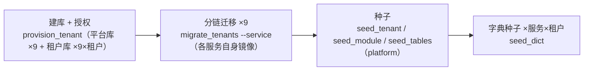
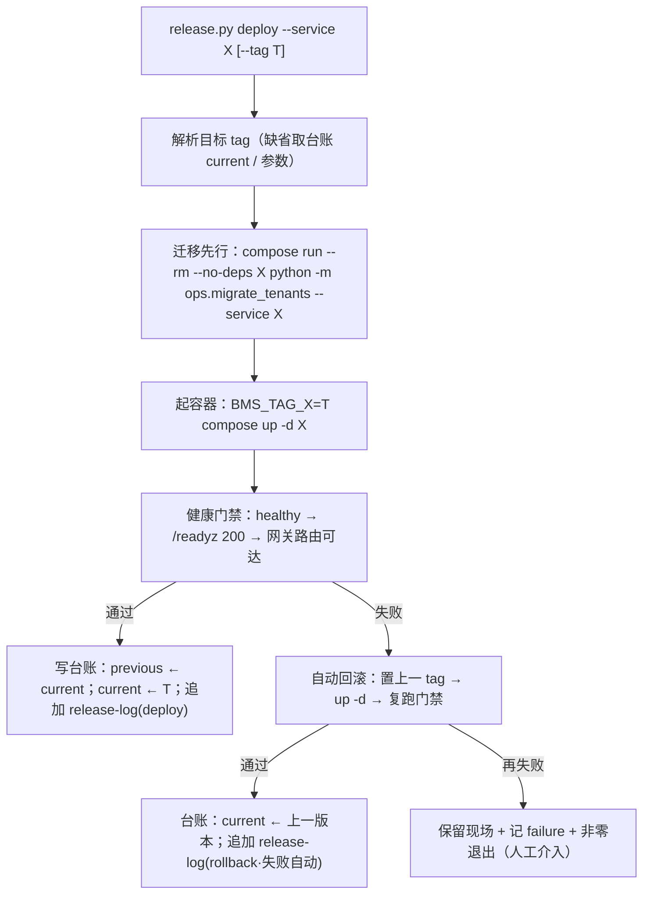

# 不可变镜像与回滚详细设计

> 后端基座与服务化地基 · 09 多服务CI-CD与契约门禁 · 02 不可变镜像与回滚 · 详细设计

[文档首页](../../../../../../文档首页.md) › [02 不可变镜像与回滚](../09_多服务CI-CD与契约门禁_02_不可变镜像与回滚.md) › 详细设计　|　[父任务：多服务CI-CD与契约门禁](../../09_多服务CI-CD与契约门禁.md) · [本阶段需求](../../../../需求/09_需求_多服务CI-CD与契约门禁.md) · [排期计划](../../../../计划/01_计划_后端基座与服务化地基.md)

## 1. 概述 <a id="overview"></a>

- **目标**：在 09_01 已交付的「按服务镜像可构建 / 推送」之上，把 9 个后端服务落成 **可编排、可回滚、可门禁、可留痕** 的发布闭环——① 服务容器编排（`deploy/compose/services.yml`，Compose DNS `{service_key}:8000`）；② 不可变镜像标签（commit short SHA 主标签 + Git tag `vX.Y.Z` 追加语义化标签，禁 `latest`，按版本留存）；③ 一键回滚（版本台账 + compose 标签变量 + 脚本）；④ 健康门禁（`/healthz` + `/readyz` + 网关路由可达冒烟，失败自动回滚）；⑤ 发布留痕（CI 清单 artifact + 服务器 `release-log.jsonl`）；⑥ Prometheus 抓取 / blackbox 探针目标切 `{service_key}:8000`。使服务化地基 S7「服务独立发布成功率」可回滚、可度量、可追溯。
- **依据**：《[架构设计 · 部署与运维](../../../../../../设计/架构设计/33_架构设计_部署与运维.md)》「基础设施编排」「版本与发布管理」节（版本号语义化 / 镜像按版本留存 / 回滚切换上一 tag / 迁移向前修复优先 / 发布检查单 CI 采集 + 人工放行 / 一服务一容器一库）；《[部署发布规范](../../../../../../规范/部署发布规范.md)》「环境管理」「镜像与版本」「发布流程」「回滚」节；《[架构设计 · 可观测性](../../../../../../设计/架构设计/27_架构设计_子系统_可观测性.md)》「健康检查与优雅停机」节；《[微服务演进规划](../../../../../../规划/微服务演进规划.md)》「服务化地基要求与门禁」（S7）；需求 [09-2](../../../../需求/09_需求_多服务CI-CD与契约门禁.md#r09-2)；前置契约 08_02（blackbox 探针 / `BmsProbeFailing` / Pushgateway 阶段度量通道）、09_01（服务子流水线 / `bms-{service}:$CI_COMMIT_SHORT_SHA` / 镜像档 / `resource_group`）、06_01 / 06_02（每服务每租户库与分链迁移）、07_03（网关 `forward-auth` 与服务 JWT）。
- **范围（本任务）**：
  1. **服务容器编排**：`deploy/compose/services.yml`（9 个已启用服务，镜像 `bms-{service}:${BMS_TAG_<SERVICE>}`、Compose DNS `{service_key}:8000`、仅内部网络、MySQL 每服务库 + Redis、健康检查），纳入 `deploy/compose/bms.yml` 聚合一键拉起。
  2. **数据引导**：一次性 `bootstrap`（建库 + 授权 + 分链迁移 + 种子；幂等）——专用应用账号最小权限，管理连接建库。
  3. **迁移容器**：运行镜像 `COPY alembic/ + ops/`，部署流程内以服务自身镜像跑一次性迁移容器（迁移先行，应用启动前）。
  4. **不可变镜像标签**：commit short SHA 主标签（沿用）+ Git tag `vX.Y.Z` 追加语义化标签；禁 `latest`；留存策略（semver 永久 + SHA 每服务保留最近 N，脚本经 Registry API 清理）。
  5. **一键回滚**：`scripts/tools/deploy/release.py`（`bootstrap` / `deploy` / `rollback` / `status` / `prune` / `health-gate`）+ 服务器侧版本台账 `deploy/releases/`（当前 / 上一版本 + `release-log.jsonl`）。
  6. **健康门禁**：容器 `healthy`（`/healthz`）→ `/readyz` 200 → 经网关路由可达（非 502 / 503 / 504 / 000）；失败**自动回滚**到上一版本并记录。
  7. **发布留痕**：CI `service-release` 产出发布清单 artifact（可采集项自动填充 + 不可采集项「人工确认」占位）；服务器侧 `release-log.jsonl` 追加部署 / 回滚动作与前后版本。
  8. **采集口径切换**：`deploy/observability/prometheus.yml` 的 `bms-services` / `bms-probe` 目标由 `host.docker.internal:8000` 切 `{service_key}:8000`（9 服务逐项登记）。
  9. **护栏与预检**：CI 配置 / 编排一致性护栏用例（服务目录 ↔ 编排服务 ↔ trigger job ↔ 抓取目标 ↔ 镜像标签）+ 本地预检扩展 + Kiwi 用例。
- **不含（明确归口，见第 8 节）**：契约门禁（oasdiff / Schemathesis）与 `bms_contract_breaking_total` 推送（**09_03**）；K8s 迁移（滚动 / 蓝绿、Helm / Operator）；服务镜像非 root 运行与多阶段瘦身（运维阶段）；Trivy DB 缓存加速（运维阶段）；数据库真实主从 / PITR（运维阶段）；模块（前端 / 运行时模块）发布与回滚（《部署发布规范》「模块发布与回滚」节，已有机制）；容量水位监控（运维阶段）。

## 2. 现状与差距 <a id="gap"></a>

| 关注点 | 现状（09_01 交付后） | 差距（本任务目标） |
| --- | --- | --- |
| 服务运行形态 | 宿主直跑（`~/bms-smoke/backend`），无编排 | Compose 编排 9 服务（`services.yml`，`{service_key}:8000` Compose DNS） |
| 数据库 | 宿主直跑用 SQLite 文件；MySQL 仅 CI 集成档使用 | 容器服务连 MySQL 每服务库（`bms_{service}` / `bms_{service}_{tenant}`）+ 一次性 bootstrap |
| 迁移 | 手动 `ops.migrate_tenants` / 启动自动建表（仅 SQLite） | 部署流程内一次性迁移容器（镜像含 `alembic/` + `ops/`），迁移先行 |
| 镜像标签 | 仅 `$CI_COMMIT_SHORT_SHA`（不可变）；无 semver；无留存 / 清理 | SHA 主标签 + semver 追加；禁 latest；按版本留存 + 脚本清理 |
| 发布触发 | CI 构建推送镜像，无部署动作 | 服务器侧一键脚本（`deploy` / `rollback`），人工放行 |
| 回滚 | 无（手工重跑旧镜像） | 版本台账 + `rollback` 脚本切换上一 tag + 门禁 |
| 健康门禁 | blackbox 探针观测就位（08_02），无发布门禁 | 发布后 `/healthz` + `/readyz` + 网关路由可达判定；失败自动回滚 |
| 发布留痕 | release job 只推阶段度量（success / failure） | CI 发布清单 artifact + 服务器 `release-log.jsonl` |
| 抓取 / 探针目标 | `host.docker.internal:8000`（宿主直跑） | 切 `{service_key}:8000`（9 服务逐项登记） |
| 容器内仓库根资产 | 容器内 `BACKEND_ROOT.parent/deploy/...` 缺省不存在 | 挂载 `deploy/boundaries` 并注入 `BMS_DATA_OWNERSHIP__EXCEPTIONS_FILE` |

## 3. 交付物清单 <a id="tree"></a>

```text
deploy/
├── compose/services.yml                                # 新：9 服务编排（bms-{service}:${BMS_TAG_<SERVICE>}；Compose DNS；仅内部网络）
├── compose/bms.yml                                     # 改：include 追加 services.yml
├── observability/prometheus.yml                        # 改：bms-services / bms-probe 目标切 {service_key}:8000 全量登记
├── .env.example                                        # 改：+服务编排 / 运行库 / 阶段二租户 / 门禁超时 / 留存参数段
└── .gitignore                                          # 改：忽略 releases/（版本台账运行时状态）

scripts/tools/deploy/release.py                         # 新：部署 / 回滚 / 状态 / 清理 / 健康门禁 / 数据引导 CLI
scripts/tools/preflight/check-preflight.py              # 改：CI 配置自检纳入 services.yml / release.py 存在性

backend/
├── Dockerfile                                          # 改：COPY alembic/ + ops/（迁移容器复用同一镜像）
└── .dockerignore                                       # 改：不排除 alembic/ / ops/（仅排除开发库与缓存）
backend/libs/bms_core/tests/ops/
├── test_deploy_config.py                               # 新：CI / 编排配置一致性护栏（Kiwi 用例）
└── test_release_cli.py                                 # 新：release CLI 台账切换 / 回滚目标解析 / 标签清理选择（Kiwi 用例）

deploy/ci/templates/backend-service.yml                 # 改：tag 流水线追加 semver 标签 + 发布清单 artifact
.gitlab-ci.yml                                          # 改：workflow 增 tag 规则；trigger 与 build/release 支持 tag 流水线
deploy/ci/verify/image                                  # 改：说明补 semver / 清单 / 回滚口径

bms文档/
├── 规范/部署发布规范.md                                 # 改：镜像与版本 / 发布流程 / 回滚 / 检查清单
├── 规划/开发部署规划.md                                 # 改：服务容器编排 / 端口组件 / 抓取目标切换
├── 资料/开发服务器/linux/
│   ├── 服务编排与发布部署使用说明.md                     # 新：编排 / bootstrap / 部署 / 回滚 / 门禁 / 清理
│   ├── 可观测性栈部署使用说明.md                         # 改：抓取 / 探针目标切 DNS 实测结论
│   └── GitLab部署使用说明.md                            # 改：tag 流水线 / 发布清单 / Registry 清理排障
└── 项目/02_后端基座与服务化地基/
    ├── 计划/01_计划_后端基座与服务化地基.md              # 改：§1 台账 / §2 已完成 / §3 移除 09_02 / §4 甘特 / §7 归口
    ├── 任务/09_多服务CI-CD与契约门禁/09_多服务CI-CD与契约门禁.md   # 改：子任务表状态
    └── 任务/09_…_02_不可变镜像与回滚/                    # 改：任务状态 / 完成日期 + 设计 / 实施 / 测试记录

test/scripts/kiwi/cases|exports/…                       # 新：本任务用例登记输入与回读（测试资产仓）
```

## 4. 领域设计 <a id="design"></a>

### 4.1 服务容器编排（`deploy/compose/services.yml`） <a id="services"></a>

**总体形态**：

```mermaid
flowchart TB
    subgraph N["Compose 项目网络（bms.yml 聚合：base + gateway + services + observability）"]
        GW["apisix（上游 nodes = {service_key}:8000）"]
        P["prometheus / blackbox（目标 = {service_key}:8000）"]
        subgraph S["services.yml（9 服务；仅 expose 8000，不映射宿主端口）"]
            S1["bms-platform"]
            S2["bms-identity"]
            S3["bms-tenant"]
            S4["bms-org"]
            S5["bms-file"]
            S6["bms-notification"]
            S7["bms-search"]
            S8["bms-ai"]
            S9["bms-report"]
        end
        R["redis"] --> S
        M["mysql"] --> S
    end
    GW -->|forward-auth → identity:8000| S2
    GW -->|/api/{key}/v1/*| S
    P -.抓取 / 探针.-> S
    S -.OTLP.-> OC["otel-collector:4318"]
```

- **服务命名**：容器名 `bms-{service_key}`、服务名（Compose DNS）取 `{service_key}`——与网关声明式上游 `platform:8000` … `report:8000`（`deploy/gateway/apisix.yaml`，由服务目录生成）**同口径**，服务无需改网关配置即可被路由。
- **镜像与标签**：`${REGISTRY_IMAGE_PREFIX}/bms-{service}:${BMS_TAG_<SERVICE>}`；标签**必填**（Compose `:?` 语法，未提供即报错），杜绝 `latest` 兜底。
- **网络与端口**：仅加入 Compose 项目网络、`expose: ["8000"]`，**不映射宿主端口**（网关统一入口；调试经 `docker compose exec` / `docker run --network`）。
- **健康检查**：沿用镜像 `HEALTHCHECK`（`/healthz`）；必要时 compose 覆盖（`start_period` 放宽）。
- **依赖**：`depends_on: [redis, mysql]`（启动顺序）；真实就绪由迁移容器与门禁判定兜底。
- **环境变量**（容器内，值经 `deploy/.env` 注入，密钥不入库）：

| 变量 | 取值 / 口径 |
| --- | --- |
| `BMS_ENV` | `dev`（部署目标环境；本任务为开发服务器 dev 部署） |
| `BMS_DATABASE__PLATFORM__URL_TEMPLATE` | `mysql+aiomysql://bms_app@mysql:3306/bms_{service}` |
| `BMS_DATABASE__PLATFORM__PASSWORD` | 应用账号密码（`.env`） |
| `BMS_DATABASE__TENANTS__URL_TEMPLATE` | `mysql+aiomysql://bms_app@mysql:3306/bms_{service}_{tenant}` |
| `BMS_DATABASE__TENANTS__PASSWORD` | 同上 |
| `BMS_DATABASE__ARCHIVE__URL` | `mysql+aiomysql://bms_app@mysql:3306/bms_archive` |
| `BMS_REDIS__URL` | `redis://redis:6379/0`（Compose DNS，禁硬编码 IP） |
| `BMS_TRACER__OTLP_ENDPOINT` | `http://otel-collector:4318`（容器内 collector DNS） |
| `BMS_SERVICE_CLIENT__PROVIDER` | `http`（启用服务间同步调用） |
| `BMS_SERVICE_CLIENT__OPTIONS` | `{"base_url_template":"http://{service}:8000"}` |
| `BMS_EDGE__REQUIRE_GATEWAY_IDENTITY` | `false`（dev；生产开 `true`，随环境） |
| `BMS_DATA_OWNERSHIP__EXCEPTIONS_FILE` | `/opt/deploy/boundaries/data_ownership_exceptions.json`（见下） |

- **仓库根相对资产**：挂载 `../boundaries:/opt/deploy/boundaries:ro`（`deploy/boundaries/`）；容器内 `BACKEND_ROOT.parent = /opt`，故显式设 `BMS_DATA_OWNERSHIP__EXCEPTIONS_FILE=/opt/deploy/boundaries/data_ownership_exceptions.json`（当前例外 0 条，语义与宿主一致）。
- **`bms.yml` 聚合**：`include` 追加 `services.yml`，一键 `docker compose -f compose/bms.yml --env-file .env up -d` 拉起「基础设施 + 网关 + 服务 + 可观测」；仅起子集时 DNS 可能不解析（同项目网络前提），部署说明登记。

### 4.2 数据引导（bootstrap） <a id="bootstrap"></a>

首次部署由 `release.py bootstrap` 一次性完成（幂等，可重跑），全部经容器执行（避免宿主环境漂移）：



- **账号与授权**：建**专用应用账号** `bms_app`（最小权限：目标库 DML / DDL）与建库授予以管理连接（`.env` 的 `MYSQL_ROOT_PASSWORD` / `admin-url`）执行；服务一律以 `bms_app` 连接（生产口径一致）。
- **建库**：`python -m ops.provision_tenant --code <租户> …`（平台服务库 `bms_{service}` + 服务租户库 `bms_{service}_{tenant}`；库名单一来源 `bms_core/db/keys.py`）；达梦不适用（本任务用 MySQL）。
- **迁移**：**按服务逐链**——`chain_metadata(service, datasource)` 依赖动态导入 `bms_{service}/models`，故迁移容器必须用**该服务自身镜像**：`docker compose run --rm --no-deps <service> python -m ops.migrate_tenants --service <service> --code <租户>…`（幂等；平台链 + 租户链）。
- **种子**：按「服务包归属」选运行镜像——`seed_module`（平台库 `sys_module`，需 `bms_platform`）与 `seed_tables`（平台库 `sys_table_ownership`，仅需 `bms_core`）在 platform 镜像；`seed_tenant`（租户注册库 `sys_tenant`，需 `bms_tenant`）在 tenant 镜像；`seed_dict`（各服务租户库字典，仅需 `bms_core`）在各服务镜像。种子脚本经 `BMS_MIGRATION_URL` 或库键解析目标；bootstrap 逐目标注入（`seed_tenant` 依赖的 `bms_tenant` 与迁移工具依赖的 `SysTenant` 采**惰性导入**，使单一服务镜像无需强依赖其他服务包）。
- **租户集合**：`.env` 的 `BMS_DEPLOY_TENANTS`（缺省 `demo,acme`，与 `config.dev.toml` 一致）。
- **幂等与失败**：建库命中已存在即跳过；迁移目标为链 head 即跳过；种子 upsert；任一失败退出码非零并汇总（供门禁 / 重跑）。

### 4.3 迁移容器 <a id="migrate"></a>

- **能力入镜像**：`backend/Dockerfile` 追加 `COPY alembic/ ./alembic/` 与 `COPY ops/ ./ops/`（均为纯 Python / SQL，微小）；`alembic.ini` 已在镜像内（09_01）。**运行镜像兼作迁移容器**，版本与发布严格一致（杜绝「宿主检出与镜像不同版本」漂移）。
- **调用形态**：`docker compose run --rm --no-deps <service> python -m ops.migrate_tenants --service <service> [--code …]`——复用编排的环境变量与网络，无需单独迁移镜像。**惰性导入**：`ops.migrate_tenants` / `ops.provision_tenant` 对 `SysTenant`（租户注册模型）改为函数内惰性导入（仅读 `--all-tenants` 注册库时需要），使单一服务镜像执行迁移 / 建库时不必强依赖 `bms_tenant`；`chain_metadata` 对未随镜像装入的服务按「无模型」处理（其链无脚本即跳过）。
- **迁移先行**：部署流程**先迁移、后启动应用**（4.5）；迁移向前修复优先——`rollback` **不执行 downgrade**（仅兼容性迁移允许，人工按需）。
- **边界**：`.dockerignore` 不排除 `alembic/` / `ops/`（现有仅排除开发库与缓存）；镜像扫描面增量以实施实测回写。

### 4.4 不可变镜像标签与留存 <a id="tags"></a>

**标签口径**：

| 标签 | 产生 | 可变性 | 用途 |
| --- | --- | --- | --- |
| `bms-{service}:$CI_COMMIT_SHORT_SHA` | 每次 main 服务子流水线 build / release | 不可变（同提交同镜像；重推覆盖同标签属异常，靠扫描与守卫） | 追溯单次提交、回滚窗口 |
| `bms-{service}:vX.Y.Z` | Git tag `v*` 流水线的 release job **对同一镜像追加** | 不可变（一版本一镜像） | 发布引用（生产 / 部署首选） |
| `latest` | **禁止** | — | 不作为任何引用 |

- **生产 / 部署引用**：显式 `vX.Y.Z`（发布）或 `$CI_COMMIT_SHORT_SHA`（回滚窗口）；编排以 `${BMS_TAG_<SERVICE>:?}` **强制显式标签**，无 `latest` 兜底。
- **CI 追加 semver**：`.gitlab-ci.yml` 的 `workflow.rules` 增 Git tag `v*` 规则；`trigger-{service}` 与子模板 `service-build` / `service-release` 支持 tag 流水线；release job 在扫描通过后 `docker tag` + `docker push` 语义化标签（**先 SHA 后 semver，semver 只推扫描通过镜像**）。
- **留存**：semver 标签**永久保留**；SHA 标签**每服务保留最近 N**（`.env` `BMS_KEEP_SHA_TAGS`，缺省 30）。`release.py prune` 经 GitLab Registry API（`GET /projects/:id/registry/repositories` → `…/tags` 按推送时间）删除超窗 SHA 标签；**磁盘回收**另经 GitLab `registry-garbage-collect`（登记部署说明，不在脚本内自动执行破坏性 GC）。

### 4.5 一键部署 / 回滚与版本台账 <a id="rollback"></a>

**部署 / 回滚流程**：



**版本台账（服务器侧，不入 Git）**：

- `deploy/releases/<service>.json`：`{"service","current":{"tag","sha","digest","deployed_at","deployed_by"},"previous":{…}}`。
- `deploy/releases/release-log.jsonl`：每行 `{at, by, action(deploy|rollback), service, from, to, result} `。
- `deploy/.gitignore` 忽略 `releases/`（运行时状态，含本地时间 / 操作者）。

**回滚语义**：

- `release.py rollback --service X [--to T]`——目标取 `--to` 或台账 `previous.tag`；**不 downgrade 迁移**（向前修复优先）；切换 tag → `up -d` → 门禁；台账 `current ↔ 目标`、追加日志（`action=rollback`）。
- 回滚目标镜像**必须保留**（留存策略保证 semver 永久 + SHA 最近 N）；缺失即报错并提示 Prune 参数。

**CLI 子命令**（`scripts/tools/deploy/release.py`，纯函数可单测）：

| 子命令 | 作用 |
| --- | --- |
| `bootstrap [--service X]` | 一次性数据引导（建库 + 迁移 + 种子；幂等；可限定服务子集——冒烟 / 灰度用） |
| `deploy --service X [--tag T] [--all]` | 迁移 → 起容器 → 门禁 → 台账（失败自动回滚） |
| `rollback --service X [--to T]` | 一键回滚（上一 tag / 指定 tag） |
| `status [--service X]` | 打印版本台账（当前 / 上一） |
| `prune --keep N` | Registry SHA 标签清理（semver 永久） |
| `health-gate --service X` | 单独跑门禁（调试 / 复验） |

- **实现口径**：经 `docker compose`（`--env-file deploy/.env`）驱动；`BMS_TAG_<SERVICE>` 经子进程环境注入；凭据只读 `.env`（不改写）；日志不打印密码。
- **幂等**：重复 `deploy` 同 tag 视为无变更（可 `--force` 重起）；`status` 纯读。

### 4.6 健康门禁 <a id="gate"></a>

发布后按序判定（任一失败即门禁失败）：

| 步骤 | 判定 | 超时（缺省，`.env` 可配） |
| --- | --- | --- |
| 1 容器存活 | `docker inspect` 容器 `Health.Status = healthy`（镜像 `HEALTHCHECK` 探测 `/healthz`） | `BMS_GATE_TIMEOUT`（90s） |
| 2 依赖就绪 | 容器内 `GET http://127.0.0.1:8000/readyz` = 200（redis / database 就绪；catalog 非必需项允许降级） | 同上 |
| 3 网关路由可达 | `GET http://127.0.0.1:${GATEWAY_HTTP_PORT}/api/{service_key}/v1/__gate__`，状态 ∈ {200,401,403,404}（路由 / 认证可达即过）；502 / 503 / 504 / 000 判失败 | 30s |

- **失败处置**：`deploy` 内**自动回滚**到上一版本并复跑门禁；仍失败保留现场、记 `failure`、非零退出（人工介入）。`--all` 逐服务判定。
- **冒烟口径**：不依赖登录链路（避免 Keycloak + 用户种子耦合）——第 3 步验证「网关 → 上游」贯通、认证前置不 fail-closed 全断；第 2 步验证服务自身依赖就绪。**完整登录链路冒烟**随认证阶段 / E2E 归口（开放项）。
- **说明**：`/readyz` 的 `catalog` 为非必需项（失败不 503，`bms_catalog_degraded=1` 告警可见），门禁按 503 与否判定。
- **与观测互补**：发布后 blackbox 探针（08_02）持续观测 `/healthz` `/readyz`（`probe_success`），`BmsProbeFailing` 规则兜底；门禁是发布当时的**同步阻断**，探针是**持续观测**。

### 4.7 发布留痕 <a id="ledger"></a>

- **CI 清单（可采集项）**：子流水线 `service-release` 产出 `release-manifest.json` artifact（`expire_in: 90 days`），字段——`service` / `commit` / `short_sha` / `tag`（tag 流水线）/ `image` / `digest`（`docker inspect`）/ `scan`（Trivy 结论）/ `pipeline_url` / `built_at`；检查项中**不可在本 job 采集**项（契约快照归档、三库迁移演练、当日备份可恢复）置 `"人工确认"` 占位——对齐架构「各项状态由 CI job 自动采集输出，人工仅最终放行」。
- **服务器发布日志**：`release.py` 每次 `deploy` / `rollback`（含自动回滚）追加 `release-log.jsonl`（动作 / 服务 / 前后版本 / 结果 / 操作者 / 时间）；`status` 可查当前 / 上一版本。
- **两处一致**：CI 清单记录「构建了什么」，服务器日志记录「部署 / 回滚了什么」；消费方（运维 / 复盘）按服务 + 版本可串起「提交 → 镜像 → 部署 → 回滚」链路。

### 4.8 Prometheus / blackbox 目标切换 <a id="scrape"></a>

- `deploy/observability/prometheus.yml`：
  - `job_name: bms-services`——`static_configs.targets` 由 `host.docker.internal:8000` 改为 **9 服务逐项** `platform:8000` … `report:8000`（指标自带 `service` 标签，勿再设静态 service 标签）。
  - `job_name: bms-probe`——目标由宿主改为 `http://{service_key}:8000/healthz` 与 `/readyz`（9×2），`relabel_configs` 与 `probe` 标签派生不变（`http_2xx` 仅 200）。
- **前提**：`bms.yml` 聚合下 services 与 observability 同项目网络，DNS 可解析；若单起 observability 则解析失败（部署说明登记：需全栈）。
- **清理**：`extra_hosts: host.docker.internal` 保留为宿主直跑兜底（不再被目标引用；注释说明）。
- **验证**：`up{job="bms-services"}` 与 `probe_success{job="bms-probe"}` 全 1；`bms_dependency_up` / `bms_catalog_degraded` 由探针持续刷新（08_02 口径）。

### 4.9 CI 改造（tag 流水线 / 发布清单） <a id="ci"></a>

- **workflow**：增 `- if: $CI_COMMIT_TAG =~ /^v/`（版本标签流水线；纯 tag 推送建流水线）。
- **trigger job**：`trigger-{service}` 规则增 `if: $CI_COMMIT_TAG =~ /^v/`（tag 流水线**全 9 服务**拉起子流水线，用于批量出语义化镜像）。
- **子模板 `service-build` / `service-release`**：规则由「仅 main + 镜像档」扩为「main 或 tag + 镜像档」；release job 扫描通过后追加语义化标签（`$CI_COMMIT_TAG`）+ 产出发布清单 artifact。
- **禁 latest 守卫**：护栏用例断言 `services.yml` / 子模板 / `.gitlab-ci.yml` 中**不含** `latest` 标签引用（`deploy/ci/Dockerfile.*` 的 base 镜像 `latest` 不在此列，另行排除）。
- **发布度量**（09_01 已就位）：`bms_release_total{service,result}` 按 job 终态推送不变；tag 流水线同样推送（发布成功率口径覆盖语义化发布）。

### 4.10 护栏用例与本地预检 <a id="guard"></a>

**新增用例** `backend/libs/bms_core/tests/ops/test_deploy_config.py`（Kiwi）：

| 断言组 | 要点 |
| --- | --- |
| 编排 ↔ 服务目录 | `services.yml` 服务集合 == `enabled_service_keys()`；服务名（DNS）取 `{service_key}`；镜像名 `bms-{service}` |
| 标签不可变 | 每服务镜像引用带 `${BMS_TAG_<SERVICE>:?…}`（无 `latest`）；`REGISTRY_IMAGE_PREFIX` 与父流水线同值 |
| 抓取 ↔ 服务目录 | `prometheus.yml` 的 `bms-services` / `bms-probe` 目标集合 == 服务目录（`{service_key}:8000`）；blackbox 模块 `http_2xx` 仅 200 |
| 网络与端口 | 服务仅 `expose` 8000、不 `ports` 映射；依赖 redis / mysql；边界白名单挂载与环境变量就位 |
| 迁移能力 | `backend/Dockerfile` 含 `COPY alembic/` + `COPY ops/`；`.dockerignore` 不排除二者 |
| 编排聚合 | `bms.yml` include 含 `services.yml`；`deploy/ci/verify/image` 存在 |

**新增用例** `backend/libs/bms_core/tests/ops/test_release_cli.py`（Kiwi）：`release.py` 纯函数——台账 current/previous 切换（deploy / rollback）、回滚目标解析（`--to` / previous / 缺失报错）、SHA 标签清理选择（保留 semver + 最近 N）、发布清单字段构造；`docker compose` 调用以桩替换（不真联）。

**预检扩展**（`scripts/tools/preflight/check-preflight.py`）：CI 配置自检解析 `deploy/compose/services.yml`（YAML 合法）并断言 `scripts/tools/deploy/release.py` 存在（结构层）。

## 5. 失败分支与边界 <a id="failures"></a>

| 场景 | 处理 |
| --- | --- |
| 缺少镜像标签变量 | Compose `:?` 直接报错（不回落 `latest`）；`release.py` 始终注入 `BMS_TAG_<SERVICE>` |
| 迁移失败 | `deploy` 中止（不启动新应用）；保留旧容器运行；非零退出 |
| 容器不 healthy / `/readyz` 非 200 | 门禁失败 → 自动回滚上一版本 → 复跑门禁 |
| 网关路由 502 / 503 / 504 | 门禁失败（上游未起 / 认证 fail-closed 全断）；`401 / 403 / 404` 视为可达通过 |
| 自动回滚目标不可用（镜像被清） | 报错提示 `BMS_KEEP_SHA_TAGS` 与 semver 留存；人工处置 |
| 数据库结构不兼容回滚版本 | 迁移向前修复优先；不自动 downgrade（文档明确约束） |
| MySQL / Redis 未就绪 | 迁移 / 门禁失败并重试窗口内退出；重跑幂等 |
| 单起 observability（无 services 同网） | 抓取 / 探针目标解析失败；部署说明登记「需 `bms.yml` 全栈」 |
| GitLab Registry API 清理失败 | `prune` 记警告不中断（留存策略由人工复核）；磁盘回收另行 GC |
| tag 流水线重复推送同 semver | 标签不可变——重推同版本属异常；护栏 / 人工拦截（生产禁同版本重发） |
| 镜像内 base 层漏洞 | 沿用 09_01 Trivy CRITICAL / HIGH 阻断；新增 `alembic/` / `ops/` 纯文本无新增依赖 |
| 边界白名单挂载路径变化 | 环境变量显式绝对路径 + compose 卷；护栏用例断言路径一致 |

## 6. 测试设计与验收映射 <a id="tests"></a>

用例**先登记 Kiwi TCMS（分类「平台骨架」/ P2 / CONFIRMED / 自动化）取得编号**，再编码并标注 `@pytest.mark.kiwi_id(<编号>)`（本任务登记一条策展用例，两条护栏文件共用）。

| 用例 / 文件 | 类型 | 断言要点 |
| --- | --- | --- |
| `libs/bms_core/tests/ops/test_deploy_config.py` | 单元 | 4.10 表六组断言（编排 ↔ 服务目录 / 标签 / 抓取 / 网络端口 / 迁移能力 / 聚合与档位） |
| `libs/bms_core/tests/ops/test_release_cli.py` | 单元 | 台账切换、回滚目标解析、清理选择、清单字段（桩替换 compose 调用） |
| 既有全量回归 | 单元 + 集成 | 全量 `pytest` / `ruff` / `pyright` / 基座与边界校验全绿（无行为回归） |
| 本地预检 | 静态 | `check-preflight.py`（含 services.yml 解析）与 GitLab CI Lint API（父配置与子模板，tag 规则）全绿 |
| mjbk 真机冒烟 | 集成（人工留痕） | bootstrap（建库 / 迁移 / 种子）→ `deploy`（迁移 → 起容器 → 门禁通过）→ 故意回滚旧 tag 验证 `rollback` → 门禁失败自动回滚演练 → 抓取 / 探针目标 `up=1` / `probe_success=1` |
| 真实流水线验收 | 集成（人工留痕） | main 服务子流水线出 SHA 镜像；打 `vX.Y.Z` tag → tag 流水线出 semver 镜像；发布清单 artifact 可下载；阶段度量可查（用户确认后推送） |

验收映射：

| 完成标准（需求 09-2） | 验证方式 |
| --- | --- |
| 镜像标签不可变可追溯 | 护栏用例标签断言 + Registry 标签实查（SHA + semver 并存、无 latest）；清单 artifact digest |
| 回滚可一键完成 | `release.py rollback` mjbk 实测（切上一 tag → 起容器 → 门禁通过）；台账前后版本正确 |
| 健康门禁生效（就绪失败阻断） | 门禁三步（healthz / readyz / 网关路由）实测；失败自动回滚演练 |
| 发布留痕可查 | CI 清单 artifact + 服务器 `release-log.jsonl` / `status` |
| 校验通过 | `pytest` / `ruff` / `pyright` / `check-base` / `check-backend-base` / `check-service-boundaries` / `check-status` / `check-preflight` / CI Lint 全绿 |

## 7. 登记落点 <a id="writeback"></a>

| 落点 | 内容 |
| --- | --- |
| 《部署发布规范》「镜像与版本」「发布流程」「回滚」「检查清单」节 | 服务镜像 semver / SHA / 禁 latest / 留存清理；Compose 服务编排与迁移容器；健康门禁与自动回滚；一键回滚与版本台账；发布留痕两处一致 |
| 《开发部署规划》「服务清单 / 端口与网络规划 / 开发工作流与 CI」节 | 服务容器编排落地、抓取 / 探针目标切 DNS、健康门禁与回滚口径 |
| 《服务编排与发布部署使用说明》（新，资料/开发服务器/linux） | 编排结构 / 环境变量 / bootstrap / deploy / rollback / status / prune / 门禁 / 排障 / 实测结论 |
| 《可观测性栈部署使用说明》 | 抓取 / 探针目标切 `{service_key}:8000` 的实测结论与「需全栈」前提 |
| 《GitLab部署使用说明》 | tag 流水线 / 发布清单 artifact / Registry 标签清理与 GC 排障 |
| 《开发服务器部署使用说明总览》 | 服务容器加入服务清单与端口约定 |
| 《后端 README》 | 服务编排 / 部署 / 回滚命令导航（`release.py`） |
| 计划 | §1 台账与计数；§2 已完成（09_02 行）；§3 移除 09_02；§4 甘特；§7 第 26 项（抓取目标切换）闭环 |
| 任务 / 父任务 | 状态与完成日期两处一致（需求文档不承载进度） |
| Kiwi TCMS / 测试资产仓 | 登记用例并回读编号；`test/scripts/kiwi/cases|exports/` 对应文件 |
| 实施 / 测试记录 | 任务目录 `实施/`、`测试/` 各一份 |
| 架构节点 | 语义不变（33 §4 编排 / §9 版本与发布已述）；实现细节落本设计与实现侧资产，不回改架构语义 |

## 8. 边界与开放项 <a id="boundary"></a>

- **归 09_03**：契约门禁（oasdiff `breaking` / Schemathesis）与 `bms_contract_breaking_total` 推送。
- **归运维 / 后续阶段**：K8s 迁移（滚动 / 蓝绿）；服务镜像非 root 运行与多阶段瘦身；Trivy DB 缓存加速；真实主从复制与 PITR；容量水位监控（node-exporter / cadvisor）；Registry 磁盘 GC 自动化。
- **开放项（完整登录链路冒烟）**：当前门禁冒烟为「探针 + 网关路由可达」；登录 → 主体链 CRUD 的完整冒烟依赖认证阶段 / 用户种子与 E2E，归后续（避免门禁脆弱）。
- **开放项（构建失败是否计入发布度量）**：沿用 09_01 口径（只统计进入 release 环节的发布）；如调整需回写 08_02 面板说明。
- **开放项（共享变更后镜像重建）**：沿用 09_01 口径（共享变更不自动拉起服务子流水线）；tag 流水线提供批量重建路径，按需使用。
- **开放项（多副本 / 滚动更新）**：Compose 单实例（MVP）；滚动 / 蓝绿随 K8s。
- **开放项（`bms_archive` 建库）**：归档库不服务化；bootstrap 是否建 `bms_archive` 随归档阶段（当前探针 / 门禁不依赖）。
- **不改**：前端 job 群；重验证层既有档；网关声明式配置（上游已为 `{service_key}:8000`）；服务目录 / 契约快照 / 事件契约；既有 Kiwi 用例号。

## 9. 实施步骤 <a id="steps"></a>


1. 读《[KiwiTCMS 部署使用说明](../../../../../../资料/开发服务器/linux/KiwiTCMS部署使用说明.md)》「用例约定」节，登记本任务用例并**回读编号**（输入文件落 `test/scripts/kiwi/cases/`；先登记后编码）。
2. 编排资产：`deploy/compose/services.yml` + `bms.yml` include + `.env.example` 段 + `deploy/.gitignore`。
3. 镜像能力：`backend/Dockerfile` 追加 `COPY alembic/` + `ops/`；核对 `.dockerignore`。
4. 发布 CLI：`scripts/tools/deploy/release.py`（六个子命令 + 台账 + 门禁）。
5. 抓取 / 探针：`deploy/observability/prometheus.yml` 目标切 `{service_key}:8000` 全量。
6. CI：`.gitlab-ci.yml` tag 规则 + `deploy/ci/templates/backend-service.yml` semver 追加与发布清单；`deploy/ci/verify/image` 说明更新。
7. 护栏与预检：`test_deploy_config.py` + `test_release_cli.py` + `check-preflight.py` 扩展。
8. 本地门禁：`uv run pytest -q` / `ruff check` / `ruff format --check` / `pyright`；`check-base` / `check-backend-base` / `check-service-boundaries` / `check-status` / `check-preflight`；GitLab CI Lint API（父配置 + 子模板）。
9. **mjbk 真机冒烟**（远程操作，先读部署说明）：同步 `deploy/` 与 `scripts/tools/deploy/` → `bootstrap` → `deploy`（门禁通过）→ 构造失败演练自动回滚 → 核查 `up` / `probe_success` / 台账 → 清理留痕。
10. **请用户确认后推送**，真实流水线验收：服务子流水线出 SHA 镜像；打 `vX.Y.Z` tag 出 semver 镜像与发布清单 artifact。
11. 登记回写（规范 / 规划 / 部署说明 / README / 计划 / 任务状态）+ 实施 / 测试记录 + 代码与文档分开提交（`feat` / `docs`）。
12. 偏差遗留闭环（09_03 / 运维 / 后续阶段归口标注；另提交）。

关键命令：

```bash
cd backend
uv run pytest -q --cov=bms_core --cov-branch
uv run ruff check . && uv run ruff format --check . && uv run pyright
# 仓库根
python3 scripts/tools/preflight/check-preflight.py
python3 scripts/tools/base-check/check-base.py
python3 scripts/tools/base-check/check-service-boundaries.py
python3 scripts/tools/check-docs/check-status.py
# mjbk（deploy/ ；先读《服务编排与发布部署使用说明》）
docker compose -f compose/bms.yml --env-file .env up -d
python3 scripts/tools/deploy/release.py bootstrap --env-file deploy/.env
python3 scripts/tools/deploy/release.py deploy --service platform --tag <sha 或 vX.Y.Z>
python3 scripts/tools/deploy/release.py status --service platform
python3 scripts/tools/deploy/release.py rollback --service platform
python3 scripts/tools/deploy/release.py prune --keep 30
curl -s 'localhost:9090/api/v1/query?query=up{job="bms-services"}' | python3 -m json.tool
curl -s 'localhost:9090/api/v1/query?query=probe_success' | python3 -m json.tool
```

## 10. 决策记录（对齐记录） <a id="align"></a>

| # | 事项 | 结论（逐项确认） |
| --- | --- | --- |
| 1 | 编排落点与聚合 | 新增 `deploy/compose/services.yml`，纳入 `bms.yml` 聚合 |
| 2 | 编排范围 | 9 个已启用服务全量（与网关上游 / 服务目录 / trigger job 一致） |
| 3 | 运行库方言 | MySQL（`bms_{service}` / `bms_{service}_{tenant}`），容器服务连 Compose DNS `mysql` |
| 4 | 不可变标签 | commit short SHA 主标签 + Git tag `vX.Y.Z` 追加语义化标签；禁 latest；部署引用显式 SHA / semver |
| 5 | 镜像留存 | semver 永久 + SHA 每服务最近 N（脚本经 Registry API 清理；GC 另经 GitLab） |
| 6 | 部署触发 | 服务器侧一键脚本 + 人工放行（CI 只构建推送 + 出清单） |
| 7 | 迁移执行 | 部署流程内一次性迁移容器（迁移先行） |
| 8 | 迁移能力入镜像 | 运行镜像 COPY `alembic/` + `ops/`（同镜像兼作迁移容器） |
| 9 | 一键回滚 | `release.py rollback` + 版本台账（当前 / 上一）+ compose 标签变量 |
| 10 | 健康门禁 | `/healthz`（容器 healthy）+ `/readyz` 200 + 网关路由可达（401/403/404 视为可达） |
| 11 | 门禁失败 | 自动回滚上一版本并记录 |
| 12 | 发布留痕 | CI 发布清单 artifact（可采集项 + 人工占位）+ 服务器 `release-log.jsonl` |
| 13 | 采集口径切换 | Prometheus / blackbox 目标切 `{service_key}:8000` 全量登记（需 `bms.yml` 全栈） |
| 14 | 端口暴露 | 仅内部网络（不映射宿主端口） |
| 15 | 护栏与 Kiwi | 新增编排一致性护栏 + release CLI 用例，登记一条 Kiwi 策展用例 |
| 16 | 数据引导 | 建库 + 迁移 + 种子（一次性 bootstrap，幂等） |
| 17 | 应用库账号 | 专用应用账号最小权限（`bms_app`）+ 管理连接建库授权 |
| 18 | 容器间调用 | 启用 `service_client` http + `service_jwt` 边缘信任（`require_gateway_identity` 随环境） |
| 19 | 冒烟范围 | 探针 + 网关路由可达（不依赖登录） |
| 20 | 脚本形态 | Python CLI（`scripts/tools/deploy/release.py`），纯函数可单测 |
| 21 | 版本台账 | 服务器侧 `deploy/releases/`，不入 Git（gitignore） |
| 22 | 语义化标签触发 | workflow 增 tag `v*` 规则；tag 流水线全 9 服务追加 semver |
| 23 | 发布清单范围 | 可采集项自动填充 + 不可采集项「人工确认」占位 |
| 24 | SHA 清理 | `release.py prune` 经 GitLab Registry API 自动清理 |
| 25 | 边界白名单 | 挂载 `deploy/boundaries` + 注入 `BMS_DATA_OWNERSHIP__EXCEPTIONS_FILE` |
| 26 | 迁移工具耦合（实施发现） | `ops.migrate_tenants` / `provision_tenant` / `seed_tenant` 对 `SysTenant` 改**惰性导入**（`seed_tenant` 另增模块级 `__getattr__` 兼容外部引用）；单一服务镜像不再强依赖 `bms_tenant` |
| 27 | 数据引导服务子集（实施补充） | `bootstrap` 增 `--service`（可重复）限定服务子集（冒烟 / 灰度） |
| 28 | 种子镜像归属（实施补充） | `seed_module`→platform；`seed_tenant`→tenant；`seed_dict`→platform 租户库（字典表归属 platform）；`seed_tables` 仅需 `bms_core` |
| 29 | compose 标签与变量注入（实施补充） | `_fill_service_tags` 按「已有 > 台账当前 > `BMS_IMAGE_TAG`」补齐全部 `BMS_TAG_<服务>`（compose 需全量插值）；`compose run` 额外变量经 `-e` 注入**容器** |
| 30 | 部署机 Python 版本（实施发现） | CLI 兼容部署机 py3.12（≥3.8）：不使用 py3.14 PEP 758 无括号多异常语法 |
| 31 | 网关 nginx 静态 DNS（实施发现） | APISIX 重建后 nginx 缓存旧 IP → 502（APISIX 直连正常）；`docker restart bms-gateway-nginx` 即解，登记部署说明排障 |
| 32 | 抓取配置重挂载（实施发现） | `prometheus.yml` / `blackbox.yml` 为单文件 bind mount，改后须 `up -d --force-recreate`（`SIGHUP` 不换 inode） |

## 11. 参考文档 <a id="ref"></a>

- [架构设计 · 部署与运维](../../../../../../设计/架构设计/33_架构设计_部署与运维.md)「基础设施编排」「版本与发布管理」节
- [架构设计 · 可观测性](../../../../../../设计/架构设计/27_架构设计_子系统_可观测性.md)「健康检查与优雅停机」节
- [部署发布规范](../../../../../../规范/部署发布规范.md)「环境管理」「镜像与版本」「发布流程」「回滚」「检查清单」节
- [微服务演进规划](../../../../../../规划/微服务演进规划.md)「服务化地基要求与门禁」（S7）
- [开发部署规划](../../../../../../规划/开发部署规划.md)「服务清单」「端口与网络规划」「开发工作流与 CI」节
- [需求 09-2：不可变镜像 + 一键回滚 + 健康门禁](../../../../需求/09_需求_多服务CI-CD与契约门禁.md#r09-2)
- [09_01 详细设计](../../09_多服务CI-CD与契约门禁_01_父-子流水线/设计/01_详细设计_01_父-子流水线.md)（服务子流水线 / 镜像 / 镜像档）
- [08_02 详细设计](../../../08_可观测性栈/08_可观测性栈_02_按服务归因与健康就绪/设计/01_详细设计_02_按服务归因与健康就绪.md)（探针 / 阶段度量通道）
- [06_01 详细设计](../../../06_数据拓扑升级/06_数据拓扑升级_01_每服务每租户建库与路由/设计/01_详细设计_01_每服务每租户建库与路由.md) / [06_02 详细设计](../../../06_数据拓扑升级/06_数据拓扑升级_02_多服务多库迁移与连接预算/设计/01_详细设计_02_多服务多库迁移与连接预算.md)（每服务库 / 分链迁移 / 连接预算）
- [服务编排与发布部署使用说明](../../../../../../资料/开发服务器/linux/服务编排与发布部署使用说明.md)（新建）
- [可观测性栈部署使用说明](../../../../../../资料/开发服务器/linux/可观测性栈部署使用说明.md)「告警与阶段度量」节
- [GitLab 父子流水线文档](https://docs.gitlab.com/ci/pipelines/downstream_pipelines/) · [Docker Compose 变量插值](https://docs.docker.com/compose/environment-variables/variable-interpolation/) · [GitLab Container Registry API](https://docs.gitlab.com/api/container_registry/)

> 本文档依《[文档生成规范](../../../../../../规范/文档生成规范.md)》编写 · 关键决策逐项确认
