# 契约门禁实施记录

> 后端基座与服务化地基 · 09 多服务CI-CD与契约门禁 · 03 契约门禁 · 实施记录

[文档首页](../../../../../../文档首页.md) › [03 契约门禁](../09_多服务CI-CD与契约门禁_03_契约门禁.md) › 实施　|　[详细设计](../设计/01_详细设计_03_契约门禁.md) · [测试记录](../测试/01_测试_03_契约门禁.md)

## 1. 实施信息 

| 项 | 值 |
| --- | --- |
| 任务 | [03 契约门禁](../09_多服务CI-CD与契约门禁_03_契约门禁.md) |
| 对应需求 | [09-3](../../../../需求/09_需求_多服务CI-CD与契约门禁.md#r09-3) |
| 详细设计 | [01_详细设计_03_契约门禁](../设计/01_详细设计_03_契约门禁.md) |
| 实施日期 | 2026-09-24 |
| 实施人 | minjian |
| 实施环境 | 开发机（Ubuntu，Python 3.14.4 / uv / 无本地 docker）；真机冒烟于开发服务器 mjbk（Docker 29.7.2 / GitLab CE / 9 服务 Compose 常驻） |
| 提交 | 设计 / 代码与文档分开提交（`docs(09_03)` / `feat(09_03)` / `docs(09_03)`） |
| 结论 | 完成（工时按 8h 交付；本地门禁全绿 + mjbk oasdiff 拦截与 Schemathesis 打真实服务冒烟通过） |

```mermaid
flowchart LR
    A["Kiwi 用例登记（2186，先登记后编码）"] --> B["ci-backend 加装 docker CLI + 镜像清单登记"]
    B --> C["契约基线目录 + 初始化（当前快照 → 基线，9 服务）"]
    C --> D["ops/contract_gate.py + service_contract.py 基线常量"]
    D --> E["ops/contract_smoke.py"]
    E --> F["CI：档位 + contract-gate / contract-smoke job"]
    F --> G["护栏用例 + 预检扩展 + 本地门禁全绿"]
    G --> H["mjbk：预拉两镜像 → oasdiff 拦截演练 → Schemathesis 打真实服务"]
    H --> I["登记回写 + 实施 / 测试记录 + 提交"]
```

## 2. 实施概览 

## 3. 实施过程 

1. **Kiwi 用例登记**：登记一条策展用例（平台骨架 / P2 / CONFIRMED / 自动化）并回读编号 **2186**（输入 `test/scripts/kiwi/cases/2026-09-24_阶段二09-03_契约门禁.json`，结果 `exports/2026-09-24_阶段二09-03_契约门禁_登记结果.json`）；先登记后编码。
2. **工具环境**：`deploy/ci/Dockerfile.backend` 加装 docker CLI（静态二进制 `docker-29.7.2.tgz`，阿里云 docker-ce static 镜像下载，仅 `/usr/local/bin/docker`），使 `ci-backend` 同一 job 内可 uv 源码起服务 + `docker run` 调工具镜像；`scripts/tools/docker/镜像清单.txt` 增 `tufin/oasdiff:v1.32.1`、`schemathesis/schemathesis:4.28.0`。
3. **独立基线**：创建 `deploy/contracts/baseline/`，逐服务复制 05_01 当前快照为初始基线（9 份，入 Git）。
4. **门禁 CLI**：`bms_core/services/service_contract.py` 增 `BASELINE_DIR` 常量；新增 `backend/ops/contract_gate.py`（`check` / `baseline-update` / `push-metrics`）——基线 ↔ **实时公开契约**（`contract_snapshot.build_openapi`）oasdiff `breaking` 比对、中文清单、破坏数文本与推送。
5. **冒烟 CLI**：新增 `backend/ops/contract_smoke.py`——逐服务 `uv run python -m bms_{service}`（dev/SQLite，端口自 18000）起真实服务 → `/healthz` 就绪 → Schemathesis 容器 `--network container:$HOSTNAME` 经 `127.0.0.1:<port>` 打真实服务（只读 GET/HEAD + 有限样例 + 仅 `not_a_server_error`）。
6. **CI**：新增档位 `deploy/ci/verify/contract-gate`；`.gitlab-ci.yml` verify 阶段增 `contract-gate`（oasdiff + 破坏数 after_script 推送）/ `contract-smoke` 两 job；`deploy/ci/verify/contract` 说明更新（破坏门禁已由 09_03 承接）。
7. **护栏与预检**：新增 `test_contract_gate.py`（基线一致性 / 门禁逻辑 / 基线刷新 / 指标文本 / CI 配置 / 基础镜像）+ `test_contract_smoke.py`（服务枚举 / 命令构造 / 就绪轮询 / 汇总）；`check-preflight.py` 增契约门禁结构层断言。
8. **门禁**：全量 `pytest`（1334 passed / 37 skipped）+ `ruff check` / `ruff format --check` / `pyright`（0 error）+ 基座 / 边界 / 状态 / 契约校验 + `check-preflight` 全绿。
9. **mjbk 真机冒烟**：预拉两工具镜像 → oasdiff 兼容比对 exit 0、人为删端点 exit 1（输出破坏项）+ Schemathesis 对真实服务（`--network container:bms-platform`）跑 platform 通过。详见[测试记录](../测试/01_测试_03_契约门禁.md)。
10. **登记回写与记录**：规范 / 规划 / 部署说明 / 基座清单 / 计划 / 任务；实施与测试记录；代码与文档分开提交。

## 4. 问题与处置 

| # | 问题 | 现象 | 处置 |
| --- | --- | --- | --- |
| 1 | 工具需 docker、源码起服务需 Python，二者不在同一 job 环境 | `ci-backend` 无 docker CLI、`docker:27-cli` 无 Python | `ci-backend` 加装 docker CLI 静态二进制（决策 10） |
| 2 | Schemathesis 4.x 无 `--method` 过滤 | mjbk 容器 `--help` 实测：方法过滤为 `--include-TYPE` / `--exclude-TYPE` | 命令改 `--include-method GET / HEAD` |
| 3 | Schemathesis 健康检查易误报 | 只读冒烟可能触发 `too_slow` / `filter_too_much` 等健康检查 | 增 `--suppress-health-check all`（仅看 `not_a_server_error`） |
| 4 | oasdiff JSON 的 `level` 为数值 | 输出 `{"level": 3, ...}`（非 `"error"` 文本） | `count_breaking` 兼容数值 `3` 与文本 `err` / `error` |
| 5 | Schemathesis 容器与源码服务跨网络命名空间 | 工具容器默认网络不可达 job 容器内服务 | 以 `--network container:$HOSTNAME` 共享 job 容器网络命名空间；mjbk 以 `container:bms-platform` 验证机制 |
| 6 | `--include-method HEAD` 无匹配告警 | 多数服务无 HEAD 操作，Schemathesis 提示 `Unmatched filters` | 警告非错误、退出码 0；保留只读语义（登记测试记录） |
| 7 | pyright 报私有函数跨模块使用 | 测试调用 `_compare_service` | 更名公开 `compare_service` |
| 8 | 测试中 CI 解析产物类型宽松（`Any`） | pyright `reportUnknown*` | 增显式 `cast` 辅助函数（`_rules` / `_change_paths`） |
| 9 | **首推流水线 `contract-gate` 全服务 oasdiff 返回码 102** | job 在容器内，`docker run -v <job 路径>`（`$CI_PROJECT_DIR` / `/tmp`）在宿主 daemon 上不可见 → 挂到空目录，oasdiff 报 `no such file or directory` | 弃用 bind mount，改 `docker create` + `docker cp`（经 daemon 流式复制）+ `docker start -a`（回传退出码）+ `docker rm -f`；契约构建器 `compare_service` 执行器抽象为 `diff: (基线, 当前, 镜像) -> (返回码, stdout, stderr)`，单测注入桩；mjbk 复现 102 并验证 create/cp/start 通过；已回写设计 §4.1 / §5 / 决策 13 与《契约门禁与契约测试使用说明》 |
| 10 | **首推流水线 `contract-smoke` 全服务失败（Schemathesis 返回码 125）** | `--network container:$HOSTNAME` 报 `No such container: runner-…-concurrent-0`（Docker executor 的 `$HOSTNAME` 非 daemon 容器引用） | 改 `--network host` + **job 容器 IP**（`socket.gethostbyname(hostname)`，可经 `BMS_SMOKE_BIND_HOST` 覆盖）经其访问源码服务；mjbk 以 host 网络 + 容器 IP 实测通过（510 用例）；已回写设计 §4.2 / §5 / 决策 14、开放项与部署说明 |

## 5. 验证结果 

| 验证项 | 命令 / 操作 | 结果 |
| --- | --- | --- |
| 全量用例 | `uv run pytest -q` | **1334 passed / 37 skipped**（新增 21 例含内） |
| 静态检查 | `ruff check` / `ruff format --check` / `pyright` | 全通过（pyright 0 error） |
| 基座 / 边界 / 状态 | `check-base` / `check-backend-base(+--self-test)` / `check-service-boundaries(+--self-test)` / `check-status` / `gateway_config check` / `contract_snapshot check` / `event_contracts check` | 全通过（基座清单 181 / 磁盘 181） |
| 本地预检 | `check-preflight.py --fast`（含契约门禁结构层断言 + CI Lint） | 全部通过 |
| CLI 冒烟 | `contract_gate --help` / `contract_smoke --help`（本地） | 正常 |
| mjbk 镜像预拉 | `docker pull tufin/oasdiff:v1.32.1` / `schemathesis/schemathesis:4.28.0` | 成功 |
| mjbk oasdiff（兼容） | 基线 ↔ 当前 platform | `[]`，exit 0 |
| mjbk oasdiff（拦截） | 删 `GET /api/v1/modules/snapshot` | 输出 `api-path-removed-without-deprecation`（`level:3`），exit 1 |
| mjbk oasdiff（修复复验） | 复现 `docker run -v` 挂空 → 102；改 `docker create + cp + start -a` | 兼容 exit 0、破坏 exit 1（`start -a` 正确回传退出码） |
| mjbk Schemathesis | 对真实服务（`container:bms-platform`，`127.0.0.1:8000`）跑 platform | 选中 21 GET 操作、540 用例全过，exit 0 |
| mjbk Schemathesis（机制复验） | `--network host` + 容器 IP 打真实服务 | 510 用例全过，exit 0（CI 机制） |
| 源码起服务 | 本机 `BMS_ENV=dev BMS_SERVER__PORT=18000 python -m bms_platform` | 1s 内 `/healthz` 200（冒烟起服务路径实测） |
| 真实流水线 | main 契约门禁两 job + 破坏数推送（待用户确认推送后验收） | 见[测试记录](../测试/01_测试_03_契约门禁.md) |

## 6. 登记回写 

| 落点 | 内容 |
| --- | --- |
| 《部署发布规范》「契约门禁」节（新 §12） | 基线 / 快照分离；oasdiff「只加不删」；基线评审合入；Schemathesis 打真实服务零 Broker；门禁位置与档位；工具固定 tag；检查清单 |
| 《测试规范》§13 | main 重验证层补契约门禁（oasdiff + Schemathesis） |
| 《开发部署规划》§7 | 新增「契约门禁（09_03 起）」条目；CI 基础镜像补 docker CLI |
| 《契约门禁与契约测试使用说明》（新，资料/开发服务器/linux） | 工具版本 / 基线目录 / 门禁与冒烟命令 / CI / 预拉 / 验证 / 排障 / 实测结论 |
| 《可观测性栈部署使用说明》 | 契约破坏数推送落点闭环（CI 契约门禁 job） |
| 《开发服务器部署使用说明总览》 | 文档索引补契约门禁说明 |
| 《基座文档清单》 | 新文档登记（清单与磁盘一致，181/181） |
| 计划 | §1 台账与计数（已完成 29 / 剩余 8h）；§2 已完成（09_03 行）；§3 移除 09_03；§7 第 16、29 项闭环 |
| 任务 / 父任务 | 状态与完成日期两处一致（需求文档不承载进度） |
| Kiwi TCMS / 测试资产仓 | 用例 **2186** 登记并回读；输入与结果落 `test/scripts/kiwi/cases\|exports/` |
| 实施 / 测试记录 | 本记录与[测试记录](../测试/01_测试_03_契约门禁.md) |
| 架构节点 | 语义不变（32 §8 契约门禁、09 §2.4 契约已述）；实现细节落本记录与实现侧资产，不回改架构语义 |

## 7. 偏差与遗留 

| # | 事项 | 归口 |
| --- | --- | --- |
| 1 | 完整登录链路冒烟（当前 Schemathesis 只读、4xx 视为可达通过；真实身份与用户 claims 未完成） | 认证阶段 / E2E |
| 2 | Schemathesis 网络命名空间兜底（`--network container:$HOSTNAME` 不可用时退化取 job 容器内网 IP 或 `uvx schemathesis==<同版本>`） | 随 CI 实测（当前机制已 mjbk 验证） |
| 3 | 某服务 dev GET 因缺表 5xx 时按服务路径白名单收敛 | 随业务模块落地 |
| 4 | 基线更新评审（单人期靠 main 保护 + CI 绿 + 人工评审；多人期恢复 MR 强制评审） | 多人协作期（《Git协作规范》） |
| 5 | Pact 消费者驱动契约（消费方 / 团队增多再引） | 后续阶段 |
| 6 | 契约破坏数面板取值口径（门禁时刻 gauge、跨流水线保留最近一次） | 如需窗口统计回写 08_02 面板说明 |
| 7 | 真实流水线契约门禁验收（两 job 全绿 + `bms_contract_breaking_total` 可查） | 用户确认推送后验收 |

> 本文档依《[文档生成规范](../../../../../../规范/文档生成规范.md)》编写
