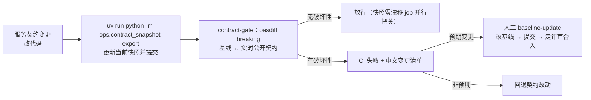
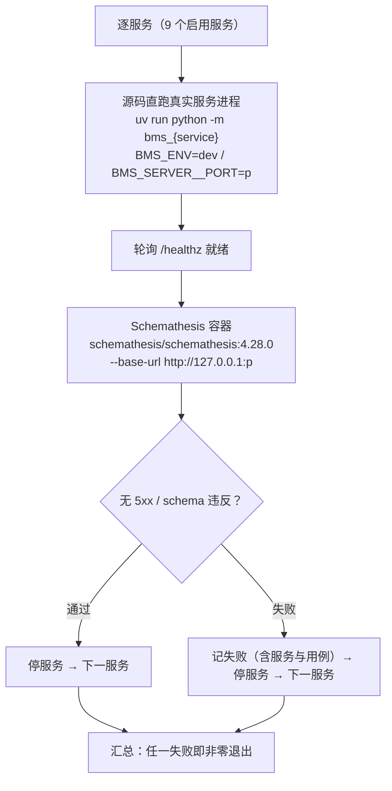
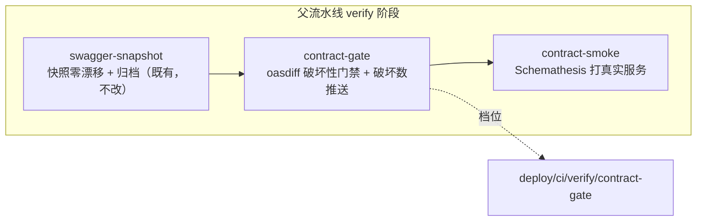

# 契约门禁详细设计

> 后端基座与服务化地基 · 09 多服务CI-CD与契约门禁 · 03 契约门禁 · 详细设计

[文档首页](../../../../../../文档首页.md) › [03 契约门禁](../09_多服务CI-CD与契约门禁_03_契约门禁.md) › 详细设计　|　[父任务：多服务CI-CD与契约门禁](../../09_多服务CI-CD与契约门禁.md) · [本阶段需求](../../../../需求/09_需求_多服务CI-CD与契约门禁.md) · [排期计划](../../../../计划/01_计划_后端基座与服务化地基.md)

## 1. 概述 <a id="overview"></a>

- **目标**：在 05_01 已交付的「每服务公开契约（OpenAPI）快照 + 零漂移校验」（`deploy/contracts/<service>.json` / `ops/contract_snapshot.py`）、08_02 已交付的「阶段度量通道」（Pushgateway + `bms_contract_breaking_total{service}` 口径）、09_01 / 09_02 已交付的「父-子流水线 + 服务容器化 / 一键发布」之上，把**契约兼容变成 CI 门禁**——① 每服务维护**独立契约基线**（`deploy/contracts/baseline/<service>.json`）；② **oasdiff breaking** 比对基线与当前公开契约，破坏性变更即失败并输出变更清单（「只加不删」）；③ **Schemathesis** 依据 OpenAPI 生成用例、**打真实服务**做接口正确性冒烟（零 Broker）；④ 门禁挂 MR / main，**基线更新走评审合入（不得自动覆盖）**；⑤ 契约破坏数按 08_02 口径推送 Pushgateway。使服务化地基 S7「契约破坏数」可拦截、可度量、可追溯。
- **依据**：《[架构设计 · 测试与质量](../../../../../../设计/架构设计/32_架构设计_测试与质量.md)》「CI 流水线」节（MR 流水线契约门禁：Schemathesis 冒烟 + oasdiff 破坏性变更拦截、每服务独立基线）；《[架构设计 · 接口与集成](../../../../../../设计/架构设计/09_架构设计_接口与集成.md)》「服务间通信与契约」节（契约快照入 CI、oasdiff「只加不删」、破坏性变更升大版本）；《[架构设计 · 服务间通信与分布式一致性](../../../../../../设计/架构设计/37_架构设计_子系统_服务间通信与一致性.md)》；《[微服务演进规划](../../../../../../规划/微服务演进规划.md)》「服务化地基要求与门禁」（S7）；知识档案《[微服务 · 12 选型对比（BMS）](../../../../../../资料/知识档案/微服务/12_微服务_选型对比.md)》§9 / §10（Schemathesis + oasdiff、零 Broker、每服务独立基线）；需求 [09-3](../../../../需求/09_需求_多服务CI-CD与契约门禁.md#r09-3)；前置契约 05_01（契约快照与 `ops/contract_snapshot.py`）、08_02（Pushgateway 通道与 `bms_contract_breaking_total` 口径）、09_01（父-子流水线 / 服务子流水线模板 / 镜像档）、09_02（服务容器化 / 发布链路 / 版本台账）。
- **范围（本任务）**：
  1. **独立契约基线**：新增 `deploy/contracts/baseline/<service>.json`（9 个启用服务，初始值取当前快照），与 CI 导出的当前快照分离；基线更新＝改此目录并走评审合入。
  2. **oasdiff 破坏性变更门禁**：新增 `backend/ops/contract_gate.py`（`check` / `baseline-update` / `push-metrics`）——逐服务以 **oasdiff `breaking`** 比对基线与**实时公开契约**，破坏性变更即失败并输出**中文变更清单**与更新指引。
  3. **Schemathesis 契约冒烟**：新增 `backend/ops/contract_smoke.py`——**源码直跑真实服务进程**（`uv run python -m bms_{service}`，dev/SQLite）+ Schemathesis 容器经 HTTP 打真实服务（零 Broker），只读方法（GET/HEAD）+ 有限样例的冒烟口径。
  4. **门禁挂载**：新增档位 `deploy/ci/verify/contract-gate`；父流水线 verify 阶段新增 `contract-gate` / `contract-smoke` 两个 job（main + MR 预留，`strategy` 语义不变）。
  5. **契约破坏数推送**：`contract-gate` job 的 `after_script` 按 `bms_contract_breaking_total{service}` 口径推送 Pushgateway（08_02 通道，末尾换行、失败不阻断门禁结论），落实计划 §7 第 29 项余项。
  6. **工具执行环境**：`deploy/ci/Dockerfile.backend` 加装 docker CLI（静态二进制），使同一 job 既能以 uv 源码起服务、又能调 oasdiff / Schemathesis 的固定 tag Docker 镜像；两镜像登记 `scripts/tools/docker/镜像清单.txt`。
  7. **护栏与预检**：契约基线 ↔ 服务目录 ↔ CI 配置一致性护栏用例（Kiwi）+ 本地预检扩展。
- **不含（明确归口，见第 8 节）**：完整登录链路冒烟 / 用户 claims（认证阶段、E2E）；Pact 消费者驱动契约（消费方 / 团队增多再引）；前端 / 运行时模块契约门禁（前端另有组件基类契约与模块清单校验机制）；K8s 迁移（运维阶段）。

## 2. 现状与差距 <a id="gap"></a>

| 关注点 | 现状（09_02 交付后） | 差距（本任务目标） |
| --- | --- | --- |
| 公开契约快照 | `deploy/contracts/<service>.json`（9 服务）+ `ops/contract_snapshot.py`（`export` / `check` 零漂移） | 无**独立基线**、无破坏性变更比对 |
| 破坏性变更门禁 | 无 | oasdiff `breaking` 基线 ↔ 当前，破坏性变更即失败 + 中文清单 |
| 契约兼容纪律 | 口径在架构 / 需求（只加不删、升大版本） | 未落为可执行 CI 门禁 |
| 契约冒烟 | 无 | Schemathesis 依据 OpenAPI 打真实服务（零 Broker） |
| 门禁位置 | `swagger-snapshot` 只做快照零漂移与归档 | 新增 `contract-gate` / `contract-smoke` job + 档位；挂 main / MR |
| 契约破坏数 | 口径已登记（08_02 `bms_contract_breaking_total`），无推送 | `contract-gate` after_script 真实推送 |
| 工具执行环境 | `ci-backend:py314` 无 docker CLI | 加装 docker CLI（静态二进制）跑 oasdiff / Schemathesis 镜像 |
| 真实服务来源 | 09_02 服务可容器化运行（Compose）；宿主直跑可 | 源码直跑真实服务进程 + Schemathesis 容器共享 job 网络 |

## 3. 交付物清单 <a id="tree"></a>

```text
deploy/
├── contracts/baseline/<service_key>.json                  # 新：9 个启用服务独立契约基线（初始 = 当前快照）
├── ci/verify/contract-gate                                # 新：契约门禁档开关（oasdiff + Schemathesis；删档即关）
├── ci/verify/contract                                     # 改：说明补基线 / oasdiff / Schemathesis 归 09_03
└── ci/Dockerfile.backend                                  # 改：加装 docker CLI（静态二进制，固定版本）

scripts/tools/docker/镜像清单.txt                          # 改：+tufin/oasdiff / schemathesis/schemathesis 固定 tag

backend/
├── ops/contract_gate.py                                   # 新：基线管理 + oasdiff 门禁 + 破坏数推送（Python CLI）
├── ops/contract_smoke.py                                  # 新：Schemathesis 冒烟编排（源码起服务 + 容器打）
└── libs/bms_core/
    ├── src/bms_core/services/service_contract.py          # 改：+基线目录常量 / 基线文件与契约比对辅助（纯函数）
    └── tests/ops/
        ├── test_contract_gate.py                          # 新：Kiwi 用例（基线 / 门禁 / 指标 / CI 护栏）
        └── test_contract_smoke.py                         # 新：冒烟编排纯函数（服务枚举 / 命令构造 / 结果判定）

.gitlab-ci.yml                                             # 改：+contract-gate / contract-smoke job（verify 阶段）
scripts/tools/preflight/check-preflight.py                 # 改：结构层断言（契约门禁档 / 基线目录 / CLI 就位）

bms文档/
├── 规范/部署发布规范.md                                     # 改：「契约门禁」节（基线 / oasdiff / Schemathesis / 破坏数 / 评审）
├── 规范/测试规范.md                                         # 改：§13 CI 执行策略补契约门禁两 job
├── 规划/开发部署规划.md                                     # 改：§7 重验证层口径补契约门禁
├── 资料/开发服务器/linux/
│   ├── 契约门禁与契约测试使用说明.md                        # 新：oasdiff / Schemathesis 预拉、命令、实测结论、排障
│   └── 可观测性栈部署使用说明.md                            # 改：契约破坏数推送落点闭环（一句）
└── 项目/02_后端基座与服务化地基/
    ├── 计划/01_计划_后端基座与服务化地基.md                  # 改：§1 台账 / §2 已完成 / §3 移除 09_03 / §4 甘特 / §7 第 16、29 项闭环
    ├── 任务/09_多服务CI-CD与契约门禁/09_多服务CI-CD与契约门禁.md  # 改：子任务表状态
    └── 任务/09_…_03_契约门禁/                              # 改：任务状态 / 完成日期 + 设计 / 实施 / 测试记录

test/scripts/kiwi/cases|exports/…                          # 新：本任务用例登记输入与回读（测试资产仓）
```

## 4. 领域设计 <a id="design"></a>

### 4.1 独立契约基线与破坏性变更门禁（oasdiff） <a id="baseline"></a>

**基线落点**：`deploy/contracts/baseline/<service_key>.json`（每启用服务一份，**入 Git**）。

- **初始值**：取 05_01 已交付并零漂移校验通过的当前快照副本（`deploy/contracts/<service_key>.json`）。
- **与当前快照的关系**：`deploy/contracts/<service_key>.json` 是「当前公开契约」（每次契约变更时由开发者重新 `export` 并提交，`swagger-snapshot` job 的 `contract_snapshot check` 保证其与实时 OpenAPI 零漂移）；基线是「已放行的兼容契约」，**只有预期破坏性变更经评审合入时才更新**。
- **不变式**：基线集合 == 服务目录 `enabled_service_keys()`（护栏用例断言）；基线不随 `contract_snapshot export` 自动改写。



**oasdiff 口径**：

| 项 | 口径 |
| --- | --- |
| 工具 | `tufin/oasdiff:v1.32.1`（Docker 固定 tag；mjbk 预拉 + 镜像清单登记） |
| 命令 | `oasdiff breaking /base.json /cur.json --fail-on ERR --format json`（容器内比对；默认即 ERR 级；返回非零即破坏性变更） |
| 比对对象 | 基线 `deploy/contracts/baseline/<svc>.json` ↔ **实时公开契约**（`contract_snapshot.build_openapi(svc)` 内存构建后渲染的确定性 JSON，写入临时文件） |
| 语义 | 「只加不删」——删字段 / 删端点 / 改类型 / 收紧必填等破坏性变更阻断；新增可选字段 / 新增端点等非破坏性变更放行 |
| 破坏性升级 | 确需破坏时按架构「版本演进」升大版本（`/api/v2` 并行一个发布周期）并更新基线，而非原地破坏 |
| 输出 | oasdiff 为英文输出；由 CLI 包一层**中文提示**（服务名 + 破坏项清单 + 更新指引），原始输出附后 |

### 4.2 Schemathesis 契约冒烟（打真实服务） <a id="smoke"></a>

**目标**：依据 OpenAPI 生成用例，打**真实服务**做接口正确性冒烟，捕捉边界值 / 500 / schema 违反（零 Broker，区别于 Pact）。



**口径**：

| 项 | 口径 |
| --- | --- |
| 工具 | `schemathesis/schemathesis:4.28.0`（Docker 固定 tag；mjbk 预拉 + 镜像清单登记） |
| 被测服务来源 | **源码直跑真实进程**——`cd backend && uv run python -m bms_{service}`，`BMS_ENV=dev`（SQLite 开发库）、`BMS_SERVER__PORT=<分配端口>`；不依赖子流水线推送的按提交镜像，任意提交（含共享库变更）均可复现 |
| 网络 | Schemathesis 容器以 `--network container:<job 容器引用>` 与 job 容器**共享网络命名空间**，经 `127.0.0.1:<port>` 打 job 容器内的真实服务进程；job 容器引用默认取 `$HOSTNAME`（Docker executor 下即容器标识），失败退化取 job 容器内网 IP |
| 契约输入 | 挂载 `deploy/contracts:/schemas:ro`，以 `<svc>.json` 为 schema（与门禁同源，不依赖服务在线文档端点） |
| 覆盖范围 | **只读方法**（GET / HEAD），不写数据、不依赖登录链路（当前认证为占位） |
| 深度 | 有限样例（`--max-examples 50` 量级）+ **仅 `not_a_server_error` 检查**（无 5xx 即通过）；**非 2xx（4xx / 401 / 403 / 404）视为可达通过** |
| 零 Broker | 无需 Broker / 平台，工具与用例自足 |
| 失败语义 | 任一服务命中 5xx / schema 违反即该服务失败；全部服务汇总，任一失败即 job 非零退出 |
| 边界收敛 | 若某服务 GET 端点在 dev 库下因缺表报 5xx，按服务**路径白名单**收敛冒烟范围并登记（开放项），不整体豁免 |

### 4.3 命令行工具 <a id="cli"></a>

**`backend/ops/contract_gate.py`**（纯标准库 + `bms_core`；oasdiff 经子进程调用，可注入桩以便单测）：

| 子命令 | 行为 |
| --- | --- |
| `check [--root] [--service X] [--oasdiff CMD] [--metrics-out PATH]` | 逐启用服务：基线存在性 + oasdiff breaking 比对（基线 ↔ 实时契约）；有破坏项即打印中文清单并非零退出；始终写出破坏数指标文本（供 after_script 推送） |
| `baseline-update --service X \| --all` | 当前快照 → 基线（复制）；仅本地 / 评审前使用，**不自动提交、不自动推送** |
| `push-metrics --file PATH [--gateway URL]` | 读指标文本并按 08_02 口径经 `urllib` POST Pushgateway（末尾换行；失败仅提示、不阻断） |

- **oasdiff 调用（不依赖宿主路径挂载）**：`docker create tufin/oasdiff:v1.32.1 breaking /base.json /cur.json --fail-on ERR --format json` → `docker cp <基线> <容器>:/base.json`、`docker cp <当前> <容器>:/cur.json` → `docker start -a <容器>`（回传退出码）→ `docker rm -f <容器>`（清理）。**不用 `docker run -v`**：门禁 job 运行在容器内，其路径（`$CI_PROJECT_DIR` / `/tmp`）在宿主 daemon 上不可见，`-v <job 路径>` 会挂到空目录（2026-09-24 首推流水线实测 oasdiff 返回码 102 `no such file or directory`）；`docker cp` 经 daemon 流式复制，跨命名空间可靠。比对执行器以 `diff: (基线, 当前, 镜像) -> (返回码, stdout, stderr)` 抽象，单测注入桩、不真联 docker。
- **中文包装**：破坏项按服务聚合，打印「服务 X：检测到 N 项破坏性变更（基线 → 当前）」+ 明细 + 指引（`baseline-update` 后走评审）。
- **破坏数计数**：取 oasdiff 输出的变更条目数（`--format json` 解析，条目级 `level=ERR`）；工具调用失败（镜像缺失 / 构建失败）不产出该服务指标（避免误报 0）并以非零退出。

**`backend/ops/contract_smoke.py`**（纯标准库 + `bms_core`；`docker` / 服务进程经子进程调用，可注入桩）：

| 子命令 | 行为 |
| --- | --- |
| `run [--service X] [--max-examples N] [--root]` | 逐服务：源码起真实进程 → 轮询 `/healthz` 就绪 → Schemathesis 容器打 → 停进程；汇总失败，任一失败非零退出 |

- **纯函数**：服务枚举（`enabled_service_keys()`）、端口分配、起服务 / 打服务命令构造、健康轮询判定、结果汇总——均以可注入的 runner 表达，单测不真起进程 / 容器。
- **共享实现**：基线与契约版本辅助（`baseline_dir` / `baseline_file_name` / 契约版本一致性）落 `bms_core/services/service_contract.py`（05_01 已建的契约工具模块），CLI 薄封装，保持「共享库不依赖服务包」。

### 4.4 CI 门禁挂载与档位 <a id="ci"></a>

**新增档位** `deploy/ci/verify/contract-gate`（P 档，删档即关；子 job 只守本档）。

**父流水线 verify 阶段新 job**：



| job | 镜像 | needs | 规则 | script |
| --- | --- | --- | --- | --- |
| `contract-gate` | `$REGISTRY_IMAGE_PREFIX/ci-backend:py314`（本任务加装 docker CLI） | `swagger-snapshot` optional | main + MR 预留；`changes: [backend/**/*, deploy/**/*]`；`exists: [deploy/ci/verify/contract-gate]` | `uv run python -m ops.contract_gate check --metrics-out /tmp/contract-metrics.txt`；after_script `uv run python -m ops.contract_gate push-metrics --file … --gateway "$PUSHGATEWAY_URL"` |
| `contract-smoke` | 同上 | `contract-gate` optional | 同 `contract-gate`（同档守卫） | `uv run python -m ops.contract_smoke run --max-examples 50` |

- **触发范围**：main 直推（+ MR 预留，口径同 09_01——父 `workflow` 暂未放行 MR，规则为恢复 MR 流程预留）；**tag 流水线不进契约门禁**（语义为兼容把关，非发布）。
- **与 `swagger-snapshot` 分工**：后者保证「已提交快照 == 实时公开契约」（零漂移）+ 归档；前者保证「实时公开契约 ⊇ 基线」（兼容）。两者独立、互不替代。
- **`PUSHGATEWAY_URL`**：父流水线 job 变量（默认宿主 9092，可被项目 CI/CD 变量覆盖；未配置则跳过推送）。
- **不改**：`swagger-snapshot` / `frontend-image` / 服务子流水线模板 / 既有重验证档。

### 4.5 工具执行环境（ci-backend 加装 docker CLI） <a id="base-image"></a>

**问题**：oasdiff / Schemathesis 走固定 tag Docker 镜像，需 `docker` CLI；而「源码直跑真实服务」与 `ops` 两个 CLI 需 Python / uv。现有 `ci-backend:py314` 无 docker CLI、`docker:27-cli` 无 Python，二者不能同 job。

**处置**：`deploy/ci/Dockerfile.backend` 增装 docker CLI（**静态二进制**，仅 `/usr/local/bin/docker`，经国内镜像下载、固定版本），使契约门禁 job 在同一环境内：uv `sync` / `run`（Python）+ `docker run`（工具镜像）。

- **基础镜像重建**：`build-base.sh` 的 lock-hash 已含 `Dockerfile.backend`，改动即自动重建，一次性、本流水线即用。
- **替代方案（不采用）**：apt 安装 `docker.io`（拉 containerd 等冗余）；工具改走 pip / 二进制（违背本任务「固定 tag 镜像」选择）。
- **镜像清单**：`tufin/oasdiff:v1.32.1`、`schemathesis/schemathesis:4.28.0` 登记 `scripts/tools/docker/镜像清单.txt`，经 `scripts/tools/docker/拉取镜像.sh` 在 mjbk 预拉缓存。

### 4.6 护栏用例与本地预检 <a id="guard"></a>

**新增用例** `backend/libs/bms_core/tests/ops/test_contract_gate.py`（Kiwi 用例）：

| 断言组 | 要点 |
| --- | --- |
| 基线 ↔ 服务目录 | `deploy/contracts/baseline/` 文件集合 == `enabled_service_keys()`（无缺件 / 无多余）；每基线 JSON 结构合法、`info.version` 与登记契约版本一致 |
| 门禁逻辑 | 桩 runner 返回破坏项 → `check` 非零 + 中文提示；无破坏项 → 0；基线缺失 → 报缺件非零 |
| 基线刷新 | `baseline-update` 复制当前快照 → 基线（临时目录）；不改动当前快照 |
| 破坏数指标 | `push-metrics` 指标文本形如 `bms_contract_breaking_total{service="x"} N` 且**末尾换行**；网关不可达仅提示不抛 |
| CI 配置 | `.gitlab-ci.yml` 含 `contract-gate` / `contract-smoke`（verify 阶段、`ci-backend:py314`、规则含 `backend/**` / `deploy/**`、档位守卫）、`contract-gate` after_script 含破坏数推送；档位文件存在 |
| 基础镜像 | `deploy/ci/Dockerfile.backend` 含 docker CLI 安装 |

**新增用例** `backend/libs/bms_core/tests/ops/test_contract_smoke.py`（Kiwi 用例）：服务枚举 == 启用服务；起服务 / Schemathesis 命令构造含固定镜像 tag、`--base-url`、`--max-examples`、只读方法口径；健康轮询与失败汇总谓词（桩 runner，不真起进程 / 容器）。

**本地预检扩展**（`scripts/tools/preflight/check-preflight.py`，结构层）：断言契约门禁档文件与 `deploy/contracts/baseline/` 目录存在、`backend/ops/contract_gate.py` / `contract_smoke.py` 就位（不真跑 docker 工具）。

## 5. 失败分支与边界 <a id="failures"></a>

| 场景 | 处理 |
| --- | --- |
| 基线缺失 / 多余 | `check` 报「基线缺件 / 多余件」并提示 `baseline-update`，非零退出 |
| 破坏性变更 | 打印中文清单 + 更新指引，非零退出；破坏数按服务写入指标文本并推送 |
| 非破坏性变更 | 门禁放行（快照零漂移 job 另行把关快照是否提交） |
| 基线需更新 | 人工 `baseline-update` 后提交、经评审合入；**无自动覆盖路径**（不自动提交 / 推送） |
| oasdiff 镜像缺失 | 中文提示（含预拉命令与镜像清单路径），非零退出（门禁不静默通过） |
| job 容器路径在宿主不可见（`docker run -v` 挂到空目录） | 改用 `docker create + docker cp + docker start`（文件经 daemon 流式复制，不依赖宿主路径）；首推流水线实测 oasdiff 返回码 102，已修复 |
| 实时契约构建失败 | 报服务名与异常，非零退出（不产出该服务指标，避免误报 0） |
| Schemathesis 起服务失败 / 就绪超时 | 记该服务失败并继续下一服务；汇总非零退出 |
| 被测服务返回 5xx | Schemathesis `not_a_server_error` 失败即该服务冒烟失败 |
| 被测服务返回 4xx（占位认证） | 视为可达通过（冒烟口径） |
| Schemathesis 容器网络命名空间不可用 | 退化取 job 容器内网 IP 作为 `--base-url`；仍不可用则登记开放项（`uvx` 同版本兜底） |
| ci-backend 未装 docker CLI | job 首步显式报错（提示基础镜像重建）；不静默跳过门禁 |
| Pushgateway 不可达 | 仅日志提示，不改门禁结论（破坏数缺失由面板可见） |
| 某服务 dev GET 因缺表 5xx | 该服务按路径白名单收敛冒烟范围并登记（开放项），不整体豁免 |
| 达梦 / 三库方言 | 不涉及（门禁基于 OpenAPI 契约与 HTTP 冒烟，不直连数据库） |
| 单人期无 MR | 规则已为 MR 预留；当前直推 main，基线更新仍经 main 分支保护 + CI 绿 + 人工评审 |

## 6. 测试设计与验收映射 <a id="tests"></a>

用例**先登记 Kiwi TCMS（分类「平台骨架」/ P2 / CONFIRMED / 自动化）取得编号**，再编码并在文件标注 `@pytest.mark.kiwi_id(<编号>)`（本任务登记一条策展用例，两个护栏文件共用）。

| 用例 / 文件 | 类型 | 断言要点 |
| --- | --- | --- |
| `libs/bms_core/tests/ops/test_contract_gate.py` | 单元 | 4.6 表六组断言（基线 ↔ 目录 / 门禁逻辑 / 基线刷新 / 指标文本 / CI 配置 / 基础镜像） |
| `libs/bms_core/tests/ops/test_contract_smoke.py` | 单元 | 服务枚举 / 命令构造 / 健康轮询与失败汇总（桩 runner） |
| 既有全量回归 | 单元 + 集成 | 全量 `pytest` / `ruff` / `pyright` / 基座与边界校验全绿（无行为回归） |
| 本地预检 | 静态 | `check-preflight.py` 与 GitLab CI Lint API（父配置）全绿 |
| mjbk 真机冒烟 | 集成（人工留痕） | 预拉两镜像 → oasdiff 对基线 vs 当前（无破坏通过）→ 人为构造破坏性变更（删字段）验证拦截与中文清单 → 还原；`contract-smoke` 对真实服务进程跑 Schemathesis 通过 |
| 真实流水线验收 | 集成（人工留痕） | 推送后 main 流水线出现契约门禁两 job 且全绿；`bms_contract_breaking_total` 可查（用户确认后推送） |

验收映射：

| 完成标准（需求 09-3） | 验证方式 |
| --- | --- |
| 破坏性契约变更被 CI 拦截并给出清单 | 桩用例 + mjbk 真实 oasdiff 拦截演练（中文清单）；`contract-gate` job 非零退出 |
| Schemathesis 冒烟可运行 | mjbk 真机冒烟（源码起服务 + Schemathesis 容器打真实服务通过）+ 命令构造用例 |
| 基线更新受评审约束 | 基线入 Git、更新仅经 `baseline-update` + 提交 + 评审；无自动覆盖路径；护栏用例断言 |
| 校验通过 | `pytest` / `ruff` / `pyright` / `check-base` / `check-backend-base` / `check-service-boundaries` / `check-status` / `check-preflight` / CI Lint 全绿 |

## 7. 登记落点 <a id="writeback"></a>

| 落点 | 内容 |
| --- | --- |
| 《部署发布规范》「契约门禁」节（新） | 独立基线（每服务、入 Git、评审合入）；oasdiff breaking「只加不删」；Schemathesis 冒烟（打真实服务、零 Broker）；破坏数推送；档位与 job 落点 |
| 《测试规范》§13 CI 执行策略 | 补契约门禁两 job（契约破坏拦截 + Schemathesis 冒烟） |
| 《开发部署规划》§7 | 重验证层口径补契约门禁（与契约快照档并列） |
| 《契约门禁与契约测试使用说明》（新，资料/开发服务器/linux） | 预拉 / 命令 / 基线刷新流程 / 破坏拦截演练 / Schemathesis 冒烟 / 排障 / 实测结论 |
| 《可观测性栈部署使用说明》 | 契约破坏数推送落点闭环（CI 契约门禁 job） |
| 《镜像清单》 | `tufin/oasdiff` / `schemathesis/schemathesis` 固定 tag |
| 计划 | §1 台账与计数；§2 已完成（09_03 行）；§3 移除 09_03；§4 甘特；§7 第 16 项（快照入 oasdiff 基线）、第 29 项（契约破坏数推送）闭环 |
| 任务 / 父任务 | 状态与完成日期两处一致（需求文档不承载进度） |
| Kiwi TCMS / 测试资产仓 | 登记一条策展用例并回读编号；`test/scripts/kiwi/cases|exports/` 对应文件 |
| 实施 / 测试记录 | 任务目录 `实施/`、`测试/` 各一份 |
| 架构节点 | 语义不变（32 §8 契约门禁、09 §2.4 契约已述）；实现细节落本设计与实现侧资产，不回改架构语义 |

## 8. 边界与开放项 <a id="boundary"></a>

- **归认证阶段 / E2E**：完整登录链路冒烟（当前 Schemathesis 只读、4xx 视为通过；真实身份与用户 claims 随认证 / E2E）。
- **归后续**：Pact 消费者驱动契约（消费方 / 团队增多再引）；前端 / 运行时模块契约门禁（前端另有机制）；K8s 迁移。
- **开放项（Schemathesis 网络命名空间）**：`--network container:<job 容器>` 依赖 Docker executor 的 `$HOSTNAME` 行为；mjbk 实测不可用则退化取 job 容器内网 IP，仍不行则评估 `uvx schemathesis==<同版本>` 兜底（不改版本口径）。
- **开放项（冒烟路径收敛）**：某服务 dev GET 因缺表 5xx 时按服务路径白名单收敛，登记后随业务模块落地放宽。
- **开放项（基线更新评审）**：单人期靠 main 分支保护 + CI 绿 + 人工评审，多人期恢复 MR 强制评审（与《Git协作规范》一致）。
- **开放项（oasdiff 中文输出）**：oasdiff 无中文输出，由 CLI 包一层中文提示；细化程度随实际使用调整。
- **开放项（契约破坏数面板取值）**：破坏数为门禁时刻的 gauge，跨流水线保留最近一次；窗口统计随 08_02 面板按需调整。
- **不改**：`swagger-snapshot` job、服务目录 / 契约快照 / 事件契约、服务子流水线模板、网关声明式配置、发布链路与版本台账、既有 Kiwi 用例号。

## 9. 实施步骤 <a id="steps"></a>


1. 读《[KiwiTCMS 部署使用说明](../../../../../../资料/开发服务器/linux/KiwiTCMS部署使用说明.md)》「用例约定」节，登记本任务用例并**回读编号**（输入文件落 `test/scripts/kiwi/cases/`；先登记后编码）。
2. 基础镜像：`deploy/ci/Dockerfile.backend` 加装 docker CLI 静态二进制（国内镜像、固定版本）；`scripts/tools/docker/镜像清单.txt` 增两工具镜像。
3. 基线：创建 `deploy/contracts/baseline/`，逐服务复制当前快照为初始基线（提交）。
4. 门禁 CLI：`bms_core/services/service_contract.py` 补基线辅助纯函数；`backend/ops/contract_gate.py`（`check` / `baseline-update` / `push-metrics`）。
5. 冒烟 CLI：`backend/ops/contract_smoke.py`（源码起服务 + Schemathesis 容器）。
6. CI：新增档位 `deploy/ci/verify/contract-gate`；`.gitlab-ci.yml` 增 `contract-gate` / `contract-smoke` job；`deploy/ci/verify/contract` 说明更新。
7. 护栏与预检：`test_contract_gate.py` + `test_contract_smoke.py` + `check-preflight.py` 扩展。
8. 本地门禁：`uv run pytest -q` / `ruff check` / `ruff format --check` / `pyright`；`check-base` / `check-backend-base` / `check-service-boundaries` / `check-status` / `check-preflight`；GitLab CI Lint API。
9. **mjbk 真机冒烟**（远程操作，先读部署说明）：预拉 `tufin/oasdiff:v1.32.1` / `schemathesis/schemathesis:4.28.0` → `contract_gate check`（通过）→ 构造破坏性变更验证拦截 + 中文清单 → 还原 → `contract_smoke run` 对真实服务通过。
10. **请用户确认后推送**，真实流水线验收：main 出现契约门禁两 job 全绿；`bms_contract_breaking_total` 可查。
11. 登记回写（规范 / 规划 / 部署说明 / 计划 / 任务状态）+ 实施 / 测试记录 + 代码与文档分开提交（`feat` / `docs`）。
12. 偏差遗留闭环（认证 / 后续阶段归口标注；另提交）。

关键命令：

```bash
cd backend
uv run python -m ops.contract_gate check                 # 基线 ↔ 实时契约 oasdiff 门禁
uv run python -m ops.contract_gate baseline-update --all  # 预期破坏性变更时刷新基线（走评审）
uv run python -m ops.contract_smoke run --max-examples 50 # Schemathesis 打真实服务
uv run pytest -q --cov=bms_core --cov-branch
uv run ruff check . && uv run ruff format --check . && uv run pyright
# 仓库根
python3 scripts/tools/preflight/check-preflight.py
python3 scripts/tools/base-check/check-base.py
python3 scripts/tools/check-docs/check-status.py
# mjbk（预拉；先读《契约门禁与契约测试使用说明》）
scripts/tools/docker/拉取镜像.sh --host <user@mjbk>
docker run --rm -v "$PWD:/repo" tufin/oasdiff:v1.32.1 breaking /repo/deploy/contracts/baseline/platform.json /repo/deploy/contracts/platform.json
docker run --rm schemathesis/schemathesis:4.28.0 --version
```

## 10. 决策记录（对齐记录） <a id="align"></a>

| # | 事项 | 结论（逐项确认） |
| --- | --- | --- |
| 1 | oasdiff 获取方式 | Docker 固定 tag 镜像 `tufin/oasdiff:v1.32.1`（预拉 + 镜像清单登记） |
| 2 | Schemathesis 获取方式 | Docker 固定 tag 镜像 `schemathesis/schemathesis:4.28.0` |
| 3 | 契约基线落点 | `deploy/contracts/baseline/<service>.json` 独立基线目录（初始 = 当前快照） |
| 4 | 门禁位置与档位 | 父流水线 verify 新 job + 新档位 `deploy/ci/verify/contract-gate` |
| 5 | 被测真实服务来源 | 源码直跑真实服务进程（`uv run python -m bms_{service}`，dev/SQLite） |
| 6 | Schemathesis 覆盖与深度 | 只读方法（GET/HEAD）+ 有限样例 + 仅 `not_a_server_error`（4xx 视为通过） |
| 7 | 破坏数推送落点 | `contract-gate` job 的 `after_script`（08_02 通道） |
| 8 | 脚本落点与形态 | `backend/ops` Python CLI（`contract_gate.py` / `contract_smoke.py`）+ `service_contract.py` 纯函数 |
| 9 | Kiwi 用例 | 1 条策展用例（两个护栏文件共用） |
| 10 | 工具执行环境 | `ci-backend` 加装 docker CLI 静态二进制（同 job 内 Python + docker） |
| 11 | 门禁覆盖服务 | 9 个启用服务全量（与契约快照 / 服务目录一致） |
| 12 | 门禁触发范围 | main（+ MR 预留，口径同 09_01）；tag 流水线不进契约门禁 |
| 13 | oasdiff 调用方式（实施发现） | 门禁 job 在容器内，其路径在宿主 daemon 不可见 → 不用 `docker run -v`，改 `docker create + docker cp + docker start -a`（oasdiff 容器内 `/base.json` / `/cur.json`） |

## 11. 参考文档 <a id="ref"></a>

- [架构设计 · 测试与质量](../../../../../../设计/架构设计/32_架构设计_测试与质量.md)「CI 流水线」节
- [架构设计 · 接口与集成](../../../../../../设计/架构设计/09_架构设计_接口与集成.md)「服务间通信与契约」「版本演进」节
- [架构设计 · 服务间通信与分布式一致性](../../../../../../设计/架构设计/37_架构设计_子系统_服务间通信与一致性.md)「服务边界与契约」节
- [部署发布规范](../../../../../../规范/部署发布规范.md)（契约门禁口径，本任务回写）
- [测试规范](../../../../../../规范/测试规范.md)「CI 执行策略」节
- [微服务演进规划](../../../../../../规划/微服务演进规划.md)「服务化地基要求与门禁」（S7）
- [微服务 · 12 选型对比（BMS）](../../../../../../资料/知识档案/微服务/12_微服务_选型对比.md)§9 / §10
- [需求 09-3：契约门禁](../../../../需求/09_需求_多服务CI-CD与契约门禁.md#r09-3)
- [05_01 详细设计](../../../05_服务间通信与一致性/05_服务间通信与一致性_01_服务契约与同步调用/设计/01_详细设计_01_服务契约与同步调用.md)（契约快照与 `contract_snapshot`）
- [08_02 详细设计](../../../08_可观测性栈/08_可观测性栈_02_按服务归因与健康就绪/设计/01_详细设计_02_按服务归因与健康就绪.md)（阶段度量通道与 `bms_contract_breaking_total`）
- [09_01 详细设计](../../09_多服务CI-CD与契约门禁_01_父-子流水线/设计/01_详细设计_01_父-子流水线.md)（父-子流水线 / 子模板 / 镜像档）
- [09_02 详细设计](../../09_多服务CI-CD与契约门禁_02_不可变镜像与回滚/设计/01_详细设计_02_不可变镜像与回滚.md)（服务容器化 / 发布链路 / 版本台账）
- [oasdiff](https://github.com/oasdiff/oasdiff) · [Schemathesis](https://schemathesis.readthedocs.io/) · [可观测性栈部署使用说明](../../../../../../资料/开发服务器/linux/可观测性栈部署使用说明.md)「告警与阶段度量」节

> 本文档依《[文档生成规范](../../../../../../规范/文档生成规范.md)》编写 · 关键决策逐项确认
