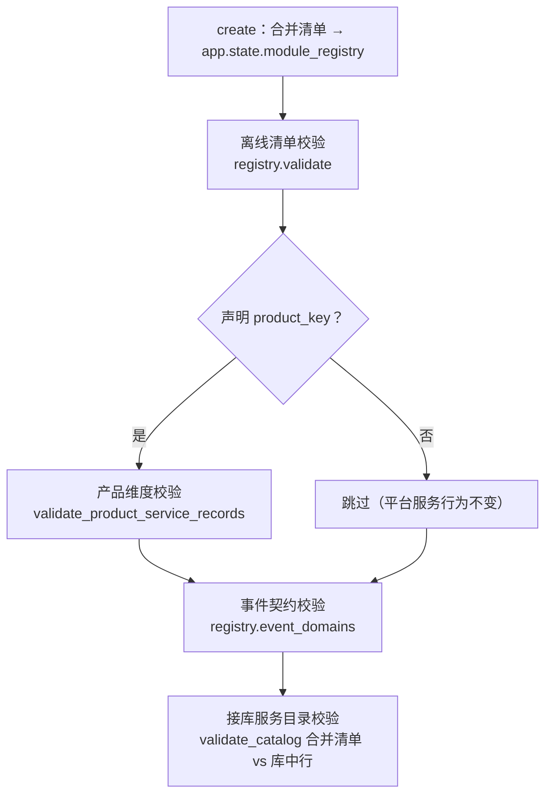

# 01 详细设计 · 共享基座产品服务装配支持

> 后端基座与服务化地基 · 12_产品服务接入 · 子任务 03（需求 12-3）· 详细设计

[文档首页](../../../../../../文档首页.md) › [12 产品服务接入](../../12_产品服务接入.md) › 详细设计　|　[← 任务](../12_产品服务接入_03_共享基座产品服务装配支持.md)

## 1. 设计目标与范围 <a id="goal"></a>

承接需求 12-3：让共享基座库 `bms_core` 支持**产品服务装配**——产品服务（跨仓库、独立部署）可经 `BaseServiceApplicationFactory` 装配并启动，不因平台专属服务集产生隐式依赖；平台服务（8 个）装配行为不变。

1. **服务目录参数化**：服务目录支持**注入产品服务记录**（产品侧提供本产品服务清单），形成「平台 + 产品」视图，与平台清单同源校验。
2. **服务身份参数化**：应用工厂支持产品服务身份（`service_name` / `service_title` / `version` / `contract_version` 已参数化，本期补**产品维度** `product_key`）。
3. **依赖可分离**：产品服务经共享基座装配时不因平台专属服务集产生隐式依赖；跨仓库依赖（git 源）可用。
4. **向后兼容**：平台服务装配行为不变（登记与校验口径一致）。

**不在本期**：产品注册表（归 12_01）；产品服务接入机制（归 12_02）；真实产品（mdm）工程骨架与跨仓联调（归 mdm 01_01）；产品档案 / 产品级路由映射的产品侧注入（归平台侧登记）。

## 2. 交付物清单 <a id="deliver"></a>

| # | 交付物 | 落点 |
| --- | --- | --- |
| 1 | 服务目录视图读取入口（清单 / 事件域） | `bms_core/services/module_registry.py`（`ModuleRegistry.catalog_records()` / `ModuleRegistry.event_domains()`） |
| 2 | 产品服务注入记录的产品维度校验（公开校验函数） | `bms_core/services/module_registry.py`（`validate_product_service_records()`） |
| 3 | 应用工厂服务目录注入钩子与产品维度声明（`service_records()` / `product_key`）+ 合并视图装配 | `bms_core/application.py`（`BaseServiceApplicationFactory`） |
| 4 | 启动校验适配（离线清单 / 接库对账 / 事件域一律读应用实例视图） | `bms_core/application.py`（`service_lifespan` / `_validate_service_catalog` / `_validate_event_contracts`） |
| 5 | 用例（产品服务装配 / 探针 / 目录注入 / 产品维度 / 冲突拒启 / 平台服务不变） | `bms_core/tests/core/test_product_service_assembly.py`、`bms_core/tests/services/test_module_registry.py` |
| 6 | 文档回写（规范 / 基类清单 / 架构 04 / 架构 11） | `bms文档/规范/后端开发规范.md`、`bms文档/后端基类清单.md`、`bms文档/设计/架构设计/04_架构设计_后端基础类体系.md`、`bms文档/设计/架构设计/11_架构设计_子系统_模块注册.md` |

> **零改动面**：`ops/check_modules.py`（契约声明扫描口径维持现状，见 §4）、`ops/seed_module.py`、`bms_core/services/service_contract.py`、`bms_core/db/*`、`deploy/`（公开契约 / 网关生成件 / 事件契约快照均无变更——平台默认视图不变）。

## 3. 装配机制设计 <a id="mechanism"></a>

| 面 | 现状 | 目标 |
| --- | --- | --- |
| 服务清单 | `SERVICE_CATALOG` 为平台服务固定元组（单一来源） | 支持**追加产品服务记录**（产品侧清单）形成「平台 + 产品」视图；平台默认视图不变 |
| 目录校验 | `_validate_service_catalog` 直接引用全局 `SERVICE_CATALOG`；`_validate_event_contracts()` 经 `known_event_domains()` 同源引用 | 一律改读 `app.state.module_registry`（应用级视图）——扩展点一处生效，产品服务不再隐式依赖平台固定清单 |
| 应用装配 | `create()` 以 `ModuleRegistry()`（平台默认清单）落 `app.state` | `create()` 以「平台清单 + 工厂注入记录」合并视图落 `app.state`；服务身份已参数化，本期补产品维度 |
| 产品维度 | 无 | 工厂声明 `product_key`，离线阶段 fail-closed 校验注入记录 |
| 插件装配 | 各服务经共享基座逐进程装配，注册表限本进程 | 产品服务同样逐进程装配，不因跨仓库改变机制 |
| 依赖方向 | 共享库不依赖任何服务 | 保持；产品服务只依赖 `bms-core` 与自身 |

### 3.1 扩展点形态（决策 1：应用工厂声明式钩子） <a id="extension-point"></a>

```text
backend/libs/bms_core/src/bms_core/
├── application.py                  # BaseServiceApplicationFactory：service_records() 钩子 + product_key 声明
└── services/module_registry.py     # ModuleRegistry 视图入口 + validate_product_service_records()
```

- **注入钩子**：`BaseServiceApplicationFactory` 增可覆写方法 `service_records()`，返回 `tuple[ModuleRecord, ...]`（缺省空元组）——产品服务在其应用工厂内 `import` 本产品服务清单返回即可（跨仓库无需平台侧改动）。
- **产品维度**：工厂增类属性 `product_key: str | None = None`（缺省空 = 平台服务，不做产品维度约束）。
- **装配时序**：`create()` 取 `service_records()` 与 `SERVICE_CATALOG` **拼接**为合并清单，构造 `ModuleRegistry(modules=合并清单)` 落 `app.state.module_registry`，并把 `product_key` 落 `app.state.service_product_key`。
- **显式不引入全局状态**：产品清单经构造入参进入注册表，不设进程级注册表、不改 `SERVICE_CATALOG` 常量、不读配置字符串（详设 §3 原「二选一」取构造入参方向）。
- **注入项范围（决策 2）**：只注入**模块记录**；产品档案（`PRODUCT_CATALOG`）与产品级路由映射（`PRODUCT_ROUTES`）仍取平台清单——二者属平台侧登记职责（先注册后建表、网关生成），产品侧不重复登记，`validate_catalog()` 签名保持不变。

### 3.2 启动校验链路（决策 4） <a id="lifespan"></a>



- **离线清单校验**：`registry.validate()`（唯一性 / 格式 / 分组 / 版本 / 产品归属 / 产品级路由映射）——合并清单下产品记录与平台记录**同一套规则**，冲突即拒。
- **产品维度校验**（声明 `product_key` 时）：`validate_product_service_records(records, service_key=..., product_key=...)`。
- **事件契约校验**：事件域集合改取 `registry.event_domains()`（合并清单）——产品服务自有事件域随之生效，不再受平台清单限制。
- **接库服务目录校验**：`validate_catalog()` 的清单参数改取 `registry.catalog_records()`（合并清单），与库中 `sys_module` 未软删行双向对账 + 运行服务项（`_check_running_service`，产品行须已在库登记、契约版本主版本兼容）——即「**先注册后建表**」的启动侧守门。

### 3.3 产品维度校验规则（决策 3） <a id="product-validation"></a>

`validate_product_service_records(records, *, service_key, product_key)`（公开函数，返回明细清单，空列表表示通过）：

| # | 断言 | 违规明细 |
| --- | --- | --- |
| 1 | 注入记录非空 | `产品服务装配未声明服务目录记录：service_records() 返回空清单（产品 {product_key}）` |
| 2 | 每条记录 `service_group = product` | `{module_key}：产品服务注入记录须为产品分组（现 {service_group}）` |
| 3 | 每条记录 `product_key` 与声明一致 | `{module_key}：注入记录产品归属与声明不一致（记录 {记录值}，声明 {声明值}）` |
| 4 | 含运行服务（`service_key`）的登记行 | `运行服务未在注入清单登记：{service_key}` |

- 未声明 `product_key` 的平台服务不执行本校验，装配与校验口径与现状完全一致（决策 4 的向后兼容面）。
- 记录格式 / 唯一性 / 产品归属已登记等规则仍由 `registry.validate()` 承担（不在本函数重复）。

## 4. 失败分支与边界 <a id="edge"></a>

| 场景 | 处置 |
| --- | --- |
| 产品服务未声明服务目录记录（`service_records()` 返回空） | 拒启：`CatalogError`（40003）+ `service_catalog_invalid`（scope=offline）critical 日志 + 明细 |
| 注入记录非产品分组 / 产品归属与声明不一致 / 未含运行服务登记行 | 同上（逐条明细） |
| 注入记录与平台记录冲突（`module_key` / `table_prefix` / `event_domain` / `service_key` / `errcode_segment` 重复） | 合并校验拒绝（唯一性冲突即启动失败，给出冲突项） |
| 产品记录在库但不在清单（未先在平台登记） | 接库对账拒绝（`库中登记行不在清单`）——「先注册后建表」守门 |
| 产品服务自有事件域 | 经 `registry.event_domains()`（合并清单）判定；未登记事件域仍拒（既有口径） |
| 平台服务（未覆写钩子 / 未声明 `product_key`） | 行为不变：合并清单等于 `SERVICE_CATALOG`，装配与校验结果与现状一致 |
| 库数量指标 `bms_db_count` | **口径不变**（平台服务库数）；产品服务视角差异归口产品可观测（阶段八 / 产品侧） |
| 产品服务契约声明扫描（`ops.check_modules.py::resolve_service_contracts`） | **维持现状**（只扫 `backend/services/` 平台服务工程）；产品公开契约产品侧自持并自校验，bms 侧只做「自报 ↔ 登记」主版本兼容校验（运行服务项） |
| 产品服务隐式引用平台专属服务集（跨服务 import / 跨库访问） | 边界校验拦截（`check-service-boundaries.py` 既有口径，本期零改动） |
| 跨仓库依赖不可用（git 源不可达） | 构建失败（不静默降级）；真实 git 源安装与启动实测归消费方 mdm 01_01 |
| 产品清单缺失 / 非法 | 启动校验失败并给出明细（不降级放行——产品侧清单属配置级错误） |

> **降级口径不变**：非目录权威服务的目录快照契约不可达时仍告警放行并置 `catalog_degraded`（既有 06_01 口径）；产品维度校验属**离线清单**环节，不受快照可达性影响。

## 5. 测试设计与验收映射 <a id="test"></a>

| 验收点（需求 12-3） | 用例 |
| --- | --- |
| 产品服务可经共享基座装配并启动 | 假产品服务工厂（`product_key` + `service_records()` 覆写）构造应用，`/healthz` / `/readyz` 200、探针响应服务名为产品服务身份 |
| 服务目录注入与唯一性校验 | 合并清单校验通过；`module_key` / `table_prefix` / `event_domain` / `service_key` / `errcode_segment` 与平台记录冲突逐项拒启 |
| 产品维度校验 | 空清单 / 非产品分组 / 产品归属不一致 / 未含运行服务登记行 逐项检出并拒启 |
| 接库对账走合并清单 | 桩快照返回「平台 + 产品」行 → 通过；产品行缺失 / 字段不符 → 拒启；运行服务项按注入行校验 |
| 事件域按合并清单 | 产品服务自有事件域通过事件契约校验；未登记事件域仍拒 |
| 视图入口 | `catalog_records()` / `event_domains()` 与清单一致；`list_modules()` 筛选语义不变 |
| 平台 8 服务行为不变 | 未覆写钩子的工厂：`app.state.module_registry` 清单等于 `SERVICE_CATALOG`、`service_product_key` 为空；既有 1206 / 2163 用例全部保持通过 |
| 依赖分离 | 产品服务装配只依赖 `bms-core` 与自身包（用例以「外部包身份」导入验证）；`check-service-boundaries.py` 通过 |
| 门禁 | `pytest`（受变更影响范围）/ `ruff` / `pyright`（strict）/ `preflight --fast` 全绿 |
| Kiwi 用例关联 | 一任务一条策展用例；先登记 Kiwi 再编码，代码标 `@pytest.mark.kiwi_id(<编号>)` |

## 6. 登记落点 <a id="register-points"></a>

| 内容 | 落点 |
| --- | --- |
| 服务应用装配（产品服务经共享基座装配 / 注入钩子 / 产品维度） | 《[后端开发规范](../../../../../../规范/后端开发规范.md)》「服务应用装配必须走共享基座」条；《[后端基类清单](../../../../../../后端基类清单.md)》「服务应用装配基座」行 |
| 共享基座库产品服务装配语义 | 《[架构设计 · 后端基础类体系](../../../../../../设计/架构设计/04_架构设计_后端基础类体系.md)》「共享基座库 / 服务应用装配基座」段 |
| 服务目录本地清单注入与产品维度 | 《[架构设计 · 模块注册](../../../../../../设计/架构设计/11_架构设计_子系统_模块注册.md)》「服务目录与契约登记」节 |
| 需求 / 任务 / 计划 | 需求 12-3、本任务、阶段计划（进度唯一落点在计划表） |
| 消费方（跨仓） | mdm 01_01 详设「平台前置契约进度」「开放项」标注 12_03 已交付与注入口径 |
| Kiwi TCMS / 测试资产仓 | 本任务策展用例（先登记回读编号）+ 输入文件落 `test/scripts/kiwi/cases/` |
| 实施 / 测试记录 | 任务目录 `实施/`、`测试/` 各一份 |

## 7. 边界与开放项 <a id="open"></a>

| # | 事项 | 归口 |
| --- | --- | --- |
| 1 | ~~扩展点最终形态（构造入参合并 vs 独立配置入口）~~ **已定（决策 1）**：应用工厂声明式钩子 `service_records()` + `ModuleRegistry` 构造入参合并 | 本任务（已闭环） |
| 2 | ~~产品侧自校验清单格式与平台清单的对齐口径~~ **已定（决策 1 / 3）**：与 `bms_core` 同口径 `ModuleRecord` 清单，经 `service_records()` 注入，产品归属经 `product_key` 校验 | 本任务（已闭环），落地随 mdm 01_01 |
| 3 | 产品服务跨仓库依赖分发（git 源 → 私有包索引） | 随工程化演进（R4 / 产品接入） |
| 4 | 产品档案 / 产品级路由映射的产品侧注入（本期不做，取平台侧登记） | 后续（如需再评估，避免双事实源） |
| 5 | 库数量指标 `kind=platform` 与契约声明扫描的产品侧口径 | 产品可观测（阶段八）/ 产品侧自校验（mdm CI） |
| 6 | 模块级注销态建模、产品服务生命周期治理（下线 / 停用运行期处置） | 后续数据库与治理阶段 |
| 7 | 真实 git 源依赖安装与产品服务端到端启动实测 | mdm 01_01（消费方，跨仓） |

## 8. 决策记录 <a id="decision"></a>

| # | 决策项 | 结论 |
| --- | --- | --- |
| 1 | 装配机制 | 产品服务**经共享基座 `BaseServiceApplicationFactory` 装配**（与平台服务同构） |
| 2 | 扩展点形态 | **应用工厂声明式钩子 `service_records()`** + `ModuleRegistry` 构造入参合并；显式注入、零全局状态、不引入配置字符串 |
| 3 | 注入项范围 | **仅模块记录**；产品档案与产品级路由映射取平台清单，`validate_catalog()` 签名不变 |
| 4 | 产品维度 | 工厂声明 `product_key`，离线阶段 **fail-closed** 校验（记录非空 / 均为产品分组 / 产品归属一致 / 含运行服务登记行） |
| 5 | 单一来源 | `ModuleRegistry` 增 `catalog_records()` / `event_domains()` 视图入口；启动校验（离线 / 接库 / 事件域）一律改读 `app.state.module_registry` |
| 6 | 失败形态 | 复用 `CatalogError`（40003）+ `service_catalog_invalid`（scope=offline）critical 日志，不新增错误码 |
| 7 | 库数指标 | 口径不变（平台服务库数）；产品侧差异归产品可观测 |
| 8 | 契约声明扫描 | `resolve_service_contracts` 维持现状（只扫平台服务工程）；产品公开契约产品侧自持 |
| 9 | 跨仓依赖验证 | 口径层保证（无静态依赖 + 只需 `bms-core` 与自身包）+ 消费方实测（mdm 01_01） |
| 10 | 用例载体 | `bms_core` 测试内构造假产品服务工厂 + 假产品清单（不新增 `backend/services/` 工程） |
| 11 | Kiwi 用例 | 一任务一条策展用例（先登记后编码，编号以平台回读为准） |
| 12 | 文档回写 | 规范 + 基类清单 + 架构 04 + 架构 11 四处同源 |
| 13 | 依赖方向 | 共享库不依赖任何服务；产品服务只依赖 `bms-core` 与自身 |
| 14 | 向后兼容 | 平台 8 服务装配与校验行为不变（默认视图不变） |

## 9. 参考文档 <a id="ref"></a>

- 需求 [12-3](../../../../需求/12_需求_产品服务接入.md#r12-3)；任务 [12_03](../12_产品服务接入_03_共享基座产品服务装配支持.md)；关联 [12_01](../../12_产品服务接入_01_产品注册机制/12_产品服务接入_01_产品注册机制.md)、[12_02](../../12_产品服务接入_02_产品服务接入/12_产品服务接入_02_产品服务接入.md)
- 《[后端开发规范](../../../../../../规范/后端开发规范.md)》「目录与分层职责」「服务应用装配」节；《[后端基类清单](../../../../../../后端基类清单.md)》
- 《[架构设计 · 后端基础类体系](../../../../../../设计/架构设计/04_架构设计_后端基础类体系.md)》「共享基座库」「服务应用装配基座」段；《[架构设计 · 模块注册](../../../../../../设计/架构设计/11_架构设计_子系统_模块注册.md)》「服务目录与契约登记」节
- mdm《01_01 产品工程骨架与平台接入详细设计》（`mdm/mdm文档/项目/01_mdm 产品奠基/任务/…`，消费方）
- 《[KiwiTCMS 部署使用说明](../../../../../../资料/开发服务器/linux/KiwiTCMS部署使用说明.md)》「用例约定」「用例登记（脚本化批量）」节

## 10. 对齐记录 <a id="align"></a>

| # | 日期 | 事项 | 处理 |
| --- | --- | --- | --- |
| 1 | 2026-10-07 | 实施前核对现状口径（详设写于 12_01 实施前） | 核对结论：`bms_core/application.py::_validate_service_catalog` **硬编码 `SERVICE_CATALOG`**、`create()` 以 `ModuleRegistry()` 平台默认清单落 `app.state`、`_validate_event_contracts()` 经 `known_event_domains()` 同源引用平台清单（本文档 §3 现状列已按实际落点修正）；`BaseServiceApplicationFactory` 的 `service_name` / `service_title` / `version` / `contract_version` **已参数化**（本期只补 `product_key`）；`ModuleRegistry` 构造已为 `modules` / `products` / `routes` 三参（12_02 改）；`bms_core/catalog/loader.py` 取数路径与 `ops/check_modules.py::resolve_service_contracts` 按 `backend/services/` 扫描**与假设一致** |
| 2 | 2026-10-07 | 详设原 §3「扩展点二选一」与 §7 三项开放项 | 12 项待拍板事项分三组用 question 逐项确认（全部取推荐项），结论落本文档 §3 / §8，开放项 1 / 2 收敛闭环（§7） |
| 3 | 2026-10-07 | 用例载体原表述「产品服务可经共享基座装配并启动」 | 明确为 `bms_core` 测试内**假产品服务工厂 + 假产品清单**（不新增平台服务工程，避免污染服务目录 / CI / 迁移 / 契约快照），已回写 §2 交付物 5 与 §5 |

> 本文档依《[文档生成规范](../../../../../../规范/文档生成规范.md)》与《[AI开发规范](../../../../../../规范/AI开发规范.md)》编写
