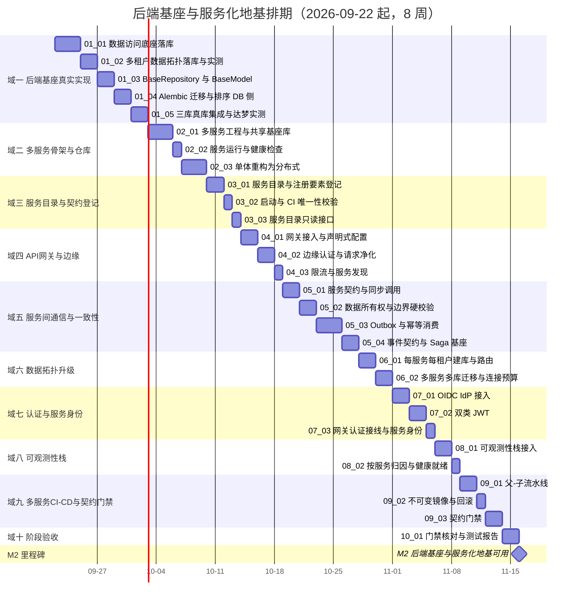

# 后端基座与服务化地基计划

> BMS 基础管理系统 · 阶段二（后端基座与服务化地基 / M2 后端基座与服务化地基可用）排期计划：已完成 2 项，剩余 27 项（246h / 8 周）

[文档首页](../../../文档首页.md) › 后端基座与服务化地基计划　|　[任务基线 →](../任务/01_后端基座真实实现/01_后端基座真实实现.md)　[需求基线 →](../需求/00_需求_后端基座与服务化地基.md)

## 1. 计划说明 

- **排期对象**：阶段二 29 条需求**已全部建任务基线**——十域各建父任务与子任务：01 [后端基座真实实现](../任务/01_后端基座真实实现/01_后端基座真实实现.md)（5 子任务 / 52h）、02 [多服务骨架与仓库](../任务/02_多服务骨架与仓库/02_多服务骨架与仓库.md)（3 / 34h）、03 [服务目录与契约登记](../任务/03_服务目录与契约登记/03_服务目录与契约登记.md)（3 / 18h）、04 [API 网关与边缘](../任务/04_API网关与边缘/04_API网关与边缘.md)（3 / 24h）、05 [服务间通信与一致性](../任务/05_服务间通信与一致性/05_服务间通信与一致性.md)（4 / 40h）、06 [数据拓扑升级](../任务/06_数据拓扑升级/06_数据拓扑升级.md)（2 / 18h）、07 [认证与服务身份](../任务/07_认证与服务身份/07_认证与服务身份.md)（3 / 22h）、08 [可观测性栈](../任务/08_可观测性栈/08_可观测性栈.md)（2 / 16h）、09 [多服务 CI-CD 与契约门禁](../任务/09_多服务CI-CD与契约门禁/09_多服务CI-CD与契约门禁.md)（3 / 24h）、10 [阶段验收](../任务/10_阶段验收/10_阶段验收.md)（1 / 8h）。
- **顺序口径（基座先行 + 地基随行 + 收口）**：先落后端基座真实实现（域一）→ 多服务骨架与重构（域二）→ 服务目录（域三）→ 网关与边缘（域四）→ 服务间通信与一致性（域五）→ 数据拓扑升级（域六）→ 认证与服务身份（域七）→ 可观测性栈（域八）→ 多服务 CI-CD 与契约门禁（域九）→ 阶段验收（域十）。
- **排期口径**：自 **2026-09-22** 起串行；**阶段二工期由原基线 4 周重估为 8 周**（服务化地基并入后体量增大），累计工期与里程碑随《总体项目规划》同步回写。
- **工时**：阶段合计 **256h**（后端基座真实实现 52h + 服务化地基 204h 中域十验收 8h 单列）。
- **里程碑锚点**：M2 = **后端基座与服务化地基可用**（《总体项目规划》「里程碑」节），门禁见第 5 节。
- **负责人**：minjian（兼职，单人）。

## 2. 已完成任务 

| 编号 | 任务 | 工时 | 完成日期 | 备注 |
| --- | --- | --- | --- | --- |
| 01_01 | 数据访问底座落库 | 12h | 2026-09-22 | 引擎主/副本多绑定、请求上下文读写选引擎、主库故障只读降级、连接池按服务与 worker、四库方言接线；预存在 6 条失败另行归口 |
| 01_02 | 多租户数据拓扑落库与实测 | 10h | 2026-09-22 | 租户解析全局中间件（三级链 + 豁免 + 未知/停用拒绝）、租户源查库 + 缓存基座短 TTL、租户库 `url_template` 解析、引擎注册表 LRU/闲置清扫/跨实例锁、会话按租户路由、租户过滤钩子与双租户物理隔离实测 |

## 3. 剩余任务排期（自 2026-09-22） 

| 编号 | 任务 | 工时 | 依赖 | 排期窗口 | 备注 | 偏差与遗留 |
| --- | --- | --- | --- | --- | --- | --- |
| 01_03 | BaseRepository 异步与 BaseModel 落库 | 10h | 01_01 | 2026-09-27 ~ 2026-09-28 | 含 sys_module 落库 | 无 |
| 01_04 | Alembic 迁移与排序 DB 侧 | 10h | 01_01 | 2026-09-29 ~ 2026-09-30 | 三套方言迁移 | 无 |
| 01_05 | 三库真库集成与达梦实测 | 10h | 01_04 | 2026-10-01 ~ 2026-10-02 | CI verify/db 档 | 无 |
| 02_01 | monorepo 多服务工程与共享基座库 | 12h | 01_01 | 2026-10-03 ~ 2026-10-05 | 服务分层与共享库 | 无 |
| 02_02 | 服务运行与健康检查 | 6h | 02_01 | 2026-10-06 | 每服务探针 | 无 |
| 02_03 | 单体重构为分布式 | 16h | 02_01 | 2026-10-07 ~ 2026-10-09 | 保留阶段一~五产出 | 无 |
| 03_01 | 服务目录与注册要素登记 | 8h | 01_03 | 2026-10-10 ~ 2026-10-11 | 注册要素按登记清单 | 无 |
| 03_02 | 启动与 CI 唯一性校验 | 6h | 03_01 | 2026-10-12 | 冲突拒启 | 无 |
| 03_03 | 服务目录只读接口 | 4h | 03_02 | 2026-10-13 | 不含密钥 | 无 |
| 04_01 | 网关接入与声明式配置 | 10h | 03_01 | 2026-10-14 ~ 2026-10-15 | APISIX standalone | 无 |
| 04_02 | 边缘认证与请求净化 | 8h | 04_01 | 2026-10-16 ~ 2026-10-17 | 剥头注入身份 | 无 |
| 04_03 | 限流与服务发现 | 6h | 04_02 | 2026-10-18 | 共享 Redis 限流 | 无 |
| 05_01 | 服务契约与同步调用 | 10h | 02_01 | 2026-10-19 ~ 2026-10-20 | 契约快照 | 无 |
| 05_02 | 数据所有权与边界硬校验 | 8h | 05_01 | 2026-10-21 ~ 2026-10-22 | CI 越界拦截 | 无 |
| 05_03 | Outbox 与幂等消费 | 14h | 05_02、01_01 | 2026-10-23 ~ 2026-10-25 | sys_outbox + 投递器 | 无 |
| 05_04 | 事件契约与 Saga 基座 | 8h | 05_03 | 2026-10-26 ~ 2026-10-27 | 补偿基座 | 无 |
| 06_01 | 每服务每租户建库与路由 | 10h | 01_02 | 2026-10-28 ~ 2026-10-29 | database-per-service | 无 |
| 06_02 | 多服务多库迁移与连接预算 | 8h | 06_01、01_04 | 2026-10-30 ~ 2026-10-31 | 按服务连接预算 | 无 |
| 07_01 | OIDC IdP 接入 | 8h | 04_01 | 2026-11-01 ~ 2026-11-02 | Keycloak 自托管 | 无 |
| 07_02 | 双类 JWT | 8h | 07_01 | 2026-11-03 ~ 2026-11-04 | aud 区分 | 无 |
| 07_03 | 网关认证接线与服务身份 | 6h | 07_02、04_02 | 2026-11-05 | 服务 JWT 校验 | 无 |
| 08_01 | 可观测性栈接入 | 10h | 02_01 | 2026-11-06 ~ 2026-11-07 | OTel + Tempo + Prom + Loki | 无 |
| 08_02 | 按服务归因与健康就绪 | 6h | 08_01、02_02 | 2026-11-08 | service.name / version | 无 |
| 09_01 | 父-子流水线 | 10h | 02_03 | 2026-11-09 ~ 2026-11-10 | 按服务构建发布 | 无 |
| 09_02 | 不可变镜像与回滚 | 6h | 09_01 | 2026-11-11 | 一键回滚 | 无 |
| 09_03 | 契约门禁 | 8h | 05_01 | 2026-11-12 ~ 2026-11-13 | oasdiff + Schemathesis | 无 |
| 10_01 | 阶段验收门禁核对与测试报告 | 8h | 01_05、02_03、03_02、04_03、05_04、06_02、07_03、08_02、09_03 | 2026-11-14 ~ 2026-11-15 | 含服务化地基 S1~S7 | 无 |

## 4. 排期甘特图 

## 5. M2 验收门禁 

门禁定义与逐项核对见《[总体项目规划](../../../规划/总体项目规划.md)》「阶段内容与完成标准」节（阶段二行）与《[微服务演进规划](../../../规划/微服务演进规划.md)》「服务化地基要求与门禁」节；本计划下的达成路径：

| 验收点 | 对应任务 | 达成路径 |
| --- | --- | --- |
| 数据访问真实落库 | 01_01 ~ 01_05 | 数据访问底座落库 → 多租户拓扑落库 → 基类与模型落库 → 迁移与排序 DB 侧 → 三库真库实测 |
| 三库拓扑可路由、租户隔离与批量迁移正确 | 01_01 / 01_02 / 06_01 / 06_02 | 底座与拓扑落库 + 每服务每租户建库与迁移编排 |
| 模块注册接库校验生效、BaseModel 落库与排序 DB 侧生效 | 01_03 / 01_04 | 注册表落库 + 四库类型映射 + 排序 DB 侧用例 |
| 基类异步切换完成 | 01_03 | `BaseRepository` 异步化与 DB 实现 |
| 三库真库集成与达梦方言实测通过 | 01_05 | CI verify/db 档 + 达梦方言实测结论 |
| **服务化地基 S1 服务边界与契约** | 03_01 / 05_01 / 09_03 | 服务目录登记 + 公开契约 + 契约门禁 |
| **S2 数据所有权** | 05_02 / 06_01 | 边界硬校验 + 每服务独立库 |
| **S3 事件与一致性** | 05_03 / 05_04 | Outbox + 幂等 + 事件契约 / Saga |
| **S4 服务身份与认证** | 04_02 / 07_01 ~ 07_03 | 网关认证 + 双类 JWT + 服务身份 |
| **S5 运行时无状态与外部化** | 02_02 / 02_03 | 服务运行与探针 + 单体重构 |
| **S6 分布式可观测** | 08_01 / 08_02 | 可观测栈 + 按服务归因 |
| **S7 度量与门禁** | 05_02 / 08_02 / 09_01 ~ 09_03 | 越界度量 + 多服务 CI-CD + 契约门禁 |
| 多服务本地一键拉起、每服务独立库迁移验证通过 | 02_01 / 02_02 / 06_01 / 06_02 | 多服务工程 + 编排 + 建库迁移 |
| 阶段验收留痕 | 10_01 | 门禁逐条结论与证据索引 + 阶段测试报告归档 |

## 6. 风险与对策 

| 风险 | 影响 | 对策 |
| --- | --- | --- |
| 服务化地基新增面广、单人兼职投入不稳 | M2 延期 | 串行保守排期（8 周）；基座先行（域一）保底，服务化各域可顺延 |
| 每服务每租户库数量爆炸、迁移编排复杂 | 数据拓扑升级受阻 | 建库 / 迁移自动化与幂等；库数量监控；必要时评估分库策略（不锁死） |
| 强一致场景跨库后正确性风险 | 一致性缺陷 | 审计链按服务×租户分条、财务收敛单一账务服务、Outbox + 幂等、排除 2PC/XA |
| 服务边界切错（退化为分布式单体） | 返工 | 按限界上下文划分 + 边界硬校验 CI 逐阶段判定 |
| 网关 / Tempo / Loki 等新增组件单机资源占用 | 单机资源吃紧 | 组件按需最小化、保留期 / TTL 配置、资源水位告警；触顶按演进路线迁 k3s |
| 达梦方言细节（SKIP LOCKED / 唯一 NULL 语义 / async 驱动）未定 | 实现返工 | 01_05 优先实测并登记结论，未定项按可移植方案兜底 |
| 服务目录与注册要素取值未定 | 登记阻塞 | 本阶段只定机制与分组，取值随实施登记清单逐域确定 |

> 本文档按《[计划文档规范](../../../规范/计划文档规范.md)》编写
