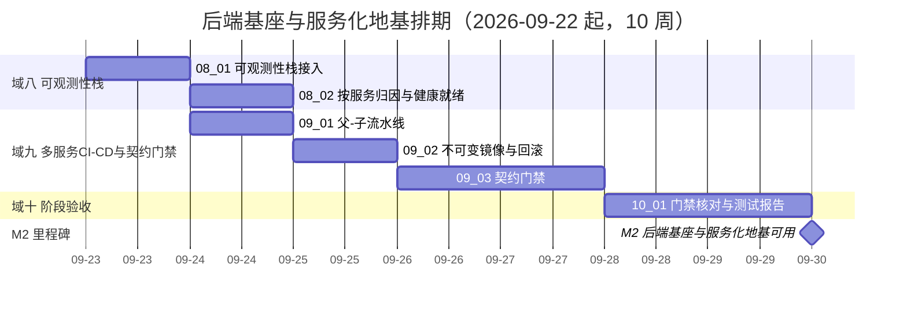

# 后端基座与服务化地基计划

> BMS 基础管理系统 · 阶段二（后端基座与服务化地基 / M2 后端基座与服务化地基可用）排期计划：已完成 29 项，剩余 1 项（8h / 10 周）

[文档首页](../../../文档首页.md) › 后端基座与服务化地基计划　|　[任务基线 →](../任务/01_后端基座真实实现/01_后端基座真实实现.md)　[需求基线 →](../需求/00_需求_后端基座与服务化地基.md)

## 1. 计划说明 

- **排期对象**：阶段二 30 条需求**已全部建任务基线**——十域各建父任务与子任务：01 [后端基座真实实现](../任务/01_后端基座真实实现/01_后端基座真实实现.md)（5 子任务 / 52h）、02 [多服务骨架与仓库](../任务/02_多服务骨架与仓库/02_多服务骨架与仓库.md)（3 / 34h）、03 [服务目录与契约登记](../任务/03_服务目录与契约登记/03_服务目录与契约登记.md)（3 / 18h）、04 [API 网关与边缘](../任务/04_API网关与边缘/04_API网关与边缘.md)（3 / 24h）、05 [服务间通信与一致性](../任务/05_服务间通信与一致性/05_服务间通信与一致性.md)（4 / 40h）、06 [数据拓扑升级](../任务/06_数据拓扑升级/06_数据拓扑升级.md)（3 / 68h）、07 [认证与服务身份](../任务/07_认证与服务身份/07_认证与服务身份.md)（3 / 22h）、08 [可观测性栈](../任务/08_可观测性栈/08_可观测性栈.md)（2 / 16h）、09 [多服务 CI-CD 与契约门禁](../任务/09_多服务CI-CD与契约门禁/09_多服务CI-CD与契约门禁.md)（3 / 24h）、10 [阶段验收](../任务/10_阶段验收/10_阶段验收.md)（1 / 8h）。
- **顺序口径（基座先行 + 地基随行 + 收口）**：先落后端基座真实实现（域一）→ 多服务骨架与重构（域二）→ 服务目录（域三）→ 网关与边缘（域四）→ 服务间通信与一致性（域五）→ 数据拓扑升级（域六）→ 认证与服务身份（域七）→ 可观测性栈（域八）→ 多服务 CI-CD 与契约门禁（域九）→ 阶段验收（域十）。**域六内顺序**：06_03 平台层表归属与按服务拆分（前置，2026-09-23 专项立项）→ 06_01 每服务每租户建库与路由（含平台服务库真实拆分）→ 06_02 多服务多库迁移与连接预算。
- **排期口径**：自 **2026-09-22** 起串行；**阶段二工期由原基线 4 周重估为 8 周**（服务化地基并入后体量增大），**再重估为 10 周**（2026-09-23 域六新增前置专项 06_03 / 40h，平台库共享问题定案后落地）；自 06_01 起各窗口整体后移 1 周（含 1 周估值缓冲），累计工期与里程碑随《总体项目规划》同步回写。
- **工时**：已完成 **302h**；剩余 **8h**；阶段合计 **310h**（后端基座真实实现 52h + 服务化地基 254h 中域十验收 8h 单列；域六 68h = 06_01 20h + 06_02 28h + 06_03 20h——2026-09-23 决策将 06_03 全部余量并入 06_02 后按「已交付 + 移交」重划，域内合计不变；**2026-09-23 与 06_02 / 06_03 一并收口，域六 68h 全部转入已完成**；**2026-09-23 域七 07_01 提前完成（8h 转入已完成）**；**2026-09-23 域七 07_02 提前完成（8h 转入已完成）**；**2026-09-23 域七 07_03 提前完成（6h 转入已完成）**；**2026-09-23 域八 08_01 提前完成（10h 转入已完成）**；**2026-09-24 域八 08_02 提前完成（6h → 10h 重估，10h 转入已完成；重估增量 +4h 计入阶段合计）**；**2026-09-24 域九 09_01 完成（10h 转入已完成）**；**2026-09-24 域九 09_02 完成（6h 转入已完成）**；**2026-09-24 域九 09_03 完成（8h 转入已完成）**）。
- **里程碑锚点**：M2 = **后端基座与服务化地基可用**（《总体项目规划》「里程碑」节），门禁见第 5 节。
- **负责人**：minjian（兼职，单人）。

## 2. 已完成任务 

| 编号 | 任务 | 工时（重估） | 完成日期 | 任务文件 | 偏差与遗留 |
| --- | --- | --- | --- | --- | --- |
| 01_01 | 数据访问底座落库 | 12h | 2026-09-22 | [01_01](../任务/01_后端基座真实实现/01_后端基座真实实现_01_数据访问底座落库/01_后端基座真实实现_01_数据访问底座落库.md) | 遗留：预存在 6 条用例失败另行归口（阶段收口） |
| 01_02 | 多租户数据拓扑落库与实测 | 10h | 2026-09-22 | [01_02](../任务/01_后端基座真实实现/01_后端基座真实实现_02_多租户数据拓扑落库与实测/01_后端基座真实实现_02_多租户数据拓扑落库与实测.md) | 无 |
| 01_03 | BaseRepository 异步与 BaseModel 落库 | 10h | 2026-09-22 | [01_03](../任务/01_后端基座真实实现/01_后端基座真实实现_03_BaseRepository 异步与 BaseModel 落库/01_后端基座真实实现_03_BaseRepository 异步与 BaseModel 落库.md) | 无 |
| 01_04 | Alembic 迁移与排序 DB 侧 | 10h | 2026-09-22 | [01_04](../任务/01_后端基座真实实现/01_后端基座真实实现_04_Alembic 迁移与排序 DB 侧/01_后端基座真实实现_04_Alembic 迁移与排序 DB 侧.md) | 无（达梦 DDL impl 注册 / 模式切换口径等实测结论见实施记录） |
| 01_05 | 三库真库集成与达梦实测 | 10h | 2026-09-22 | [01_05](../任务/01_后端基座真实实现/01_后端基座真实实现_05_三库真库集成与达梦实测/01_后端基座真实实现_05_三库真库集成与达梦实测.md) | 范围澄清：补达梦运行期同步门面（01_01 / 01_03 归口落地）；遗留：达梦复合唯一多 NULL 差异兜底（信创适配阶段定案）、JSON 读回字符串适配、`init_tenant` 达梦种子路径（详见任务测试记录 §6） |
| 02_01 | monorepo 多服务工程与共享基座库 | 12h | 2026-09-22 | [02_01](../任务/02_多服务骨架与仓库/02_多服务骨架与仓库_01_monorepo 多服务工程与共享基座库/02_多服务骨架与仓库_01_monorepo 多服务工程与共享基座库.md) | 范围澄清：只落工作区骨架 + 共享基座库 + 1 平台服务（业务拆分留 02_03）；遗留：ops 暂留根、平台基础模型暂随库（详见任务实施记录 §7） |
| 02_02 | 服务运行与健康检查 | 6h | 2026-09-22 | [02_02](../任务/02_多服务骨架与仓库/02_多服务骨架与仓库_02_服务运行与健康检查/02_多服务骨架与仓库_02_服务运行与健康检查.md) | 无（探针响应追加服务身份属契约变更，消费方为零；minio 检查项归文件管理阶段） |
| 02_03 | 单体重构为分布式 | 16h | 2026-09-22 | [02_03](../任务/02_多服务骨架与仓库/02_多服务骨架与仓库_03_单体重构为分布式/02_多服务骨架与仓库_03_单体重构为分布式.md) | 范围澄清：能力域实现留 bms_core、服务目录登记归 03_01、运行时跨库校验归 05_02；新增服务级路由登记表（mount_service_routers）避免多服务同进程登记串扰（详见任务实施记录 §7） |
| 03_01 | 服务目录与注册要素登记 | 8h | 2026-09-22 | [03_01](../任务/03_服务目录与契约登记/03_服务目录与契约登记_01_服务目录与注册要素登记/03_服务目录与契约登记_01_服务目录与注册要素登记.md) | 无（服务简称沿用微服务工程名；平台链新增 0002 迁移升格服务目录，详见任务实施记录） |
| 03_02 | 启动与 CI 唯一性校验 | 6h | 2026-09-23 | [03_02](../任务/03_服务目录与契约登记/03_服务目录与契约登记_02_启动与 CI 唯一性校验/03_服务目录与契约登记_02_启动与 CI 唯一性校验.md) | 无（新增 `CatalogError` 40003 与接库校验内核；服务包自报契约版本，详见任务实施记录） |
| 03_03 | 服务目录只读接口 | 4h | 2026-09-23 | [03_03](../任务/03_服务目录与契约登记/03_服务目录与契约登记_03_服务目录只读接口/03_服务目录与契约登记_03_服务目录只读接口.md) | 清单响应由数组改分页结构（消费方为零，已登记）；顺带修复依赖工厂契约校验转 10001（详见任务实施记录 §6） |
| 04_01 | 网关接入与声明式配置 | 10h | 2026-09-23 | [04_01](../任务/04_API网关与边缘/04_API网关与边缘_01_网关接入与声明式配置/04_API网关与边缘_01_网关接入与声明式配置.md) | 偏差：单文件 bind mount 无法热加载（改目录挂载 + 软链）；镜像标签用 `3.18.0-debian`；外部路径前缀 `/api/{service_key}/v1` 属契约变更（消费方 04_02 / 04_03 / 前端接入，已标注） |
| 04_02 | 边缘认证与请求净化 | 8h | 2026-09-23 | [04_02](../任务/04_API网关与边缘/04_API网关与边缘_02_边缘认证与请求净化/04_API网关与边缘_02_边缘认证与请求净化.md) | 偏差：`global_rules` 的 `headers.set` 被路由级 `proxy-rewrite` 丢弃（标记置入移至路由级，已回写设计与 APISIX 说明）；契约：身份头契约（消费方 07_03 / 前端接入，已标注）；真实 JWT 校验归 07_03 |
| 04_03 | 限流与服务发现 | 6h | 2026-09-23 | [04_03](../任务/04_API网关与边缘/04_API网关与边缘_03_限流与服务发现/04_API网关与边缘_03_限流与服务发现.md) | 偏差：限流 Redis 端口 / 库改整数字面量（环境变量替换致 schema 校验失败，已回写设计）；遗留：用户 / 租户维度限流归 07_03、指标抓取与日志采集归 08（已交付端点出口） |
| 05_01 | 服务契约与同步调用 | 10h | 2026-09-23 | [05_01](../任务/05_服务间通信与一致性/05_服务间通信与一致性_01_服务契约与同步调用/05_服务间通信与一致性_01_服务契约与同步调用.md) | 无（新增 `service_client` 能力域 + `ServiceDto` + 公开契约快照；错误码 10007 因 10006 已被 DATABASE_UNAVAILABLE 占用而顺延，详见任务实施记录 §7） |
| 05_02 | 数据所有权与边界硬校验 | 8h | 2026-09-23 | [05_02](../任务/05_服务间通信与一致性/05_服务间通信与一致性_02_数据所有权与边界硬校验/05_服务间通信与一致性_02_数据所有权与边界硬校验.md) | 新增 `boundary` 能力域（静态硬校验规则 6/7 + 运行时守卫 + 例外白名单 + 度量），错误码新增 10008；**平台 / 能力域模型与落库实现迁出 `bms_core` 另立独立迁移任务**（见 §7 第 9 项） |
| 05_03 | Outbox 与幂等消费 | 14h | 2026-09-23 | [05_03](../任务/05_服务间通信与一致性/05_服务间通信与一致性_03_Outbox 与幂等消费/05_服务间通信与一致性_03_Outbox 与幂等消费.md) | 新增 `outbox` 能力域（发件箱三表双链 + 轮询投递器 + 消费幂等 + 重放 / 死信看板 + Redis 业务幂等键）+ 平台链 0003 / 租户链 0002 迁移 + 错误码 10009；RocketMQ 真实发布归 M10、每服务库按库投递编排归 06_01（见 §7 第 10 项） |
| 05_04 | 事件契约与 Saga 基座 | 8h | 2026-09-23 | [05_04](../任务/05_服务间通信与一致性/05_服务间通信与一致性_04_事件契约与 Saga 基座/05_服务间通信与一致性_04_事件契约与 Saga 基座.md) | 新增事件契约注册表 / 兼容校验与快照门禁（`deploy/events/contracts.json`）、平台默认事件契约 23 条 + 存量 13 个事件名统一为域前缀、`sys_outbox.event_version` 列（平台链 0004 / 租户链 0003）、签发校验模式 `[event].contract_mode`、Saga 三态协同式基座（`[saga]`）与强一致口径（`build_chain_key`）+ 错误码 10010；编排式运行时归后续、服务级契约 / 订阅随消费方落地（见 §7 第 11~14 项） |
| 06_01 | 每服务每租户建库与路由 | 20h | 2026-09-23 | [06_01](../任务/06_数据拓扑升级/06_数据拓扑升级_01_每服务每租户建库与路由/06_数据拓扑升级_01_每服务每租户建库与路由.md) | 范围澄清：并入 06_03 遗留 2（服务目录快照契约 + 启动接库校验改经契约 + `catalog` 非必需项降级），工时 12h → 20h；承接项见 06_03 行。库键契约服务化（相对键 / 全限定键双形态）回写 01_02 设计，`sys_tenant.db_key` 废弃（平台链 0005），06_03 的 `sys_table_ownership` 迁移号顺延 0006；三库真库建库迁移演练归 06_02（详见任务实施记录 §7） |
| 06_03 | 平台层表归属与按服务拆分 | 20h | 2026-09-23 | [06_03](../任务/06_数据拓扑升级/06_数据拓扑升级_03_平台层表归属与按服务拆分/06_数据拓扑升级_03_平台层表归属与按服务拆分.md) | 第一轮交付表归属登记与派生 / `SysTenant` 迁出 / 租户源装配点；**全部余量移交 06_02 并已交付**（`sys_table_ownership` 建表 + 种子 + 双向对账、分链与过渡豁免移除、`SysModule` / `SysModuleI18n` 迁出、字典跨服务读出口），本任务随 06_02 收口（完成日期 2026-09-23）；工时按「已交付 + 移交」重划 40h → 20h |
| 06_02 | 多服务多库迁移与连接预算 | 28h | 2026-09-23 | [06_02](../任务/06_数据拓扑升级/06_数据拓扑升级_02_多服务多库迁移与连接预算/06_数据拓扑升级_02_多服务多库迁移与连接预算.md) | **提前开工当日完成（2026-09-23）**，承接 06_03 全部余量（工时 8h → 28h）；交付：分链机制 / 模型迁出与按服务模型解析 / 归属登记落库与对账 / 批量编排与开通即迁移 / 按服务连接预算 / 库数量可观测 / 字典跨服务读出口 / **三库真库演练**（MySQL / PG / 达梦，修复达梦 `DROP NOT NULL` 与 ops 同步方言路径）/ Kiwi 用例 2178；门禁 pytest 1193 / pyright 0 / ruff 干净 / 基座与边界校验全绿 |
| 07_01 | OIDC IdP 接入 | 8h | 2026-09-23 | [07_01](../任务/07_认证与服务身份/07_认证与服务身份_01_OIDC IdP 接入/07_认证与服务身份_01_OIDC IdP 接入.md) | 偏差：客户端以 authlib 的 JOSE 拆分包 joserfc + httpx 实现（authlib httpx 集成模块弃用告警）；postgres init 用 `.sh` 读环境变量（替代 `.sql`，避免明文密码）。遗留：外部身份映射 / JIT 建号归阶段六、双类 JWT 与 JWKS 分发归 07_02、网关认证接线归 07_03 |
| 07_02 | 双类 JWT | 8h | 2026-09-23 | [07_02](../任务/07_认证与服务身份/07_认证与服务身份_02_双类 JWT/07_认证与服务身份_02_双类 JWT.md) | 用户 JWT（`aud=api`）由 Keycloak 签发（realm 补 audience mapper）、服务 JWT（`aud=service`）BMS 自签（joserfc RS256/ES256、多密钥轮换）；`oauth` 增 `service_token` / `token_verifier` 能力域 + `VerifiedToken` 契约；统一校验按 `aud` 分流（`service`→本地 JWKS、`api`→IdP JWKS）；JWKS 分发 `/.well-known/jwks.json`（identity 宿主）；出站换券（`service_client` 剥离 `Authorization` + 附服务 JWT）；Kiwi 用例 2180。遗留：网关 `openid-connect` 接线与服务 JWT 入站校验归 07_03；`oauth_server` 真实实现归阶段十；存量 realm mapper 需 `import --override`（已记部署说明） |
| 07_03 | 网关认证接线与服务身份 | 6h | 2026-09-23 | [07_03](../任务/07_认证与服务身份/07_认证与服务身份_03_网关认证接线与服务身份/07_认证与服务身份_03_网关认证接线与服务身份.md) | 网关认证接线落地为 `forward-auth` 转调认证服务内部端点 `/api/v1/auth/introspect`（**偏差**：APISIX 无 `$jwt_claim_*`、`openid-connect` 仅产 `X-Userinfo`，04_02 预留写法作废）；认证端点复用 `UnifiedTokenVerifier` 按 `aud=api` 全校验用户 JWT、判公开路径、换发短时网关服务 JWT（`aud=service`）；后端 `[edge].provider` 切 `ServiceJwtEdgeTrust`（本地 JWKS 验签入站服务 JWT、只信服务 JWT、旁路伪造被拒）；`require_auth` 按 `[edge].require_gateway_identity` 门控真实身份；新增 `X-User-Subject` / `EdgeIdentity.subject`；限流维度扩用户主体 / 租户（**偏差**：用户维度取 `X-User-Subject`，`X-User-Id` 待阶段六）；`[gateway]` 配置节；Kiwi 用例 2181。遗留：完整登录链路 / 用户 claims 与 `X-User-Id` 填充归阶段六、RBAC 归阶段七、认证端点独立鉴权与 mTLS / 缓存优化归 K8s / 性能阶段 |
| 08_01 | 可观测性栈接入 | 10h | 2026-09-23 | [08_01](../任务/08_可观测性栈/08_可观测性栈_01_可观测性栈接入/08_可观测性栈_01_可观测性栈接入.md) | 指标真实实现（`PrometheusMetrics` + `/metrics` 采集端点 + 请求 / 依赖指标）、链路真实实现（`OtelTracer` + 全局 provider + 程序化自动埋点 + OTel 为 trace id 事实源）、可观测栈编排（otel-collector / Tempo / Prometheus / Grafana / Loki / Alloy + 一键 `bms.yml`，保留期 15d / 30d / 72h）、Grafana provisioning（三数据源 + 总览面板）、Alloy→Loki 日志采集（结构化元数据）、APISIX 指标 / 访问日志入栈；Kiwi 用例 2182。遗留：SLO / 告警与阶段度量归 08_02、服务容器化按服务抓取归 09、真实 Celery 埋点实测归任务调度阶段、`prometheus-client` 多进程模式与 prod 采样率随压测复核（详见任务实施记录 §7） |
| 08_02 | 按服务归因与健康就绪 | 10h | 2026-09-24 | [08_02](../任务/08_可观测性栈/08_可观测性栈_02_按服务归因与健康就绪/08_可观测性栈_02_按服务归因与健康就绪.md) | 按服务归因复核（span / 指标 / 日志三类信号）+ 跨服务链路用例与双服务冒烟（identity → platform 同 trace）；SLO 告警阈值锚点（Alertmanager 9093 + 基座规则 + blackbox 探针 + 模板渲染通道，业务链路留位）；catalog 降级指标化（`bms_catalog_degraded` + 警告规则）；阶段度量通道（Pushgateway + `bms_release_total` / `bms_contract_breaking_total` 口径 + 面板）；Grafana 两张新面板 + 总览 service / version 变量；Kiwi 用例 2183。**工时 6h → 10h 重估**（新增两张面板、渲染脚本、跨服务用例与三组件冒烟）。遗留：CI 推送发布 / 契约度量归 09、服务容器化后抓取与探针目标切 DNS 归 09、告警内部接口格式转换归通知阶段、业务链路 SLO 规则实体随端点实现、容量水位监控归运维阶段（详见任务实施记录 §7） |
| 09_01 | 父-子流水线 | 10h | 2026-09-24 | [09_01](../任务/09_多服务CI-CD与契约门禁/09_多服务CI-CD与契约门禁_01_父-子流水线/09_多服务CI-CD与契约门禁_01_父-子流水线.md) | 父流水线 trigger 调度层（9 服务按变更路径拉起子流水线，`strategy: depend`；共享 / 工作区变更跑全量测试兜底）+ 服务子流水线公共模板（工程级测试 + 本服务包覆盖率 ≥70% → 按服务镜像 `bms-{service}:$SHA` → push + Trivy 扫描 + 发布度量；`resource_group` 串行、release 不可中断）+ `backend/Dockerfile` 参数化 + 镜像档开关（P3 激活）+ core 子集测试隔离缺陷修复 + CI 配置护栏用例；Kiwi 用例 2184。**实测发现并修复**：BuildKit attestation 推送报 `blob unknown`（构建加 `--provenance=false`）、镜像缺 `alembic.ini` / `config*.toml`、base 镜像自带 45 条高危（apt 安全更新 + 移除 pip）、Trivy DB 国内镜像与缓存、前端镜像空跑失败（脚本内前置判定）。遗留：Compose 编排 / 不可变标签 / 回滚 / 健康门禁归 09_02（**已于 09_02 交付闭环**），契约门禁归 09_03，Trivy DB 缓存加速 / 非 root 与瘦身归运维阶段（详见任务实施记录 §7） |
| 09_02 | 不可变镜像与回滚 | 6h | 2026-09-24 | [09_02](../任务/09_多服务CI-CD与契约门禁/09_多服务CI-CD与契约门禁_02_不可变镜像与回滚/09_多服务CI-CD与契约门禁_02_不可变镜像与回滚.md) | 服务容器编排（`services.yml`，9 服务 Compose DNS `{service_key}:8000`、仅内部网络、MySQL 每服务库）+ 数据引导 bootstrap（建库 + 分链迁移 + 种子）+ 运行镜像含 `alembic/`/`ops/`（迁移容器复用）+ 不可变标签（SHA 主 + Git tag 追加 semver、禁 latest、留存清理）+ 一键回滚（`release.py` + 版本台账）+ 健康门禁（`/healthz`+`/readyz`+网关路由，失败自动回滚）+ 发布留痕（CI 清单 artifact + `release-log.jsonl`）+ 抓取 / 探针目标切 Compose DNS + 护栏用例；Kiwi 用例 2185。**实施发现**：`ops.migrate_tenants`/`provision_tenant`/`seed_tenant` 对 `SysTenant` 改惰性导入（单一服务镜像不强依赖 bms_tenant）、发布 CLI 兼容部署机 py3.12、`compose run` 额外变量须 `-e` 注入容器。mjbk 真机：9 服务 bootstrap + deploy 全通过、门禁通过、一键回滚与自动回滚演练通过、`up`/`probe_success` 全 1。遗留：K8s 迁移 / 非 root 与瘦身 / Trivy DB 缓存 / 真实主从归运维阶段；完整登录链路冒烟随认证 / E2E 阶段；共享变更后镜像重建沿用 09_01 口径（tag 流水线提供批量重建） |
| 09_03 | 契约门禁 | 8h | 2026-09-24 | [09_03](../任务/09_多服务CI-CD与契约门禁/09_多服务CI-CD与契约门禁_03_契约门禁/09_多服务CI-CD与契约门禁_03_契约门禁.md) | 每服务独立契约基线（`deploy/contracts/baseline/<service>.json`，入 Git、仅经评审更新）+ `ops/contract_gate.py`（oasdiff `tufin/oasdiff:v1.32.1` `breaking` 比对基线 ↔ 实时公开契约、「只加不删」、中文清单、`baseline-update`）+ `ops/contract_smoke.py`（Schemathesis `schemathesis/schemathesis:4.28.0` 源码起真实服务 + 容器共享 job 网络打真实服务，只读 GET/HEAD + 有限样例、零 Broker）+ 父流水线 verify 两 job（档位 `deploy/ci/verify/contract-gate`）+ 破坏数 `bms_contract_breaking_total{service}` 推 Pushgateway + `ci-backend` 加装 docker CLI + 护栏用例；Kiwi 用例 2186。mjbk 真机：两镜像预拉、oasdiff 兼容 exit 0 与删端点拦截 exit 1、Schemathesis 打真实服务（platform 21 GET 操作 / 540 用例全过）exit 0。遗留：完整登录链路冒烟随认证 / E2E；Schemathesis 网络命名空间兜底 / 冒烟路径收敛按需（详见任务实施记录 §7） |

## 3. 剩余任务排期（自 2026-09-22） 

| 编号 | 任务 | 工时 | 依赖 | 排期窗口 | 备注 | 偏差与遗留 |
| --- | --- | --- | --- | --- | --- | --- |
| 10_01 | 阶段验收门禁核对与测试报告 | 8h | 02_03、03_02、04_03、06_02、07_03、08_02、09_03 | 2026-11-21 ~ 2026-11-22 | 含服务化地基 S1~S7 | 无 |

## 4. 排期甘特图 

## 5. M2 验收门禁 

门禁定义与逐项核对见《[总体项目规划](../../../规划/总体项目规划.md)》「阶段内容与完成标准」节（阶段二行）与《[微服务演进规划](../../../规划/微服务演进规划.md)》「服务化地基要求与门禁」节；本计划下的达成路径：

| 验收点 | 对应任务 | 达成路径 |
| --- | --- | --- |
| 数据访问真实落库 | 01_01 ~ 01_05 | 数据访问底座落库 → 多租户拓扑落库 → 基类与模型落库 → 迁移与排序 DB 侧 → 三库真库实测 |
| 三库拓扑可路由、租户隔离与批量迁移正确 | 01_01 / 01_02 / 06_01 / 06_02 | 底座与拓扑落库 + 每服务每租户建库与迁移编排 |
| 模块注册接库校验生效、BaseModel 落库与排序 DB 侧生效 | 01_03 / 01_04 | 注册表落库 + 四库类型映射 + 排序 DB 侧用例 |
| 基类异步切换完成 | 01_03 | `BaseRepository` 异步化与 DB 实现 |
| 三库真库集成与达梦方言实测通过 | 01_05 | CI verify/db 档 + 达梦方言实测结论 |
| **服务化地基 S1 服务边界与契约** | 03_01 / 05_01 / 09_03 | 服务目录登记 + 公开契约 + 契约门禁 |
| **S2 数据所有权** | 05_02 / 06_03 / 06_01 | 边界硬校验 + 平台层表归属定案与实现迁出 + 每服务独立库 |
| **S3 事件与一致性** | 05_03 / 05_04 | Outbox + 幂等 + 事件契约 / Saga |
| **S4 服务身份与认证** | 04_02 / 07_01 ~ 07_03 | 网关认证 + 双类 JWT + 服务身份 |
| **S5 运行时无状态与外部化** | 02_02 / 02_03 | 服务运行与探针 + 单体重构 |
| **S6 分布式可观测** | 08_01 / 08_02 | 可观测栈 + 按服务归因 |
| **S7 度量与门禁** | 05_02 / 08_02 / 09_01 ~ 09_03 | 越界度量 + 多服务 CI-CD + 契约门禁 |
| 多服务本地一键拉起、每服务独立库迁移验证通过 | 02_01 / 02_02 / 06_03 / 06_01 / 06_02 | 多服务工程 + 编排 + 归属定案 + 建库迁移 |
| 阶段验收留痕 | 10_01 | 门禁逐条结论与证据索引 + 阶段测试报告归档 |

## 6. 风险与对策 

| 风险 | 影响 | 对策 |
| --- | --- | --- |
| 服务化地基新增面广、单人兼职投入不稳 | M2 延期 | 串行保守排期（8 周）；基座先行（域一）保底，服务化各域可顺延 |
| 每服务每租户库数量爆炸、迁移编排复杂 | 数据拓扑升级受阻 | 建库 / 迁移自动化与幂等；库数量监控；必要时评估分库策略（不锁死） |
| 强一致场景跨库后正确性风险 | 一致性缺陷 | 审计链按服务×租户分条、财务收敛单一账务服务、Outbox + 幂等、排除 2PC/XA |
| 服务边界切错（退化为分布式单体） | 返工 | 按限界上下文划分 + 边界硬校验 CI 逐阶段判定 |
| 网关 / Tempo / Loki 等新增组件单机资源占用 | 单机资源吃紧 | 组件按需最小化、保留期 / TTL 配置、资源水位告警；触顶按演进路线迁 k3s |
| 达梦方言细节（SKIP LOCKED / 唯一 NULL 语义 / async 驱动）未定 | 实现返工 | 01_05 已实测并登记结论（唯一 NULL 语义差异见下「后续阶段待办」；async 驱动经同步门面落地；SKIP LOCKED 归事件 / 任务阶段实测） |
| 服务目录与注册要素取值未定 | 登记阻塞 | 本阶段只定机制与分组，取值随实施登记清单逐域确定 |

## 7. 后续阶段待办 

| # | 事项 | 来源 | 归口 |
| --- | --- | --- | --- |
| 1 | 达梦复合唯一 `(唯一字段, deleted_at)` 的多 NULL 语义差异兜底（达梦视 NULL 相等 → 未删行不能共存）：先排查达梦实例 / 建库选项能否恢复多 NULL，再评估应用层唯一校验或哨兵值方案 | 01_05 真库实测（差异取证见任务测试记录 §3.3） | 信创适配阶段（定案前不改平台统一口径与表结构） |
| 2 | 达梦 `JSON` 列经 dmPython 读回为字符串的适配（模块若直接下标访问 JSON 字段需处理） | 01_05 真库实测 | 按影响面后续（业务模块接入时评估） |
| 3 | `ops/init_tenant.py` 在达梦下的种子路径需经同步门面（现 `_seed` 走异步引擎） | 01_05 实施发现 | 租户管理阶段 / 达梦生产化 |
| 4 | 真实主从复制与只读副本谓词（现仅验证副本路由决策，未搭主从） | 01_05 范围确认 | 后续（读写分离真实化） |
| 5 | 游标排序键类型范围扩展（`Decimal` 等） | 01_04 遗留 | 按需 |
| 6 | 骨架表（`sys_task` / `sys_notification` / `sys_icon` / `ai_chat_log` 等）迁移 | 01_04 / 01_05 归口 | 各所属阶段 |
| 7 | 分片表按月预创建与分片路由真实落地 | 01_05 范围确认 | 任务调度阶段 |
| 8 | CI `integration-dm8` 临时关闭：达梦实例连接报 `dmPython DatabaseError [CODE:-70089] Encryption module failed to load`（建连阶段、非本仓代码；属达梦服务端加密模块 / 客户端环境问题）；已置 `when: never`，修复达梦环境后恢复该 job | 02_03 CI 运行发现 | 达梦环境修复（运维 / 达梦生产化） |
| 9 | ~~平台 / 能力域模型与落库实现迁出 `bms_core`~~ **已立项为任务 06_03**（2026-09-23 专项决策：路线「表归属 → 逐表迁出 → 拆库」，需求 06-3，工时 40h，排期在 06_01 之前）；平台服务库的最终拆分由 06_01 承接 | 05_02 决策确认（2026-09-23） | 已闭环（06_03） |
| 10 | 发件箱 / 消费幂等 / 死信三表保留期清理与归档（`delivered` 记录、已处置死信）；跨租户全局死信看板视图与每服务库按库投递编排 | 05_03 决策确认（2026-09-23） | 任务调度 / 归档阶段；06_02 |
| 11 | 服务级事件契约与服务级订阅声明（本期平台默认契约 23 条 + 机制就位，订阅注册表为空集）；跨仓库（产品侧）消费方订阅无法自动校验，靠登记流程与契约快照留痕 | 05_04 决策确认（2026-09-23） | 消费方实现阶段 |
| 12 | 事件清单文档（架构《接口与集成》「事件模型清单」）与契约注册表的对账脚本（事件批量落地后评估） | 05_04 实施登记 | 后续（事件批量落地） |
| 13 | topic 命名域（`bms.log.*` / `bms.event.*` 等）与已登记事件域对齐 | 05_04 命名整改发现 | 阶段十 M10 集成消息 |
| 14 | 开发库自动建表（`ensure_development_schema`）不写 Alembic 版本号：已自动建表的库遇新增迁移会「表已存在」冲突（05_04 实测租户演示库停留 0001 且含 05_03 表）；本地已就地修补（stamp 0002 后升级 0003），自动建表与迁移版本号的衔接机制待评估 | 05_04 实施发现 | 01_04 后续 / 运维 |
| 15 | `sys_tenant.db_key` **物理删列**（现为可空废弃列，06_01 起不再写入）：列定义 / 表文件 / 模型三处同步删除 | 06_01 决策确认（2026-09-23） | 后续数据库治理任务（另立） |
| 16 | ~~服务目录快照接口 `GET /api/v1/modules/snapshot` 入契约快照与 oasdiff 基线；`catalog` 健康项与 `catalog_degraded` 状态的指标化 / 告警联动~~ **指标化 / 告警联动已闭环（2026-09-24，08_02：`bms_catalog_degraded` gauge + `BmsCatalogDegraded` 规则）**；快照入 oasdiff 基线（09_03：接口在 platform 公开契约快照内，独立基线 `deploy/contracts/baseline/platform.json` 已含该端点，门禁以实时契约比对） | 06_01 登记落点（2026-09-23） | —（已闭环） |
| 17 | 其余服务（identity / org / file / notification / search / ai / report）的基础设施表（发件箱三表）迁移脚本：现只建空目录 `versions/{service}/{platform,tenant}/`，派生表集为目标口径、**迁移与开发库自动建表均以「有脚本的链」为准** | 06_02 决策确认（2026-09-23） | M10 事件总线真实投递 / 该服务首次发事件 |
| 18 | ~~三库真库建库迁移演练（MySQL / PG / 达梦各一轮：建测试库 → 按服务建库 → 分链迁移 → 校验 → 清理）~~ **已完成**（2026-09-23，主机 192.168.0.107；9 / 9 / 13 例通过并清理；修复达梦 `DROP NOT NULL` 与 ops 同步方言路径） | 06_02 测试记录 §3.2 | — |
| 19 | ~~Kiwi TCMS 本任务用例登记（原预计 2178）~~ **已完成**：用例 **2178**（平台骨架 / P2 / CONFIRMED / 自动化），新增 5 个用例文件已标 `kiwi_id(2178)` | 06_02 测试记录 §1 | — |
| 20 | 分链形态变更后既有 SQLite 开发库 / CI 临时库须重建（`alembic_version` 存量取值不在新链中）；口径已写入 `alembic/README.md` 与《数据库开发规范》 | 06_02 实施发现（2026-09-23） | 开发 / 运维（文档已就位，无需专项） |
| 21 | 完整登录链路（授权码回调 / state / nonce / PKCE）、用户 JWT 租户等 claims 映射（Keycloak mappers）与 `X-User-Id` 内部数字 id 填充 / JIT 建号 | 07_03 遗留 | 阶段六 |
| 22 | RBAC 权限码细粒度校验（`require_permission` 接入路由） | 07_03 遗留 | 阶段七 |
| 23 | 认证内部端点 `/api/v1/auth/introspect` 独立鉴权（内网令牌 / mTLS）与 `forward-auth` 平移 ext_authz；Linkerd 自动 mTLS | 07_03 登记（2026-09-23） | K8s / 运维阶段 |
| 24 | 票据校验结果缓存与网关服务 JWT 短期缓存优化（不改契约） | 07_03 登记（2026-09-23） | 性能阶段 |
| 25 | 可观测组件镜像国内加速：daocloud 对部分镜像限速、`otel/opentelemetry-collector-contrib:0.116.0` 曾为坏副本（缺加载器，改用 `0.115.1`）；批量拉取走 `scripts/tools/docker/拉取镜像.sh`（containerd 断点续传 + 自动重试），经验见《Docker 部署使用说明》「大镜像拉取与断点续传」节 | 08_01 真机冒烟（2026-09-23） | 运维（文档与工具已就位） |
| 26 | ~~Prometheus 抓取目标：当前服务未容器化，用 `host.docker.internal:8000`；服务容器化后改 `{service_key}:8000`（Compose DNS）并按启用服务逐项登记~~ **已闭环**（2026-09-24，09_02：9 服务 Compose 编排 + 目标切 DNS，`up{job="bms-services"}` 9/9、`probe_success` 18/18 实测） | 08_01 实施（2026-09-23） | — |
| 27 | `prometheus-client` 多进程（multiprocess）模式随「每服务多 worker / 多副本」评估；prod 采样率与 Tempo 保留期随压测 / 容量复核修订 | 08_01 设计开放项（2026-09-23） | 性能 / 运维阶段 |
| 28 | 真实 Celery 运行时链路埋点实测（当前依赖与钩子就位，无 Celery 运行时可导入即降级） | 08_01 实施（2026-09-23） | 任务调度阶段 |
| 29 | CI 推送阶段度量至 Pushgateway——**发布成功率 `bms_release_total{service,result}` 已随 09_01 接入**（服务子流水线 release job `after_script` 按 job 终态推送，真实流水线实证）；**契约破坏数 `bms_contract_breaking_total{service}` 已随 09_03 接入**（父流水线 `contract-gate` job `after_script` 推送，同 08_02 通道与 `PUSHGATEWAY_URL`） | 08_02 实施（2026-09-24） | —（已闭环） |
| 30 | 业务链路 SLO 规则实体（登录成功率 / 审批提交成功率 / Socket.IO 推送延迟 / 备份每日成功；锚点已在 08_02 规则文件留位登记）与阈值随压测复核；容量水位监控（node-exporter / cadvisor） | 08_02 设计（2026-09-24） | 对应业务阶段（认证 / 工作流 / 实时推送 / 运维）与阶段十四压测 |
| 31 | 告警内部接口格式转换（企业微信 / 钉钉 webhook 转 BMS 内部接口）与短信通道（`sys_sms_template`）——08_02 已交付 webhook receiver 骨架 | 08_02 实施（2026-09-24） | 通知阶段 |
| 32 | dev 环境依赖缺口导致的 5xx（如 platform `GET /api/v1/outbox/dead-letters` 在 dev/SQLite 未迁移表下 500、无 Redis 时依赖端点异常）；已由 09_03 冒烟排除探针类端点并将 `contract-smoke` 设为非阻断 | 09_03 实施发现（2026-09-24） | 后端基座 / 数据拓扑后续任务（dev 库迁移与自动建表衔接，见第 17 / 14 项） |

> 本文档按《[计划文档规范](../../../规范/计划文档规范.md)》编写
