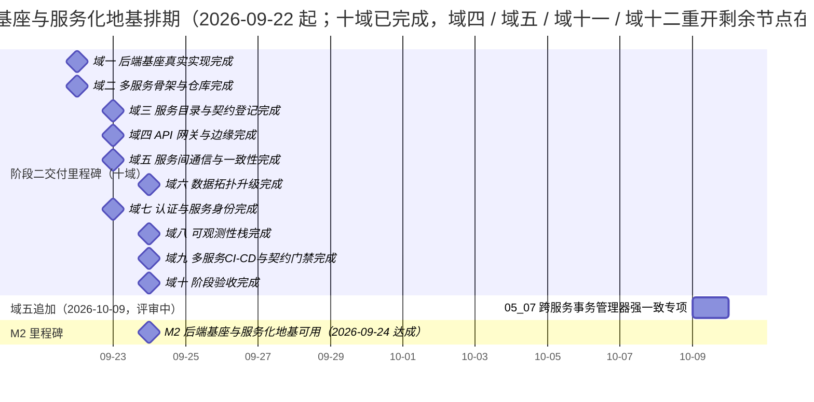

# 后端基座与服务化地基计划

> BMS 基础管理系统 · 阶段二（后端基座与服务化地基 / M2 后端基座与服务化地基可用）排期计划：已完成 40 项，剩余 1 项（**2026-10-09 追加域五 05_07「跨服务事务管理器（强一致专项）」，评审中**——按《后端开发规范》「强一致场景口径」的专项立项通道启用跨服务强一致，阶段二随域五追加**第三次重开**（M2 结论不变）；**阶段二其余任务全部交付**；域四 04_01 的两嵌套子任务 04-1-1 前端网关接入改造（2026-09-26）与 04-1-2 网关请求体限制（2026-10-08）均已交付、父任务完成收口；**域五 2026-10-06 追加需求 05-5 已交付：05_05 达梦 XA 方言 + 05_06 分布式事务方案评估与一致性屏障**；**2026-10-07 追加域十一（组织服务退役）3 条需求并另立任务、域十二（产品服务接入）4 条需求并另立任务**；域十二 12_01 产品注册机制、12_02 产品服务接入、12_03 共享基座产品服务装配支持均已于 2026-10-07 交付；**2026-10-07 域十一 11_01（组织服务工程退役）提前执行并交付**——次序修订为「先释放 `org` 标识、mdm 随后承接」，域十二 12_02 因追加嵌套子任务（mdm 域登记与产品级路由，已交付）重开为部分完成；**2026-10-07 域十二追加补充需求 12-4 并新建子任务 12_04（产品服务接入基座补充，mdm 01_02 跨仓前置）**；M2 已达成）

[文档首页](../../../文档首页.md) › 后端基座与服务化地基计划　|　[任务基线 →](../任务/01_后端基座真实实现/01_后端基座真实实现.md)　[需求基线 →](../需求/00_需求_后端基座与服务化地基.md)

## 1. 计划说明 

- **排期对象**：阶段二 41 条需求**已全部建任务基线**——十域各建父任务与子任务：01 [后端基座真实实现](../任务/01_后端基座真实实现/01_后端基座真实实现.md)（5 子任务 / 52h）、02 [多服务骨架与仓库](../任务/02_多服务骨架与仓库/02_多服务骨架与仓库.md)（3 / 34h）、03 [服务目录与契约登记](../任务/03_服务目录与契约登记/03_服务目录与契约登记.md)（3 / 18h）、04 [API 网关与边缘](../任务/04_API网关与边缘/04_API网关与边缘.md)（3 含 2 嵌套 / 42h）、05 [服务间通信与一致性](../任务/05_服务间通信与一致性/05_服务间通信与一致性.md)（7 / 72h ＋ 05_07 待估）、06 [数据拓扑升级](../任务/06_数据拓扑升级/06_数据拓扑升级.md)（4 / 74h）、07 [认证与服务身份](../任务/07_认证与服务身份/07_认证与服务身份.md)（3 / 22h）、08 [可观测性栈](../任务/08_可观测性栈/08_可观测性栈.md)（2 / 16h）、09 [多服务 CI-CD 与契约门禁](../任务/09_多服务CI-CD与契约门禁/09_多服务CI-CD与契约门禁.md)（3 / 24h）、10 [阶段验收](../任务/10_阶段验收/10_阶段验收.md)（1 / 8h）；**域十一（组织服务退役，3 条）与域十二（产品服务接入，4 条）为 2026-10-07 追加，另立任务 11_01 ~ 11_03 / 12_01 ~ 12_04**。
- **顺序口径（基座先行 + 地基随行 + 收口）**：先落后端基座真实实现（域一）→ 多服务骨架与重构（域二）→ 服务目录（域三）→ 网关与边缘（域四）→ 服务间通信与一致性（域五）→ 数据拓扑升级（域六）→ 认证与服务身份（域七）→ 可观测性栈（域八）→ 多服务 CI-CD 与契约门禁（域九）→ 阶段验收（域十）。**域六内顺序**：06_03 平台层表归属与按服务拆分（前置，2026-09-23 专项立项）→ 06_01 每服务每租户建库与路由（含平台服务库真实拆分）→ 06_02 多服务多库迁移与连接预算 → 06_04 租户解析与库键派生健壮性（补充需求 06-4，2026-09-24 追加，缺陷另立）。
- **排期口径**：自 **2026-09-22** 起串行；**阶段二工期由原基线 4 周重估为 8 周**（服务化地基并入后体量增大），**再重估为 10 周**（2026-09-23 域六新增前置专项 06_03 / 40h，平台库共享问题定案后落地）；自 06_01 起各窗口整体后移 1 周（含 1 周估值缓冲），累计工期与里程碑随《总体项目规划》同步回写。**阶段二实际于 2026-09-22 ~ 2026-09-24 全部完成并收口（M2 提前达成，2026-09-24）；10_01 排期窗口由 2026-11-21 ~ 2026-11-22 提前至 2026-09-24 单日。** **（2026-10-06 追加）**：补充需求 05-5（分布式事务能力：达梦 XA 方言 / 三库 2PC / 跨服务 TM）新增 05_05 / 05_06，域五由「已完成」重开为「部分完成」，排期 2026-10-07 ~ 2026-10-09；阶段二随域五追加再次重开（M2 结论不变）。**（2026-10-06）05_05（达梦 XA 方言）与 05_06（分布式事务方案评估 + 一致性屏障基座 + 知识档案《分布式事务》技术储备）均已交付，域五再次收口为已完成。**
- **工时**：已完成 442h；剩余 0h；阶段合计 **442h**（**2026-10-08 台账三笔回写修正 + 两笔**：① **域四 04_01「网关接入与声明式配置」28h 转入已完成（父任务收口）**——两嵌套子任务（04-1-1 前端网关接入改造 2026-09-26、04-1-2 网关请求体限制 2026-10-08）均已交付，父任务完成收口；① **域十二 12_02「产品服务接入」20h 转入已完成（父任务二次收口）**——本体 2026-10-07 交付，因追加嵌套子任务「mdm 域登记与产品级路由」重开为部分完成；该子任务同日交付、遗留（`org` 标识释放 / `frontend_package_source`）已随 11_01 与 R4.3 闭环，本次二次收口；② **域十二 12_04「产品服务接入基座补充」12h 转入已完成（回写修正）**——该任务 2026-10-07 交付当日仅回写统计行，未将任务行移入已完成且残留一行重复的「未开始」行（致收口断言用例报警），本次修正；① **域十二 12_04「产品服务接入基座补充」12h 转入已完成（回写修正）**——该任务 2026-10-07 交付当日仅回写统计行，未将任务行移入已完成且残留一行重复的「未开始」行（致收口断言用例报警），本次修正；② 域十一 11_02「组织只读出口契约迁出与前端切换」6h 转入已完成——基座 `bms_core/org` 契约 / 装配 / 导出 / 配置与测试期望零残留，前端组织选择字段族出口经寻址契约切 mdm 产品命名空间 `/api/mdm/v1/org`；③ 域十一 11_03「门禁回归与阶段收口」4h 转入已完成——六项零漂移门禁 + 预检 + 后端测试 / 静态检查全绿、文档口径一致（修正 1 处 + 补 4 处）、阶段测试报告追加域十一结论、**域十一整域收口**；① 域十一 11_02「组织只读出口契约迁出与前端切换」6h 转入已完成——基座 `bms_core/org` 契约 / 装配 / 导出 / 配置与测试期望零残留，前端组织选择字段族出口经寻址契约切 mdm 产品命名空间 `/api/mdm/v1/org`；② 域十一 11_03「门禁回归与阶段收口」4h 转入已完成——六项零漂移门禁 + 预检 + 后端测试 / 静态检查全绿、文档口径一致（修正 1 处 + 补 4 处）、阶段测试报告追加域十一结论、**域十一整域收口**；**2026-10-07 台账三笔**：① 域十一 11_01 8h 转入已完成（提前交付）；② 域十二 12_02 追加嵌套子任务 +4h（16h → 20h）并重开为部分完成——原 16h 由已完成移回剩余；③ 域六 06_01 追加嵌套子任务 +2h（20h → 22h）当轮交付。原口径——2026-10-07 域十二 12_01 12h + 12_02 16h + 12_03 8h 转入已完成——12_02「产品服务接入」含产品档案只读出口、产品级路由映射与网关产品命名空间、开放接口 scope 登记、产品事件契约扩展点与接入骨架；12_03「共享基座产品服务装配支持」含服务目录应用级视图与 `service_records()` 注入钩子、产品维度 fail-closed 校验、启动离线 / 接库 / 事件域校验改造；域五追加补充需求 05-5：05_05 16h + 05_06 20h = +36h，2026-10-06；其中 05_05 16h 已于 2026-10-06 转入已完成，**05_06 由 16h 重估为 20h**——新增一致性屏障基座与知识档案《分布式事务》5 篇，+4h，已于 2026-10-06 转入已完成）。阶段二原有 334h 明细沿革：域四 04_01 重开：自有 10h + 追加嵌套子任务 18h；阶段二原有 316h 明细沿革：域六 68h = 06_01 20h + 06_02 28h + 06_03 20h——2026-09-23 决策将 06_03 全部余量并入 06_02 后按「已交付 + 移交」重划，域内合计不变；**2026-09-23 与 06_02 / 06_03 一并收口，域六 68h 全部转入已完成**；**2026-09-23 域七 07_01 提前完成（8h 转入已完成）**；**2026-09-23 域七 07_02 提前完成（8h 转入已完成）**；**2026-09-23 域七 07_03 提前完成（6h 转入已完成）**；**2026-09-23 域八 08_01 提前完成（10h 转入已完成）**；**2026-09-24 域八 08_02 提前完成（6h → 10h 重估，10h 转入已完成；重估增量 +4h 计入阶段合计）**；**2026-09-24 域九 09_01 完成（10h 转入已完成）**；**2026-09-24 域九 09_02 完成（6h 转入已完成）**；**2026-09-24 域九 09_03 完成（8h 转入已完成）**；**2026-09-24 域六追加 06_04（补充需求 06-4，6h，缺陷另立）→ 域六合计 68h → 74h、阶段合计 310h → 316h，域六由「已完成」重开为「部分完成」**；**2026-09-24 域六 06_04 完成（6h 转入已完成，域六再次收口）**；**2026-09-24 域十 10_01 完成（8h 转入已完成，阶段二 316h 全部转入已完成）**）。**（2026-10-07 追加）**域十二新增补充需求 12-4（产品服务接入基座补充：表归属产品注入与合并视图、服务包模型名前缀参数化、产品业务码与动作码种子、规范与清单回写）并新建子任务 12_04，**+12h**（域十二合计 36h → 48h、阶段合计 430h → 442h）；域十二「产品服务接入」父任务随即重开为部分完成。
- **里程碑锚点**：M2 = **后端基座与服务化地基可用**（《总体项目规划》「里程碑」节），门禁见第 5 节。
- **负责人**：minjian（兼职，单人）。
- **（2026-10-07 追加）域十一「组织服务退役」**：组织主数据（部门 / 岗位 / 用户-岗位）统一归 mdm 产品，bms 原 `org` 服务一步到位退役（补充需求 11-1 ~ 11-3，另立任务 11_01 ~ 11_03）。**依赖顺序（2026-10-07 修订）**：`11_01`（工程退役与 `org` 标识释放）**提前执行**——先释放标识、mdm 需求 `01-1` ~ `01-3` 随后承接；`11_02`（契约迁出与前端切换）仍待 mdm `01-3` 就绪后执行、`11_03` 收口最后。**11_01 已于 2026-10-07 交付**（含 `org` 条目易主、产品级路由登记、网关服务级路由分组、库名前缀参数化与全量引用清理）。阶段二随域十一追加**重开为部分完成**（M2 结论不变）。工时：11_01 8h + 11_02 6h + 11_03 4h = **+18h**（阶段合计 370h → 388h）。
- **（2026-10-07 追加）域十二「产品服务接入」**：平台支持产品服务注册与接入（R4.1 / R4.2）+ 共享基座产品服务装配支持（补充需求 12-1 ~ 12-3，另立任务 12_01 ~ 12_03），**解锁 mdm 产品实施**（mdm 需求 `01-1` 依赖本域）。**依赖链**：域十二 → mdm 阶段一承接 → 域十一退役（跨仓）。工时：12_01 12h + 12_02 16h + 12_03 8h = **+36h**（阶段合计 388h → 424h）。**（2026-10-07 追加嵌套子任务）**：12_02 下追加「mdm 域登记与产品级路由」（+4h，16h → 20h；含 `org` 条目易主、`PRODUCT_ROUTES` 映射、产品档案升 `enabled`、网关服务级路由排除产品分组），子任务已交付、父任务重开为部分完成待收口。**（2026-10-07 追加补充需求 12-4）** → 新建子任务 12_04「产品服务接入基座补充」（表归属产品注入与合并视图、服务包模型名前缀参数化、产品业务码与动作码种子、规范与清单回写；mdm 01_02 跨仓前置），域十二父任务随即重开为部分完成。
- **（2026-10-09 追加）域五「服务间通信与一致性」子任务 05_07「跨服务事务管理器（强一致专项）」**：跨服务写（角色保存 / 用户保存：平台 ↔ 组织）此前定位于「本地事务 + 反向补偿 + 一致性屏障」最终一致；经确认其**中间态在业务上不可接受**，故按《[后端开发规范](../../../规范/后端开发规范.md)》「强一致场景口径」的**专项立项通道**启用技术储备中的跨服务强一致（自研 TM + 各服务 XA），形态为「能力基类 + 插件注册表 + 配置选择 + 提供者」、`[transaction_manager].provider` 默认 `null`（现状基线不动）。**本阶段先出详细设计评审稿**（6 项评审决策点见 §7 第 45 项），**评审通过后再登记投入与窗口**——故本条暂不计入工时行（工时行维持「已完成 442h / 剩余 0h / 合计 442h」，待定稿后同步回写）。**域五第三态**：域五由「已完成」重开为「部分完成」；阶段二随域五追加第三次重开（M2 结论不变）。

## 2. 已完成任务（2026-09-22 ~ 2026-09-24） 

| 编号 | 任务 | 工时（重估） | 完成日期 | 任务文件 | 偏差与遗留 |
| --- | --- | --- | --- | --- | --- |
| 01_01 | 数据访问底座落库 | 12h | 2026-09-22 | [01_01](../任务/01_后端基座真实实现/01_后端基座真实实现_01_数据访问底座落库/01_后端基座真实实现_01_数据访问底座落库.md) | 遗留：预存在 6 条用例失败另行归口（阶段收口） |
| 01_02 | 多租户数据拓扑落库与实测 | 10h | 2026-09-22 | [01_02](../任务/01_后端基座真实实现/01_后端基座真实实现_02_多租户数据拓扑落库与实测/01_后端基座真实实现_02_多租户数据拓扑落库与实测.md) | 无 |
| 01_03 | BaseRepository 异步与 BaseModel 落库 | 10h | 2026-09-22 | [01_03](../任务/01_后端基座真实实现/01_后端基座真实实现_03_BaseRepository 异步与 BaseModel 落库/01_后端基座真实实现_03_BaseRepository 异步与 BaseModel 落库.md) | 无 |
| 01_04 | Alembic 迁移与排序 DB 侧 | 10h | 2026-09-22 | [01_04](../任务/01_后端基座真实实现/01_后端基座真实实现_04_Alembic 迁移与排序 DB 侧/01_后端基座真实实现_04_Alembic 迁移与排序 DB 侧.md) | 无（达梦 DDL impl 注册 / 模式切换口径等实测结论见实施记录） |
| 01_05 | 三库真库集成与达梦实测 | 10h | 2026-09-22 | [01_05](../任务/01_后端基座真实实现/01_后端基座真实实现_05_三库真库集成与达梦实测/01_后端基座真实实现_05_三库真库集成与达梦实测.md) | 范围澄清：补达梦运行期同步门面（01_01 / 01_03 归口落地）；遗留：达梦复合唯一多 NULL 差异兜底（信创适配阶段定案）、JSON 读回字符串适配、`init_tenant` 达梦种子路径（详见任务测试记录 §6） |
| 02_01 | monorepo 多服务工程与共享基座库 | 12h | 2026-09-22 | [02_01](../任务/02_多服务骨架与仓库/02_多服务骨架与仓库_01_monorepo 多服务工程与共享基座库/02_多服务骨架与仓库_01_monorepo 多服务工程与共享基座库.md) | 范围澄清：只落工作区骨架 + 共享基座库 + 1 平台服务（业务拆分留 02_03）；遗留：ops 暂留根、平台基础模型暂随库（详见任务实施记录 §7） |
| 02_02 | 服务运行与健康检查 | 6h | 2026-09-22 | [02_02](../任务/02_多服务骨架与仓库/02_多服务骨架与仓库_02_服务运行与健康检查/02_多服务骨架与仓库_02_服务运行与健康检查.md) | 无（探针响应追加服务身份属契约变更，消费方为零；minio 检查项归文件管理阶段） |
| 02_03 | 单体重构为分布式 | 16h | 2026-09-22 | [02_03](../任务/02_多服务骨架与仓库/02_多服务骨架与仓库_03_单体重构为分布式/02_多服务骨架与仓库_03_单体重构为分布式.md) | 范围澄清：能力域实现留 bms_core、服务目录登记归 03_01、运行时跨库校验归 05_02；新增服务级路由登记表（mount_service_routers）避免多服务同进程登记串扰（详见任务实施记录 §7） |
| 03_01 | 服务目录与注册要素登记 | 8h | 2026-09-22 | [03_01](../任务/03_服务目录与契约登记/03_服务目录与契约登记_01_服务目录与注册要素登记/03_服务目录与契约登记_01_服务目录与注册要素登记.md) | 无（服务简称沿用微服务工程名；平台链新增 0002 迁移升格服务目录，详见任务实施记录） |
| 03_02 | 启动与 CI 唯一性校验 | 6h | 2026-09-23 | [03_02](../任务/03_服务目录与契约登记/03_服务目录与契约登记_02_启动与 CI 唯一性校验/03_服务目录与契约登记_02_启动与 CI 唯一性校验.md) | 无（新增 `CatalogError` 40003 与接库校验内核；服务包自报契约版本，详见任务实施记录） |
| 03_03 | 服务目录只读接口 | 4h | 2026-09-23 | [03_03](../任务/03_服务目录与契约登记/03_服务目录与契约登记_03_服务目录只读接口/03_服务目录与契约登记_03_服务目录只读接口.md) | 清单响应由数组改分页结构（消费方为零，已登记）；顺带修复依赖工厂契约校验转 10001（详见任务实施记录 §6） |
| 04_02 | 边缘认证与请求净化 | 8h | 2026-09-23 | [04_02](../任务/04_API网关与边缘/04_API网关与边缘_02_边缘认证与请求净化/04_API网关与边缘_02_边缘认证与请求净化.md) | 偏差：`global_rules` 的 `headers.set` 被路由级 `proxy-rewrite` 丢弃（标记置入移至路由级，已回写设计与 APISIX 说明）；契约：身份头契约（消费方 07_03 / 前端接入，已标注）；真实 JWT 校验归 07_03 |
| 04_03 | 限流与服务发现 | 6h | 2026-09-23 | [04_03](../任务/04_API网关与边缘/04_API网关与边缘_03_限流与服务发现/04_API网关与边缘_03_限流与服务发现.md) | 偏差：限流 Redis 端口 / 库改整数字面量（环境变量替换致 schema 校验失败，已回写设计）；遗留：用户 / 租户维度限流归 07_03、指标抓取与日志采集归 08（已交付端点出口） |
| 05_01 | 服务契约与同步调用 | 10h | 2026-09-23 | [05_01](../任务/05_服务间通信与一致性/05_服务间通信与一致性_01_服务契约与同步调用/05_服务间通信与一致性_01_服务契约与同步调用.md) | 无（新增 `service_client` 能力域 + `ServiceDto` + 公开契约快照；错误码 10007 因 10006 已被 DATABASE_UNAVAILABLE 占用而顺延，详见任务实施记录 §7） |
| 05_02 | 数据所有权与边界硬校验 | 8h | 2026-09-23 | [05_02](../任务/05_服务间通信与一致性/05_服务间通信与一致性_02_数据所有权与边界硬校验/05_服务间通信与一致性_02_数据所有权与边界硬校验.md) | 新增 `boundary` 能力域（静态硬校验规则 6/7 + 运行时守卫 + 例外白名单 + 度量），错误码新增 10008；**平台 / 能力域模型与落库实现迁出 `bms_core` 另立独立迁移任务**（见 §7 第 9 项） |
| 05_03 | Outbox 与幂等消费 | 14h | 2026-09-23 | [05_03](../任务/05_服务间通信与一致性/05_服务间通信与一致性_03_Outbox 与幂等消费/05_服务间通信与一致性_03_Outbox 与幂等消费.md) | 新增 `outbox` 能力域（发件箱三表双链 + 轮询投递器 + 消费幂等 + 重放 / 死信看板 + Redis 业务幂等键）+ 平台链 0003 / 租户链 0002 迁移 + 错误码 10009；RocketMQ 真实发布归 M10、每服务库按库投递编排归 06_01（见 §7 第 10 项） |
| 05_04 | 事件契约与 Saga 基座 | 8h | 2026-09-23 | [05_04](../任务/05_服务间通信与一致性/05_服务间通信与一致性_04_事件契约与 Saga 基座/05_服务间通信与一致性_04_事件契约与 Saga 基座.md) | 新增事件契约注册表 / 兼容校验与快照门禁（`deploy/events/contracts.json`）、平台默认事件契约 23 条 + 存量 13 个事件名统一为域前缀、`sys_outbox.event_version` 列（平台链 0004 / 租户链 0003）、签发校验模式 `[event].contract_mode`、Saga 三态协同式基座（`[saga]`）与强一致口径（`build_chain_key`）+ 错误码 10010；编排式运行时归后续、服务级契约 / 订阅随消费方落地（见 §7 第 11~14 项） |
| 06_01 | 每服务每租户建库与路由 | 22h | 2026-09-23 | [06_01](../任务/06_数据拓扑升级/06_数据拓扑升级_01_每服务每租户建库与路由/06_数据拓扑升级_01_每服务每租户建库与路由.md) | 范围澄清：并入 06_03 遗留 2（服务目录快照契约 + 启动接库校验改经契约 + `catalog` 非必需项降级），工时 12h → 20h；承接项见 06_03 行。库键契约服务化（相对键 / 全限定键双形态）回写 01_02 设计，`sys_tenant.db_key` 废弃（平台链 0005），06_03 的 `sys_table_ownership` 迁移号顺延 0006；三库真库建库迁移演练归 06_02（详见任务实施记录 §7）；**追加（2026-10-07）**：库名前缀参数化——`[database].name_prefix`（默认 `bms`）与 `db/keys.py` 库名派生参数化、`db/engine.py` / `ops/provision_tenant.py` 接线、用例覆盖，工时 20h → 22h（嵌套子任务「库名前缀参数化」当轮交付） |
| 06_03 | 平台层表归属与按服务拆分 | 20h | 2026-09-23 | [06_03](../任务/06_数据拓扑升级/06_数据拓扑升级_03_平台层表归属与按服务拆分/06_数据拓扑升级_03_平台层表归属与按服务拆分.md) | 第一轮交付表归属登记与派生 / `SysTenant` 迁出 / 租户源装配点；**全部余量移交 06_02 并已交付**（`sys_table_ownership` 建表 + 种子 + 双向对账、分链与过渡豁免移除、`SysModule` / `SysModuleI18n` 迁出、字典跨服务读出口），本任务随 06_02 收口（完成日期 2026-09-23）；工时按「已交付 + 移交」重划 40h → 20h |
| 06_02 | 多服务多库迁移与连接预算 | 28h | 2026-09-23 | [06_02](../任务/06_数据拓扑升级/06_数据拓扑升级_02_多服务多库迁移与连接预算/06_数据拓扑升级_02_多服务多库迁移与连接预算.md) | **提前开工当日完成（2026-09-23）**，承接 06_03 全部余量（工时 8h → 28h）；交付：分链机制 / 模型迁出与按服务模型解析 / 归属登记落库与对账 / 批量编排与开通即迁移 / 按服务连接预算 / 库数量可观测 / 字典跨服务读出口 / **三库真库演练**（MySQL / PG / 达梦，修复达梦 `DROP NOT NULL` 与 ops 同步方言路径）/ Kiwi 用例 2178；门禁 pytest 1193 / pyright 0 / ruff 干净 / 基座与边界校验全绿 |
| 07_01 | OIDC IdP 接入 | 8h | 2026-09-23 | [07_01](../任务/07_认证与服务身份/07_认证与服务身份_01_OIDC IdP 接入/07_认证与服务身份_01_OIDC IdP 接入.md) | 偏差：客户端以 authlib 的 JOSE 拆分包 joserfc + httpx 实现（authlib httpx 集成模块弃用告警）；postgres init 用 `.sh` 读环境变量（替代 `.sql`，避免明文密码）。遗留：外部身份映射 / JIT 建号归阶段六、双类 JWT 与 JWKS 分发归 07_02、网关认证接线归 07_03 |
| 07_02 | 双类 JWT | 8h | 2026-09-23 | [07_02](../任务/07_认证与服务身份/07_认证与服务身份_02_双类 JWT/07_认证与服务身份_02_双类 JWT.md) | 用户 JWT（`aud=api`）由 Keycloak 签发（realm 补 audience mapper）、服务 JWT（`aud=service`）BMS 自签（joserfc RS256/ES256、多密钥轮换）；`oauth` 增 `service_token` / `token_verifier` 能力域 + `VerifiedToken` 契约；统一校验按 `aud` 分流（`service`→本地 JWKS、`api`→IdP JWKS）；JWKS 分发 `/.well-known/jwks.json`（identity 宿主）；出站换券（`service_client` 剥离 `Authorization` + 附服务 JWT）；Kiwi 用例 2180。遗留：网关 `openid-connect` 接线与服务 JWT 入站校验归 07_03；`oauth_server` 真实实现归阶段十；存量 realm mapper 需 `import --override`（已记部署说明） |
| 07_03 | 网关认证接线与服务身份 | 6h | 2026-09-23 | [07_03](../任务/07_认证与服务身份/07_认证与服务身份_03_网关认证接线与服务身份/07_认证与服务身份_03_网关认证接线与服务身份.md) | 网关认证接线落地为 `forward-auth` 转调认证服务内部端点 `/api/v1/auth/introspect`（**偏差**：APISIX 无 `$jwt_claim_*`、`openid-connect` 仅产 `X-Userinfo`，04_02 预留写法作废）；认证端点复用 `UnifiedTokenVerifier` 按 `aud=api` 全校验用户 JWT、判公开路径、换发短时网关服务 JWT（`aud=service`）；后端 `[edge].provider` 切 `ServiceJwtEdgeTrust`（本地 JWKS 验签入站服务 JWT、只信服务 JWT、旁路伪造被拒）；`require_auth` 按 `[edge].require_gateway_identity` 门控真实身份；新增 `X-User-Subject` / `EdgeIdentity.subject`；限流维度扩用户主体 / 租户（**偏差**：用户维度取 `X-User-Subject`，`X-User-Id` 待阶段六）；`[gateway]` 配置节；Kiwi 用例 2181。遗留：完整登录链路 / 用户 claims 与 `X-User-Id` 填充归阶段六、RBAC 归阶段七、认证端点独立鉴权与 mTLS / 缓存优化归 K8s / 性能阶段 |
| 08_01 | 可观测性栈接入 | 10h | 2026-09-23 | [08_01](../任务/08_可观测性栈/08_可观测性栈_01_可观测性栈接入/08_可观测性栈_01_可观测性栈接入.md) | 指标真实实现（`PrometheusMetrics` + `/metrics` 采集端点 + 请求 / 依赖指标）、链路真实实现（`OtelTracer` + 全局 provider + 程序化自动埋点 + OTel 为 trace id 事实源）、可观测栈编排（otel-collector / Tempo / Prometheus / Grafana / Loki / Alloy + 一键 `bms.yml`，保留期 15d / 30d / 72h）、Grafana provisioning（三数据源 + 总览面板）、Alloy→Loki 日志采集（结构化元数据）、APISIX 指标 / 访问日志入栈；Kiwi 用例 2182。遗留：SLO / 告警与阶段度量归 08_02、服务容器化按服务抓取归 09、真实 Celery 埋点实测归任务调度阶段、`prometheus-client` 多进程模式与 prod 采样率随压测复核（详见任务实施记录 §7） |
| 08_02 | 按服务归因与健康就绪 | 10h | 2026-09-24 | [08_02](../任务/08_可观测性栈/08_可观测性栈_02_按服务归因与健康就绪/08_可观测性栈_02_按服务归因与健康就绪.md) | 按服务归因复核（span / 指标 / 日志三类信号）+ 跨服务链路用例与双服务冒烟（identity → platform 同 trace）；SLO 告警阈值锚点（Alertmanager 9093 + 基座规则 + blackbox 探针 + 模板渲染通道，业务链路留位）；catalog 降级指标化（`bms_catalog_degraded` + 警告规则）；阶段度量通道（Pushgateway + `bms_release_total` / `bms_contract_breaking_total` 口径 + 面板）；Grafana 两张新面板 + 总览 service / version 变量；Kiwi 用例 2183。**工时 6h → 10h 重估**（新增两张面板、渲染脚本、跨服务用例与三组件冒烟）。遗留：CI 推送发布 / 契约度量归 09、服务容器化后抓取与探针目标切 DNS 归 09、告警内部接口格式转换归通知阶段、业务链路 SLO 规则实体随端点实现、容量水位监控归运维阶段（详见任务实施记录 §7） |
| 09_01 | 父-子流水线 | 10h | 2026-09-24 | [09_01](../任务/09_多服务CI-CD与契约门禁/09_多服务CI-CD与契约门禁_01_父-子流水线/09_多服务CI-CD与契约门禁_01_父-子流水线.md) | 父流水线 trigger 调度层（9 服务按变更路径拉起子流水线，`strategy: depend`；共享 / 工作区变更跑全量测试兜底）+ 服务子流水线公共模板（工程级测试 + 本服务包覆盖率 ≥70% → 按服务镜像 `bms-{service}:$SHA` → push + Trivy 扫描 + 发布度量；`resource_group` 串行、release 不可中断）+ `backend/Dockerfile` 参数化 + 镜像档开关（P3 激活）+ core 子集测试隔离缺陷修复 + CI 配置护栏用例；Kiwi 用例 2184。**实测发现并修复**：BuildKit attestation 推送报 `blob unknown`（构建加 `--provenance=false`）、镜像缺 `alembic.ini` / `config*.toml`、base 镜像自带 45 条高危（apt 安全更新 + 移除 pip）、Trivy DB 国内镜像与缓存、前端镜像空跑失败（脚本内前置判定）。遗留：Compose 编排 / 不可变标签 / 回滚 / 健康门禁归 09_02（**已于 09_02 交付闭环**），契约门禁归 09_03，Trivy DB 缓存加速 / 非 root 与瘦身归运维阶段（详见任务实施记录 §7） |
| 09_02 | 不可变镜像与回滚 | 6h | 2026-09-24 | [09_02](../任务/09_多服务CI-CD与契约门禁/09_多服务CI-CD与契约门禁_02_不可变镜像与回滚/09_多服务CI-CD与契约门禁_02_不可变镜像与回滚.md) | 服务容器编排（`services.yml`，9 服务 Compose DNS `{service_key}:8000`、仅内部网络、MySQL 每服务库）+ 数据引导 bootstrap（建库 + 分链迁移 + 种子）+ 运行镜像含 `alembic/`/`ops/`（迁移容器复用）+ 不可变标签（SHA 主 + Git tag 追加 semver、禁 latest、留存清理）+ 一键回滚（`release.py` + 版本台账）+ 健康门禁（`/healthz`+`/readyz`+网关路由，失败自动回滚）+ 发布留痕（CI 清单 artifact + `release-log.jsonl`）+ 抓取 / 探针目标切 Compose DNS + 护栏用例；Kiwi 用例 2185。**实施发现**：`ops.migrate_tenants`/`provision_tenant`/`seed_tenant` 对 `SysTenant` 改惰性导入（单一服务镜像不强依赖 bms_tenant）、发布 CLI 兼容部署机 py3.12、`compose run` 额外变量须 `-e` 注入容器。mjbk 真机：9 服务 bootstrap + deploy 全通过、门禁通过、一键回滚与自动回滚演练通过、`up`/`probe_success` 全 1。遗留：K8s 迁移 / 非 root 与瘦身 / Trivy DB 缓存 / 真实主从归运维阶段；完整登录链路冒烟随认证 / E2E 阶段；共享变更后镜像重建沿用 09_01 口径（tag 流水线提供批量重建） |
| 09_03 | 契约门禁 | 8h | 2026-09-24 | [09_03](../任务/09_多服务CI-CD与契约门禁/09_多服务CI-CD与契约门禁_03_契约门禁/09_多服务CI-CD与契约门禁_03_契约门禁.md) | 每服务独立契约基线（`deploy/contracts/baseline/<service>.json`，入 Git、仅经评审更新）+ `ops/contract_gate.py`（oasdiff `tufin/oasdiff:v1.32.1` `breaking` 比对基线 ↔ 实时公开契约、「只加不删」、中文清单、`baseline-update`）+ `ops/contract_smoke.py`（Schemathesis `schemathesis/schemathesis:4.28.0` 源码起真实服务 + 容器共享 job 网络打真实服务，只读 GET/HEAD + 有限样例、零 Broker）+ 父流水线 verify 两 job（档位 `deploy/ci/verify/contract-gate`）+ 破坏数 `bms_contract_breaking_total{service}` 推 Pushgateway + `ci-backend` 加装 docker CLI + 护栏用例；Kiwi 用例 2186。mjbk 真机：两镜像预拉、oasdiff 兼容 exit 0 与删端点拦截 exit 1、Schemathesis 打真实服务（platform 21 GET 操作 / 540 用例全过）exit 0。遗留：完整登录链路冒烟随认证 / E2E；Schemathesis 网络命名空间兜底 / 冒烟路径收敛按需（详见任务实施记录 §7） |
| 06_04 | 租户解析与库键派生健壮性 | 6h | 2026-09-24 | [06_04](../任务/06_数据拓扑升级/06_数据拓扑升级_04_租户解析与库键派生健壮性/06_数据拓扑升级_04_租户解析与库键派生健壮性.md) | **补充需求 06-4（GitLab Issue #47）**：租户解析来源形态判定（IP 字面量 / `localhost` 不入子域名解析；编码 / 域名形态校验，非法视为未命中）+ 租户源兜底收口（不可作编码的来源值按 4xx，不派生非法库名、不冒泡 5xx）+ `contract-smoke-<服务>` 由非阻断改**阻断**（CI / 档位 / 规范 / 规划 / 部署说明同步）+ 护栏用例 5 例（Kiwi 2187，含 platform 侧「dev 环境全 GET 端点零 5xx」回归，旧代码下必红）。同口径 Schemathesis 修复前 `7 failures` → 修复后 `462 passed` / exit 0；全量 pytest 1337 passed / 37 skipped。遗留：共享基座变更下冒烟覆盖口径归 09 域（§7 第 33 项）、其余 8 服务 CI 实证随下次变更命中（详见任务实施记录 §6） |
| 10_01 | 阶段验收门禁核对与测试报告 | 8h | 2026-09-24 | [10_01](../任务/10_阶段验收/10_阶段验收_01_阶段验收门禁核对与测试报告/10_阶段验收_01_阶段验收门禁核对与测试报告.md) | 无（阶段二 14 行门禁逐条有结论与证据、[阶段测试报告](../01_测试报告_后端基座与服务化地基.md)归档、三类文档状态一致；顺带闭环 09_03 收口遗留的甘特 S2 软提示） |
| 11_01 | 组织服务工程退役与登记清理 | 8h | 2026-10-07 | [11_01](../任务/11_组织服务退役/11_组织服务退役_01_组织服务工程退役/11_组织服务退役_01_组织服务工程退役.md) | **提前执行（2026-10-07 次序修订）**：先释放 `org` 标识、mdm 随后承接（原「先切出口 → 删服务 → 移除基座契约」次序随之修订）。交付：`services/org` 工程删除；`org` 条目**易主为 mdm 产品行**（四要素不变）；`PRODUCT_ROUTES` 增 `mdm/org → org`、产品档案 `mdm` 升 `enabled`；网关服务级路由排除产品分组（upstream 保留，新增 `route-mdm-org`）；契约快照 / api-types / 迁移链 / 部署编排（compose·prometheus）/ 校验脚本全量清理；`ops/migrate_user_tables.py` 与其测试退役。偏差与决策见 [11_01 详设](../任务/11_组织服务退役/11_组织服务退役_01_组织服务工程退役/设计/01_详细设计_01_组织服务工程退役.md) §10 对齐记录；遗留：`bms_org_{code}` 租户库 DROP（运维）、11_02 契约迁出与前端切换、网关联调归 mdm 部署联调 |
| 11_02 | 组织只读出口契约迁出与前端切换 | 6h | 2026-10-08 | [11_02](../任务/11_组织服务退役/11_组织服务退役_02_组织只读出口契约迁出与前端切换/11_组织服务退役_02_组织只读出口契约迁出与前端切换.md) | **交付**：① **基座清理**——`bms_core/org/`（两契约 + 空实现）目录删除、`assembly.py`（导入 / 空实现模块登记 / 两条插件装配项）与 `api/deps.py`（导入 + `__all__` 两项）清理、`config.py` 两项插件配置项移除、platform 插件注册用例期望同步；② **前端切址**——组织数据源 HTTP 内建实现默认端点经**寻址契约**组装为 **mdm 产品命名空间**（`productPrefix('mdm','org')` = `/api/mdm/v1/org`，新增 `orgSourceEndpoint()` 单一来源）+ 路径切出口口径（`/data-source/{users,posts,dept-tree}`、`/resolve-names`），查询 / 部门含子级 / 状态 / 分页与 `target`+`id_in` 批量参数口径不变、部门树一次性返回；响应形态兼容 `{list}` / `{items}` / 裸数组（切址不因集合字段名差异而破）；核对页新增第 13 项自检（默认端点＝产品命名空间）；③ **文档回写**——后端基类清单（§10 继承链移除 org 两条、目录清单去 `bms_core/org/`、横切扩展行状态）。**门禁**：后端 pytest **2083 passed / 51 skipped** + ruff + format + pyright（0 err）、`check-backend-base`（736 链对齐）与 `preflight --fast` **全部通过**；前端 core 1288 / ui-ep 950（68 文件）/ desktop 292 例、三包 lint、`tsc`+`vue-tsc` 与隔离扫描（31 文件零违规）全绿；Kiwi **2262**。**偏差与决策**：基座校验（继承链对账）要求清单同步移除 org 两条链（文档与代码同批收口）；顺带修复既存失败用例 1 例（`field-file-upload` 图片尺寸探测在 jsdom 走 3000ms 超时兜底 → 用例等待窗口放宽至 5s，非实现缺陷）。**遗留**：真实网关联调（前端经网关 `/api/mdm/v1/org/...` 打真实 mdm 服务 + 令牌 / 三库）归部署联调与 11_03 收口；`bms_org_{code}` 租户库 DROP（运维） |
| 11_03 | 门禁回归与阶段收口 | 4h | 2026-10-08 | [11_03](../任务/11_组织服务退役/11_组织服务退役_03_门禁回归与阶段收口/11_组织服务退役_03_门禁回归与阶段收口.md) | **交付（域十一整域收口）**：① **门禁回归**——服务目录 `ops.check_modules --offline`（清单 16 项 + 产品档案 3 项）/ 网关 `ops.gateway_config check`（与服务目录一致、无硬编码 IP、无 org 服务级路由残留）/ `ops.contract_snapshot check`（**8 个启用服务**零漂移）/ `ops.check_contracts`（8 服务实现路由 ⊆ 公开契约）/ `ops.event_contracts check`（23 条 / 订阅 0、零漂移）/ 前端 `@bms/api-types gen:check`（8 份零漂移）/ `preflight --fast` **全部通过**；后端 `pytest` **2083 passed / 51 skipped** + `ruff` + `format` + `pyright`（0 err）全绿；② **文档口径一致**——架构 03 / 04 / 09 / 15 / 33、后端开发规范、后端基类清单、数据库设计总览与组织表文件、阶段二需求与计划逐份核对，**修正 1 处「org 服务」当前状态残留**（后端基类清单账号锁定端点落点 `bms_org/api/account_locks.py` → `bms_platform/api/account_locks.py`，随 02_05 归口）并**补 4 处 11_02 落地事实**（架构 03 / 15、后端开发规范、基类清单）；阶段测试报告追加 §6 域十一结论与 §1 追加事实（**不回溯 M2 收口快照**）；③ **计划两表回写**（域十一三子任务完成日期）。**偏差与决策**：详设 §3 所列 api-types 检查入口实为 `pnpm --filter @bms/api-types run gen:check`（详设写 `scripts/generate.mjs --check`）→ 已在对齐记录更正；契约冒烟 `ops.contract_smoke` 无服务实现变更（`11_01` 已删 org 工程、`11_02` 仅删基座契约 + 前端切址）→ **按需不跑**，随 CI 与下次服务变更命中（沿用 09_03 口径）。**遗留**：真实网关联调（令牌 / 三库）随部署；`bms_org_{code}` 租户库 DROP（运维）；mdm 侧组织域出口联合验收（mdm `01-4`） |
| 12_01 | 产品注册机制（R4.1） | 12h | 2026-10-07 | [12_01](../任务/12_产品服务接入/12_产品服务接入_01_产品注册机制/12_产品服务接入_01_产品注册机制.md) | 偏差：产品档案落点与校验口径按稿时现状回写详设（模型落 `bms_platform/models/catalog.py`、校验改「离线 + CI 接库对账」，见 §7 第 40 项）；遗留：产品档案 HTTP 只读出口归 12_02、`frontend_package_source` 取值归 R4.3（见 §7 第 41 项）；**追加（2026-10-07）**：产品档案 `mdm` 状态由 `planned` 升 `enabled`（随 12_02 嵌套子任务交付） |
| 12_03 | 共享基座产品服务装配支持 | 8h | 2026-10-07 | [12_03](../任务/12_产品服务接入/12_产品服务接入_03_共享基座产品服务装配支持/12_产品服务接入_03_共享基座产品服务装配支持.md) | 交付：服务目录**应用级视图**（`service_records()` 注入钩子 + `ModuleRegistry.catalog_records()` / `event_domains()` 视图入口）、产品维度 fail-closed 校验（`validate_product_service_records()`）、启动离线 / 接库 / 事件域校验改读应用实例视图；偏差：产品维度校验取**注入记录**而非合并清单（见 §7 第 43 项）；遗留：产品档案 / 路由映射的产品侧注入不做、库数指标与契约声明扫描口径维持平台侧、真实 git 源安装与端到端启动实测归 mdm 01_01（见 §7 第 43 项） |
| 05_05 | 达梦 XA 自定义方言（DBMS_XA） | 16h | 2026-10-06 | [05_05](../任务/05_服务间通信与一致性/05_服务间通信与一致性_05_达梦XA自定义方言/05_服务间通信与一致性_05_达梦XA自定义方言.md) | 纯 Python 方言接 `DBMS_XA`（`dmxa`）+ 达梦连接串方言归一 + `SYNC_ONLY_DIALECTS` 增收；达梦真库 `begin_twophase` 三态通过（Kiwi 2245）；跨库 TM 评估与正式接入归 05_06 |
| 05_06 | 分布式事务方案评估（三库同步 2PC / 跨服务 TM） | 20h | 2026-10-06 | [05_06](../任务/05_服务间通信与一致性/05_服务间通信与一致性_06_分布式事务方案评估/05_服务间通信与一致性_06_分布式事务方案评估.md) | **补充需求 05-5**：结论「单库原子优先 + 跨服务最终一致 + 一致性屏障」，**应用级 2PC / 外部 TM 作插件化技术储备不引入**；交付**一致性屏障基座**（`BaseConsistencyBarrier` + `null`/`redis`，Kiwi 2246）+ **三库单进程 2PC 真库证据用例**（MySQL×PG×达梦 全通过）+ 知识档案《分布式事务》5 篇 + 回写架构 37/34/15、后端开发规范 §10、后端基类清单；**工时 16h → 20h 重估**（新增基座与知识档案）。遗留：自研 TM 运行时 / 悬挂自动回收 / 屏障在权限链路真实接线归后续（详见任务实施记录 §6） |
| 12_04 | 产品服务接入基座补充（表归属注入 + 服务包模型前缀 + 产品种子） | 12h | 2026-10-07 | [12_04](../任务/12_产品服务接入/12_产品服务接入_04_产品服务接入基座补充/12_产品服务接入_04_产品服务接入基座补充.md) | **补充需求 12-4（mdm 需求 `01-2` 跨仓前置）交付**：① **表归属产品注入与合并视图**——`services/table_registry.py` 增 `merge_table_records` / `register_table_records` / `injected_table_records` / `reset_table_records` / `table_ownership_view`（同 `table_name` **同值去重、异值即拒**），派生函数与 `boundary/directory.py` 查询出口一律改取**合并视图**；`application.py` 增 `table_records()` 装配钩子 + `app.state.table_ownership`（装载期注册）；② **服务包模型名前缀参数化**——`[app].package_prefix`（平台默认 `bms`、产品配自有前缀）派生 `{前缀}_{service}.models`，新增严格入口 `require_service_model_modules()`（服务已启用但服务包缺失**快速失败**），`ops/check_tables.py` 接入；③ **产品业务码 / 动作码种子**——`ops/seed_menu.py` / `ops/seed_tables.py` 增 `org` 业务码 + 5 动作码（`query` / `create` / `update` / `delete` / `move`），种子来源改合并视图；④ **规范与清单回写**（数据库开发规范 / 数据规范 / 后端开发规范 / 后端基类清单）。**门禁**：`pytest`（`libs/bms_core/tests` + `services/platform/tests`）**1659 passed / 49 skipped** + `ruff` + `format` + `pyright`（0 err）+ `preflight --fast` 全绿；Kiwi **2254**（5 个用例文件：注入即进链 / 同值去重与异值即拒 / 装配钩子与合并视图 / 包名前缀与严格入口 / 种子）。**遗留**：产品侧表归属清单声明与装载调用（归 mdm `01-2`）、产品侧自建归属校验 ops（产品仓按需）、菜单与字段种子（mdm `01-4`）、产品契约基线与破坏性门禁（mdm `01-3`）、第三方产品包名映射兼容（随实际接入评估）。**计划回写修正（2026-10-08）**：本任务交付日计划表仅回写统计行，漏将本行移入已完成且**残留一行重复的「未开始」行**（致阶段收口断言用例 `test_m2_closure.py::test_plan_closure_state` 报警）→ 本次修正（重复行删除、本行移入已完成、统计与台账同步） |
| 12_02 | 产品服务接入（R4.2） | 20h | 2026-10-07 | [12_02](../任务/12_产品服务接入/12_产品服务接入_02_产品服务接入/12_产品服务接入_02_产品服务接入.md) | **交付（2026-10-07；父任务二次收口 2026-10-08）**：① **服务目录与契约登记**（产品服务纳入服务目录与契约快照 / 门禁）；② **认证接入**（OIDC 用户 / 服务双令牌 + JWKS + 服务身份）；③ **开放接口**（`/api/open` + `sys_client` 最小 scope 集合，`bms_core/oauth/scopes.py` scope 登记）；④ **事件接入**（产品事件域扩展点与契约校验，`bms_core/events/product_events.py`）；⑤ **网关路由与产品命名空间**（`PRODUCT_ROUTES`「域段 → 服务」单一来源 + `gateway_catalog` 产品级路由生成 + 产品档案只读出口 `GET /api/v1/products`：清单分页 / 明细 / 字段集护栏 / 空库口径）；⑥ **嵌套子任务「mdm 域登记与产品级路由」**（**2026-10-07 交付**）——`org` 条目易主 **mdm 产品行**（四要素不变）、`PRODUCT_ROUTES` 增 `mdm/org → org`、网关 `route-mdm-org`（`/api/mdm/v1/org` + `/org/*`，路径重写 `^/api/mdm/v1(.*)$` → 服务内 `/api/v1…`）、产品档案 `mdm` 升 `enabled`、网关服务级路由排除产品分组。**门禁（本体交付时点）**：定向 454 例 + 基座全量 1232 + platform 414 + identity 289、`ruff` / `format` / `pyright`（0 err）、契约 / 事件 / 网关 / 服务目录零漂移、覆盖率定向 100%（分支）、`preflight --fast` 全绿；Kiwi **2250**。**二次收口复核（2026-10-08）**：嵌套子任务交付事实齐备（`PRODUCT_ROUTES` 含 `mdm/org`、网关 `route-mdm-org` 就位、`ops.check_modules --offline` 通过、产品档案出口用例 327 例全绿）；**遗留闭环**——⑤ `org` 标识释放随 **11_01**（2026-10-07）闭环、② `frontend_package_source` 取值随 **R4.3（阶段五 `03_04`，2026-10-08）**闭环、① 产品档案只读出口本体交付（12_01 遗留闭环）；**持续性遗留**——③ mdm 各域模块行与产品级路由映射**组织域已登、余域随产品接入续登**；**归他阶段**——④ 真实 `/api/open` 令牌签发 / 撤销 / 调用日志 / 按 client 限流归**阶段十**、⑥ 模块级注销态建模归**后续数据库治理**。**偏差**：校验入口随 `ModuleRegistry.validate()` 一并执行（非 `ops/check_modules.py` 显式接线）、映射校验只拒 `disabled`、公开契约变更连带重生成 platform 契约与前端类型（基线不随本次更新）；见 §7 台账第 42 项 |
| 04_01 | 网关接入与声明式配置 | 28h | 2026-10-08 | [04_01](../任务/04_API网关与边缘/04_API网关与边缘_01_网关接入与声明式配置/04_API网关与边缘_01_网关接入与声明式配置.md) | **收口（含两嵌套子任务）**：① 本体交付（域四，2026-09-2x）：网关声明式配置（`apisix.yaml` 由服务目录生成、standalone 文件驱动热加载）、边缘 nginx 模板化、认证接线与服务身份、限流与真实 IP、边缘可观测出口；② **嵌套子任务 04-1-1 前端网关接入改造**（Kiwi **2191**，2026-09-26 交付）：外部寻址口径与「域 → 服务前缀」单一来源、宿主请求层 baseURL 收敛、能力源按服务注入 endpoint、动态菜单与路由守卫、契约类型生成与 dev 代理口径；③ **嵌套子任务 04-1-2 网关请求体限制**（Kiwi **2264**，2026-10-08 交付）：边缘 nginx `client_max_body_size` 经 `GATEWAY_MAX_BODY_SIZE` 注入（缺省 32m = 20MB 整包 + multipart 开销 + 一片余量、按环境可调）、APISIX 侧同值纵深防御、**三方一致 + ≥ 文件上传整包上限（20MB）机器断言**（`ops.gateway_config check` 的 `validate_body_size`，纳入预检与 CI）、超限边缘先拒 **413**、分片（单片 ≤ 20MB）不受影响。**门禁**：网关配置校验通过、`test_gateway_config.py` **12 passed**（新增 5）、`ops` + `crosscut` **202 passed**、`ruff` / `format` / `pyright`（0 err）、`check-env-example`、`preflight --fast` 全绿。**遗留**：真机「超限 413 + 分片不受影响」实测随**部署联调**（证据补入 04-1-2 测试记录）；分片单片值随文件管理阶段定值回看；K8s 阶段以 Ingress / Gateway API 等价配置承载 |

## 3. 剩余任务排期（自 2026-09-22） 
|  | --- |
> 阶段二 40 项任务**全部已交付**（含域五 05_05 / 05_06，2026-10-06；域十二 12_01 产品注册机制 / **12_02 产品服务接入（父任务二次收口）** / 12_03 共享基座产品服务装配支持 / **12_04 产品服务接入基座补充**，2026-10-07；**域十一 11_01 / 11_02 / 11_03**，2026-10-07 / 08——域十一整域收口；**域四 04_01 及其两嵌套子任务 04-1-1 / 04-1-2 完成收口**，2026-10-08）。**本表剩 1 行**（05_07 跨服务事务管理器强一致专项，评审中）；其余 40 项已整体交付（后续跨仓联调与部署面见 §7 台账）。
|  | --- |
| 编号 | 任务 | 状态 | 工时 | 依赖 | 排期窗口 | 备注 | 偏差与遗留 |
| --- | --- | --- | --- | --- | --- | --- | --- |
| 05_07 | 跨服务事务管理器（强一致专项） | 未开始 | 待估 | 05_05、05_06 | 搁置（详细设计评审中，窗口待定稿） | **2026-10-09 立项至详细设计评审**；已交付[详细设计（评审稿）](../任务/05_服务间通信与一致性/05_服务间通信与一致性_07_跨服务事务管理器强一致专项/设计/01_详细设计_07_跨服务事务管理器强一致专项.md)；投入与窗口待评审定稿后登记 | 评审决策点 6 项：同步引擎策略（决定量级）/ 本地开发无 XA / TM 高可用 / 参与方范围与产品化 / 达梦悬挂对账补齐 / 人工处置队列口径 |
|  | --- |
## 4. 排期甘特图 

```mermaid
gantt
    title 后端基座与服务化地基排期（2026-09-22 起；十域已完成，域四 / 域五 / 域十一 / 域十二重开剩余节点在列）
    dateFormat  YYYY-MM-DD
    axisFormat %m-%d
    section 阶段二交付里程碑（十域）
    域一 后端基座真实实现完成 :milestone, m01, 2026-09-22, 0d
    域二 多服务骨架与仓库完成 :milestone, m02, 2026-09-22, 0d
    域三 服务目录与契约登记完成 :milestone, m03, 2026-09-23, 0d
    域四 API 网关与边缘完成 :milestone, m04, 2026-09-23, 0d
    域五 服务间通信与一致性完成 :milestone, m05, 2026-09-23, 0d
    域六 数据拓扑升级完成 :milestone, m06, 2026-09-24, 0d
    域七 认证与服务身份完成 :milestone, m07, 2026-09-23, 0d
    域八 可观测性栈完成 :milestone, m08, 2026-09-24, 0d
    域九 多服务CI-CD与契约门禁完成 :milestone, m09, 2026-09-24, 0d
    域十 阶段验收完成 :milestone, m10, 2026-09-24, 0d
    section 域五追加（2026-10-09，评审中）
    05_07 跨服务事务管理器强一致专项 :t0507, 2026-10-09, 1d
    section M2 里程碑
    M2 后端基座与服务化地基可用（2026-09-24 达成） :milestone, mm2, 2026-09-24, 0d
```

> 阶段已收口：甘特不含已完成任务节点，只保留十域交付里程碑、M2 达成与**域五追加的 05_07（强一致专项，2026-10-09 立项至详细设计评审、节点保留在列）**（域五 05_05 / 05_06 已于 2026-10-06 交付、域十二 12_01 / 12_02 / 12_03 / **12_04** 已于 2026-10-07 交付、**域十一 11_01 / 11_02 / 11_03 已于 2026-10-07 / 2026-10-08 交付**、**域四 04_01 及其两嵌套子任务 04-1-1 / 04-1-2 已于 2026-09-26 / 2026-10-08 交付**，均不列节点）；逐条门禁结论见 §5。

## 5. M2 验收门禁 

门禁定义见《[总体项目规划](../../../规划/总体项目规划.md)》「阶段内容与完成标准」节（阶段二行）与《[微服务演进规划](../../../规划/微服务演进规划.md)》「服务化地基要求与门禁」节（S1~S7）；**逐项结论与证据索引见下表（14 行）**，阶段汇总见《[阶段测试报告](../01_测试报告_后端基座与服务化地基.md)》。判定口径：本阶段门禁判「机制与产物就位」，真实业务链路随后续阶段实证的项在结论后以「（限定：…）」注明归口；**14 行全部达标，无未达标项**（2026-09-24 收口）。

| 验收点 | 对应任务 | 达成路径（结论与证据索引） |
| --- | --- | --- |
| 数据访问真实落库 | 01_01 ~ 01_05 | **达标（2026-09-24）**：`bms_core/db/` 引擎 / 会话工厂 / UoW / 仓储真实落库（01_01，Kiwi 984）；全量 pytest **1337 passed / 37 skipped**；`bms_core` 覆盖 96.7% |
| 三库拓扑可路由、租户隔离与批量迁移正确 | 01_01 / 01_02 / 06_01 / 06_02 | **达标（2026-09-24）**：库键 / 库名派生（`bms_core/db/keys.py`）与解析链中间件（Kiwi 1019）+ `ops/{provision_tenant,migrate_tenants,init_tenant}` 编排（Kiwi 2177 / 2178）；三库真库演练 9 / 9 / 13 例通过（06_02 测试记录 §3.2，计划 §7 第 18 项已闭环） |
| 模块注册接库校验生效、BaseModel 落库与排序 DB 侧生效 | 01_03 / 01_04 | **达标（2026-09-24）**：`SERVICE_CATALOG` 16 行（9 启用服务）+ 启动唯一性校验 `CatalogError` 40003（Kiwi 2162 / 2163）；`BaseModel` 四库类型映射 + ORDER BY 白名单 / NULL 恒末位 / 分页限深（Kiwi 1050 / 1078） |
| 基类异步切换完成 | 01_03 | **达标（2026-09-24）**：`BaseDbRepository` 真实异步 CRUD 与 DB 实现（Kiwi 1050） |
| 三库真库集成与达梦方言实测通过 | 01_05 | **达标（2026-09-24）**：达梦四项方言实测（schema 与大小写 / 复合唯一多 NULL / 布尔与 `JSON` 读回 / `VARCHAR2` 计长）+ 运行期同步门面（Kiwi 1156）；06_02 三库演练再验并按服务分链迁移。**（限定：CI `integration-dm8` 岗位因达梦环境加密模块问题 `when: never` → 计划 §7 第 8 项）** |
| **服务化地基 S1 服务边界与契约** | 03_01 / 05_01 / 09_03 | **达标（2026-09-24）**：服务目录登记 + 每服务公开契约快照 + `deploy/contracts/baseline/` 9 份基线入 Git + oasdiff `breaking` 拦截与 Schemathesis 打真实服务冒烟（Kiwi 2162 / 2168 / 2186）；预检 `contract_snapshot check` 零漂移 |
| **服务化地基 S2 数据所有权** | 05_02 / 06_03 / 06_01 | **达标（2026-09-24）**：边界静态硬校验 + 运行时守卫 + 越界度量（Kiwi 2170 / 2171）；`TABLE_OWNERSHIP` 39 条表归属登记与双向对账（06_03 / 06_02）；每服务独立库键契约与库名派生（06_01） |
| **服务化地基 S3 事件与一致性** | 05_03 / 05_04 | **达标（2026-09-24）**：Outbox 三表双链 + 幂等消费 + 重放 / 死信（Kiwi 2172 / 2173）；事件契约 23 条 + 快照零漂移 + Saga 三态执行器与审计链分条键（Kiwi 2174 / 2175）。**（限定：RocketMQ 真实投递归阶段十 → 计划 §7 第 13 / 17 项）** |
| **服务化地基 S4 服务身份与认证** | 04_02 / 07_01 ~ 07_03 | **达标（2026-09-24）**：网关 `forward-auth` → `/api/v1/auth/introspect` + 双类 JWT（`aud=api` / `aud=service`）+ `ServiceJwtEdgeTrust` 只信服务 JWT（Kiwi 2166 / 2179 ~ 2181）；mjbk 六项实测通过。**（限定：完整登录链路 / `X-User-Id` / RBAC → 阶段六 / 阶段七）** |
| **服务化地基 S5 运行时无状态与外部化** | 02_02 / 02_03 | **达标（2026-09-24）**：9 服务 `/healthz` `/readyz` + 配置加载 + 本地一键拉起（Kiwi 1205）；单体重构为多服务、会话 / 缓存 / 文件 / 任务外部化（Kiwi 1206） |
| **服务化地基 S6 分布式可观测** | 08_01 / 08_02 | **达标（2026-09-24）**：OTel 全链路（跨服务同 trace 用例 + 双服务冒烟）+ 指标采集端点 + Loki 日志聚合 + Grafana 面板与 SLO 规则锚点（Kiwi 2182 / 2183）。**（限定：真实 Celery 埋点 → 计划 §7 第 28 项）** |
| **服务化地基 S7 度量与门禁** | 05_02 / 08_02 / 09_01 ~ 09_03 | **达标（2026-09-24）**：越界度量 + `bms_contract_breaking_total` / `bms_release_total` 推送通道与面板（Kiwi 2171 / 2183 / 2184）+ 契约门禁两 job 阻断（Kiwi 2186）+ 9 服务发布与一键回滚实测（Kiwi 2185） |
| 多服务本地一键拉起、每服务独立库迁移验证通过 | 02_01 / 02_02 / 06_03 / 06_01 / 06_02 | **达标（2026-09-24）**：`deploy/compose/services.yml` 9 服务（Compose DNS `{service_key}:8000`）+ bootstrap 建库 / 分链迁移 / 种子；`up{job="bms-services"}` 9/9、`probe_success` 18/18（09_02 测试记录） |
| 阶段验收留痕 | 10_01 | **达标（2026-09-24）**：本表 14 行结论与证据索引 + [阶段测试报告](../01_测试报告_后端基座与服务化地基.md)（六节 + 附录）归档 + 三类文档状态一致 + 收口断言用例（Kiwi 2188） |

**里程碑对照**（《总体项目规划》「里程碑」节）：

| 里程碑 | 基线（《总体项目规划》§15） | 本计划实际 | 说明 |
| --- | --- | --- | --- |
| M2 后端基座与服务化地基可用 | 阶段二 10 周（累计 15 周） | **2026-09-24 达成**（自 2026-09-22 起实际投入 3 日） | 14 行门禁全部达标（含服务化地基 S1~S7）；阶段测试报告归档；阶段二 31 项 / 316h 全部完成 |

## 6. 风险与对策 

| 风险 | 影响 | 对策 |
| --- | --- | --- |
| 服务化地基新增面广、单人兼职投入不稳 | M2 延期 | 串行保守排期（8 周）；基座先行（域一）保底，服务化各域可顺延 |
| 每服务每租户库数量爆炸、迁移编排复杂 | 数据拓扑升级受阻 | 建库 / 迁移自动化与幂等；库数量监控；必要时评估分库策略（不锁死） |
| 强一致场景跨库后正确性风险 | 一致性缺陷 | 审计链按服务×租户分条、财务收敛单一账务服务、Outbox + 幂等、排除 2PC/XA |
| 服务边界切错（退化为分布式单体） | 返工 | 按限界上下文划分 + 边界硬校验 CI 逐阶段判定 |
| 网关 / Tempo / Loki 等新增组件单机资源占用 | 单机资源吃紧 | 组件按需最小化、保留期 / TTL 配置、资源水位告警；触顶按演进路线迁 k3s |
| 达梦方言细节（SKIP LOCKED / 唯一 NULL 语义 / async 驱动）未定 | 实现返工 | 01_05 已实测并登记结论（唯一 NULL 语义差异见下「后续阶段待办」；async 驱动经同步门面落地；SKIP LOCKED 归事件 / 任务阶段实测） |
| 服务目录与注册要素取值未定 | 登记阻塞 | 本阶段只定机制与分组，取值随实施登记清单逐域确定 |

## 7. 后续阶段待办 

| # | 事项 | 来源 | 归口 |
| --- | --- | --- | --- |
| 1 | 达梦复合唯一 `(唯一字段, deleted_at)` 的多 NULL 语义差异兜底（达梦视 NULL 相等 → 未删行不能共存）：先排查达梦实例 / 建库选项能否恢复多 NULL，再评估应用层唯一校验或哨兵值方案 | 01_05 真库实测（差异取证见任务测试记录 §3.3） | 信创适配阶段（定案前不改平台统一口径与表结构） |
| 2 | 达梦 `JSON` 列经 dmPython 读回为字符串的适配（模块若直接下标访问 JSON 字段需处理） | 01_05 真库实测 | 按影响面后续（业务模块接入时评估） |
| 3 | `ops/init_tenant.py` 在达梦下的种子路径需经同步门面（现 `_seed` 走异步引擎） | 01_05 实施发现 | 租户管理阶段 / 达梦生产化 |
| 4 | 真实主从复制与只读副本谓词（现仅验证副本路由决策，未搭主从） | 01_05 范围确认 | 后续（读写分离真实化） |
| 5 | 游标排序键类型范围扩展（`Decimal` 等） | 01_04 遗留 | 按需 |
| 6 | 骨架表（`sys_task` / `sys_notification` / `sys_icon` / `ai_chat_log` 等）迁移 | 01_04 / 01_05 归口 | 各所属阶段 |
| 7 | 分片表按月预创建与分片路由真实落地 | 01_05 范围确认 | 任务调度阶段 |
| 8 | CI `integration-dm8` 临时关闭：达梦实例连接报 `dmPython DatabaseError [CODE:-70089] Encryption module failed to load`（建连阶段、非本仓代码；属达梦服务端加密模块 / 客户端环境问题）；已置 `when: never`，修复达梦环境后恢复该 job | 02_03 CI 运行发现 | 达梦环境修复（运维 / 达梦生产化） |
| 9 | ~~平台 / 能力域模型与落库实现迁出 `bms_core`~~ **已立项为任务 06_03**（2026-09-23 专项决策：路线「表归属 → 逐表迁出 → 拆库」，需求 06-3，工时 40h，排期在 06_01 之前）；平台服务库的最终拆分由 06_01 承接 | 05_02 决策确认（2026-09-23） | 已闭环（06_03） |
| 10 | 发件箱 / 消费幂等 / 死信三表保留期清理与归档（`delivered` 记录、已处置死信）；跨租户全局死信看板视图与每服务库按库投递编排 | 05_03 决策确认（2026-09-23） | 任务调度 / 归档阶段；06_02 |
| 11 | 服务级事件契约与服务级订阅声明（本期平台默认契约 23 条 + 机制就位，订阅注册表为空集）；跨仓库（产品侧）消费方订阅无法自动校验，靠登记流程与契约快照留痕 | 05_04 决策确认（2026-09-23） | 消费方实现阶段 |
| 12 | 事件清单文档（架构《接口与集成》「事件模型清单」）与契约注册表的对账脚本（事件批量落地后评估） | 05_04 实施登记 | 后续（事件批量落地） |
| 13 | topic 命名域（`bms.log.*` / `bms.event.*` 等）与已登记事件域对齐 | 05_04 命名整改发现 | 阶段十 M10 集成消息 |
| 14 | 开发库自动建表（`ensure_development_schema`）不写 Alembic 版本号：已自动建表的库遇新增迁移会「表已存在」冲突（05_04 实测租户演示库停留 0001 且含 05_03 表）；本地已就地修补（stamp 0002 后升级 0003），自动建表与迁移版本号的衔接机制待评估 | 05_04 实施发现 | 01_04 后续 / 运维 |
| 15 | `sys_tenant.db_key` **物理删列**（现为可空废弃列，06_01 起不再写入）：列定义 / 表文件 / 模型三处同步删除 | 06_01 决策确认（2026-09-23） | 后续数据库治理任务（另立） |
| 16 | ~~服务目录快照接口 `GET /api/v1/modules/snapshot` 入契约快照与 oasdiff 基线；`catalog` 健康项与 `catalog_degraded` 状态的指标化 / 告警联动~~ **指标化 / 告警联动已闭环（2026-09-24，08_02：`bms_catalog_degraded` gauge + `BmsCatalogDegraded` 规则）**；快照入 oasdiff 基线（09_03：接口在 platform 公开契约快照内，独立基线 `deploy/contracts/baseline/platform.json` 已含该端点，门禁以实时契约比对） | 06_01 登记落点（2026-09-23） | —（已闭环） |
| 17 | 其余服务（identity / org / file / notification / search / ai / report）的基础设施表（发件箱三表）迁移脚本：现只建空目录 `versions/{service}/{platform,tenant}/`，派生表集为目标口径、**迁移与开发库自动建表均以「有脚本的链」为准** | 06_02 决策确认（2026-09-23） | M10 事件总线真实投递 / 该服务首次发事件 |
| 18 | ~~三库真库建库迁移演练（MySQL / PG / 达梦各一轮：建测试库 → 按服务建库 → 分链迁移 → 校验 → 清理）~~ **已完成**（2026-09-23，主机 192.168.0.107；9 / 9 / 13 例通过并清理；修复达梦 `DROP NOT NULL` 与 ops 同步方言路径） | 06_02 测试记录 §3.2 | — |
| 19 | ~~Kiwi TCMS 本任务用例登记（原预计 2178）~~ **已完成**：用例 **2178**（平台骨架 / P2 / CONFIRMED / 自动化），新增 5 个用例文件已标 `kiwi_id(2178)` | 06_02 测试记录 §1 | — |
| 20 | 分链形态变更后既有 SQLite 开发库 / CI 临时库须重建（`alembic_version` 存量取值不在新链中）；口径已写入 `alembic/README.md` 与《数据库开发规范》 | 06_02 实施发现（2026-09-23） | 开发 / 运维（文档已就位，无需专项） |
| 21 | 完整登录链路（授权码回调 / state / nonce / PKCE）、用户 JWT 租户等 claims 映射（Keycloak mappers）与 `X-User-Id` 内部数字 id 填充 / JIT 建号 | 07_03 遗留 | 阶段六 |
| 22 | RBAC 权限码细粒度校验（`require_permission` 接入路由） | 07_03 遗留 | 阶段七 |
| 23 | 认证内部端点 `/api/v1/auth/introspect` 独立鉴权（内网令牌 / mTLS）与 `forward-auth` 平移 ext_authz；Linkerd 自动 mTLS | 07_03 登记（2026-09-23） | K8s / 运维阶段 |
| 24 | 票据校验结果缓存与网关服务 JWT 短期缓存优化（不改契约） | 07_03 登记（2026-09-23） | 性能阶段 |
| 25 | 可观测组件镜像国内加速：daocloud 对部分镜像限速、`otel/opentelemetry-collector-contrib:0.116.0` 曾为坏副本（缺加载器，改用 `0.115.1`）；批量拉取走 `scripts/tools/docker/拉取镜像.sh`（containerd 断点续传 + 自动重试），经验见《Docker 部署使用说明》「大镜像拉取与断点续传」节 | 08_01 真机冒烟（2026-09-23） | 运维（文档与工具已就位） |
| 26 | ~~Prometheus 抓取目标：当前服务未容器化，用 `host.docker.internal:8000`；服务容器化后改 `{service_key}:8000`（Compose DNS）并按启用服务逐项登记~~ **已闭环**（2026-09-24，09_02：9 服务 Compose 编排 + 目标切 DNS，`up{job="bms-services"}` 9/9、`probe_success` 18/18 实测） | 08_01 实施（2026-09-23） | — |
| 27 | `prometheus-client` 多进程（multiprocess）模式随「每服务多 worker / 多副本」评估；prod 采样率与 Tempo 保留期随压测 / 容量复核修订 | 08_01 设计开放项（2026-09-23） | 性能 / 运维阶段 |
| 28 | 真实 Celery 运行时链路埋点实测（当前依赖与钩子就位，无 Celery 运行时可导入即降级） | 08_01 实施（2026-09-23） | 任务调度阶段 |
| 29 | CI 推送阶段度量至 Pushgateway——**发布成功率 `bms_release_total{service,result}` 已随 09_01 接入**（服务子流水线 release job `after_script` 按 job 终态推送，真实流水线实证）；**契约破坏数 `bms_contract_breaking_total{service}` 已随 09_03 接入**（父流水线 `contract-gate` job `after_script` 推送，同 08_02 通道与 `PUSHGATEWAY_URL`） | 08_02 实施（2026-09-24） | —（已闭环） |
| 30 | 业务链路 SLO 规则实体（登录成功率 / 审批提交成功率 / Socket.IO 推送延迟 / 备份每日成功；锚点已在 08_02 规则文件留位登记）与阈值随压测复核；容量水位监控（node-exporter / cadvisor） | 08_02 设计（2026-09-24） | 对应业务阶段（认证 / 工作流 / 实时推送 / 运维）与阶段十四压测 |
| 31 | 告警内部接口格式转换（企业微信 / 钉钉 webhook 转 BMS 内部接口）与短信通道（`sys_sms_template`）——08_02 已交付 webhook receiver 骨架 | 08_02 实施（2026-09-24） | 通知阶段 |
| 32 | ~~**另立任务**：修复 dev 环境 5xx~~ **已立项为任务 [06_04](../任务/06_数据拓扑升级/06_数据拓扑升级_04_租户解析与库键派生健壮性/06_数据拓扑升级_04_租户解析与库键派生健壮性.md)（2026-09-24，补充需求 06-4，6h，窗口 2026-09-24 ~ 2026-09-25）**。根因经本地复现更正：**非**「dev 未迁移表 / 无 Redis 依赖」，而是租户解析把 IP 字面量主机名（`Host: 127.0.0.1:8000`）当子域名、兜底再把该值当租户编码 → 派生非法库名 `bms_platform_127.0.0.1` → `ConfigError` 冒泡 500（同口径复现 7 处 5xx，与流水线 #362 一致）；修复转绿后 `contract-smoke-<服务>` 由非阻断改为阻断 | 09_03 实施发现（2026-09-24） | —（已闭环：06_04 交付 + 流水线 #366 `contract-smoke-platform` 阻断通过 + GitLab Issue #47 已关闭，2026-09-24） |
| 33 | 共享基座变更下的契约冒烟覆盖：`contract-smoke-<服务>` 与 `trigger-<服务>` 的 `rules:changes` 现只认 `backend/services/<服务>/**/*`，`backend/libs/bms_core/**` 等共享路径变更不拉服务子流水线（无镜像可取）也不跑冒烟，改由 `backend-test` 全量兜底；候选替代路径（共享路径纳入放行 / 源码起重打服务 / 按需重建镜像）随 CI 容量与 runner 并发评估后再定 | 06_04 决策确认（2026-09-24） | 09 域后续（CI 容量 / runner 并发评估） |
| 34 | ~~**开放自动缺陷单 27 条**（`defect-auto`，对应流水线 #248 ~ #306，属阶段二之前）未随修复流转关闭~~ **已闭环（2026-09-24）**：经用户逐项确认后按 10_01 同一口径批量核销——27 条（iid 2 ~ 28）各追加「失败岗位 + 人工定级（门禁类 P2、构建与快照类 P3）+ 后续转绿流水线与提交」评论后 `state_event=close`（复验检索口径：GitLab API（项目 2）`/pipelines/{id}/jobs`）；至此项目 GitLab 工作项开放数归零（47 条全部关闭）；「修复即流转关闭」治理脚本转第 36 项 | 10_01 缺陷核对（2026-09-24） | —（已闭环） |
| 35 | 测试资产仓《Kiwi 用例台账》§2 缺 **984 / 1204 / 1205 / 1206** 四条登记（平台侧用例存在、台账未回填） | 10_01 编号核对（2026-09-24，与平台对账发现） | 测试资产仓台账补齐（随下次用例批次维护） |
| 36 | 缺陷单「修复即流转关闭」治理脚本：按缺陷单对应岗位扫描后续 main 流水线是否转绿，达条件时输出关闭建议 / 半自动关闭，替代人工逐条核对（本次 27 条为人工批量核销） | 10_01 缺陷核对（2026-09-24，自第 34 项拆分） | 缺陷治理（阶段收口窗口 / 运维） |
| 37 | `defect-capture` 现场数据归档缺口：dump 步骤报 `mysqldump: Got error: 1049: Unknown database 'bms_test_mysql'` 后跳过（2026-09-24 流水线 #358 `defect-capture` 日志实证），缺陷现场缺数据库 dump；需核对 CI 变量 `BMS_TEST_DB_NAME` 与测试库实际命名 / 存在性 | 10_01 证据复核（2026-09-24） | CI 与测试库治理（运维窗口） |
| 38 | **前端网关接入改造**（外部路径前缀自 `/api/v1` 变更为 `/api/{service_key}/v1`）：请求层 baseURL / 服务前缀映射收敛、请求适配器装配、能力源（字典 / 组织 / 验证码 / 文件 / 检索等）按服务分流、9 份契约的前端类型生成（`@bms/api-types`） | 04_01 已登记消费方（原归口表述「08 / 09_需求」不对口，2026-09-25 前端影响评估修正） | **已完成（域四 04-4）**：任务 [04-1-1 前端网关接入改造](../任务/04_API网关与边缘/04_API网关与边缘_01_网关接入与声明式配置/04_API网关与边缘_01_网关接入与声明式配置_01_前端网关接入改造/04_API网关与边缘_01_网关接入与声明式配置_01_前端网关接入改造.md)（2026-09-26 交付 / Kiwi 2191）；真实登录链路与守卫默认开启归阶段六 |
| 39 | ~~网关 nginx `client_max_body_size` 未配置（默认 1m）与文件上传 20MB / 分片策略潜在冲突；APISIX 侧无请求体限制~~ | 04_01 网关骨架与文件策略（2026-09-25 前端影响评估发现） | **已闭环（2026-10-08，域四 04-5 / 任务 [04-1-2](../任务/04_API网关与边缘/04_API网关与边缘_01_网关接入与声明式配置/04_API网关与边缘_01_网关接入与声明式配置_02_网关请求体限制/04_API网关与边缘_01_网关接入与声明式配置_02_网关请求体限制.md)，Kiwi **2264**）：边缘 nginx `client_max_body_size` 经 `GATEWAY_MAX_BODY_SIZE` 注入（缺省 32m、按环境可调）+ APISIX 侧同值纵深防御 + **三方一致与「≥ 20MB 整包上限」机器断言**（`ops.gateway_config check`，纳入预检与 CI）+ 超限边缘先拒 413；**遗留**：真机 413 / 分片实测随部署联调（证据补 04-1-2 测试记录）、分片单片值随文件管理阶段定值回看、K8s 阶段以 Ingress / Gateway API 等价承载 |
| 40 | **12_01 实施偏差登记（已回写详设对齐记录）**：① 详设交付物 3 写的 ORM 落点 `bms_core/models/platform.py` 随 06_02 分链已不存在 → 改落 `bms_platform/models/catalog.py`；② 校验口径由「`validate_catalog` 覆盖产品维度」调整为「离线 `validate()` 产品归属 + CI 接库产品档案对账」，不改 `validate_catalog` 签名（免波及 12_03 与全部调用方）；③ 产品清单含 `mdm`（`planned`，先注册后建表预登记）；④ 产品档案 HTTP 只读出口本期不做；⑤ 补齐《数据库设计》节点 03「模块注册」（总览悬空引用）+ 修正 `alembic/README.md` 平台两链表集摘要；⑥ 一并修复域十一 / 十二详设与 `sys_product.md` 相对链接层级（`check-links` 19 处断链 → 0）；⑦ 修正 `sys_module.md` 的 ORM / 迁移路径滞后描述。**同时校正计划头部项数与工时行**（域十一 / 十二追加时未回写，收口断言用例 Kiwi 2188 曾红） | 12_01 实施 / 测试记录（2026-10-07） | 已闭环（偏差回写详设 §12，本次任务内） |
| 41 | **12_01 遗留归口**：① ~~产品档案 HTTP 只读出口（`GET /api/v1/products` 形态）归 **12_02**~~ **已闭环（12_02，2026-10-07：清单分页 + 明细 + 字段集护栏 + 空库口径）**；② ~~`frontend_package_source` 取值（产品前端产物来源）随 **R4.3 前端多包合并**定稿后回填~~ **已闭环（2026-10-08，bms 阶段五 `03_04`：取值口径定稿为「产品前端工程标识」并回填已接入产品 `mdm`）**；③ ~~`mdm` 各域模块行随产品接入补登 `SERVICE_CATALOG`~~ **组织域已闭环（2026-10-07：`org` 行易主为 mdm 产品行）**，其余域随产品接入续登；④ ~~`alembic/README.md` 的 `org:tenant` 行随 **11_01** 组织服务退役回写~~ **已闭环（2026-10-07）** | 12_01 实施 / 测试记录（2026-10-07） | ① —（已闭环）/ ③ 组织域已闭环（余域随 mdm 接入）/ ④ —（已闭环） |
| 42 | **12_02 实施偏差与遗留归口**：偏差（已回写详设 §13.2 对齐记录 9~12）——① 产品级路由映射校验入口由 `ops/check_modules.py` 显式接线改为**随 `ModuleRegistry.validate()` 一并执行**（离线对清单、接库对库中行，单一实现、`ops/check_modules.py` 零改动）；② 映射校验只拒 `disabled`（`sys_module.status` 无 `retired` 取值，**模块级注销态未建模**）；③ 公开契约变更连带重生成 `deploy/contracts/platform.json` 与前端 `@bms/api-types`（**契约基线不随本次更新**——加性变更，基线与实时契约比对仍通过）；④ Kiwi 编号回填 **2250**。遗留——⑤ `mdm` 各域模块行与产品级路由映射（`PRODUCT_ROUTES`）随**产品接入**补登（先注册后建表；本期为空清单）；⑥ 真实 `/api/open` 令牌签发 / 撤销 / 调用日志 / 按 client 限流归**阶段十**；⑦ 模块级注销态建模归**后续数据库治理**；⑧ ~~`org` 标识待 bms `org` 服务退役（**11_01**）后释放给 mdm~~ **已闭环（11_01，2026-10-07：`org` 条目易主 mdm 产品行）**。**二次收口（2026-10-08）遗留闭合核对**：② 已闭环（**R4.3 阶段五 `03_04`**，2026-10-08：`frontend_package_source` 取值定稿并回填 `mdm`）；③ **持续性**（mdm 各域模块行与产品级路由映射「组织域已登、余域随产品接入续登」）；④ 归**阶段十**；⑥ 归**后续数据库治理**；⑦ 归**后续数据库治理**（本次拍板不做） | 12_02 实施 / 测试记录（2026-10-07）与二次收口复核（2026-10-08） | ③ mdm 产品接入（持续性）/ ④ 阶段十开放接口管理 / ⑥⑦ 后续数据库治理 |
| 43 | **12_03 实施偏差与遗留归口**：偏差——① 产品维度校验的入参取**注入记录**（`service_records()` 产物）而非应用级合并清单（合并清单含平台行，按产品维度判定会把平台行误判为产品记录，已回写详设 §3.3 与对齐记录 5）；② 注入记录经**构造入参**进入注册表（未改 `SERVICE_CATALOG` 常量、未引入进程级注册表），未覆写钩子的服务视图严格等于 `SERVICE_CATALOG`；③ Kiwi 编号回填 **2251**。遗留——④ 产品档案与产品级路由映射的**产品侧注入不做**（平台侧登记职责，避免双事实源）；⑤ 库数量指标 `kind=platform` 与 `ops.check_modules` 契约声明扫描口径**维持平台侧**（差异归产品可观测 / 产品侧自校验）；⑥ 真实 git 源依赖安装与产品服务端到端启动实测归 **mdm 01_01**（跨仓消费方）；⑦ 模块级注销态建模与产品服务生命周期治理（下线 / 停用运行期处置）归**后续数据库与治理阶段** | 12_03 实施 / 测试记录（2026-10-07） | 产品可观测 / mdm 01_01 / 后续数据库治理 |
| 44 | **12_04 遗留归口与计划回写修正**：① **计划回写修正（2026-10-08）**——该任务 2026-10-07 交付当日登记回写仅落到统计行，未把任务行移入已完成且**残留一行重复的「未开始」行**，致阶段收口断言用例 `test_m2_closure.py::test_plan_closure_state` 报警（头部项数与表行数不一致）；本次修正（重复行删除、行移入已完成、头部 38 项 / 2 项、工时 394h / 48h、甘特节点移除）→ **Kiwi 2254** 用例与门禁复跑全绿；② **产品侧表归属清单声明与装载调用**（`backend/services/table_registry.py` + ops / alembic 入口）归 **mdm 需求 `01-2`**（跨仓消费方）；③ 产品侧自建「表归属校验」ops 与 `sys_table_ownership` 落库载体（如需）归**产品仓按需**（通道已具备）；④ 菜单 / 表单 / 字段 / 按钮与多语言种子归 **mdm `01-4`**；⑤ 产品公开契约基线与 oasdiff 破坏性变更门禁归 **mdm `01-3`**；⑥ 第三方产品服务包名与 `{包前缀}_{service}` 不兼容时按需扩「服务 → 包名」显式映射（**随实际接入评估**）；⑦ bms 现役关联表为 `BaseModel` 形态（与修订后规范一致），形态统一（联合主键）**本次拍板不做**，归后续数据库治理 | 12_04 实施 / 测试记录（2026-10-07）与本次回写修正（2026-10-08） | mdm `01-2` / `01-3` / `01-4`、产品仓按需、后续数据库治理 |

| 45 | **05_07（跨服务事务管理器强一致专项）评审决策点**：① **同步引擎策略**——2PC 分支仅同步引擎可用（SQLAlchemy 异步 API 不暴露两阶段），而现有服务写路径为异步：全栈转同步 / 维持双路径（`DbSession` 联合类型承载），**本项不通过则方案不具备落地条件**；② **本地开发库为 SQLite 无两阶段**：引入三库本地容器 / 开发态降级 `null`；③ **TM 高可用**：单实例快速恢复 / 多实例领导者选举；④ **参与方范围与 `txn` 是否产品化**；⑤ **达梦悬挂对账补齐**（`do_recover_twophase` 现恒返回空）+ 达梦 CI 作业恢复（见第 8 项）；⑥ **悬挂 / 启发式完成的人工处置队列运行方式**（台账 + 一键驱动协议完成，**禁止修改业务数据内容**） | 需求域 05 追加子任务 05_07 详细设计评审稿（2026-10-09） | 评审定稿 → 实施；未通过则维持「本地事务 + 反向补偿 + 一致性屏障」基线 |

> **台账核销（2026-09-24 阶段二收口）**：第 9 / 16 / 18 / 19 / 26 / 29 / 32 项已随阶段内任务闭环；**第 34 项已随本次批量核销闭环**（新增第 36 / 37 项承接治理脚本与上报缺口）；**第 38 / 39 项为 2026-09-25 微服务前端影响评估补登**（2026-09-25 立项为域四补充需求 04-4 / 04-5，任务 04-1-1 / 04-1-2）；其余各项去向见「归口」列。**09_03 收口遗留的甘特 S2 软提示（08_01 / 08_02 / 09_01 ~ 09_03 已完成节点仍在甘特）随 10_01 甘特精简为里程碑态闭环**（`check-status --stage 02_后端基座与服务化地基` 硬 0 / 软 0）。

> 本文档按《[计划文档规范](../../../规范/计划文档规范.md)》编写
