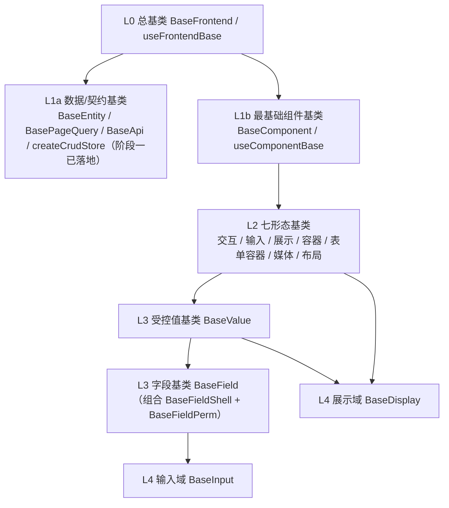

# 基础组件类需求

> BMS 基础管理系统 · 阶段三（前端组件库 / M3 组件库可用）· 需求域一：基础类体系 L0-L4（6 条）

[文档首页](../../../文档首页.md) › [前端组件库总览](00_需求_前端组件库.md) › 基础组件类　|　[← 00 总览](00_需求_前端组件库.md)　[02 布局组件类 →](02_需求_布局组件类.md)

## 1. 域说明 

本域对应阶段三「基础组件类」（WBS 01，组件设计 02 基础组件类 L0-L4），是全组件库的根：所有基类收敛为一套分层体系，**公共字段/方法只在对应层基类维护，任何组件与模块不得重复实现**。以 **L0 总基类**为根，按继承链**一层一层**组织，共 6 条需求：

| 层 | 需求 | 基类 | 继承关系 | 本阶段口径 |
| --- | --- | --- | --- | --- |
| L0 | `01-1` | `BaseFrontend` / `useFrontendBase` | 一切基类之根（无父层） | **落地** |
| L1a | —（复用） | `BaseEntity` / `BasePageQuery` / `BaseApi` / `createCrudStore` / `stableStringify` | → L0 | 阶段一已落地，**复用不重复建设** |
| L1b | `01-2` | `BaseComponent` / `useComponentBase` | → L0 | **落地** |
| L2 | `01-3` | 七形态基类 | → L1b | **落地** |
| L3 | `01-4` | `BaseValue` / `useValueBase` | → L2 输入 / 展示 | **落地** |
| L3 | `01-5` | `BaseField`（组合 `BaseFieldShell` + `BaseFieldPerm`） | → `BaseValue` | **落地** |
| L4 | `01-6` | `BaseInput`（输入域）/ `BaseDisplay`（展示域） | `BaseInput` → `BaseField`；`BaseDisplay` 组合 `BaseDisplayControl` + `BaseValue` | **落地** |

**命名规则（强制）**：基类一律 `Base` 打头（`BaseFrontend` / `BaseComponent` / `BaseInputControl` / `BaseValue` / `BaseField` / `BaseInput` / `BaseDisplay`）；非 `Base` 打头为具体组件（命名自由，如 `UserForm` / `DeptTree`）；组合式统一 `useXxxBase` / `useXxx`。详见《[命名规范](../../../规范/命名规范.md)》「前端命名」节。

**依赖方向（强制）**：只准上层依赖下层，禁止反向依赖（L4 不得依赖具体组件，L0 不得依赖任何上层）；Vue 3 无类多继承，统一以**组合式函数 + 组件包装**模拟继承，一个组件可组合多个基类。

**依据**：《项目规划说明》「前端页面清单与菜单机制」节、《前端开发规范》「前端基础类体系（L0-L4，强制）」节、《架构设计 · 前端组件体系》「基础类分层体系」节、《组件设计》02 基础组件类各节点。

**目标**：L0-L4 按层落地于 `frontend/src/components/base/<layer>/`，继承链与依赖方向符合规范；L1a 数据/契约基类复用阶段一成果不重复建设。

## 2. 需求 01-1：L0 总基类 BaseFrontend 

优先级：2（高）　|　状态：未开始　|　完成日期：—

**继承关系**：`BaseFrontend` / `useFrontendBase`（无父层）——一切前端基类之根；`数据/契约基类 → L0`、`UI 组件基类 → L0`。

**背景与动机**：组件库承载上百个组件与海量字段，若每个组件各写一套命名空间、日志、错误上报、配置读取、i18n、生命周期钩子，行为会发散。必须先把「所有基类之根」立起来，后续基类才有统一的继承起点。

**内容**（《前端开发规范》「前端基础类体系」节、《组件设计》02 类 L0 节点）：

1. L0 `BaseFrontend` + `useFrontendBase`：通用字段（命名空间、版本/标识）与通用方法（日志、错误上报、配置/环境读取、i18n 取词、生命周期钩子）
2. 约束：不含 UI 或业务语义，L0 只放「所有基类共有」的横切能力；数据/UI 任一方的特有逻辑不得上提 L0

**完成标准**：`BaseFrontend` / `useFrontendBase` 可被 L1a / L1b 继承；通用字段与通用方法契约可用；Vitest 覆盖基类契约关键项；`vue-tsc`、ESLint、Vitest 全通过。

**参考文档**：《前端开发规范》「前端基础类体系（L0-L4，强制）」节、《组件设计》02 基础组件类 L0 节点（含可交互原型）、《架构设计 · 前端组件体系》「基础类分层体系」节

## 3. 需求 01-2：L1b 最基础组件基类 BaseComponent 

优先级：2（高）　|　状态：未开始　|　完成日期：—

**继承关系**：`BaseComponent` / `useComponentBase` → `BaseFrontend`（L0）；所有 UI 组件基类的父层。

**背景与动机**：所有 UI 组件都要处理 attrs 透传、尺寸/密度/主题、i18n、可访问性、loading/disabled/显隐；若每个组件各写一套，改一处要改上百处。

**内容**（《前端开发规范》「前端基础类体系」节、《组件设计》02 类 L1b 节点）：

1. L1b `BaseComponent` + `useComponentBase`：attrs 透传（`id`/`class`/`style`/`data-*`）与根元素约定、尺寸 `size`/密度 `density`/主题令牌消费、i18n 取词与样式命名空间/前缀、可访问性（aria）与 ref/expose、通用 `loading`/`disabled`/显隐
2. 代码落地：`src/components/base/L1b/`

**完成标准**：`BaseComponent` / `useComponentBase` 可被 L2 七形态基类继承；透传、尺寸/密度令牌、loading/disabled 契约可用；Vitest 覆盖基类契约关键项；`vue-tsc`、ESLint、Vitest 全通过。

**参考文档**：《前端开发规范》「前端基础类体系（L0-L4，强制）」节、《组件设计》02 基础组件类 L1b 节点（含可交互原型）、《架构设计 · 前端组件体系》「基础类分层体系」节

## 4. 需求 01-3：L2 七形态基类 

优先级：2（高）　|　状态：未开始　|　完成日期：—

**继承关系**：七形态基类 → `BaseComponent`（L1b）。

**背景与动机**：交互 / 输入 / 展示 / 容器 / 表单容器 / 媒体 / 布局七种形态各有公共语义；不先立，同类组件会各自实现形态逻辑。

**内容**（《前端开发规范》「前端基础类体系」节、《组件设计》02 类 L2 节点）：

1. 交互 `BaseInteractive`（可点击/loading/disabled/焦点语义）
2. 输入 `BaseInputControl`（值绑定、前后缀插槽、清空、只读）
3. 展示 `BaseDisplayControl`（密度/令牌/空值/省略）
4. 容器 `BaseContainer`（插槽/折叠/分栏/区域）
5. 表单容器 `BaseFormContainer`（表单/分区/校验汇总）
6. 媒体 `BaseMedia`（图片/音视频/文件预览）
7. 布局 `BaseLayout`（栅格/断点、间距/对齐令牌、布局根元素与透传、显隐）
8. 代码落地：`src/components/base/L2/`

**完成标准**：七形态基类均按层落地且可被具体组件继承；各形态公共语义（值绑定/密度令牌/插槽/校验汇总等）正确；Vitest 覆盖七形态各自的公共语义；`vue-tsc`、ESLint、Vitest 全通过。

**参考文档**：《前端开发规范》「前端基础类体系（L0-L4，强制）」节、《组件设计》02 基础组件类 L2 节点（含可交互原型）、《架构设计 · 前端组件体系》「基础类分层体系」节

## 5. 需求 01-4：L3 受控值基类 BaseValue 

优先级：2（高）　|　状态：未开始　|　完成日期：—

**继承关系**：`BaseValue` / `useValueBase` → L2 输入 / 展示形态基类（承前启后）。

**背景与动机**：输入与展示共用「值语义」（受控 `modelValue`、三态、格式化调度、`change` 上报）；不统一，输入与展示各写一套值处理。

**内容**（《前端开发规范》「前端基础类体系」节、《组件设计》02 类 L3 节点）：

1. L3 `BaseValue` + `useValueBase`：值归一、格式化调度、三态、`change` 上报

**完成标准**：`BaseValue` / `useValueBase` 可被 `BaseField` 与展示域组合复用；值归一 / 格式化调度 / 三态 / `change` 契约可用；Vitest 覆盖受控值契约；`vue-tsc`、ESLint、Vitest 全通过。

**参考文档**：《前端开发规范》「前端基础类体系（L0-L4，强制）」节、《组件设计》02 基础组件类 L3 受控值节点（含可交互原型）

## 6. 需求 01-5：L3 字段基类 BaseField 

优先级：2（高）　|　状态：未开始　|　完成日期：—

**继承关系**：`BaseField` → `BaseValue`（L3）；**组合** `BaseFieldShell`（字段壳）+ `BaseFieldPerm`（字段权限）。

**背景与动机**：字段控件是组件库用量最大的一类，字段语义（字段上下文、字段权限、校验触发、`fieldKey`）与字段壳（label/必填/错误/栅格跨度/只读回显）若不在基类统一，字段将各写一套校验与权限判定，权限与校验会失控。

**内容**（《前端开发规范》「前端基础类体系」节、《组件设计》02 类 L3 节点）：

1. L3 `BaseField` + `useFieldMeta`：字段上下文（字段壳）、字段权限、校验触发、`fieldKey`
2. 组合 `BaseFieldShell`（label/必填/帮助/错误/栅格跨度/只读回显）与 `BaseFieldPerm`（`visible`/`editable`/`required`/脱敏，`useFieldPerm` / `v-plain`）

**完成标准**：`BaseField` 可被 `BaseInput`（L4）继承；`v-plain`/`useFieldPerm` 的 `visible`/`editable`/`required`/脱敏契约可用；字段壳装配（label/必填/错误/栅格）生效；Vitest 覆盖字段权限契约；`vue-tsc`、ESLint、Vitest 全通过。

**参考文档**：《前端开发规范》「前端基础类体系（L0-L4，强制）」节、《组件设计》02 基础组件类 L3 字段节点（含可交互原型）

## 7. 需求 01-6：L4 域基类 BaseInput / BaseDisplay 

优先级：2（高）　|　状态：未开始　|　完成日期：—

**继承关系**：`BaseInput`（输入域）→ `BaseField`（L3）；`BaseDisplay`（展示域）组合 `BaseDisplayControl`（L2）+ `BaseValue`（L3）。字段控件统一继承链：`具体控件 → BaseInput(L4) → BaseField(L3) → BaseValue(L3) → BaseInputControl(L2) → BaseComponent(L1b) → BaseFrontend(L0)`。

**背景与动机**：输入域与展示域是字段控件 / 展示类的最终细化层；不先立，字段类与展示类各做一套受控与格式化。

**内容**（《前端开发规范》「前端基础类体系」节、《组件设计》02 类 L4 节点）：

1. L4 `BaseInput`（输入域）：受控、三态、`disabled` 合并、校验触发、字段上下文，被基础控件类继承
2. L4 `BaseDisplay`（展示域）：值格式化、空值占位、密度，展示类与字段只读回显继承
3. 只读态不做两套组件，统一以 `disabled` 或纯文本回显

**完成标准**：`BaseInput` 可被基础控件类 / 字段类继承、`BaseDisplay` 可被展示类与字段只读回显继承；受控 / 格式化 / 只读回显契约可用；Vitest 覆盖域基类契约；`vue-tsc`、ESLint、Vitest 全通过。

**参考文档**：《前端开发规范》「前端基础类体系（L0-L4，强制）」节、《组件设计》02 基础组件类 L4 节点（含可交互原型）、《组件设计 · 总览》「通用设计约定」节

> 本文档依《文档生成规范》编写
