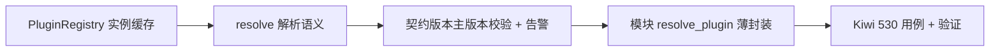

# 解析器与契约版本实施记录

> 后端插件化 · 01 插件化基座 · 01 中间层与注册表 · 01-1-1 解析器与契约版本 · 实施记录

[文档首页](../../../../../../../文档首页.md) › [01-1-1 解析器与契约版本](../01_插件化基座_01_中间层与注册表_01_解析器与契约版本.md) › 01 实施　|　[← 父任务](../01_插件化基座_01_中间层与注册表_01_解析器与契约版本.md)

## 1. 实施信息 <a id="meta"></a>

| 项 | 值 |
| --- | --- |
| 任务 | [01-1-1 解析器与契约版本](../01_插件化基座_01_中间层与注册表_01_解析器与契约版本.md) |
| 对应需求 | [01-1](../../../../../需求/01_需求_插件化基座.md#r01-1) |
| 详细设计 | [01_详细设计_01_解析器与契约版本](../设计/01_详细设计_01_解析器与契约版本.md) |
| 实施日期 | 2026-09-15 |
| 实施人 | minjian |
| 实施环境 | 开发机（Ubuntu，Python 3.14.4 / uv 0.12.7） |
| 提交 | `98ac0c3`（feat(core)：插件解析器 resolve_plugin） |
| 结论 | 完成 |

## 2. 实施概览 <a id="overview"></a>



结果小结：`resolve` / `resolve_plugin` 落地——provider 归一（`None` / 空串 → `null`）、`(plugin_key, 实现名)` 查找与实例缓存（同 provider 复用唯一实例、`build` 重建清缓存）、未注册即拒、契约版本主版本兼容校验（显式期望版本，不匹配告警 + `PluginError`）；`app/core/plugin.py` 覆盖率 100%，全量 `pytest` / `ruff` / `pyright` 全绿；应用行为不变（装配接线归 02 任务）。

## 3. 实施过程 <a id="process"></a>

1. **缓存结构**：`PluginRegistry.__init__` 增 `_instances`（键 `(plugin_key, 实现名)`）；`build()` 冻结快照后清空缓存（防陈旧）。
2. **解析**：`resolve(plugin_key, provider=None, *, expected_version=None)`——快照查找（未命中报键名与已注册实现名）、实例化（类 / 零参工厂）、缓存、版本校验（失败不缓存）；只实例化与缓存，不调用 `setup()` / `aclose()`。
3. **版本校验**：模块私有 `_contract_major` / `_ensure_contract_compatible`——期望与实现均为 `X.Y.Z`、主版本一致即兼容；不匹配 `get_logger("bms").error("插件契约版本不兼容", …)` + `PluginError`；结构化实现缺失 `contract_version` 且传期望版本即拒。
4. **入口**：模块级 `resolve_plugin` 薄封装（默认注册表）；`__all__` 与模块说明同步。
5. **测试**：Kiwi 先登记（**530**，平台自增顺延），后写 `backend/tests/core/test_plugin_resolve.py`（11 条用例、`@pytest.mark.kiwi_id(530)`；含日志告警断言）。
6. **验证**：命令与结果见[测试记录](../测试/01_测试_01_解析器与契约版本.md)；`app/core/plugin.py` 覆盖率 100%。

关键命令：

```bash
uv run pytest tests/core/test_plugin_resolve.py -q
uv run pytest --cov=app --cov-branch --cov-report=term-missing -q
uv run ruff check .
uv run ruff format --check .
uv run pyright
```

## 4. 问题与处置 <a id="issues"></a>

| 问题 / 现象 | 原因 | 处置与落点 |
| --- | --- | --- |
| 覆盖率首轮 99%（实现版本格式非法的分支未覆盖） | 构建期已校验候选类版本格式，该分支仅经工厂实例（构建期不经校验）可达 | 增补用例「实现版本格式非法（工厂实例）解析期即拒」；`app/core/plugin.py` 回到 100% |
| 告警日志断言需 structlog 渲染生效 | 日志基座为 stdout 输出 | 用例内 `configure_logging(Settings())` + `capsys`（沿用日志体系用例口径） |

## 5. 验证结果 <a id="verify"></a>

| 完成标准 | 验证方法 | 实测结果 |
| --- | --- | --- |
| 未配置回退 `null` | 缺省回退用例（`None` / 空串同实例） | 通过 |
| 同 provider 同实例（缓存） | 唯一实例 / 工厂仅一次 / 重建清缓存用例 | 通过 |
| 未注册抛错 | 未注册用例（消息含键名与已注册实现名） | 通过 |
| 契约版本主版本校验（不匹配拒启并告警） | 兼容 / 不匹配 / 缺失属性 / 双方格式非法用例 + 日志断言 | 通过 |
| `pytest` / `ruff` / `pyright` 全绿 | 验证命令（见测试记录） | 442 passed / 7 skipped；All checks passed；0 errors |
| 注册表与解析语义纳入契约测试（与 03-1 一致） | 快照 + resolve 接口可复用 | 已就位（03-1 复用） |

## 6. 偏差与遗留 <a id="deviations"></a>

- **偏差**：设计测试表列 10 条用例，实施增补 1 条（实现版本格式非法，工厂实例路径），共 11 条（同一 Kiwi 530）。
- **遗留归口**：提供者 `get_xxx` 改造与装配预热 → 域二 02-2 / 02；启动 / CI 离线校验 → 01-2-1；清单接口 → 03；契约测试基座 → 域三 03-1。

> 本文档依《文档生成规范》编写
