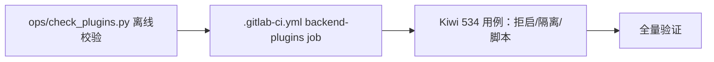

# 启动校验与 CI 离线校验实施记录

> 后端插件化 · 01 插件化基座 · 02 配置分区与启动装配 · 01-2-1 启动校验与 CI 离线校验 · 实施记录

[文档首页](../../../../../../../文档首页.md) › [01-2-1 启动校验与 CI 离线校验](../01_插件化基座_02_配置分区与启动装配_01_启动校验与CI离线校验.md) › 01 实施　|　[← 父任务](../01_插件化基座_02_配置分区与启动装配_01_启动校验与CI离线校验.md)

## 1. 实施信息 <a id="meta"></a>

| 项 | 值 |
| --- | --- |
| 任务 | [01-2-1 启动校验与 CI 离线校验](../01_插件化基座_02_配置分区与启动装配_01_启动校验与CI离线校验.md) |
| 对应需求 | [01-2](../../../../../需求/01_需求_插件化基座.md#r01-2) |
| 详细设计 | [01_详细设计_01_启动校验与CI离线校验](../设计/01_详细设计_01_启动校验与CI离线校验.md) |
| 实施日期 | 2026-09-15 |
| 实施人 | minjian |
| 实施环境 | 开发机（Ubuntu，Python 3.14.4 / uv 0.12.7） |
| 提交 | `5d80dc3`（feat(core)：01-2-1 启动校验与 CI 离线校验） |
| 结论 | 完成 |

## 2. 实施概览 <a id="overview"></a>



结果小结：`backend/ops/check_plugins.py` 复用装配清单 + 注册表语义离线校验（provider 引用存在性 / 重名 / 版本格式），退出码口径与 `check_modules` 同构；CI 冒烟层新增独立 job `backend-plugins`；启动拒启三径（非法 provider / 契约版本不符 / 依赖不可用）与依赖隔离（未选中工厂不被调用）用例化；全量 `pytest` / `ruff` / `pyright` 全绿。

## 3. 实施过程 <a id="process"></a>

1. **离线校验脚本**：`ops/check_plugins.py`——`load_settings()` → `register_platform_plugins` → `build_plugin_registry()` → 逐清单项校验 `(plugin_key, provider)` 引用存在性；失败打印明细退出码 1。
2. **CI 接入**：`.gitlab-ci.yml` 新增 `backend-plugins` job（stage lint，与 `backend-modules` 同构、并行，`uv run python -m ops.check_plugins`）。
3. **用例**：Kiwi 534 登记 → `tests/crosscut/test_plugin_validation.py`（7 条）：非法 provider / 版本不符 / setup 失败 / 工厂导入失败拒启；探针模块依赖隔离；CI 脚本子进程（合法 0 / 非法 1）。
4. **验证**：全量 464 passed / 7 skipped；`assembly.py` / `plugin.py` 覆盖率 100%；脚本手工运行退出码 0（35 项）。

关键命令：

```bash
uv run pytest tests/crosscut/test_plugin_validation.py -q
uv run python -m ops.check_plugins
uv run pytest --cov=app --cov-branch -q
```

## 4. 问题与处置 <a id="issues"></a>

| 问题 / 现象 | 原因 | 处置与落点 |
| --- | --- | --- |
| 脚本用例在进程内运行会撞「注册表已构建只读」 | 装配登记幂等按注册表对象；进程内重复登记被拒 | 脚本用例统一走**子进程**（`python -m ops.check_plugins`，注册表 / 配置全新），与 CI 执行同构 |
| 非法配置注入口径 | 需在脚本加载配置前生效 | 用 `BMS_STORAGE__PROVIDER` 环境变量覆盖（子进程 env），不污染进程内配置 |

## 5. 验证结果 <a id="verify"></a>

| 完成标准 | 验证方法 | 实测结果 |
| --- | --- | --- |
| 非法 provider / 重名 / 契约版本不符启动被拒（退出码非 0、错误可读） | lifespan 拒启用例（消息断言） | 通过 |
| CI 离线校验能拦截非法配置且随冒烟层执行 | 子进程用例（合法 0 / 非法 1）+ job 定义核对 | 通过 |
| 未选中实现不被导入（依赖隔离可证） | 探针模块 + `sys.modules` 断言 | 通过 |
| `pytest` / `ruff` / `pyright` 全绿 | 验证命令 | 464 passed / 7 skipped；All checks passed；0 errors |

## 6. 偏差与遗留 <a id="deviations"></a>

- 真实实现的服务可达性探活（MinIO / SMTP 等）属实现自身 `setup()` 职责，随 04-1 / 对应阶段实测。
- CI 首次运行验证随下次 `backend/**` 流水线观察（job 与既有 lint 层同构，无新增变量）。

> 本文档依《文档生成规范》编写
