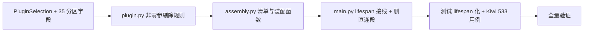

# 配置分区与启动装配实施记录

> 后端插件化 · 01 插件化基座 · 02 配置分区与启动装配 · 实施记录

[文档首页](../../../../../../文档首页.md) › [02 配置分区与启动装配](../01_插件化基座_02_配置分区与启动装配.md) › 01 实施　|　[← 父任务](../01_插件化基座_02_配置分区与启动装配.md)

## 1. 实施信息 <a id="meta"></a>

| 项 | 值 |
| --- | --- |
| 任务 | [02 配置分区与启动装配](../01_插件化基座_02_配置分区与启动装配.md) |
| 对应需求 | [01-2](../../../../需求/01_需求_插件化基座.md#r01-2) |
| 详细设计 | [01_详细设计_01_配置分区与启动装配](../设计/01_详细设计_01_配置分区与启动装配.md) |
| 实施日期 | 2026-09-15 |
| 实施人 | minjian |
| 实施环境 | 开发机（Ubuntu，Python 3.14.4 / uv 0.12.7） |
| 提交 | `5d80dc3`（feat(core)：01_02 配置分区与 lifespan 装配） |
| 结论 | 完成（含嵌套 01-2-1） |

## 2. 实施概览 <a id="overview"></a>



结果小结：`config.toml` / `Settings` 具备 35 个能力选择分区（`provider` / `options`，空串 → null）；新增 `app/core/assembly.py`（`PluginWiring` 清单 35 项 + `register_platform_plugins` + `assemble_plugins`）；`main.py` lifespan 严格装配（解析缓存 → `setup()` → `ResourceManager` → `app.state` → 启动日志），删除 33 项直连 `NullXxx()` 段；登记规则补「构造需参数不自动登记」，`masking:null` 走显式工厂注入权限检查器；33 个测试文件 40 处用例 lifespan 化；全量 `pytest` / `ruff` / `pyright` 全绿。

## 3. 实施过程 <a id="process"></a>

1. **登记规则**：`core/plugin.py` 构建期候选新增「非零参剔除」（`inspect.signature` 含无默认值参数 → 不自动登记，需显式工厂）。
2. **配置模型**：`core/config.py` 增 `PluginSelection`（provider / options）+ 35 个能力选择字段（分区名 = plugin_key，`object_storage` 别名 `storage`）；`config.toml` 增 `[storage]` 示例（密钥不入配置）。
3. **装配模块**：`core/assembly.py` 落 `PluginWiring` / `PLUGIN_WIRINGS`（35 项）/ `register_platform_plugins`（导入 33 个 `null.py` + 登记 `masking` 工厂；按注册表引用幂等）/ `assemble_plugins`（解析 → setup → 资源登记 → `app.state` → `插件装配完成` 日志）。
4. **接线**：`main.py` lifespan 调 `register_platform_plugins` → `build_plugin_registry` → `assemble_plugins`；删除 33 项直连段（健康检查 / 引擎 / 模块注册 / demo 保留）；`plugin.py` 增 `default_plugin_registry()` 访问器供装配幂等。
5. **测试 lifespan 化**：codemod 将 29 个文件 30 处 `create_app()` 用例包入 `async with lifespan(app):`；`conftest.client` 夹具同步（30+ 用例零语义改动）；`test_request_logging._records` 容错非 JSON 行（装配日志形态差异）。
6. **验证**：`Kiwi 533` 登记 → 新增 `tests/crosscut/test_plugin_assembly.py`（默认装配 / 配置切换 / 工厂注入 / 生命周期 / 日志）；全量 464 passed / 7 skipped；`plugin.py` / `assembly.py` 覆盖率 100%。
7. **回写**：01-1 设计 §5.1 登记规则补「非零参剔除」、02-1 设计口径注记（`masking` 工厂登记）；01_02 设计补「缺省实现导入」与幂等口径。

关键命令：

```bash
uv run pytest --cov=app --cov-branch -q
uv run ruff check . && uv run ruff format --check . && uv run pyright
```

## 4. 问题与处置 <a id="issues"></a>

| 问题 / 现象 | 原因 | 处置与落点 |
| --- | --- | --- |
| lifespan 装配首轮报「未注册的 permission 实现：null」 | `main.py` 不再导入缺省实现，`null.py` 未导入 → 候选为空 | `register_platform_plugins` 显式导入 33 个 `null.py`（导入即自动登记）；装配日志与设计同步 |
| 隔离注册表用例随机失败（版本校验被「未注册 masking」替代） | 幂等记账用 `id(registry)`，对象回收后 `id` 复用 | 改为持注册表引用列表比对（`_PREPARED_REGISTRIES`） |
| `NullMasker` 零参实例化失败 | 构造需注入 `checker` | 登记规则非零参剔除 + 装配清单显式工厂（注入解析后的权限检查器） |
| lifespan 化后请求日志用例 JSON 解析失败 | 装配启动日志在用例重配 JSON 渲染前输出（console 形态） | `_records` 只解析 `{` 开头行；断言按事件过滤 |

## 5. 验证结果 <a id="verify"></a>

| 完成标准 | 验证方法 | 实测结果 |
| --- | --- | --- |
| 切换 provider 后装配随实现生效且消费方零改动 | 配置切换用例（隔离注册表 + 自定义 Settings）+ 既有 provider 用例回归 | 通过 |
| 未配置能力维持 `null` | 默认装配用例（`app.state` 逐项 `NullXxx`） | 通过 |
| 启动日志可核对且不含密钥 | 日志用例（`插件装配完成` 含 provider；`options` 值不出现） | 通过 |
| 延迟导入（未选中实现不进启动路径） | 01-2-1 依赖隔离用例 | 通过（见 01-2-1 测试记录） |
| `pytest` / `ruff` / `pyright` 全绿 | 验证命令 | 464 passed / 7 skipped；All checks passed；0 errors |

## 6. 偏差与遗留 <a id="deviations"></a>

- **偏差**：设计测试表列 6 类用例，实施落 5 条（配置切换与缓存复合并入同一用例；装配错误路径归 01-2-1 用例）；`data_scope` / `sharding` 仅预热（无 `app.state` 落点，设计已注记 `state_attr=None`）。
- **遗留归口**：35 个 `get_xxx` 提供者改经 `resolve_plugin` → 02-2；平台内建实现（`storage/local.py` / `storage/minio.py`）经 `register_platform_plugins` 工厂登记 → 04-1；插件清单接口 → 03。

> 本文档依《文档生成规范》编写
