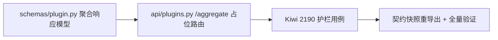

# 跨服务插件聚合视图实施记录

> 后端插件化 · 01 插件化基座 · 03 插件清单接口 · 01-3-1 跨服务插件聚合视图 · 实施记录

[文档首页](../../../../../../../文档首页.md) › [01-3-1 跨服务插件聚合视图](../01_插件化基座_03_插件清单接口_01_跨服务插件聚合视图.md) › 01 实施　|　[← 父任务](../01_插件化基座_03_插件清单接口_01_跨服务插件聚合视图.md)

## 1. 实施信息 <a id="meta"></a>

| 项 | 值 |
| --- | --- |
| 任务 | [01-3-1 跨服务插件聚合视图](../01_插件化基座_03_插件清单接口_01_跨服务插件聚合视图.md) |
| 对应需求 | [01-4](../../../../../需求/01_需求_插件化基座.md#r01-4) |
| 详细设计 | [01_详细设计_01_跨服务插件聚合视图](../设计/01_详细设计_01_跨服务插件聚合视图.md) |
| 实施日期 | 2026-09-26 |
| 实施人 | minjian |
| 实施环境 | 开发机（Ubuntu，Python 3.14.4 / uv 0.12.7） |
| 提交 | `docs(插件化)` 详细设计；`feat(api)` 占位端点与用例 |
| 结论 | 完成（触发前接口占位；Kiwi 2190） |

## 2. 实施概览 <a id="overview"></a>



结果小结：`GET /api/v1/plugins/aggregate` 占位端点就位，固定返回 `{"placeholder": true, "services": []}`（不读注册表、不读 `options`、不发起服务调用）；响应契约按服务嵌套冻结（`PluginAggregateResponse` / `PluginAggregateServiceResponse`）；公开契约快照纳入新端点。

## 3. 实施过程 <a id="process"></a>

1. **响应模型**：`libs/bms_core/src/bms_core/schemas/plugin.py` 新增 `PluginAggregateServiceResponse`（`service_key` / `service_title` / `status: Literal["ok","unreachable"]` / `groups: list[PluginGroupResponse]`）与 `PluginAggregateResponse`（`placeholder` / `services`）。
2. **占位路由**：`services/platform/src/bms_platform/api/plugins.py` 新增 `@router.get("/aggregate")`，**注册顺序先于 `/{plugin_key}`**（避免被明细动态路由吞掉）；恒定返回固定空聚合。
3. **用例**：先登记 Kiwi（分类「平台骨架」/ `P2` / `CONFIRMED` / 标签「自动化」）→ 回读编号 **2190** → `services/platform/tests/api/test_plugins.py` 追加 4 条护栏用例并回填 `@pytest.mark.kiwi_id(2190)`。
4. **契约快照**：`uv run python -m ops.contract_snapshot export` 重导出 `deploy/contracts/platform.json`；新增端点为兼容变更，**baseline 不更新**。
5. **验证**：全量 `pytest` 1349 passed / 37 skipped；`ruff` / `ruff format --check` / `pyright` 全绿；契约快照 `check` 零漂移（9 服务一致）。

关键命令：

```bash
uv run python -m ops.contract_snapshot export
uv run python -m ops.contract_snapshot check
uv run pytest -q
uv run ruff check . && uv run ruff format --check . && uv run pyright
```

## 4. 问题与处置 <a id="issues"></a>

| 问题 / 现象 | 原因 | 处置与落点 |
| --- | --- | --- |
| 全量测试 3 项失败（M2 / M3 阶段收口护栏 Kiwi 663 / 664 / 2188） | 最近提交 `b13b3e85`（补登 01-3-1）与 `91250f5f`（前端网关接入遗留立项 04-4 / 04-5）改了阶段计划头与需求总览，但未同步更新收口护栏的固定断言 | 经用户确认（范围外）一并修复：护栏改「头部计数与已完成 / 剩余表行数一致、剩余项为触发式 / 重开子任务、工时已完成 + 剩余 = 阶段合计」结构自洽断言（同一 Kiwi 编号，用例语义「计划收口状态」不变） |
| M3 剩余排期片段误含 §3.1 台账大表 | 切分终止符取 `## 4.`，而 §3.1 在其之前 | 切分终止符改 `### 3.1`（仅取 §3 本体） |

## 5. 验证结果 <a id="verify"></a>

| 完成标准（占位口径） | 验证方法 | 实测结果 |
| --- | --- | --- |
| 聚合端点就位且契约形状冻结 | 占位固定返回用例 + OpenAPI 路径断言 | 通过 |
| 未被明细路由吞掉 | 同路径命中聚合端点（非 404） | 通过 |
| 不含密钥 / 敏感 options | 密钥用例（`top-secret` / `secret_key` 不出现） | 通过 |
| 只读 | `POST` / `PUT` / `DELETE` → 405 | 通过 |
| 契约快照纳入新端点 | `contract_snapshot export` + `check` 零漂移 | 通过（9 服务一致） |
| `pytest` / `ruff` / `pyright` 全绿 | 验证命令 | 1349 passed / 37 skipped；0 errors |

## 6. 偏差与遗留 <a id="deviations"></a>

- **偏差**：无（占位口径与详细设计一致）。
- **遗留归口**：
  - 真实取数（经 `service_client` 调用各服务 `GET /api/v1/plugins`）、单服务降级、`platform:manage` 鉴权、`by-capability` 矩阵轴 → **触发时实现**（触发条件：多服务出现按服务差异化的插件配置，或运营需要统一查看面）。
  - 契约 baseline 未更新（新增端点属兼容变更，符合《契约门禁与契约测试使用说明》「当前值与基线不混同」口径）。
  - 连带修复 M2 / M3 收口护栏（范围外，用户确认）：属对最近两次提交遗留的维护性修正，已随本次验证全绿。

> 本文档依《文档生成规范》编写
