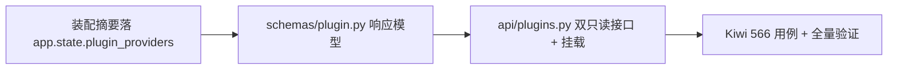

# 插件清单接口实施记录

> 后端插件化 · 01 插件化基座 · 03 插件清单接口 · 实施记录

[文档首页](../../../../../../文档首页.md) › [03 插件清单接口](../01_插件化基座_03_插件清单接口.md) › 01 实施　|　[← 父任务](../01_插件化基座_03_插件清单接口.md)

## 1. 实施信息 <a id="meta"></a>

| 项 | 值 |
| --- | --- |
| 任务 | [03 插件清单接口](../01_插件化基座_03_插件清单接口.md) |
| 对应需求 | [01-3](../../../../需求/01_需求_插件化基座.md#r01-3) |
| 详细设计 | [01_详细设计_01_插件清单接口](../设计/01_详细设计_01_插件清单接口.md) |
| 实施日期 | 2026-09-15 |
| 实施人 | minjian |
| 实施环境 | 开发机（Ubuntu，Python 3.14.4 / uv 0.12.7） |
| 提交 | `1c8c817`（设计）、清单接口代码提交（feat(api)：01_03 插件清单接口） |
| 结论 | 完成（Kiwi 566） |

## 2. 实施概览 <a id="overview"></a>



结果小结：`GET /api/v1/plugins`（按能力分组：`plugin_key` / `provider` / 实现列表含 `plugin_name` / `contract_version` / `status`）与 `GET /api/v1/plugins/{plugin_key}`（明细）落地；数据源为装配摘要 + 注册表快照（不实例化、不读 `options`）；未登记能力 404（10002）；只读无写接口。

## 3. 实施过程 <a id="process"></a>

1. **装配摘要**：`assemble_plugins` 追加 `app.state.plugin_providers = providers`（与启动日志同源）。
2. **响应模型**：`app/schemas/plugin.py` 落 `PluginImplementationResponse`（`plugin_name` / `contract_version` / `status: Literal["active","registered"]`）与 `PluginGroupResponse`（`plugin_key` / `provider` / `implementations`）。
3. **接口**：`app/api/plugins.py`——列表按 `PLUGIN_WIRINGS` 的 `plugin_key` 升序分组组装（实现按 `plugin_name` 升序）；类实现读类 `contract_version`、工厂 / 结构化实现报端口版本；明细未登记 → `NotFoundError`；路由挂 `api_router`。
4. **用例**：Kiwi 566 登记 → `tests/api/test_plugins.py`（列表契约 / 明细 / 404 / 不含密钥 / 只读 405）。
5. **验证**：全量 474 passed / 7 skipped；`api/plugins.py` / `schemas/plugin.py` 覆盖率 100%；ruff / pyright 全绿。

关键命令：

```bash
uv run pytest tests/api/test_plugins.py -q
uv run pytest --cov=app --cov-branch -q
uv run ruff check . && uv run ruff format --check . && uv run pyright
```

## 4. 问题与处置 <a id="issues"></a>

| 问题 / 现象 | 原因 | 处置与落点 |
| --- | --- | --- |
| 测试对 `resp.json()` 取值触发 pyright unknown 告警 | `json()` 返回 `Any` | 显式 `cast` 分组 / 实现列表类型（测试内） |

## 5. 验证结果 <a id="verify"></a>

| 完成标准 | 验证方法 | 实测结果 |
| --- | --- | --- |
| 双接口可查且字段与架构一致 | 列表 / 明细用例（36 组、`storage` 与 `health_check_registry` 抽样） | 通过 |
| 不含密钥 / 敏感 options | 密钥用例（`top-secret` / `secret_key` 不出现） | 通过 |
| 未登记能力 404 与统一响应体一致 | 404 用例（code 10002） | 通过 |
| `pytest` / `ruff` / `pyright` 全绿 | 验证命令 | 474 passed / 7 skipped；All checks passed；0 errors |

## 6. 偏差与遗留 <a id="deviations"></a>

- **偏差**：无（Kiwi 566 与设计口径一致）。
- **遗留归口**：`platform:manage` 鉴权随认证 / RBAC 阶段接入；启停 / 热切换属演进路线（不提供写接口）；平台内建存储实现落地后清单自动呈现（04-1）。

> 本文档依《文档生成规范》编写
