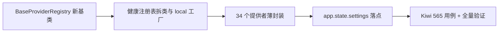

# 提供者改经 resolve_plugin 实施记录

> 后端插件化 · 02 能力域改造 · 02 提供者改经 resolve_plugin · 实施记录

[文档首页](../../../../../../文档首页.md) › [02 提供者改经 resolve_plugin](../02_能力域改造_02_提供者改经resolve_plugin.md) › 01 实施　|　[← 父任务](../02_能力域改造_02_提供者改经resolve_plugin.md)

## 1. 实施信息 <a id="meta"></a>

| 项 | 值 |
| --- | --- |
| 任务 | [02 提供者改经 resolve_plugin](../02_能力域改造_02_提供者改经resolve_plugin.md) |
| 对应需求 | [02-2](../../../../需求/02_需求_能力域改造.md#r02-2) |
| 详细设计 | [01_详细设计_01_提供者改经resolve_plugin](../设计/01_详细设计_01_提供者改经resolve_plugin.md) |
| 实施日期 | 2026-09-15 |
| 实施人 | minjian |
| 实施环境 | 开发机（Ubuntu，Python 3.14.4 / uv 0.12.7） |
| 提交 | `3b4e4b4`（feat(core)：02-2 提供者改经 resolve_plugin） |
| 结论 | 完成（Kiwi 平台编号 565） |

## 2. 实施概览 <a id="overview"></a>



结果小结：34 个提供者（32 同步 + `get_masker` 异步生成器 + 健康注册表）统一薄封装——settings 取 `app.state.settings`、经 `resolve_plugin`（含 `expected_version` 主版本复核）；新增中间层基类 `BaseProviderRegistry[ItemT]`（`app/core/registry.py`）；健康注册表拆类（`local` 真实实现经装配工厂注入超时 / 检查项 / 资源；`null` 缺省保留）并接入 `/readyz`；提供者直连 `app.state` 路径清零（护栏用例）。

## 3. 实施过程 <a id="process"></a>

1. **新基类**：`core/registry.py` 落 `BaseProviderRegistry[ItemT]`（`register` 唯一性拒重 `ConflictError` / `get` 未命中 `None` / `keys` / `values` 保序；`_provider_key` 钩子供各域），供域三 03-3 复用。
2. **健康域重构**：`BaseHealthCheckRegistry` 继承新基类（`checks()` 接 `values()`；`aggregate` 模板保留）；`HealthCheckRegistry`（真实实现）复用基类存储、实现名 `local`；`NullHealthCheckRegistry` 语义不变；`assembly.py` 登记 `health_check_registry:local` 工厂（超时取 `[health]`、注入 `redis` / `database` 检查项并登记资源）；`config.toml [health_check_registry] provider = "local"`；`main.py` 删除手工健康构造、增 `app.state.settings`。
3. **提供者薄封装**：codemod 改写 33 个同步提供者 + `get_masker`（保留异步生成器与 `current_masker` 上下文写入 / 复位）；导入补齐（`Settings` / `resolve_plugin`），`ruff` 归一。
4. **CI 校验同步**：`ops/check_plugins.py` 改以 `create_app()` 提供离线 app / resources，供依赖注入型工厂登记；清单核验 36 项通过。
5. **测试适配**：`test_health` 的 fake 注册表改经隔离注册表 + 配置注入（provider=test）；masking / permission 的最小应用同法注入；既有 provider 回归全绿。
6. **用例**：Kiwi 先登记（平台实际编号 **565**，自增序列被 CI 导入用例推进）→ `tests/crosscut/test_plugin_providers.py`（5 条）。

关键命令：

```bash
uv run pytest --cov=app --cov-branch -q
uv run ruff check . && uv run ruff format --check . && uv run pyright
uv run python -m ops.check_plugins
```

## 4. 问题与处置 <a id="issues"></a>

| 问题 / 现象 | 原因 | 处置与落点 |
| --- | --- | --- |
| `(health_check_registry, null)` 重名构建失败 | 基类重构后 `BaseHealthCheckRegistry` 无抽象方法 → 端口被当作可实例化实现登记 | 端口保持抽象：`_provider_key` 留在实现层（真实 / Null 各自实现），端口不实现 |
| `NullHealthCheckRegistry.register` 覆盖告警 | 参数名与基类不一致（`check` vs `provider`） | 统一为 `provider`（公开调用均为位置参数） |
| 最小应用测试（masking / permission / health）注入失效 | 提供者不再读 `app.state.<能力属性>` | 测试改经「隔离注册表 + `app.state.settings` 配置 provider」注入；`test_health` 的 fake 注册表经 provider=test 解析 |
| 隔离注册表缺其余能力导致 lifespan 装配失败（顺序相关） | 类创建期收集语义 + null 模块已导入 | fake 注入助手先全量导入并收集应用候选，再登记测试实现 |
| 提供者护栏误报 `app.state.settings` | 直读检查范围过宽 | 护栏排除 `app.state.settings`（仅拦能力属性直读） |

## 5. 验证结果 <a id="verify"></a>

| 完成标准 | 验证方法 | 实测结果 |
| --- | --- | --- |
| 切换 provider 后消费方零改动 | 配置切换用例（既有路由 + 自定义 Settings） | 通过 |
| 34 个提供者全部经 `resolve_plugin` | 直连残留护栏用例（≥34 个扫描 + 无能力属性直读） | 通过 |
| 无绕过注册表的直连实现 | 护栏用例 + `check_plugins` 36 项通过 | 通过 |
| 健康注册表插件化且 `/readyz` 真实探针保留 | 健康插件化用例（`local` 实例、redis/database 键、null 登记） | 通过 |
| `pytest` / `ruff` / `pyright` 全绿 | 验证命令 | 469 passed / 7 skipped；All checks passed；0 errors |

## 6. 偏差与遗留 <a id="deviations"></a>

- **偏差**：Kiwi 编号设计预期 535、平台实际登记 **565**（自增序列被 CI 导入用例推进；设计对齐记录与用例已同步）；需求「35 个提供者」实测为 34 个（33 插件 + 1 健康；`data_scope` / `sharding` 无提供者，健康已纳入改造）——口径差已在设计对齐记录登记。
- **遗留归口**：其余 3 个域注册表改继承 `BaseProviderRegistry` → 域三 03-3；`BaseProvider`（注册项契约）→ 03-2；平台内建存储实现（`local` / `minio`）→ 04-1；`get_masker` 真实实现随 RBAC 阶段。

> 本文档依《文档生成规范》编写
