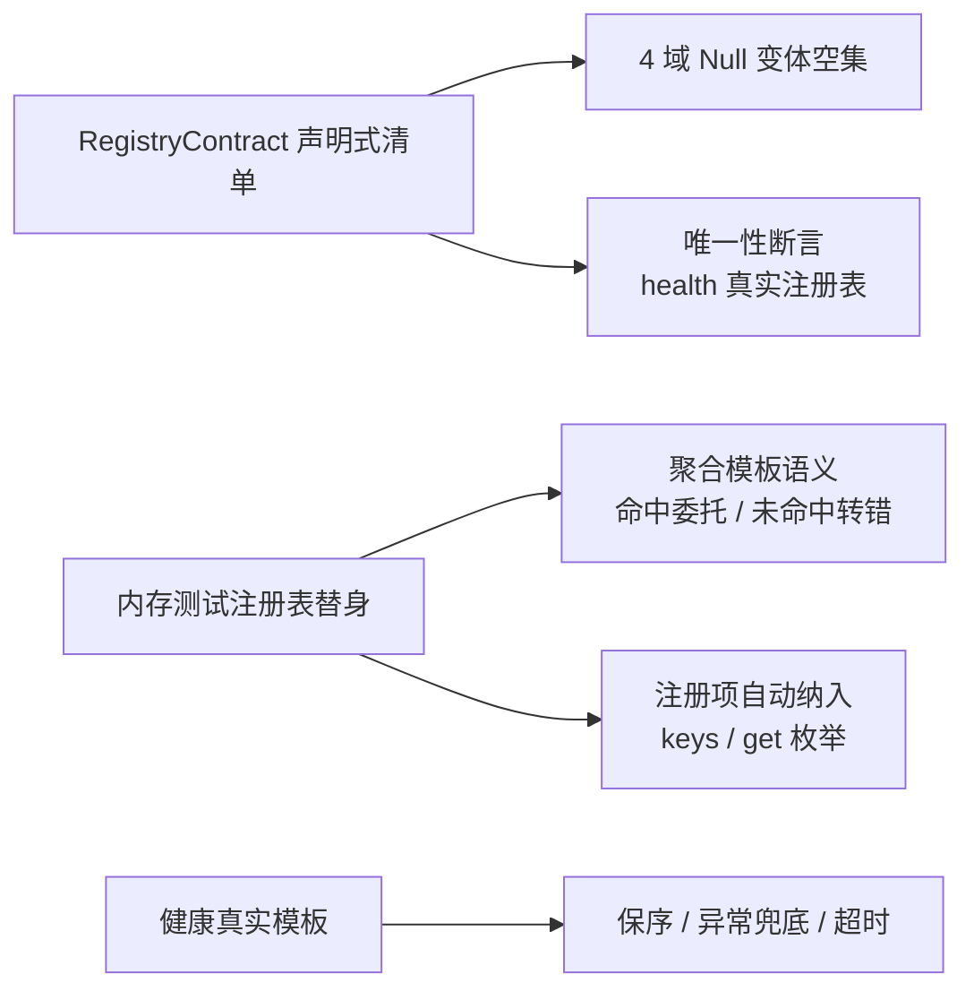

# 域注册表与实现覆盖实施记录

> 后端插件化 · 03 契约与收敛提取 · 01 契约测试基座 · 03-1-1 域注册表与实现覆盖 · 实施记录

[文档首页](../../../../../../../文档首页.md) › [03-1-1 域注册表与实现覆盖](../03_契约与收敛提取_01_契约测试基座_01_域注册表与实现覆盖.md) › 01 实施　|　[← 父任务](../03_契约与收敛提取_01_契约测试基座_01_域注册表与实现覆盖.md)

## 1. 实施信息 <a id="meta"></a>

| 项 | 值 |
| --- | --- |
| 任务 | [03-1-1 域注册表与实现覆盖](../03_契约与收敛提取_01_契约测试基座_01_域注册表与实现覆盖.md) |
| 对应需求 | [03-1](../../../../../需求/03_需求_契约与收敛提取.md#r03-1) |
| 详细设计 | [01_详细设计_01_域注册表与实现覆盖](../设计/01_详细设计_01_域注册表与实现覆盖.md) |
| 实施日期 | 2026-09-15 |
| 实施人 | minjian |
| 实施环境 | 开发机（Ubuntu，Python 3.14.4 / uv 0.12.7） |
| 提交 | `f30d128`（feat(test)：03-1 契约测试基座，含本嵌套交付） |
| 结论 | 完成（Kiwi 568） |

## 2. 实施概览 <a id="overview"></a>



结果小结：域侧 18 条用例落 `test_domain_registry_contracts.py`（Kiwi 568）——4 域 `Null` 变体空集语义、字段类型 / 查询 / 卡片三域聚合模板未命中转 `NotFoundError`、健康聚合模板（保序 / 异常类名 / 超时）、`Null` 无副作用、测试注册项与健康 `local` 注册项枚举；`RegistryContract` 清单为 03-3 唯一性翻转留声明式开关。

## 3. 实施过程 <a id="process"></a>

1. **契约清单**：`support.py` 落 `RegistryContract`（`suite_name` / `registry_factory` / `uniqueness`）与 `REGISTRY_CONTRACTS`；`health` 指向真实 `HealthCheckRegistry`（唯一性已随 02-2 收敛），其余 3 域 `uniqueness=False`（`Null` no-op，待 03-3 翻转）。
2. **空集变体**：参数化 4 域 `Null` 注册表——`keys() == ()`、`get("missing") is None`。
3. **Null 语义**：字段类型恒过 / 固定 `NULL_COLUMN_TYPE`；查询恒空结果；卡片元数据 / 取数空映射；健康登记 no-op + 空集聚合就绪（不探依赖）。
4. **聚合模板**：内存测试注册表替身登记 1 项后——命中委托、未命中转 `NotFoundError`（三域三处消息）；健康模板用测试检查项断言保序收集、异常类名兜底与单项超时。
5. **自动纳入**：`keys()` / `get()` 枚举断言（登记后即出现）；健康 `local` 经 `resolve_plugin` 解析后枚举 `redis` / `database`（不执行真实探活）。
6. **验证**：域用例 + 全量套件 + `ruff` / `pyright` 全绿。

关键命令：

```bash
uv run pytest tests/contracts/test_domain_registry_contracts.py -q
uv run pytest --cov=app --cov-branch -q
uv run ruff check . && uv run ruff format --check . && uv run pyright
```

## 4. 问题与处置 <a id="issues"></a>

| 问题 / 现象 | 原因 | 处置与落点 |
| --- | --- | --- |
| 唯一性断言未触发（`DID NOT RAISE`） | `health` 契约初版指向 `Null` 注册表（no-op 正确） | 契约工厂改真实 `HealthCheckRegistry`；`Null` 语义由独立用例覆盖 |
| `pyright` 变体探测面类型不定 | `registry_factory` 返回 `object` | `support.py` 增 `EmptyRegistryProbe` 协议，用例 `cast` 后断言 |
| `ruff` 导入排序 | 新增 `REGISTRY_CONTRACTS` 导入位置 | `ruff check --fix` 归一 |

## 5. 验证结果 <a id="verify"></a>

| 完成标准 | 验证方法 | 实测结果 |
| --- | --- | --- |
| 域注册表全部实现被套件覆盖 | 变体参数化（4 域）+ 健康双变体 | 通过 |
| 聚合模板语义断言通过 | 按域断言（命中 / 未命中 / 空集 / 超时） | 通过 |
| 注册项自动纳入 | 替身登记后枚举断言 + 健康 `local` 枚举 | 通过（`redis` / `database`） |
| `pytest` / `ruff` / `pyright` 全绿 | 验证命令 | 域用例通过；531 passed / 7 skipped；All checks passed；0 errors |

## 6. 偏差与遗留 <a id="deviations"></a>

- **偏差**：替身与 `RegistryContract` 清单落 `support.py`（设计初稿写 `conftest.py`）；空集聚合语义以逐域显式用例断言（未用 callable 字段）——已回写设计对齐记录 #5。
- **遗留归口**：3 域唯一性开关翻转 → 03-3（改 `uniqueness=True` 即可，不改套件结构）。

> 本文档依《文档生成规范》编写
