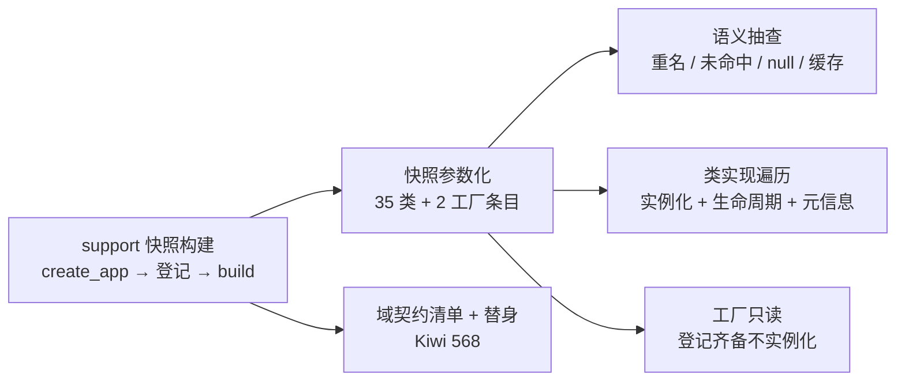

# 契约测试基座实施记录

> 后端插件化 · 03 契约与收敛提取 · 01 契约测试基座 · 实施记录

[文档首页](../../../../../../文档首页.md) › [01 契约测试基座](../03_契约与收敛提取_01_契约测试基座.md) › 01 实施　|　[← 父任务](../03_契约与收敛提取_01_契约测试基座.md)

## 1. 实施信息 <a id="meta"></a>

| 项 | 值 |
| --- | --- |
| 任务 | [01 契约测试基座](../03_契约与收敛提取_01_契约测试基座.md) |
| 对应需求 | [03-1](../../../../需求/03_需求_契约与收敛提取.md#r03-1) |
| 详细设计 | [01_详细设计_01_契约测试基座](../设计/01_详细设计_01_契约测试基座.md) |
| 实施日期 | 2026-09-15 |
| 实施人 | minjian |
| 实施环境 | 开发机（Ubuntu，Python 3.14.4 / uv 0.12.7） |
| 提交 | `f30d128`（feat(test)：03-1 契约测试基座） |
| 结论 | 完成（Kiwi 567 / 568） |

## 2. 实施概览 <a id="overview"></a>



结果小结：新增 `backend/tests/contracts/`（`support.py` + `conftest.py` + 两个用例文件，21 个测试函数 / 57 个参数化条目）——以**装配快照自动枚举**统一校验插件注册表语义与全部注册实现（35 类实例化断生命周期、2 工厂只读），并以声明式 `RegistryContract` 清单 + 测试替身覆盖 4 域注册表变体、聚合模板与注册项纳入链路。

## 3. 实施过程 <a id="process"></a>

1. **快照支撑**：`tests/contracts/support.py` 落 `build_snapshot()`——`create_app` → `register_platform_plugins` → `build_plugin_registry`（离线，不进入 lifespan、不实例化工厂）；`conftest.py` 会话级 fixture 幂等兜底单文件运行。
2. **快照参数化**：模块导入期由快照派生 `_CASES`（36 键 / 37 项）并按类 / 工厂分流，参数 id 为 `plugin_key:plugin_name`；条目数与被测参数数由结构用例互证（新增实现登记即被遍历）。
3. **语义抽查**（不与既有单测重复）：隔离注册表（`monkeypatch` 重定向 `_DEFAULT_REGISTRY`）验证重名构建拒 / 未注册解析拒 / 空 provider → `null` / 同 provider 同实例。
4. **类实现遍历**：35 个 `Null` 类零参实例化 + `setup`×2 + `aclose`×2 + `describe` 含键名 + 版本 `X.Y.Z` + `null` 继承 `BaseNullObject`。
5. **工厂只读**：`health_check_registry:local` / `masking:null` 两项登记齐备且端口存在；不实例化（不拖入未选中实现依赖）。
6. **域侧覆盖（嵌套 03-1-1）**：`RegistryContract` 声明式清单（`uniqueness`：health=True，其余 3 域待 03-3 翻转）；4 域 Null 变体空集、聚合模板（未命中转 `NotFoundError` / 空集就绪 / 保序 + 异常兜底 + 超时）、Null 无副作用、注册项自动纳入与健康 `local` 枚举。
7. **Kiwi 先行**：平台登记 Kiwi **567** / **568**（自增顺延，与设计预期一致）后编码。

关键命令：

```bash
uv run pytest tests/contracts -q
uv run pytest --cov=app --cov-branch -q
uv run ruff check . && uv run ruff format --check . && uv run pyright
uv run python -m ops.check_plugins
```

## 4. 问题与处置 <a id="issues"></a>

| 问题 / 现象 | 原因 | 处置与落点 |
| --- | --- | --- |
| `masking:null` 条目未命中断言（工厂非类） | 该条目为工厂（`NullMasker` 需注入 checker，不自动登记） | 完整性用例把 `null` 继承断言限定**类实现**（设计 §4.2 同步回写） |
| 语义抽查的测试类污染默认注册表（后置 rebuild 重名风险） | 类创建期自动登记语义 | `monkeypatch` 重定向 `_DEFAULT_REGISTRY` 到隔离实例后定义测试类 |
| 健康唯一性断言初版指向 `Null` 注册表不拒重 | `Null` 登记为 no-op 属正确语义 | `RegistryContract.health` 改指向真实 `HealthCheckRegistry` 构造 |

## 5. 验证结果 <a id="verify"></a>

| 完成标准 | 验证方法 | 实测结果 |
| --- | --- | --- |
| 契约套件可运行并遍历全部注册实现 | `uv run pytest tests/contracts -q` | 57 passed（35 类参数 + 2 工厂条目 + 语义 / 域用例） |
| 新增实现自动纳入 | 快照派生参数化 + 域契约清单 | 机制就位；对象存储双实现随 04-1 登记后自动纳入（04-2 证据） |
| `Null` 实现纳入 | 参数化覆盖 35 个 `null` 类 + 4 域 `Null` 注册表 | 通过 |
| 全量 `pytest` / `ruff` / `pyright` 全绿 | 验证命令 | 531 passed / 7 skipped；All checks passed；0 errors |
| 插件清单不受影响 | `uv run python -m ops.check_plugins` | 校验通过（36 项） |

## 6. 偏差与遗留 <a id="deviations"></a>

- **偏差**：快照承载由设计初稿的 `conftest.py` 拆为 `support.py`（可导入，供收集期参数化）+ `conftest.py`（仅会话级 fixture）；空集聚合语义以逐域显式用例断言——均已回写设计对齐记录（03-1 #6 / 03-1-1 #5）。
- **遗留归口**：3 域注册表唯一性开关翻转 → 03-3；对象存储双实现纳入断言 → 04-1；健康真实探针连通（redis / database）→ 阶段八 / 运维。
- 本记录文档与任务 / 需求 / 计划状态回写同批提交（docs）。

> 本文档依《文档生成规范》编写
