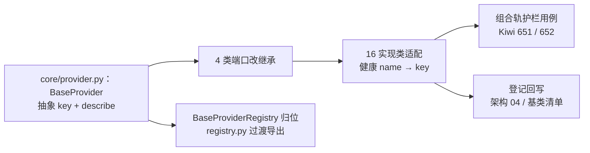

# BaseProvider 提取实施记录

> 后端插件化 · 03 契约与收敛提取 · 02 BaseProvider 提取 · 实施记录

[文档首页](../../../../../../文档首页.md) › [02 BaseProvider 提取](../03_契约与收敛提取_02_BaseProvider提取.md) › 01 实施　|　[← 父任务](../03_契约与收敛提取_02_BaseProvider提取.md)

## 1. 实施信息 <a id="meta"></a>

| 项 | 值 |
| --- | --- |
| 任务 | [02 BaseProvider 提取](../03_契约与收敛提取_02_BaseProvider提取.md) |
| 对应需求 | [03-2](../../../../需求/03_需求_契约与收敛提取.md#r03-2) |
| 详细设计 | [01_详细设计_01_BaseProvider提取](../设计/01_详细设计_01_BaseProvider提取.md) |
| 实施日期 | 2026-09-15 |
| 实施人 | minjian |
| 实施环境 | 开发机（Ubuntu，Python 3.14.4 / uv 0.12.7） |
| 提交 | `da700b8`（feat(core)：03-2 BaseProvider 提取） |
| 结论 | 完成（Kiwi 651 / 652） |

## 2. 实施概览 <a id="overview"></a>



结果小结：新增 `app/core/provider.py`（`BaseProvider` + `BaseProviderRegistry` 归位）；4 类提供者端口统一继承 `BaseProvider`（组合轨，非 `BasePluggable`）；健康键口径 `name` → 抽象 `key` + `name` 兼容别名；16 个实现类（app 3 + 测试替身 13）显式提供 `key` / `describe`；新增组合轨边界护栏用例。

## 3. 实施过程 <a id="process"></a>

1. **契约与归位**：`core/provider.py` 落 `BaseProvider(BaseCapability, ABC)`（抽象 `key` + 抽象 `describe`）；`BaseProviderRegistry[ItemT]` 自 `core/registry.py` 移入（`_provider_key` 注释统一取 `provider.key`）；`registry.py` 缩为过渡导出（`__all__` 不变）。
2. **4 类端口**：`BaseFieldType` / `BaseQueryProvider` / `BaseDashboardCardProvider` 改继承 `BaseProvider`（抽象 `key` 上收）；`BaseHealthCheck` 抽象 `name` → 抽象 `key` + 具体 `name` 别名（`/readyz` 与 `DEPENDENCIES` 口径不变）。
3. **实现类适配（16 个）**：app 侧 `NullQueryProvider`（补 `describe`）、`RedisHealthCheck` / `DatabaseHealthCheck`（`name` → `key` + `describe`，`check()` 返回 `name=self.key`）；测试侧 13 个替身同步（健康类 `name` → `key`，全部补 `describe`）。
4. **注册表键钩子**：健康 `HealthCheckRegistry` / `NullHealthCheckRegistry` 的 `_provider_key` 切 `provider.key`（`name` 别名继续服务响应口径）。
5. **组合轨护栏**：新增 `tests/crosscut/test_provider_contracts.py`（Kiwi 651 / 652）——4 端口 `issubclass(BaseProvider)` 且非 `BasePluggable`；实现类 `key` / `describe` 齐备且描述含键名；健康 `name == key`；插件快照与提供者实现类互斥。
6. **Kiwi 先行**：平台登记 Kiwi **651 / 652**（自增序列被 CI 导入用例推进，以实际为准）后编码。
7. **登记回写**：架构 04（交付表 / 继承链 / 候选表）与《后端基类清单》（中间层表 / 候选表 / 继承链 / 阶段三备注）同步。

关键命令：

```bash
uv run pytest --cov=app --cov-branch -q
uv run ruff check . && uv run ruff format --check . && uv run pyright
uv run python -m ops.check_plugins
```

## 4. 问题与处置 <a id="issues"></a>

| 问题 / 现象 | 原因 | 处置与落点 |
| --- | --- | --- |
| `pyright`：`key` 覆写 `BaseCapability.key` 类属性告警 | 抽象 property 覆写类变量（口径有意） | 按仓库先例加 `# pyright: ignore[reportIncompatibleVariableOverride]` |
| 健康实现类与新抽象不符（仍为 `name`） | 抽象改 `key`、`name` 别名 | `RedisHealthCheck` / `DatabaseHealthCheck` 与 9 个测试替身切 `key`，响应 `HealthCheckResult.name` 取 `self.key` |
| `describe` 强约束使无描述实现类不可实例化 | 抽象强约束（已确认口径） | 16 个实现类显式补齐（文案统一短句）；后续新增提供者按登记规范执行 |

## 5. 验证结果 <a id="verify"></a>

| 完成标准 | 验证方法 | 实测结果 |
| --- | --- | --- |
| 4 类提供者统一继承 `BaseProvider` | 护栏用例（Kiwi 651）+ 类型检查 | 通过 |
| 既有注册表与契约套件（03-1）不破 | `uv run pytest -q` | 533 passed / 7 skipped（契约套件 57 条仍全绿） |
| 组合轨边界（不入继承自动登记） | 护栏用例（Kiwi 652） | 通过（非 `BasePluggable`；快照与提供者互斥） |
| 插件清单不受影响 | `uv run python -m ops.check_plugins` | 校验通过（36 项） |
| `ruff` / `pyright` 全绿 | 验证命令 | All checks passed；0 errors |

## 6. 偏差与遗留 <a id="deviations"></a>

- **偏差**：Kiwi 实际编号 **651 / 652**（自增序列被 CI 导入用例大幅推进；设计预期表已回填实际值）。
- **遗留归口**：其余 3 域注册表 `_provider_key` 与唯一性断言开关随 03-3；`registry.py` 过渡导出清理随后续阶段（无外部引用后）。
- 本记录文档与任务 / 需求 / 计划状态回写同批提交（docs）。

> 本文档依《文档生成规范》编写
