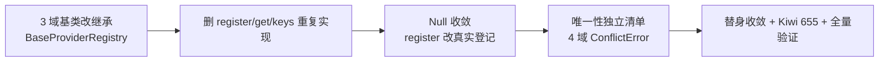

# BaseProviderRegistry 收敛实施记录

> 后端插件化 · 03 契约与收敛提取 · 03 BaseProviderRegistry 收敛 · 实施记录

[文档首页](../../../../../../文档首页.md) › [03 BaseProviderRegistry 收敛](../03_契约与收敛提取_03_BaseProviderRegistry收敛.md) › 01 实施　|　[← 父任务](../03_契约与收敛提取_03_BaseProviderRegistry收敛.md)

## 1. 实施信息 <a id="meta"></a>

| 项 | 值 |
| --- | --- |
| 任务 | [03 BaseProviderRegistry 收敛](../03_契约与收敛提取_03_BaseProviderRegistry收敛.md) |
| 对应需求 | [03-3](../../../../需求/03_需求_契约与收敛提取.md#r03-3) |
| 详细设计 | [01_详细设计_01_BaseProviderRegistry收敛](../设计/01_详细设计_01_BaseProviderRegistry收敛.md) |
| 实施日期 | 2026-09-15 |
| 实施人 | minjian |
| 实施环境 | 开发机（Ubuntu，Python 3.14.4 / uv 0.12.7） |
| 提交 | `efa0275`（feat(core)：03-3 BaseProviderRegistry 收敛） |
| 结论 | 完成（Kiwi 655） |

## 2. 实施概览 <a id="overview"></a>



结果小结：字段类型 / 查询 / 仪表盘卡片 3 域注册表基类改继承 `BaseProviderRegistry[ItemT]`（`register` 唯一性拒重 / `get` 未命中 `None` / `keys` / `values` 公共实现），删除约 300 行重复实现；3 域 `Null` 注册表**登记改真实**（可解析 / 可枚举，重名 `ConflictError`），聚合模板语义不变；契约套件唯一性断言改为**4 域独立清单**（Kiwi 655）。

## 3. 实施过程 <a id="process"></a>

1. **3 域基类**：`BaseFieldTypeRegistry` / `BaseQueryProviderRegistry` / `BaseDashboardCardRegistry` 改继承 `BaseProviderRegistry[...]`（`app/core/provider.py`），删除自声明的抽象 `register` / `get` / `keys`；聚合模板（`validate` / `column_type` / `query` / `metadata` / `fetch`）保留并改走继承的 `get`。
2. **抽象性保持**：`_provider_key` 抽象由中间层承载、域基类不实现 → 基类不可实例化，不会误登记进插件注册表（口径同健康域）。
3. **Null 收敛**：3 域 `Null` 删 `register` / `get` / `keys` 覆写，实现 `_provider_key`（取 `provider.key`）→ 登记真实、重名拒重；聚合模板（恒过 / 固定映射 / 空结果 / 空卡片）不变；健康 `Null` 维持 no-op（范围外）。
4. **契约套件**：`RegistryContract` 去 `uniqueness` 开关；新增 `UNIQUENESS_REGISTRIES` 独立清单（4 域：3 域 `Null` + 健康真实注册表）→ 同键二次登记 `ConflictError`；新增 `test_null_registry_registers_really`。
5. **测试替身收敛**：3 域测试 `_InMemoryRegistry` 与 contracts `Memory*` 删除存储与三方法重复实现（改继承），聚合 / 未命中 / 枚举断言不变（语义等价）。
6. **Kiwi 先行**：平台登记 Kiwi **655** 后编码（自增序列被 CI 导入推进）。
7. **登记回写**：架构 04、基类清单（4 域全部收敛）；03-1-1 设计 / 记录回写（Null 语义与唯一性清单变更注记）。

关键命令：

```bash
uv run pytest --cov=app --cov-branch -q
uv run ruff check . && uv run ruff format --check . && uv run pyright
uv run python -m ops.check_plugins
```

## 4. 问题与处置 <a id="issues"></a>

| 问题 / 现象 | 原因 | 处置与落点 |
| --- | --- | --- |
| 3 条既有 Null 断言失败（`get` None / `keys` 空） | 登记口径由 no-op 改真实（已确认决策） | 三条用例改断言「登记后可解析 / 可枚举」+ 聚合模板不变 |
| 唯一性断言结构变动 | 原 `uniqueness` 开关与域语义耦合（用户选定独立清单） | `RegistryContract` 去开关，新增 `UNIQUENESS_REGISTRIES`（4 域） |
| `ruff` 导入排序 / 未用导入 | 替身收敛后导入变化 | `ruff check --fix` + `ruff format` 归一 |

## 5. 验证结果 <a id="verify"></a>

| 完成标准 | 验证方法 | 实测结果 |
| --- | --- | --- |
| 4 个域注册表收敛且行为不变 | 既有域用例 + 契约套件全绿（聚合模板不变） | 通过（537 passed / 7 skipped） |
| 插件注册表语义口径对齐 | 唯一性独立清单（4 域 `ConflictError`） | 通过 |
| `Null` 登记语义务实 | `test_null_registry_registers_really`（Kiwi 655） | 通过 |
| `ruff` / `pyright` 全绿 | 验证命令 | All checks passed；0 errors |
| 插件清单不受影响 | `uv run python -m ops.check_plugins` | 校验通过（36 项） |

## 6. 偏差与遗留 <a id="deviations"></a>

- **偏差**：Kiwi 实际编号 **655**（CI 导入推进自增）；3 域 `Null` 登记语义由 no-op 改真实（设计对齐记录 #1，03-1-1 设计 / 记录同步注记）。
- **遗留归口**：3 域真实注册实现与真实提供者随对应能力阶段；健康 `Null` 登记 no-op 口径维持（如需统一另行登记）。
- 本记录文档与任务 / 需求 / 计划状态回写同批提交（docs）。

> 本文档依《文档生成规范》编写
