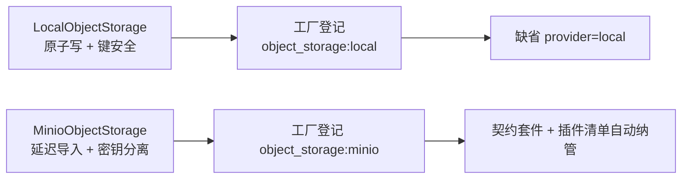

# 对象存储接入验证实施记录

> 后端插件化 · 04 首个能力与阶段验收 · 01 对象存储接入验证 · 实施记录

[文档首页](../../../../../../文档首页.md) › [01 对象存储接入验证](../04_首个能力与阶段验收_01_对象存储接入验证.md) › 01 实施　|　[← 父任务](../04_首个能力与阶段验收_01_对象存储接入验证.md)

## 1. 实施信息 <a id="meta"></a>

| 项 | 值 |
| --- | --- |
| 任务 | [01 对象存储接入验证](../04_首个能力与阶段验收_01_对象存储接入验证.md) |
| 对应需求 | [04-1](../../../../需求/04_需求_首个能力与阶段验收.md#r04-1) |
| 详细设计 | [01_详细设计_01_对象存储接入验证](../设计/01_详细设计_01_对象存储接入验证.md) |
| 实施日期 | 2026-09-15 |
| 实施人 | minjian |
| 实施环境 | 开发机（Ubuntu，Python 3.14.4 / uv 0.12.7） |
| 提交 | `3924884`（feat(storage)：04-1 对象存储双实现） |
| 结论 | 完成（Kiwi 661；嵌套 04-1-1 记 662） |

## 2. 实施概览 <a id="overview"></a>



结果小结：对象存储首个纵向能力落地——`local` 真实读写（`app/storage/local.py`）、`minio` 延迟导入实现（`app/storage/minio.py`，含 04-1-1）；双实现经装配工厂登记（`register_platform_plugins`）；`[storage] provider` 缺省改 `local`；契约套件与插件清单**零改动自动纳管**（快照条目 37 → 39）。

## 3. 实施过程 <a id="process"></a>

1. **local 实现**：键安全校验（空 / 绝对路径 / `..` 拒 `ValueError`）→ 根目录映射；写入「临时文件 + `os.replace`」原子写；阻塞 IO 统一 `asyncio.to_thread`；`get` 未命中 `NotFoundError`；`delete` 幂等；`presign` 返回 `file://` 绝对路径；根目录 `options.root` 缺省 `var/storage`（`__init__` 不建目录）。
2. **工厂登记**：`assembly.py` 增 `object_storage:local` / `object_storage:minio` 工厂（工厂内延迟导入实现模块；minio 另校验 SDK 依赖与端点 / 凭据，均 `PluginError` 可读），与健康注册表工厂同构。
3. **缺省切换**：`config.toml [storage] provider = "local"`；`[minio]` 注释（`bucket` 废弃）/ `[storage].options` 注释（root / bucket 口径）同步；影响面用例适配（默认装配 = `LocalObjectStorage`；清单缺省 `provider=local`）。
4. **minio 实现（04-1-1）**：顶层不导入 SDK；惰性客户端 + `asyncio.to_thread` 包装同步 SDK；`NoSuchKey → NotFoundError`、删除幂等、`presign` GET/PUT 分派；桶名 `options.bucket` 缺省 `STORAGE_BUCKET`；密钥仅环境变量注入。
5. **依赖组**：`pyproject.toml` 增可选组 `storage-minio = ["minio>=7.2"]`，dev 组引入供测试与本地开发（CI `uv sync --frozen` 覆盖；`uv.lock` 同步）。
6. **Kiwi 先行**：平台登记 Kiwi **661**（本任务）/ **662**（04-1-1）后编码。

关键命令：

```bash
uv run pytest --cov=app --cov-branch -q
uv run ruff check . && uv run ruff format --check . && uv run pyright
uv run python -m ops.check_plugins
```

## 4. 问题与处置 <a id="issues"></a>

| 问题 / 现象 | 原因 | 处置与落点 |
| --- | --- | --- |
| 既有用例断言缺省对象存储为 `null`（3 处） | 缺省切换为 `local`（已确认决策） | 断言改 `LocalObjectStorage` / 清单三项实现；显式 `provider=""` 用例不受影响 |
| 默认装配用例经默认注册表缓存工厂导致根目录不受 `monkeypatch` 控制 | `register_platform_plugins` 按注册表身份幂等（工厂捕获首次 settings） | 涉及自定义 settings 的用例改「隔离注册表 + 设置注入」（与 02-2 用例同法） |
| 探针用例写文件落入 `var/storage` | 缺省根目录相对运行目录 | 探针用例改注入 `tmp_path` 根目录；产物不入库（`var/` gitignore） |

## 5. 验证结果 <a id="verify"></a>

| 完成标准 | 验证方法 | 实测结果 |
| --- | --- | --- |
| `local` / `minio` 双实现就位且落点 `<domain>/<impl>.py` | 文件与导入断言 | 通过（`app/storage/local.py` / `minio.py`） |
| `local` 真实读写通过 | 本地文件系统用例（`tmp_path`） | 通过（含原子写 / 幂等 / 键安全 / presign） |
| `minio` 延迟导入与密钥分离可证 | `sys.modules` / 哨兵用例 / 工厂校验 | 通过（Kiwi 662） |
| 切换 provider 消费方零改动 | 切换用例（既有路由 + `resolve_plugin` 同实例） | 通过（Kiwi 661） |
| 双实现纳入契约套件与插件清单 | 快照 `object_storage` 三项 + 清单状态断言 | 通过（local active / minio / null registered） |
| `pytest` / `ruff` / `pyright` 全绿 | 验证命令 | 544 passed / 7 skipped；All checks passed；0 errors |

## 6. 偏差与遗留 <a id="deviations"></a>

- **偏差**：`[minio].bucket` 注记废弃（桶名统一 `[storage].options.bucket`，键位保留兼容环境变量覆盖）；Kiwi 实际 661 / 662（自增顺延）。
- **遗留归口**：MinIO 真实连通 E2E 与桶策略随阶段八文件管理；`[minio].bucket` 键位清理随后续版本。
- 本记录文档与任务 / 需求 / 计划状态回写同批提交（docs）。

> 本文档依《文档生成规范》编写
