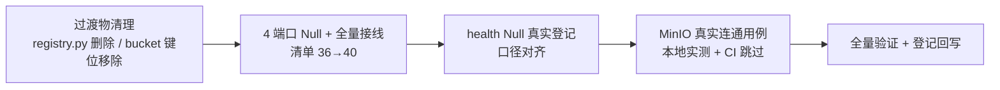

# 收口后遗留处理实施记录

> 后端插件化 · 05 收口后遗留处理 · 实施记录

[文档首页](../../../../../../文档首页.md) › [05 收口后遗留处理](../05_收口后遗留处理_01_遗留核销.md) › 01 实施　|　[← 父任务](../05_收口后遗留处理_01_遗留核销.md)

## 1. 实施信息 <a id="meta"></a>

| 项 | 值 |
| --- | --- |
| 任务 | [05 收口后遗留处理](../05_收口后遗留处理_01_遗留核销.md) |
| 对应需求 | [03-1](../../../../需求/03_需求_契约与收敛提取.md#r03-1) / [03-2](../../../../需求/03_需求_契约与收敛提取.md#r03-2) / [03-3](../../../../需求/03_需求_契约与收敛提取.md#r03-3) / [04-1](../../../../需求/04_需求_首个能力与阶段验收.md#r04-1)（遗留项核销） |
| 详细设计 | [01_详细设计_01_收口后遗留处理](../设计/01_详细设计_01_收口后遗留处理.md) |
| 实施日期 | 2026-09-15 |
| 实施人 | minjian |
| 实施环境 | 开发机（Ubuntu，Python 3.14.4 / uv 0.12.7）+ 开发服务器 `bms-minio` |
| 提交 | `cf92f5f`（feat(core)：05 收口后遗留处理） |
| 结论 | 完成（Kiwi 675 / 676 / 677 / 678） |

## 2. 实施概览 <a id="overview"></a>



结果小结：四项遗留全部核销——过渡物零残留；`cache` / `audit` / `task` / `event` 四能力补 `NullXxx` 并全量接线（插件清单 **40 项**、契约套件自动纳入）；health `Null` 登记口径与 3 域一致；MinIO 真实连通以集成用例在开发服务器实测通过（`put` / `get` / `exists` / `presign` / `delete`）。

## 3. 实施过程 <a id="process"></a>

1. **过渡物清理**：删除 `app/core/registry.py`（导入改 `app/core/provider.py`）；`MinioSettings.bucket` 字段与 `config.toml [minio].bucket` 移除（桶名唯一口径 `[storage].options.bucket`）。
2. **4 端口 Null**：新增 `NullCacheRegion` / `NullAuditCapturer` / `NullTask` / `NullEventPublisher`（组合轨自动登记；事件域仅发布轨，消费轨随后续）。
3. **全量接线**：`assembly.py` 增 4 条 `PluginWiring`（`cache` / `audit` / `task` / `event`）+ `_NULL_MODULES` 补 3 个模块；`Settings` 增 4 分区 + `config.toml` 4 节；各域 `get_xxx` 提供者薄封装 + `app/api/deps.py` 导出。
4. **health Null 对齐**：删除 `NullHealthCheckRegistry.register` no-op 覆写（继承真实登记），聚合覆写不变。
5. **MinIO 真实连通**：新增 env 门控集成用例（`BMS_TEST_MINIO_*`）；`tests/conftest.py` 配置隔离保留 `BMS_TEST_*` 前缀（既有 Redis / 真库集成用例同受益）；以服务器 `deploy/.env` 凭据本地实测通过；本地资源文档 MinIO 凭据已同步（不提交）。
6. **口径适配**：计数断言 36 → 40（清单）、38 → 42（Null 类）、端口 40 → 44；`ops/check_plugins` 校验 40 项通过。

关键命令：

```bash
uv run pytest -q && uv run ruff check . && uv run ruff format --check . && uv run pyright
uv run python -m ops.check_plugins
# MinIO 实测（凭据经 BMS_TEST_MINIO_* 注入，CI 无凭据自动跳过）
uv run pytest tests/integration/test_minio_integration.py -q
```

## 4. 问题与处置 <a id="issues"></a>

| 问题 / 现象 | 原因 | 处置与落点 |
| --- | --- | --- |
| 本地资源文档 MinIO 凭据实测不匹配（`SignatureDoesNotMatch`） | 文档密码与服务器 `deploy/.env` 不同步 | 从服务器实际配置同步本地资源文档（不落仓库）；实测通过 |
| 集成用例首跑被公共夹具清空环境变量而跳过 | `isolate_settings` 删除全部 `BMS_*` | 保留 `BMS_TEST_*` 前缀（测试专用变量，与应用配置隔离不冲突） |
| 桶不存在导致首跑失败 | 目标桶未初始化 | 集成用例幂等建桶（`BucketAlreadyOwnedByYou` 容忍） |
| 新增端口与 Null 引发计数断言失败（4 处） | 口径 36→40 / 38→42 / 40→44 | 同步更新断言与文档字符串（含 `_PORTS_WITHOUT_NULL` 清空） |

## 5. 验证结果 <a id="verify"></a>

| 完成标准 | 验证方法 | 实测结果 |
| --- | --- | --- |
| 过渡物零残留 | 清理核验用例（Kiwi 675）+ 全量回归 | 通过 |
| MinIO 连通实测通过 | 集成用例（Kiwi 676，本地带凭据执行） | 通过（CI 无凭据跳过） |
| 4 能力接线且清单 40 项 | 接线 / Null 语义用例（Kiwi 677）+ 清单断言 | 通过 |
| health Null 口径一致 | 对齐用例（Kiwi 678）+ 契约套件回归 | 通过 |
| 全量绿 | `pytest` / `ruff` / `pyright` / `check_plugins` | 555 passed / 8 skipped；0 errors；校验通过（40 项） |

## 6. 偏差与遗留 <a id="deviations"></a>

- **偏差**：`[minio].bucket` 与 `registry.py` 过渡物提前于「随后续版本」清理（本次核销，设计对齐记录已注）；集成用例环境变量口径定为 `BMS_TEST_MINIO_*`（测试专用，不写应用配置）。
- **遗留**：事件域消费轨 Null（`EventConsumer`）随后续；四能力真实实现随对应阶段；MinIO 端到端上传下载 / 桶策略随后续文件管理。
- 本记录文档与计划台账、架构 04 / 基类清单登记同批提交（docs）。

> 本文档依《文档生成规范》编写
