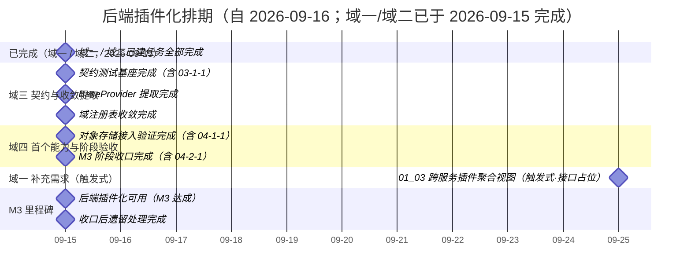

# 后端插件化计划

> BMS 基础管理系统 · 阶段三（后端插件化 / M3 后端插件化可用）排期计划：已完成 11 项，剩余 1 项（域一 03 追加嵌套 01-3-1 触发式；M3 已达成）

[文档首页](../../../文档首页.md) › 后端插件化计划　|　[任务基线 →](../任务/01_插件化基座/01_插件化基座.md)　[需求基线 →](../需求/00_需求_后端插件化.md)

## 1. 计划说明 

- **排期对象**：阶段三 12 条需求**已全部建任务基线**——域一 插件化基座（[01 插件化基座](../任务/01_插件化基座/01_插件化基座.md)，3 子任务含 3 嵌套 / 24h，**部分完成**：03 追加嵌套 01-3-1 跨服务插件聚合视图（触发式））、域二 能力域改造（[02 能力域改造](../任务/02_能力域改造/02_能力域改造.md)，3 子任务 / 18h，**已完成**）、域三 契约与收敛提取（[03 契约与收敛提取](../任务/03_契约与收敛提取/03_契约与收敛提取.md)，3 子任务含 1 嵌套 / 13h）、域四 首个能力与阶段验收（[04 首个能力与阶段验收](../任务/04_首个能力与阶段验收/04_首个能力与阶段验收.md)，2 子任务含 2 嵌套 / 10h）。
- **顺序口径（基座先行 + 改造面联动 + 收口）**：域三 03-1 ~ 03-3（均已完成）→ 域四 04-1 对象存储（已完成，双实现并入契约套件）→ 04-2 M3 收口（已完成）。
- **排期口径**：阶段三全部任务于 2026-09-15 实际完成（原排期 09-15 ~ 09-21，提前 6 天）；阶段三整体周期口径 2 周（[需求总览](../需求/00_需求_后端插件化.md#goal)）。
- **工时**：已完成 58h；剩余 11h；阶段合计 69h（域一 03 重开：自有 3h + 追加嵌套子任务 01-3-1 8h）。<!-- 2026-09-24 修正：头部原记 57h，未计入 05_01 收口后遗留处理（4h）；明细合计为 61h（S1 校验随 check-status 正则修正后生效，见阶段二 10_01 实施记录） -->
- **里程碑锚点**：M3 = **后端插件化可用**（《总体项目规划》「里程碑」节），门禁见第 5 节。
- **负责人**：minjian（兼职，单人）。

## 2. 已完成任务（2026-09-15） 

| 编号 | 任务 | 工时（重估） | 完成日期 | 任务文件 | 偏差与遗留 |
| --- | --- | --- | --- | --- | --- |
| 01_01 | 中间层与注册表 | 8h | 2026-09-15 | [01_01](../任务/01_插件化基座/01_插件化基座_01_中间层与注册表/01_插件化基座_01_中间层与注册表.md) | 无（机制提前于 2026-09-15 交付；嵌套 01-1-1 同日完成，Kiwi 529 / 530） |
| 02_01 | 能力域基类改继承 | 8h | 2026-09-15 | [02_01](../任务/02_能力域改造/02_能力域改造_01_能力域基类改继承/02_能力域改造_01_能力域基类改继承.md) | 偏差：4 端口暂无 `NullXxx` 缺省实现（回写设计注记）；Kiwi 531 |
| 02_03 | null.py 拆分迁移 | 4h | 2026-09-15 | [02_03](../任务/02_能力域改造/02_能力域改造_03_null.py拆分迁移/02_能力域改造_03_null.py拆分迁移.md) | 无（38 类迁 33 个 `null.py`；旧路径不留转发；Kiwi 532） |
| 01_02 | 配置分区与启动装配 | 5h | 2026-09-15 | [01_02](../任务/01_插件化基座/01_插件化基座_02_配置分区与启动装配/01_插件化基座_02_配置分区与启动装配.md) | 无（含嵌套 01-2-1 同日完成；严格 lifespan 装配 + CI 离线校验，Kiwi 533 / 534） |
| 02_02 | 提供者改经 resolve_plugin | 6h | 2026-09-15 | [02_02](../任务/02_能力域改造/02_能力域改造_02_提供者改经resolve_plugin/02_能力域改造_02_提供者改经resolve_plugin.md) | 偏差：Kiwi 实际 565（设计预期 535）；健康注册表插件化 + `BaseProviderRegistry` 提前提取 |
| 03_01 | 契约测试基座 | 5h | 2026-09-15 | [03_01](../任务/03_契约与收敛提取/03_契约与收敛提取_01_契约测试基座/03_契约与收敛提取_01_契约测试基座.md) | 无（**提前于排期 09-16~17** 交付；含嵌套 03-1-1 同日完成；快照遍历 35 类 + 2 工厂条目，Kiwi 567 / 568） |
| 03_02 | BaseProvider 提取 | 4h | 2026-09-15 | [03_02](../任务/03_契约与收敛提取/03_契约与收敛提取_02_BaseProvider提取/03_契约与收敛提取_02_BaseProvider提取.md) | 偏差：Kiwi 实际 651 / 652（CI 导入推进自增）；注册项契约 + 组合轨边界 + 健康键口径统一 |
| 03_03 | BaseProviderRegistry 收敛 | 4h | 2026-09-15 | [03_03](../任务/03_契约与收敛提取/03_契约与收敛提取_03_BaseProviderRegistry收敛/03_契约与收敛提取_03_BaseProviderRegistry收敛.md) | 偏差：Kiwi 实际 655；3 域注册表改继承 + `Null` 登记改真实 + 唯一性独立清单（4 域） |
| 04_01 | 对象存储接入验证 | 7h | 2026-09-15 | [04_01](../任务/04_首个能力与阶段验收/04_首个能力与阶段验收_01_对象存储接入验证/04_首个能力与阶段验收_01_对象存储接入验证.md) | 无（含嵌套 04-1-1 同日完成；`local` 真实读写 + `minio` 延迟导入，缺省 `provider=local`，Kiwi 661 / 662） |
| 04_02 | M3 阶段收口 | 3h | 2026-09-15 | [04_02](../任务/04_首个能力与阶段验收/04_首个能力与阶段验收_02_M3阶段收口/04_首个能力与阶段验收_02_M3阶段收口.md) | 无（含嵌套 04-2-1 同日完成；门禁 8/8 达标 + [阶段测试报告](../01_测试报告_后端插件化.md)归档，Kiwi 663 / 664） |
| 05_01 | 收口后遗留处理 | 4h | 2026-09-15 | [05_01](../任务/05_收口后遗留处理/05_收口后遗留处理.md) | 无（过渡物清理 + 4 端口 Null 与接线（清单 40 项）+ health Null 口径 + MinIO 真实连通实测；Kiwi 675 ~ 678） |

## 3. 剩余任务排期（自 2026-09-16） 

阶段三域一 ~ 域四与收口后遗留处理已于 2026-09-15 完成；域一补充需求 01-4（微服务适配，2026-09-25 立项）的嵌套子任务为触发式，排期如下：

| 编号 | 任务 | 工时 | 依赖 | 排期窗口 | 备注 | 偏差与遗留 |
| --- | --- | --- | --- | --- | --- | --- |
| 01_03 | 插件清单接口 | 11h | 01_01/01_02 | 搁置（触发时排期） | 已重开为部分完成，追加嵌套 01-3-1 跨服务插件聚合视图（需求 01-4） | 偏差：追加嵌套子任务重开（自有 3h + 子任务 8h）；遗留：01-3-1 触发式（触发条件见需求 01-4） |

阶段末测试报告见 [01_测试报告_后端插件化](../01_测试报告_后端插件化.md)。

### 3.1 偏差与遗留与后续阶段待办（域一 / 域二闭环台账） 

域一 / 域二 6 个任务已完成（2026-09-15）；同阶段内遗留已随后续任务闭环，未闭环项逐条登记去向（防遗漏）：

| # | 遗留项 | 归口 | 处理动作 |
| --- | --- | --- | --- |
| 1 | 契约测试基座（统一「注册表 + 全部注册实现」套件） | [03_01 契约测试基座（含 03-1-1）](../任务/03_契约与收敛提取/03_契约与收敛提取_01_契约测试基座/03_契约与收敛提取_01_契约测试基座.md) | **已闭环（2026-09-15）**：Kiwi 567 / 568；对齐 M3 门禁「契约测试全覆盖」（双实现纳入随 04_01） |
| 2 | `BaseProvider` 提取（4 类提供者注册项契约） | [03_02 BaseProvider 提取](../任务/03_契约与收敛提取/03_契约与收敛提取_02_BaseProvider提取/03_契约与收敛提取_02_BaseProvider提取.md) | **已闭环（2026-09-15）**：Kiwi 651 / 652；组合轨边界护栏 + 健康键口径统一 |
| 3 | 其余 3 个域注册表收敛 `BaseProviderRegistry`（字段类型 / 查询提供者 / 仪表盘卡片及其 `Null` 注册表） | [03_03 BaseProviderRegistry 收敛](../任务/03_契约与收敛提取/03_契约与收敛提取_03_BaseProviderRegistry收敛/03_契约与收敛提取_03_BaseProviderRegistry收敛.md) | **已闭环（2026-09-15）**：Kiwi 655；4 域唯一性口径对齐（`Null` 登记改真实） |
| 4 | 对象存储 `local` / `minio` 双实现与真实探活（MinIO 连通随文件管理阶段） | [04_01 对象存储接入验证（含 04-1-1）](../任务/04_首个能力与阶段验收/04_首个能力与阶段验收_01_对象存储接入验证/04_首个能力与阶段验收_01_对象存储接入验证.md) | **已闭环（2026-09-15）**：Kiwi 661 / 662；双实现纳入契约套件与插件清单（真实连通随阶段八） |
| 5 | M3 门禁核对与阶段测试报告（结论 / 证据 / 状态三收口） | [04_02 M3 阶段收口（含 04-2-1）](../任务/04_首个能力与阶段验收/04_首个能力与阶段验收_02_M3阶段收口/04_首个能力与阶段验收_02_M3阶段收口.md) | **已闭环（2026-09-15）**：Kiwi 663 / 664；门禁 8/8 达标 + [阶段测试报告](../01_测试报告_后端插件化.md)归档 |
| 6 | 4 个端口缺省实现补齐（`audit` / `cache` / `task` / `event` 暂无 `NullXxx`） | [05_01 收口后遗留处理](../任务/05_收口后遗留处理/05_收口后遗留处理.md) | **已闭环（2026-09-15）**：四能力 Null 与全量接线（清单 36→40；Kiwi 677）；真实实现随对应能力阶段 |
| 7 | `platform:manage` 鉴权接入（插件 / 模块等平台接口）；`get_masker` 真实实现 | 认证阶段、RBAC 阶段 | 台账跟踪；随对应阶段任务落地 |
| 8 | `backend-plugins` CI job（离线校验）首跑验证 | 下次推送后观察流水线 | **已闭环（2026-09-15）**：流水线 #194 `backend-plugins` success（岗位全绿） |
| 9 | 跨服务实现一致性可见性（同一能力在各服务实际选用的实现无统一查看面） | **已立项**（域一 01-4；与 #10 合并） | 归 [需求 01-4](../需求/01_需求_插件化基座.md#r01-4)；任务 [01-3-1](../任务/01_插件化基座/01_插件化基座_03_插件清单接口/01_插件化基座_03_插件清单接口_01_跨服务插件聚合视图/01_插件化基座_03_插件清单接口_01_跨服务插件聚合视图.md)（触发式接口占位） |
| 10 | 插件清单跨服务聚合（`GET /api/v1/plugins` 每服务只读一份） | **已立项**（域一 01-4，候选落点 `platform`；与 #9 合并） | 合入 [需求 01-4](../需求/01_需求_插件化基座.md#r01-4)（同上，任务 01-3-1） |
| 11 | 插件端口契约版本与服务公开契约版本的关系口径 | **已定案**（不立项） | 维持「互不替代」，口径已补入《[接口与集成](../../../设计/架构设计/09_架构设计_接口与集成.md)》「服务间通信与契约」节 |
| 12 | 组合轨（第三方 / 定制）实现的分发与版本一致性 | **已定案**（不立项，触发式） | 定为**构建期随服务镜像分发**，运行期分发随「安装即发现」演进；口径入《[扩展点与插件化](../../../设计/架构设计/10_架构设计_子系统_扩展点与插件化.md)》「服务化下的插件边界」节 |
| 13 | 插件治理落库（第三方治理表；注册表现不落库） | **已定案**（不立项，触发式；候选落点 `platform` 服务库） | 维持不落库；**受控第三方来源引入时**立项；口径入架构 10「服务化下的插件边界」节 |

> 台账即「遗留去向」唯一落点：第 1 ~ 6 项已闭环（1 ~ 5 随域三 / 域四，6 随收口后遗留处理）；第 7 项随对应阶段闭环；第 8 项推送后核验；**第 9 ~ 13 项已于 2026-09-25 逐项评估定案**——#9 / #10 合并立项为域一 [01-4](../需求/01_需求_插件化基座.md#r01-4)（触发式接口占位，任务 01-3-1）；#11 维持「互不替代」并补口径；#12 / #13 不立项、定案归触发式（受控第三方来源引入时）。

## 4. 排期甘特图 

> 域一补充需求「01_03 跨服务插件聚合视图」（01-4）为触发式，甘特以立项日占位、触发时排期；域一 / 域二 ~ 域四及收口后遗留处理已于 2026-09-15 完成。

> M3 里程碑随阶段收口（04_02）标注。

## 5. M3 验收门禁 

门禁定义与逐项核对见[本计划 §5 M3 验收门禁](#accept)（8 个验收点）；本计划下的达成路径：

| 验收点 | 对应任务 | 达成路径 |
| --- | --- | --- |
| 插件化基座可用（含双轨注册） | 01_01（含 01-1-1） | **已达成（2026-09-15）**：`BasePluggable` / 注册表 / `resolve_plugin` 就位；双轨登记汇入同一注册表（Kiwi 529 / 530） |
| 配置切换零改动 | 01_02（含 01-2-1）· 域二 02_02（改造面） | 域一交付配置驱动装配与实例缓存；域二 35 个提供者改经 `resolve_plugin` 后闭环 |
| 非法输入拒启 | 01_02（含 01-2-1） | 非法 provider / 重名 / 契约版本不符拒启（含 CI 离线校验拦截） |
| 契约测试全覆盖 | 03_01（含 03-1-1）· 03_03（口径对齐）· 04_01（纳入） | **已达成（2026-09-15）**：契约套件遍历全部注册实现（35 类 + 4 工厂条目，含 `Null` 缺省实现与对象存储双实现）；4 域注册表唯一性口径对齐（03_03）；证据索引随 04_02 收口 |
| 插件清单可查 | 01_03 | **已达成（2026-09-15）**：双接口只读可查且不含密钥（Kiwi 566） |
| 能力域改造完成 | 域二 02_01 ~ 02_03 | **已达成（2026-09-15）**：40 基类继承链（02_01）+ 34 提供者经 `resolve_plugin`（02_02）+ `null.py` 迁移（02_03）全部完成，全量测试全绿 |
| 首个纵向能力验证 | 04_01（含 04-1-1） | **已达成（2026-09-15）**：对象存储 `local` + `minio` 双实现配置切换验证（消费方零改动；延迟导入 / 密钥分离可证；Kiwi 661 / 662） |
| 阶段验收留痕 | 04_02（含 04-2-1） | **已达成（2026-09-15）**：门禁逐项结论与证据索引（本表 + [本计划 §5 M3 验收门禁](#accept)）、[阶段测试报告](../01_测试报告_后端插件化.md)归档、三类文档状态一致（Kiwi 663 / 664） |

## 6. 风险与对策 

| 风险 | 影响 | 对策 |
| --- | --- | --- |
| `__init_subclass__` 可实例化判定误判（抽象端口误登记 / 实现漏登记） | 注册表污染或解析不可用 | 仅对可实例化子类登记；抽象端口 / 中间层不登记的用例覆盖；契约测试基座纳入 |
| 绕过注册表的直连实现残留（含配置开关分支） | 配置切换不生效、依赖隔离失效 | 解析路径唯一性核查；未选中实现不被导入的断言用例（01_02 含 01-2-1） |
| 契约版本口径（能力域基类 `contract_version` 起步值与兼容规则）未固化 | 装配误拒 / 漏拒、域二改造返工 | 主版本一致口径随 01_01 固化并回写详细设计；域二改造沿用 |
| 域二 ~ 四任务基线未建 | 阶段计划与门禁口径不完整 | 各域启动即补建任务并回写本计划 §3 与甘特图 |
| 单人兼职投入不稳 | M3 延期 | 串行保守排期；机制先行（01_01）保底，装配与校验可顺延 |

> 本文档依《文档生成规范》编写
