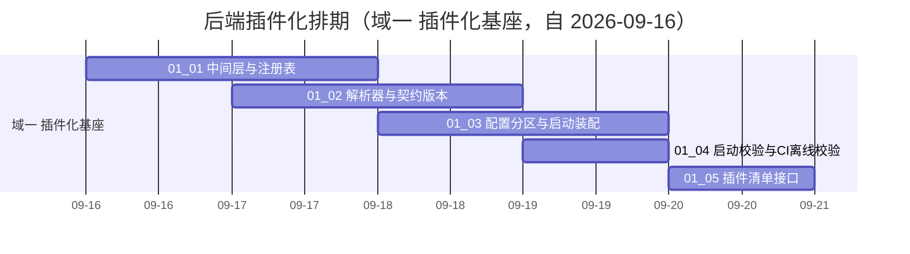

# 后端插件化计划

> BMS 基础管理系统 · 阶段三（后端插件化 / M3 后端插件化可用）排期计划：已完成 0 项，剩余 5 项（域一 插件化基座；域二 ~ 四随任务基线补建回写）

[文档首页](../../../文档首页.md) › 后端插件化计划　|　[任务基线 →](../任务/01_插件化基座/01_插件化基座.md)　[需求基线 →](../需求/00_需求_后端插件化.md)

## 1. 计划说明 

- **排期对象**：阶段三 11 条需求中的**域一 插件化基座**（3 条需求，任务基线已建：[01 插件化基座](../任务/01_插件化基座/01_插件化基座.md)，5 个子任务 / 16h）；域二 能力域改造、域三 契约与收敛提取、域四 首个能力与阶段验收的任务随各自启动补建，届时在本计划追加排期行并同步甘特图。
- **顺序口径（基座先行）**：机制（中间层与注册表 → 解析器与契约版本）→ 装配（配置分区与启动装配）→ 校验（启动校验与 CI 离线校验）→ 清单接口；域二改造成面依赖域一机制就位后启动。
- **排期口径**：自 2026-09-16 起排，域一 5 个子任务串行约 5 天（16h，兼职）；阶段三整体周期口径 2 周（[需求总览](../需求/00_需求_后端插件化.md#goal)），域二 ~ 四任务补建后回写。
- **工时**：已完成 0h；剩余 16h；阶段合计 16h（域一已建任务口径；域二 ~ 四补建后追加）。
- **里程碑锚点**：M3 = **后端插件化可用**（《总体项目规划》「里程碑」节），门禁见第 5 节。
- **负责人**：minjian（兼职，单人）。

## 2. 已完成任务（暂无） 

| 编号 | 任务 | 工时（重估） | 完成日期 | 任务文件 | 偏差与遗留 |
| --- | --- | --- | --- | --- | --- |
| — | **本阶段任务尚未动工（首任务 01_01 自 2026-09-16 起）** | — | — | — | — |

## 3. 剩余任务排期（自 2026-09-16） 

| 编号 | 任务 | 工时 | 依赖 | 排期窗口 | 备注 | 偏差与遗留 |
| --- | --- | --- | --- | --- | --- | --- |
| 01_01 | 中间层与注册表 | 4h | — | 2026-09-16 ~ 2026-09-17 | `core/plugin.py`：`BasePluggable` + 注册表 + 双轨登记 | 无 |
| 01_02 | 解析器与契约版本 | 4h | 01_01 | 2026-09-17 ~ 2026-09-18 | `resolve_plugin` + 实例缓存 + 契约版本 | 无 |
| 01_03 | 配置分区与启动装配 | 3h | 01_01/01_02 | 2026-09-18 ~ 2026-09-19 | `config.toml` provider / options + lifespan 装配 + 延迟导入 | 无 |
| 01_04 | 启动校验与 CI 离线校验 | 2h | 01_02/01_03 | 2026-09-19 | 非法 provider / 重名 / 契约版本不符拒启 + `ops/check_plugins.py` | 无 |
| 01_05 | 插件清单接口 | 3h | 01_01/01_03 | 2026-09-20 | `GET /api/v1/plugins`（+ 明细）：只读、不含密钥 | 无 |

剩余合计 **16h**；域二 ~ 四（能力域改造 / 契约与收敛提取 / 首个能力与阶段验收）任务补建后在本表追加。

## 4. 排期甘特图 

> 域二 ~ 四任务补建后在本图追加（M3 里程碑随阶段收口标注）。

## 5. M3 验收门禁 

门禁定义与逐项核对见[需求总览 · M3 验收门禁](../需求/00_需求_后端插件化.md#accept)（8 个验收点）；本计划下的达成路径：

| 验收点 | 对应任务 | 达成路径 |
| --- | --- | --- |
| 插件化基座可用（含双轨注册） | 01_01、01_02 | `BasePluggable` / 注册表 / `resolve_plugin` 就位；继承自动登记与显式注册汇入同一注册表 |
| 配置切换零改动 | 01_03（机制）· 域二 02_02（改造面） | 域一交付配置驱动装配与实例缓存；域二 35 个提供者改经 `resolve_plugin` 后闭环 |
| 非法输入拒启 | 01_04 | 非法 provider / 重名 / 契约版本不符拒启（含 CI 离线校验拦截） |
| 契约测试全覆盖 | 域三 03_01 | 契约套件遍历全部注册实现（含 `Null` 缺省实现） |
| 插件清单可查 | 01_05 | 双接口只读可查且不含密钥 |
| 能力域改造完成 | 域二 02_01 ~ 02_03 | 40 基类继承链 / 35 提供者 / `null.py` 迁移后导入与测试全绿 |
| 首个纵向能力验证 | 域四 04_01 | 对象存储 `local` + `minio` 多实现配置切换验证（消费方零改动） |
| 阶段验收留痕 | 域四 04_02 | M3 门禁逐项结论与证据索引、阶段测试报告、三类文档状态一致 |

## 6. 风险与对策 

| 风险 | 影响 | 对策 |
| --- | --- | --- |
| `__init_subclass__` 可实例化判定误判（抽象端口误登记 / 实现漏登记） | 注册表污染或解析不可用 | 仅对可实例化子类登记；抽象端口 / 中间层不登记的用例覆盖；契约测试基座纳入 |
| 绕过注册表的直连实现残留（含配置开关分支） | 配置切换不生效、依赖隔离失效 | 解析路径唯一性核查；未选中实现不被导入的断言用例（01_04） |
| 契约版本口径（能力域基类 `contract_version` 起步值与兼容规则）未固化 | 装配误拒 / 漏拒、域二改造返工 | 主版本一致口径随 01_02 固化并回写详细设计；域二改造沿用 |
| 域二 ~ 四任务基线未建 | 阶段计划与门禁口径不完整 | 各域启动即补建任务并回写本计划 §3 与甘特图 |
| 单人兼职投入不稳 | M3 延期 | 串行保守排期；机制先行（01_01 / 01_02）保底，装配与校验可顺延 |

> 本文档依《文档生成规范》编写
