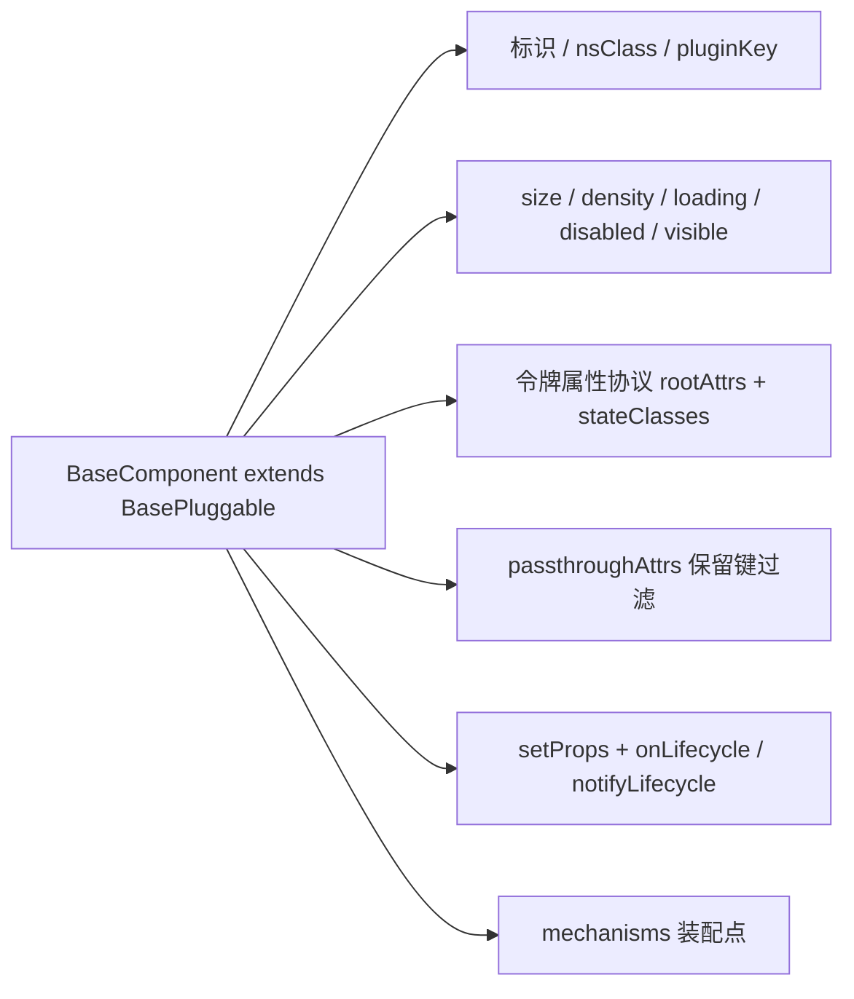

# 02 实施 · 组件根

> 前端组件库 · 02 基础组件类 · 子任务 02（需求 02-2）· 实施记录

[文档首页](../../../../../../文档首页.md) › [02 基础组件类](../../02_基础组件类.md) › [02 组件根](../02_基础组件类_02_组件根.md) › 实施记录　|　[← 任务](../02_基础组件类_02_组件根.md)

## 1. 实施信息 

| 项 | 值 |
| --- | --- |
| 任务 | [02 组件根](../02_基础组件类_02_组件根.md) |
| 对应需求 | [02-2](../../../../需求/02_需求_基础组件类.md#r02-2) |
| 详细设计 | [02 详细设计](../设计/02_详细设计_01_组件根.md) |
| 实施日期 | 2026-09-18 |
| 实施人 | minjian |
| 实施环境 | 本地开发机（Node v24.20.0 / pnpm 11.x，npmmirror） |
| 提交 | 设计 `ea849aa8`；代码 `6e978e72` |
| 结论 | 完成 |

## 2. 实施概览 

## 3. 实施过程 

1. `frontend/packages/core/src/base/BaseComponent.ts` 落组件根（继承插件基类）：标识 / `pluginKey`（= 标识）/ `pluginName` 缺省 `core` / `nsClass`。
2. 令牌属性协议：`rootAttrs`（`data-size` / `data-density` / `aria-busy` / `aria-disabled` / `aria-hidden`）与 `stateClasses`（`is-loading` / `is-disabled` / `is-hidden`）。
3. attrs 透传 `passthroughAttrs`（过滤 `size` / `density` / `loading` / `disabled` / `visible` 与 `_` 前缀）。
4. 生命周期：多监听 `onLifecycle`（返回幂等取消函数）+ `notifyLifecycle` 广播（异常上报不阻断）；`onDispose` 广播 `unmount` 并清空监听与装配点。
5. 入口导出 + 用例；`pnpm run core:check` 全绿。

## 4. 问题与处置 

- 无问题（首次全绿）。

## 5. 验证结果 

| 验证点 | 方法 | 结果 |
| --- | --- | --- |
| 类型检查 | `pnpm run core:typecheck` | 通过 |
| Lint（零告警，含注释齐备护栏） | `pnpm run core:lint` / `guard-jsdoc` | 通过 |
| 单测 | `pnpm run core:test` | 13 文件 / 44 用例全通过 |
| 门禁串联 | `pnpm run core:check` | 全绿 |

## 6. 偏差与遗留 

- **偏差**：无（按详细设计实施）。
- **遗留**：① `mount` / `update` 触发时机由投影 / 组件调用（核心只提供 `notifyLifecycle`）；② attrs 落到真实根元素与样式由渲染插件 / 绑定包承接；③ 设计令牌属性选择器映射随 `02_06`。

> 本文档依《[文档生成规范](../../../../../../规范/文档生成规范.md)》编写
