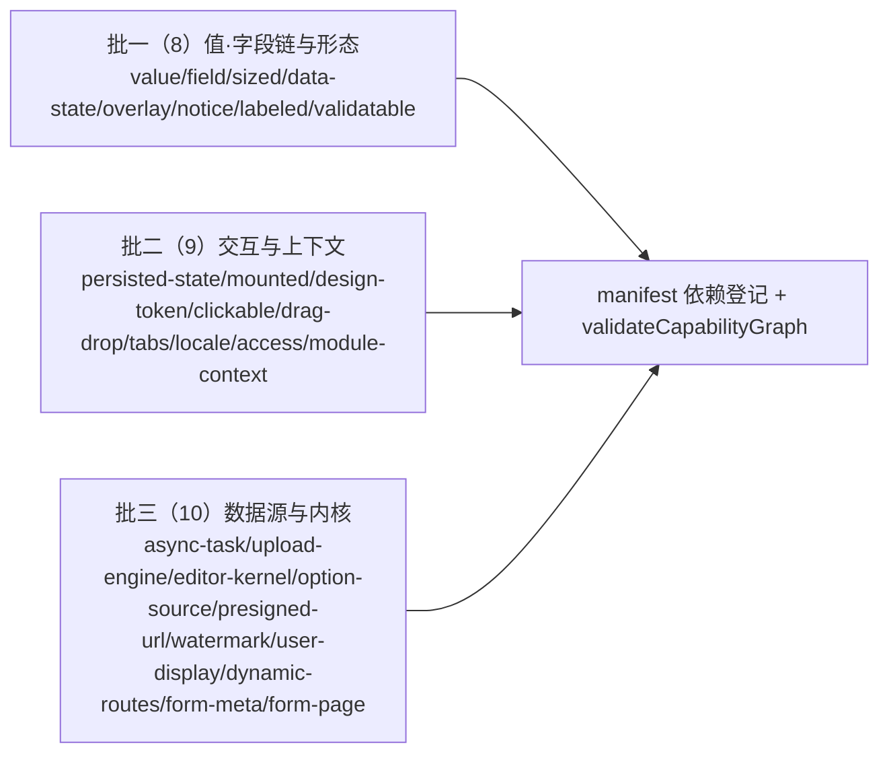

# 03 实施 · 能力基类族

> 前端组件库 · 02 基础组件类 · 子任务 03（需求 02-3）· 实施记录

[文档首页](../../../../../../文档首页.md) › [02 基础组件类](../../02_基础组件类.md) › [03 能力基类族](../02_基础组件类_03_能力基类族.md) › 实施记录　|　[← 任务](../02_基础组件类_03_能力基类族.md)

## 1. 实施信息 

| 项 | 值 |
| --- | --- |
| 任务 | [03 能力基类族](../02_基础组件类_03_能力基类族.md) |
| 对应需求 | [02-3](../../../../需求/02_需求_基础组件类.md#r02-3) |
| 详细设计 | [03 详细设计](../设计/03_详细设计_01_能力基类族.md) |
| 实施日期 | 2026-09-18 |
| 实施人 | minjian |
| 实施环境 | 本地开发机（Node v24.20.0 / npm 11.19.0，npmmirror） |
| 提交 | 设计 `5ef95afd`；代码 批一 `3bf79cc6`、批二 `01f8b730`、批三 `b228550d` |
| 结论 | 完成 |

## 2. 实施概览 

## 3. 实施过程 

1. **批一**：`capabilities/{value,field,sized,data-state,overlay,notice,labeled,validatable}.ts` + `manifest.ts`（`CAPABILITY_MANIFEST` / `validateCapabilityGraph` / `assertCapabilityGraph`）。
2. **批二**：`capabilities/{persisted-state,mounted,design-token,interactive,drag-drop,tabs,locale,access,module-context}.ts`，manifest 追加 9 键。
3. **批三**：`capabilities/{async-task,upload-engine,editor-kernel,option-source,presigned-url,watermark,user-display,dynamic-routes,form-meta,form-page}.ts`，manifest 追加 10 键（含 `upload-engine → presigned-url`、`form-page → form-meta`）。
4. 能力基类经继承链取得能力键（`key = pluginKey = identifier`）；状态为纯 TS 内存状态 + 可订阅快照；数据通路按占位（未注入加载器 / 执行器即不请求）。
5. 入口导出 + 分批用例；每批 `npm run core:check` 全绿。

## 4. 问题与处置 

| # | 问题 / 现象 | 原因 | 处置 |
| --- | --- | --- | --- |
| 1 | `BaseField` / `BaseOverlay` / `BaseValidatable` 覆写 `identifier` 报类型错 | 基类 `identifier` 由字面量推断为固定字面量类型 | 基类 `identifier` 显式标注 `string` |
| 2 | `BaseOptionSource` / `BaseFormMeta` 的 `version: number` 与根字段 `version: string` 冲突 | 总基类根字段 `version` 与数据版本同名 | 数据版本字段改名 `dataVersion`（回写详细设计 §4 概要表与清单） |

## 5. 验证结果 

| 验证点 | 方法 | 结果 |
| --- | --- | --- |
| 类型检查 | `npm run core:typecheck` | 通过 |
| Lint（零告警，含注释齐备护栏） | `npm run core:lint` / `guard-jsdoc` | 通过 |
| 单测 | `npm run core:test` | 17 文件 / 82 用例全通过 |
| 门禁串联 | `npm run core:check` | 全绿 |

## 6. 偏差与遗留 

- **偏差**：`BaseOptionSource` / `BaseFormMeta` 数据版本字段名 `dataVersion`（避开根字段 `version`）——已回写设计 §4 与清单 §2.1。
- **遗留**：① 真实数据通路（选项源 / 上传 / 预签名 / 元数据 / 动态路由菜单源 / 异步任务）随组件域与后端能力阶段回补，当前为占位（不请求）；② 清单对账护栏（`manifest` ↔ 清单 ↔ 插件导出）待 `02_04` / `02_07` 收口；③ 具体组件与渲染实现随域 05+。

> 本文档依《[文档生成规范](../../../../../../规范/文档生成规范.md)》编写
