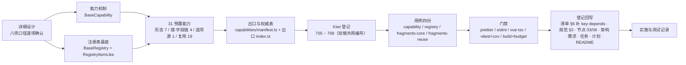

# 能力机制与预置能力实施记录

> 前端组件库 · 02 基础组件类 · 03 能力机制与预置能力 · 实施记录

[文档首页](../../../../../../文档首页.md) › [02-3 能力机制与预置能力](../02_基础组件类_03_能力机制与预置能力.md) › 01 实施　|　[← 父任务](../02_基础组件类_03_能力机制与预置能力.md)

## 1. 实施信息 

| 项 | 值 |
| --- | --- |
| 任务 | [02-3 能力机制与预置能力](../02_基础组件类_03_能力机制与预置能力.md) |
| 对应需求 | [02-3](../../../../需求/02_需求_基础组件类.md#r02-3) |
| 详细设计 | [01 详细设计](../设计/01_详细设计_02_03_能力机制与预置能力.md) |
| 实施日期 | 2026-09-16（计划窗口 2026-09-18 ~ 2026-09-19，实际提前两日完成） |
| 实施人 | minjian |
| 实施环境 | Linux 开发机（mjpc）；Node v24.20.0 / npm 11.19.0；`frontend/apps/desktop/`、`frontend/apps/mobile/`（Vue 3.5 + Vite 8 + Vitest 5 + jsdom）；Kiwi TCMS 容器 `bms-kiwi` |
| 工时 | 40h |
| 提交 | 见本记录 §3 第 9 步（机制 / 注册表与能力分笔提交） |
| 结论 | 已完成（双端门禁、114 条用例与构建体积均通过；31 能力依赖登记齐备） |

## 2. 实施概览 

结果小结：能力机制（声明 / 依赖校验 / 循环检测 / 开发态告警）与注册表基座（唯一性拒重 / 未命中 / 保序 / 只读快照）落地；**预置 31 能力**全部交付（一域一文件，`frontend/packages/core/src/capabilities/manifest.ts` 为 key / depends 权威表）；依赖后端能力者按**占位先行**（不请求、降级、占位契约测试）；双端各 114 条用例通过（本任务新增 47 条），新增文件语句覆盖 ≥70%，构建体积未超预算。

## 3. 实施过程 

1. **上下文**：读任务 02-3 → 需求 02-3 → 详细设计依据（组件设计 03 能力机制、06 注册表基类、`02_能力类/` 31 节点摘要 + 位置列）→ 清单 §2 / §6 / §9 → 规范 §3.1 / §3.2 → 计划与域总览。
2. **决策确认**（question 逐项，共八项）：① 注册表命名按**需求口径** `BaseRegistry` / `RegistryItemLike`（回写节点 06 / 清单 / 规范）；② 组合式投影按需（`useXxx` 只落 `frontend/packages/vue/src/bindings/`）；③ 能力名按节点与清单（`BaseFieldPerm` / `BasePersistedState`，回写需求与任务）；④ 落点 `frontend/packages/core/src/capabilities/<能力域>.ts`；⑤ **一次全交**（机制 + 注册表 + 31 能力），代码分笔提交；⑥ 深度 = 契约 + 最小可用实现，`BaseXxx.vue` 包装按需；⑦ Kiwi **4 条**（705 机制 / 706 注册表 / 707 核心 12 / 708 复用 19，双端共用）；⑧ 清单「能力」节补 `key` 与 `depends` 两列。
3. **能力机制**（`frontend/packages/core/src/mechanisms/capability.ts`）：`BaseCapability` + `registerKnownCapabilities` / `knownCapabilitiesView` / `resetKnownCapabilities`；开发态校验「依赖已登记 / 无循环 / `key` kebab-case」，违规默认经根系告警（`strict` 抛 `BaseError` 码 `10003`），生产态零开销；已知能力表由**能力层注入**（机制层不反向依赖能力层）。
4. **注册表基座**（`frontend/packages/core/src/mechanisms/registry.ts`）：`RegistryItemLike`（`key` + `describe()`）、`BaseRegistry`（`register` 唯一性拒重（严格域抛 `BaseError` 码 `10002`）、`unregister`、`get` 未命中 `undefined`、`keys` / `values` / `list` 保序、`snapshot` 冻结、`count`、`clear`）。
5. **预置 31 能力**（`frontend/packages/core/src/capabilities/`）：形态 7（`BaseInteractive` / `BaseInputControl` / `BaseDisplayControl` / `BaseContainer` / `BaseFormContainer` / `BaseMedia` / `BaseLayout`）、值·字段链 4（`BaseValue` / `BaseFieldShell` / `BaseFieldPerm` / `BaseField`）、选项源 1（`BaseOptionSource`）、复用 19（上传引擎 / 异步任务 / 页签 / 偏好持久化 / 编辑器内核 / 树数据 / 用户展示 / 动态路由 / 表单元数据 / 预签名 / 拖拽 / 设计令牌 / 表单页 / 语言上下文 / 权限上下文 / 列配置 / 查询方案 / 水印 / 模块上下文）；每能力经 `manifest.ts` 登记（`registerKnownCapabilities`；依赖取自 `capabilities/manifest.ts`）；跨能力真实依赖按登记表落地（`field` → `BaseValue` + `BaseFieldShell` + `BaseFieldPerm`；`option-source` → `BaseValue`；`media` / `upload-engine` → 预签名；`layout` → 设计令牌；`column-config` / `query-scheme` → 偏好持久化）。
6. **出口与权威表**：`capabilities/manifest.ts`（31 项 key / depends / 中文名 + `registerKnownCapabilities`）、出口 `frontend/packages/core/src/capabilities/index.ts`。
7. **Kiwi 登记（先登记后编码）**：测试资产仓 `scripts/kiwi/register_cases.py` 批量登记（输入 `scripts/kiwi/cases/2026-09-16_阶段四02-03_能力机制与预置能力.json`），回读得 **705 ~ 708**。
8. **用例**（双端同一套断言集，4 份 / 47 条）：`base-capability.spec.ts`（705，7 条）、`base-registry.spec.ts`（706，8 条）、`base-fragments-core.spec.ts`（707，13 条）、`base-fragments-reuse.spec.ts`（708，19 条）——覆盖占位降级路径（选项源 / 上传 / 异步任务 / 预签名 / 表单元数据 / 权限码 / 偏好远端）与 31 能力契约。
9. **双端与验证**：契约套件（`frontend/packages/core/tests/contracts/`）与宿主用例（`frontend/apps/{desktop,mobile}/tests/`）同一套断言集；双端各自跑 `prettier`（本任务文件）/ `eslint` / `vue-tsc` / `vitest run --coverage` / `build` + `budget` 全通过（见[测试记录](../测试/01_测试_02_03_能力机制与预置能力.md) §3）。
10. **回写**：《前端基类清单》「组件根机制基类表」三行 + 「能力」节补 `key` / `depends` 两列 + 「目录与依赖」节；《前端开发规范》「前端组件体系」节（`BaseRegistry` 命名 + 能力机制 / 注册表 / 能力层落点要点）；《组件设计 · 注册表基类》名称同步为 `BaseRegistry` / `RegistryItemLike`、《组件设计 · 能力机制》补实现口径；《架构设计》05 / 08 命名同步；需求 02-3（状态 + 命名 + 实现期要点注块）与总览 / 域地图；任务 02-3、域总览、计划（已完成表 + 剩余表 + 甘特 + 头部 + §3.1 归口 14 ~ 16）、阶段 README；消费方任务补「前置契约（已交付）：能力机制 + 注册表基座 + 预置 31 能力」。

## 4. 问题与处置 

| # | 问题 / 现象 | 原因 | 处置与落点 |
| --- | --- | --- | --- |
| 1 | 注册表基类命名四份文档三套（节点 / 清单 / 规范与需求 02-3 命名未统一） | 文档演进不同步 | 按拍板取**需求口径**并回写节点 06 / 清单 / 规范 §3.1 与架构命名（本记录与提交同批） |
| 2 | `BaseRegistry.size` 与组件根尺寸档位 `size` 冲突（TS2416，与 02_02 的 `BaseAsyncResource.size` 同源） | 子类 getter 覆盖父类同名 getter 且类型不同 | 注册表数量改 `count`；详细设计 §4.2 与用例同步 |
| 3 | `BaseOptionSource` 内 `options` 参数与 `options` 计算属性同名（TS2300 重复标识符） | 命名占用 | 计算属性改 `optionItems`，参数保持 `options`（跨能力一致） |
| 4 | 泛型 ref 深度解包破坏业务类型（TS2322，`persisted-state` / `drag-drop` / `form-page`） | `ref<T>` 的 `UnwrapRefSimple<T>` 与 `T` 不等价 | 泛型状态改 `shallowRef<T>` 并注明原因 |
| 5 | 返回对象直接给 `ComputedRef` 与声明的 `Record` 不符（8 处 TS2322） | 对象字面量与接口类型不匹配 | 统一改 getter（`get shellAttrs() { return shellAttrs.value }`） |
| 6 | 索引取值报 `T \| undefined`（`noUncheckedIndexedAccess` 生效） | tsconfig 严格项 | 显式标注 `DeptDisplayInfo \| undefined` 并做守卫 |
| 7 | eslint `no-extra-boolean-cast`（三元条件中的 `Boolean(...)`）2 处 | 布尔上下文冗余转换 | 改 `toValue(x) === true` |
| 8 | 能力机制构造即校验：`strict` 在构造抛错、未挂接告警过早（用例 3 处失败） | 校验时机选错 | 改为「挂载（`attachToComponent`）/ 显式 `assertDeps()` / `register()`」三处校验；未挂接告警仅在 `register()` 触发 |
| 9 | 媒体「过期重取」语义不清（首次 `onError` 后状态停在 `loading`） | 重取成功与否只能在图片事件中得知 | 明确语义：首次 `onError` → `expired` + 重取一次；再次 `onError` 才判 `error` 并回退；用例与设计说明同步 |
| 10 | 上传引擎占位分支返回入参副本 → 调用方读到 `pending` 而非 `placeholder` | 占位分支 `return item`（旧对象） | 改为返回队列内最新项（`items.value.find(...)`） |
| 11 | `option-source` 原登记依赖 `value` + `field`，实现无需 `field` | 把节点正文的「协作 / 消费」当依赖 | 按本任务「协作不入 depends」口径收紧为 `value`；同步设计文档、`capabilities/manifest.ts`、清单 §6 **与平台用例 707 正文**（正文修订留痕见测试记录 §6） |
| 12 | 纯再导出的 `index.ts`（32 个）在覆盖率表记 0%，拉低聚合口径 | v8 provider 统计到无逻辑 barrel 文件 | 双端 `vitest.config.ts` 增 `coverage.exclude`（仅排除能力层 barrel），并在测试记录 §5 说明 |
| 13 | `BaseLocale` 语句覆盖 63.63%（低于新增文件 70% 口径） | 相对时间 / 数字粒度 / 无 i18n 分支未断言 | 补 13 条断言（时间 / 相对 / 非法日期 / 数字粒度 / 无 i18n 回退），升至 97.72% |
| 14 | 脚本化补断言静默失效（改的是另一个文件的字符串） | 变量写错（`t.count(o3)` 应为 `t3.count(o3)`） | 改为逐项 `assert count == 1` + 独立脚本校验，避免「看着像改了其实没改」 |

## 5. 验证结果 

双端逐条命令与结果见[测试记录](../测试/01_测试_02_03_能力机制与预置能力.md) §3；结论：`prettier`（本任务文件）/ `eslint` / `vue-tsc` / `vitest run --coverage` / `build` / `budget` 双端全通过。

## 6. 偏差与遗留 

| # | 项 | 归口 / 去向 |
| --- | --- | --- |
| 1 | 注册表命名改按需求口径，节点 06 / 清单 / 规范 §3.1 / 架构 05·08 命名 | 本次已回写（命名统一为 `BaseRegistry` / `RegistryItemLike`） |
| 2 | 能力命名（`BaseFieldPerm` / `BasePersistedState`） | 本次按节点与清单回写需求 02-3 |
| 3 | `option-source` 依赖由 `value` + `field` 收紧为 `value` | 设计文档 / 代码 / 清单 §6 / 平台用例 707 正文已同步 |
| 4 | 静态护栏（继承 / 依赖方向 / 清单对账）与错误码段位对齐（`10002` / `10003`） | `02_05`（扩展与登记机制）——能力机制只做运行期声明与开发态校验 |
| 5 | `BaseXxx.vue` 包装（约 20 余个） | 各具体组件任务按需交付（本轮按拍板只交契约与最小可用实现） |
| 6 | 请求组合式（`useRequest` / `useListPage` / `useFormModal`）与能力协作 | `02_06`（基础类横切底座）；`form-page` / `column-config` / `query-scheme` 与其协作在 `02_06` 内接 |
| 7 | 对账脚本前端标记缺口（`--reconcile` 只扫 `.py`） | 测试资产仓工具改进（待排期）；缺口见 `test/scripts/kiwi/README.md` §2.2 |
| 8 | 分支覆盖率（部分能力 < 70%，如 `BaseFormContainer` 54.41 / `BaseTabs` 66 / `BaseValue` 66.66） | 新增能力按「语句 / 行 ≥ 70%」执行（门禁阈值为**全工程** 70%）；防御性与占位兜底分支未全覆盖，登记为可接受的覆盖偏差（需要时随消费方任务补断言） |

- **处理偏差与遗留（2026-09-16 闭环）**：
  - **计划 §3.1 归口**：新增第 14 ~ 16 行（静态护栏与错误码段位 → `02_05`；`BaseXxx.vue` 包装 → 各具体组件任务；对账脚本前端标记缺口 → 测试资产仓），均注出处 `02_03`；需求 02-3 `> 注：` 块补齐实现期要点与遗留去向。
  - **计划 §2 已完成表**：`02_03` 行「偏差与遗留」列写明命名回写、依赖口径收紧与三项遗留归口。
  - **消费方标注**：任务 `02_04` / `02_05` / `02_06`（含嵌套 01 请求封装 / 02 权限指令 / 03 格式化工具）补「前置契约（已交付）：能力机制 + 注册表基座 + 预置 31 能力（2026-09-16）」。
  - **不处理的开放项**：能力「未挂接组件根」仅开发态告警（兼容能力独立使用）；`BaseRegistry` 快照被误当可变数据（文档已声明冻结）——已知、可接受。
- **结论**：本任务偏差已记录、遗留已全部登记去向或闭环，偏差与遗留处理完成。

> 本文档依《[文档生成规范](../../../../../../规范/文档生成规范.md)》编写
