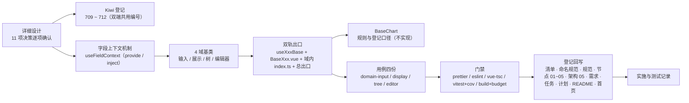

# 域基类实施记录

> 前端组件库 · 02 基础组件类 · 04 域基类 · 实施记录

[文档首页](../../../../../../文档首页.md) › [02-4 域基类](../02_基础组件类_04_域基类.md) › 01 实施　|　[← 父任务](../02_基础组件类_04_域基类.md)

## 1. 实施信息 

| 项 | 值 |
| --- | --- |
| 任务 | [02-4 域基类](../02_基础组件类_04_域基类.md)（自有 11h） |
| 对应需求 | [02-4](../../../../需求/02_需求_基础组件类.md#r02-4) |
| 详细设计 | [01 详细设计](../设计/01_详细设计_04_域基类.md) |
| 实施日期 | 2026-09-16（计划窗口 2026-09-20，实际提前四日完成） |
| 实施人 | minjian |
| 实施环境 | Linux 开发机（mjpc）；Node v24.20.0 / npm 11.19.0；`frontend/`、`frontend-mobile/`（Vue 3.5 + Vite 8 + Vitest 5 + jsdom）；Kiwi TCMS 容器 `bms-kiwi` |
| 工时 | 11h |
| 提交 | 详细设计 `f00e159`；代码 / 用例 `f8cd037`（双端）；文档收口见 §3 第 10 步 |
| 结论 | 已完成（双端门禁、148 条用例与构建体积均通过；`BaseChart` 规则与登记就位、实现归 `07_06`） |

## 2. 实施概览 

结果小结：域基类按「组合式 + 组件」双轨落地 4 件（输入 `useInputBase` / `BaseInput.vue`、展示 `useDisplayBase` / `BaseDisplay.vue`、树 `useTreeBase` / `BaseTree.vue`、编辑器 `useEditorBase` / `BaseEditor.vue`），**双端同款、框架无关**（原生元素 + 插槽 + 片段；具体控件由子类接入）；字段上下文机制 `useFieldContext` 补交付（`field-shell/` 域内，非片段）；`BaseChart` 只落新增域规则与登记口径（实现随 `07_06`）。双端各 148 条用例全绿（本任务新增 34 条），构建体积未超预算。

## 3. 实施过程 

1. **上下文**：读任务 / 需求 02-4 → 5 个域基类设计节点（含原型）→ 清单 §5~§7、规范 §3、命名规范 §9 → 计划与域总览 → 现有片段与代码现状（`useField` / `useInputControl` / `useDisplayControl` / `useValue` / `useTreeData` / `useEditorKernel`、组件根包装形态）。
2. **决策确认**（question 逐项，共 11 项）：① `BaseChart` 只落规则（不实现，随 `07_06`）；② 双端同款·框架无关（不 import element-plus / vant）；③ 新建域目录 `{input,display,tree,editor}`；④ 组件 + 组合式双轨；⑤ 组合式命名 `useInputBase` / `useDisplayBase` / `useTreeBase` / `useEditorBase`；⑥ 契约 + 最小可用·原生渲染；⑦ `useFieldContext` 本次补实现（落 `field-shell/`，按上下文机制登记、不占片段表）；⑧ Kiwi 每域 1 条（4 条，双端共用）；⑨ 常规回写面 + 概要设计 / 布局设计登记项遗留；⑩ 排期提前执行；⑪ 概要设计 / 布局设计登记项归 `02_05`。
3. **Kiwi 登记（先登记后编码）**：测试资产仓 `scripts/kiwi/register_cases.py` 批量登记（输入 `scripts/kiwi/cases/2026-09-16_阶段四02-04_域基类.json`），回读得 **709 ~ 712**。
4. **字段上下文机制**（`field-shell/useFieldContext.ts`）：`FieldContextValue` / `FieldContextControl` / `FIELD_CONTEXT_KEY` + `provideFieldContext` / `useFieldContext`（缺省回落 `undefined`，控件可独立工作）。
5. **输入域**：`useInputBase`（组合 `useField` + `useInputControl`；`disabled` 合并 props / loading / 上下文 / 字段权限；`readonly` 合并；只读与禁用拒绝程序化写入；上下文注册 / 注销）与 `BaseInput.vue`（原生 `<input>` 兜底 + `default` / 前后缀 / 前后置 / `empty` 插槽 + attrs 透传 + 组件根令牌属性）。
6. **展示域**：`useDisplayBase`（组合 `useValue` + `useDisplayControl`；函数格式化器 / 名义回退 `String`；空值 `—`；省略与 tooltip；点击；复制含 clipboard 缺失回退与脱敏禁复制）与 `BaseDisplay.vue`（`` + `title` + 复制按钮兜底）。
7. **树域**：`useTreeBase`（组合 `useTreeData`；`load` 根 / 子加载器；过滤**保留命中节点及祖先路径**；手风琴；全展开；`selectable` 开关）与 `BaseTree.vue`（递归原生列表 + 节点 / 空态 / 操作插槽 + `select` / `check` / `node-click` / `node-expand` / `node-collapse` / `loaded` 事件）。
8. **编辑器域**：`useEditorBase`（组合 `useEditorKernel`；即时 `onUpdate` + 去抖 `onChange`（缺省 300ms）；`mount` / `unmount`；`rich` 白名单净化 `sanitizeHtml`（危险标签整块剔除））与 `BaseEditor.vue`（内核容器 / textarea 降级 + 工具栏插槽 + `kernel-ready`）。
9. **出口与双端**：4 个域内 `index.ts` + 总出口 `src/components/base/index.ts` 追加；双端 `diff -r` 无差异（实现与四份用例）。
10. **门禁与回写**：双端各自跑 `prettier` / `eslint` / `vue-tsc` / `vitest run --coverage` / `build` + `budget` 全通过（见[测试记录](../测试/01_测试_04_域基类.md)）；回写《前端基类清单》§2/§5/§6/§7、《命名规范》§9（域基类组合式行）、《架构设计 · 前端组件体系》规模行、组件设计 5 节点实现口径、需求 02-4、任务 02_04、域总览、计划（已完成表 / 剩余表 / 甘特 / 头部 / §3.1 归口 18~20）、阶段 README、文档首页；消费方任务 `02_05` / `02_06`（含 `02_06_03`）补「前置契约（已交付）」。

## 4. 问题与处置 

| # | 问题 / 现象 | 原因 | 处置与落点 |
| --- | --- | --- | --- |
| 1 | 用例内「父组件 provide → 同组件 inject」断言失败 | Vue 语义：`inject` 只解析**父链** provides，不查本组件 provide | 用例改为「父提供 / 子消费」结构（机制用法不变：字段壳与控件天然父子），测试模块用例同步调整 |
| 2 | 展示域函数格式化器不生效（`1234.5` 而非 `1234.5元`） | `toValue` 对裸函数按 getter 处理并调用 | `resolveFormatter` 明确口径：**裸函数 = 格式化函数**；响应式切换传 `ref` / `computed`（`BaseDisplay.vue` 传 `computed(() => props.formatter)`）；详细设计 §4.3 类型行同步 |
| 3 | `sanitizeHtml` 对 `<script>` 解包后残留文本（`alert(1)`） | 非白名单标签按「解包保留内容」处理 | 增**危险标签整块剔除**（`script` / `style` / `iframe` / `object` / `embed` / `link` / `meta`）；用例断言同步 |
| 4 | `vue-tsc` 类型错误（`ComputedRef` 联合、`MaybeRefOrGetter<T>` 与 `T \| undefined`、`emit` 事件名联合） | 片段入参口径为 `T`（不含 `undefined`）；联合事件名无法被类型化 `emit` 收窄 | 输入域 `modelValue` 回传按只读消费面兼容；展示域 formatter / density 改为 `MaybeRefOrGetter` 并在域层解析；树域 `node-expand` / `node-collapse` 改分叉 emit |
| 5 | `eslint` 对 `.vue` 脚本内 DOM 类型（`HTMLElement` 等）报 `no-undef` | 配置未对 Vue SFC 关闭该规则（TS 侧由 `vue-tsc` 保障） | 双端 `eslint.config.js` 对 `**/*.vue` 关闭 `no-undef`（配置块 `app/vue-no-undef`） |
| 6 | 测试文件多 `defineComponent` 触发 `vue/one-component-per-file` 告警 | 用例需宿主 / 探针组件，规则不适用于测试文件 | 双端 `eslint.config.js` 对 `tests/**/*.{ts,mts,tsx}` 关闭该规则（配置块 `app/tests`） |
| 7 | `useTreeData.filter` 返回命中节点平铺列表，不满足节点「保留祖先路径」 | 片段与域层职责边界 | 域层 `useTreeBase` 以剪枝复制实现（不修改片段，避免重复实现且保持片段契约稳定）；设计 §4.4 记录 |
| 8 | 设计节点为 Element Plus 集成口径（`el-tree` 二次封装 / `el-input` 模板），与「双端同款」冲突 | 节点撰写期未考虑双端 UI 库差异 | 按拍板落地**框架无关**（原生兜底 + 子类接入）；回写节点 01 ~ 05 §2「实现口径」；输入域「default 留空」以原生 `<input>` 兜底 |
| 9 | `useInputBase` 缺字段权限入参，`field.perm.disabled` 不可达 | 设计节点要求 `disabled` 合并权限态 | 增 `perm` 选项（透传 `useField`）；详细设计 §4.2 选项与合并行同步 |
| 10 | 实施中发现需在编辑域透出 `onUpdate`（即时）与 `onChange`（去抖）双回调、`BaseEditor` 需 `loader` 入参 | 设计只列 `onChange` | 详细设计 §4.5 选项 / props 同步（`onUpdate` / `loader`），详细设计随实施回写 |

## 5. 验证结果 

双端逐条命令与结果见[测试记录](../测试/01_测试_04_域基类.md) §3；结论：`prettier` / `eslint` / `vue-tsc` / `vitest run --coverage` / `build` / `budget` 双端全通过（双端各 18 个用例文件 / 148 条用例；覆盖 87.33% 语句；构建体积 71.6 KB / 70.5 KB，均低于预算）。

## 6. 偏差与遗留 

| # | 项 | 归口 / 去向 |
| --- | --- | --- |
| 1 | `BaseChart`（图表域）实现与用例 | `07_06`（展示类图表卡）演练新增；规则与登记口径已就位（清单 §6），计划 §3.1 第 18 行 |
| 2 | 名义格式化器名称分发（金额 / 日期 / 枚举 / 布尔） | `02_06`（格式化工具）接入后收敛（当前未注册名回退 `String(value)`），计划 §3.1 第 19 行 |
| 3 | 具体控件接入（`el-input` / `el-tree` / Vant / 真实编辑器内核） | 各组件任务（基础控件类 `03` / 字段类 `06` / 展示类 `07`）按子类接入 |
| 4 | 5 个节点 §6.2 上游登记项（《概要设计 · 表单定制》/《布局设计》html） | `02_05` 登记或对应设计更新，计划 §3.1 第 20 行 |
| 5 | 域基类框架无关与节点口径偏差（Element Plus 集成 → 原生兜底） | 本次已回写节点 01 ~ 05「实现口径」，无后续动作 |
| 6 | `field-shell` 目录分支覆盖率 61.29%（< 70%） | 新增按「语句 / 行 ≥ 70%」口径（语句 79.06% / 行 80%）；防御分支偏差可接受，消费方任务接入按需补断言 |

- **处理偏差与遗留（2026-09-16 闭环）**：计划 §3.1 新增第 18 ~ 20 行（出处 `02_04`）；需求 02-4 `> 注：` 块补齐实现期要点与遗留去向；计划 §2 已完成表 `02_04` 行「偏差与遗留」列写明偏差与归口；消费方任务 `02_05` / `02_06`（含 `02_06_03`）补「前置契约（已交付）」。
- **结论**：本任务偏差已记录、遗留已全部登记去向或闭环，偏差与遗留处理完成。

> 本文档依《[文档生成规范](../../../../../../规范/文档生成规范.md)》编写
