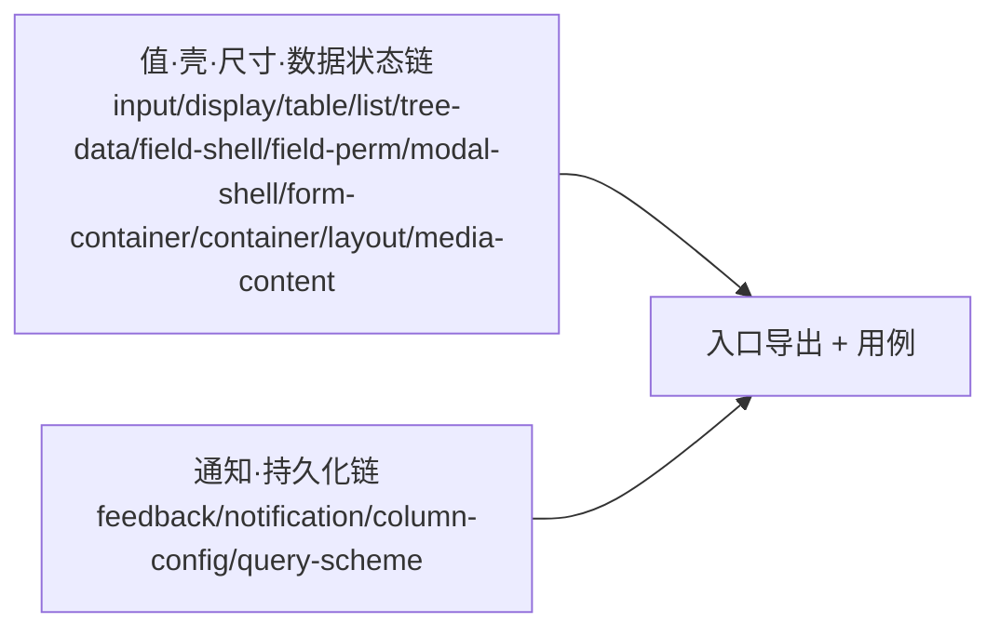

# 04 实施 · 组件基类族

> 前端组件库 · 02 基础组件类 · 子任务 04（需求 02-4）· 实施记录

[文档首页](../../../../../文档首页.md) › [02 基础组件类](../../02_基础组件类.md) › [04 组件基类族](../02_基础组件类_04_组件基类族.md) › 实施记录　|　[← 任务](../02_基础组件类_04_组件基类族.md)

## 1. 实施信息 

| 项 | 值 |
| --- | --- |
| 任务 | [04 组件基类族](../02_基础组件类_04_组件基类族.md) |
| 对应需求 | [02-4](../../../需求/02_需求_基础组件类.md#r02-4) |
| 详细设计 | [04 详细设计](../设计/04_详细设计_01_组件基类族.md) |
| 实施日期 | 2026-09-18 |
| 实施人 | minjian |
| 实施环境 | 本地开发机（Node v24.20.0 / npm 11.19.0，npmmirror） |
| 提交 | 设计 `7e972597`；代码 `4f7d669f` |
| 结论 | 完成 |

## 2. 实施概览 

## 3. 实施过程 

1. 组件基类 16 个落 `capabilities/`：输入族 `BaseInput`、展示族 `BaseDisplay`、数据族 `BaseTable` / `BaseList` / `BaseTreeData`、模态族 `BaseModalShell`、表单容器族 `BaseFormContainer`、尺寸族 `BaseContainer` / `BaseLayout` / `BaseMediaContent`、通知族 `BaseFeedback` / `BaseNotification`、持久化族 `BaseColumnConfig` / `BaseQueryScheme`、字段壳 / 权限族 `BaseFieldShell` / `BaseFieldPerm`。
2. 各基类继承相应能力基类，经继承链取得能力键（`key = pluginKey = identifier`）；状态为纯 TS 内存状态。
3. 字段链组合口径：两条链当前不互相依赖，各自独立（具体字段件在渲染插件层组合，后续任务）；`BaseChart` 本期不建类。
4. 入口导出 + 用例；`npm run core:check` 全绿。

## 4. 问题与处置 

| # | 问题 / 现象 | 原因 | 处置 |
| --- | --- | --- | --- |
| 1 | `BaseTable.size`（页长）与组件根尺寸档位 `size: SizeToken` 冲突 | 根字段 `size` 被组件根占用 | 页长字段改名 `pageSize`（回写详细设计 §3 概要表与清单） |

## 5. 验证结果 

| 验证点 | 方法 | 结果 |
| --- | --- | --- |
| 类型检查 | `npm run core:typecheck` | 通过 |
| Lint（零告警，含注释齐备护栏） | `npm run core:lint` / `guard-jsdoc` | 通过 |
| 单测 | `npm run core:test` | 18 文件 / 100 用例全通过 |
| 门禁串联 | `npm run core:check` | 全绿 |

## 6. 偏差与遗留 

- **偏差**：`BaseTable` 页长字段名 `pageSize`（避开组件根 `size`）——已回写设计 §3 与清单。
- **遗留**：① 具体组件与双端渲染实现随域 03+；② 字段件「值控 + 壳 / 权限」组合随字段域（域 06）；③ `BaseChart` 随需求域 07 图表卡演练新增；④ 清单对账护栏随 `02_07` 收口。

> 本文档依《[文档生成规范](../../../../../规范/文档生成规范.md)》编写
