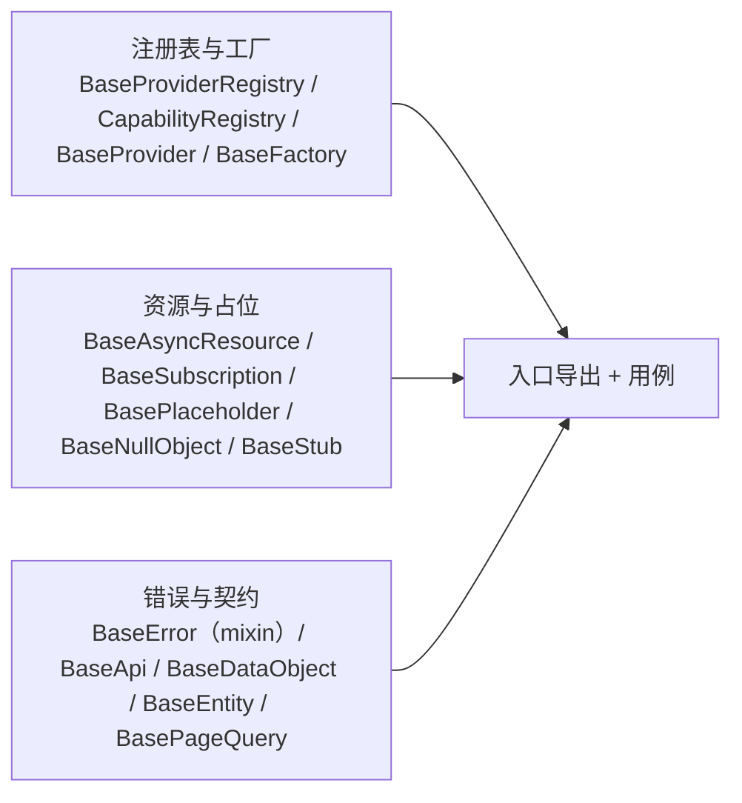

# 05 实施 · 体系机制

> 前端组件库 · 02 基础组件类 · 子任务 05（需求 02-5）· 实施记录

[文档首页](../../../../../../文档首页.md) › [02 基础组件类](../../02_基础组件类.md) › [05 体系机制](../02_基础组件类_05_体系机制.md) › 实施记录　|　[← 任务](../02_基础组件类_05_体系机制.md)

## 1. 实施信息 

| 项 | 值 |
| --- | --- |
| 任务 | [05 体系机制](../02_基础组件类_05_体系机制.md) |
| 对应需求 | [02-5](../../../../需求/02_需求_基础组件类.md#r02-5) |
| 详细设计 | [05 详细设计](../设计/05_详细设计_01_体系机制.md) |
| 实施日期 | 2026-09-18 |
| 实施人 | minjian |
| 实施环境 | 本地开发机（Node v24.20.0 / npm 11.19.0，npmmirror） |
| 提交 | 设计 `4af0f08f`；代码 `7e39056d` |
| 结论 | 完成 |

## 2. 实施概览 

## 3. 实施过程 

1. **混入**：`base/mixin.ts` 落 `withBaseObject`（把 `BaseObject` 公共面注入任意基类）；`BaseObject.ts` 增 `getBaseSinks`。
2. **错误基座**：`mechanisms/error.ts` `BaseError extends withBaseObject(Error)`（保留 `instanceof Error` 与堆栈 + 段位 `code`）。
3. **注册表与工厂**：`registry.ts`（`BaseProviderRegistry<T>` / `CapabilityRegistry`）、`provider.ts`（组合轨 `BaseProvider`）、`factory.ts`（`BaseFactory`）。
4. **资源与占位**：`resource.ts`（逆序释放 / 释放后拒登 / 失败不阻断）、`subscription.ts`、`placeholder.ts`（三件）。
5. **契约基类**：`contracts/{api,data-object,entity,page-query}.ts` + `domain/serialize.ts`（`stableStringify`）。
6. **验证**：`npm run core:check` 全绿（11 文件 / 35 用例）。

## 4. 问题与处置 

| # | 问题 / 现象 | 原因 | 处置 |
| --- | --- | --- | --- |
| 1 | `tsc` 报 `BaseEntity.version` 与 `BaseObject.version` 冲突（`string` vs `number`） | 总基类根字段 `version`（基类版本）与实体乐观锁 `version` 同名 | 实体字段改名 **`recordVersion`**（对应后端实体 `version`），并回写详细设计 §3.5 与《前端基类清单》§2.1 |
| 2 | ESLint 报 `any`（mixin 构造签名）与未用参数 | 混入需任意实参；`validate` 缺省空实现未用参数 | mixin 加显式 `eslint-disable-next-line`（附理由）；`validate` 用 `void options` |
| 3 | `BaseApi` 清单代码位置与实现不符 | 清单原写宿主包 `src/api/base.ts` | 按决策落核心 `contracts/api.ts`，回写清单 §2.1 |

## 5. 验证结果 

| 验证点 | 方法 | 结果 |
| --- | --- | --- |
| 类型检查 | `npm run core:typecheck` | 通过 |
| Lint（零告警） | `npm run core:lint` | 通过 |
| 单测 | `npm run core:test`（Vitest） | 11 文件 / 35 用例全通过 |
| 门禁串联 | `npm run core:check` | 全绿 |

## 6. 偏差与遗留 

- **偏差**：`BaseEntity` 乐观锁字段名 `recordVersion`（避开根字段 `version`，语义对应后端 `version`）——已回写详细设计 §3.5 与清单 §2.1。
- **遗留**：① 各扩展点注册表最小实现随域 10；② `BaseApi` 请求执行 / 401 / 提示由宿主请求层（`02_06`）承接；③ 占位三类降级的渲染语义随组件域；④ 清单 §10 迁移映射仍为旧叙事，待统一修订。

> 本文档依《[文档生成规范](../../../../../../规范/文档生成规范.md)》编写
