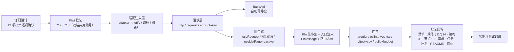

# 请求封装实施记录

> 前端组件库 · 02 基础组件类 · 06 基础类横切底座 · 嵌套 01 请求封装 · 实施记录

[文档首页](../../../../../../../文档首页.md) › [02-6 基础类横切底座](../../02_基础组件类_06_基础类横切底座.md) › [02-6-1 请求封装](../../02_基础组件类_06_基础类横切底座_01_请求封装/02_基础组件类_06_基础类横切底座_01_请求封装.md) › 01 实施　|　[← 父任务](../../02_基础组件类_06_基础类横切底座.md)

## 1. 实施信息 

| 项 | 值 |
| --- | --- |
| 任务 | [02-6-1 请求封装](../../02_基础组件类_06_基础类横切底座_01_请求封装/02_基础组件类_06_基础类横切底座_01_请求封装.md)（8h） |
| 对应需求 | [02-6](../../../../../需求/02_需求_基础组件类.md#r02-6) |
| 详细设计 | [01 详细设计](../设计/01_详细设计_06_01_请求封装.md) |
| 实施日期 | 2026-09-16（父任务窗口 2026-09-22 ~ 2026-09-23，提前交付） |
| 实施人 | minjian |
| 实施环境 | Linux 开发机（mjpc）；Node v24.20.0 / npm 11.19.0；`frontend/apps/desktop/`、`frontend/apps/mobile/`（Vue 3.5 + Vite 8 + Vitest 5 + jsdom）；Kiwi TCMS 容器 `bms-kiwi` |
| 工时 | 8h |
| 提交 | 详细设计 `8b68bcf`；代码 / 用例 `6a598df`（双端）；文档收口见 §3 第 10 步 |
| 结论 | 已完成（双端门禁全通过；401 占位降级 + 并发收敛 / 单次重放、统一解包与提示、幂等键自动生成齐备） |

## 2. 实施概览 

结果小结：请求底座完整落地（同接口多实现、框架无关核心 + 适配注入）：`request<T>` 解包与 `raw`、`ApiError`（继承 `BaseError`）+ i18n 文案、`tokenManager` 单飞刷新、401 会话失效占位降级 + 并发收敛与单次重放、403/404/409/5xx 归一提示、`BaseApi` 写方法自动幂等键、`X-Request-Id` / `Accept-Language` / `Authorization` 注入；组合式 `useRequest`（immediate / refresh / cancel / 竞态）与 `useListPage`（query reactive / 排序 / 选择 / 删除 / 在途取消）。双端各 186 条用例全绿（本任务新增 15 条），覆盖率 88.31 / 79.39 / 86.32 / 88.21。

## 3. 实施过程 

1. **上下文**：读任务 / 需求 02-6、请求封装设计节点全篇（含原型）、规范 §11 / §12、阶段一既有 `http.ts` / `BaseApi` / `useRequest` / `useListPage` 与用例、后端 `/auth` 现状（未就绪）、i18n 与构建配置。
2. **决策确认**（question 逐项，共 12 项）：① 按设计节点拆分文件；② 同接口多实现 + 适配注入；③ 401 注入式 + 占位降级；④ `tokenManager` + store 同步；⑤ 幂等键自动生成；⑥ 默认提示 + silent；⑦ i18n 补最小集；⑧ `useListPage.query` 改 reactive（`AGENTS.md` 补「推荐项着眼长期」原则）；⑨ Kiwi 2 条分层；⑩ 登录跳转注入占位；⑪ 只交嵌套 01；⑫ `AGENTS.md` 变更单独提交（工作区仓库 `a5f0f2e`）。
3. **Kiwi 登记（先登记后编码）**：测试资产仓 `scripts/kiwi/register_cases.py`（输入 `scripts/kiwi/cases/2026-09-16_阶段四02-06-01_请求封装.json`），回读得 **717 / 718**。
4. **请求层**：`adapter.ts`（`configureHttpAdapter` / `getHttpAdapter` / `resetHttpAdapter`）、`error.ts`（`ApiError extends BaseError` + `errorMessage` + 段位常量）、`token.ts`（`tokenManager` 单飞刷新）、`request.ts`（条件泛型 `request<T, O>`：解包 / `raw` / `silent` / `timeout` / `signal` / 幂等键）、`axios-extensions.ts`（`metadata` / `__authRetried` 类型增补）。
5. **拦截器**（`http.ts`）：请求头注入（token / locale / `X-Request-Id` / 写方法兜底幂等键）；响应侧 HTTP 错误归一（401 刷新收敛与单次重放、占位降级清会话 + 跳登录；403 / 404 / 409 / 5xx 分场景提示与码位归一；取消不提示不上报）。
6. **BaseApi 与组合式**：`BaseApi` 方法签名改为 `(url, params|data, options?)` 并自动幂等键；`useRequest` 兼容扩展（`immediate` / `refresh` / `cancel`，`fetcher` 增加 `AbortSignal`）；`useListPage` 改 `query` 为 reactive，补 `selection` / `onSortChange` / `remove` / `onPageChange`。
7. **i18n 与入口**：双端语言包补错误最小集（含 `error.20001`）；PC `main.ts` 注入 `ElMessage` + 路由跳转占位（`/login` / `/403`）。
8. **既有用例适配**：Kiwi 25（`request` 迁至 `@/api/request`、401 行为更新）、Kiwi 23（useListPage reactive）、Kiwi 21（BaseApi 新签名与 mock 路径）同步更新并保持全绿。
9. **双端与验证**：`diff` 比对源码与用例均一致；双端各自跑门禁全通过。**构建体积**：引入 `ElMessage` 后 frontend/apps/desktop 90.0 / 65.9 KB 超原预算，经拍板放宽为 **100 / 75 KB**（`budget.json` + 规范 §14 记录原因），复跑通过；frontend/apps/mobile 72.7 / 72.3 KB 维持原预算。
10. **回写与提交**：节点 01（实现口径）、规范 §11 / §14、清单『契约与横切底座』/『目录与依赖』节、架构 08（HTTP 行）、需求 02-6（注块）、任务 02-6-1 / 父 02-6 / 域总览、计划（工时与 §3.1 第 21 ~ 23 行）、README / 首页；记录与文档收口提交。

## 4. 问题与处置 

| # | 问题 / 现象 | 原因 | 处置与落点 |
| --- | --- | --- | --- |
| 1 | 既有 `request` 导入路径失效（`@/api/http` 无该导出） | `request<T>` 按设计迁至 `@/api/request` | Kiwi 25 用例更新导入；`http.ts` 保留实例与拦截器职责（设计 §2 / §3 同步） |
| 2 | stage-one 断言与新行为冲突（401 透传 → `ApiError`；BaseApi 第三参 config → options） | 设计口径升级（401 刷新 / 幂等键 / 适配注入） | Kiwi 25 / 23 / 21 用例按新契约更新并保持全绿（设计已声明「断言适配」） |
| 3 | frontend/apps/desktop 构建体积超预算（90.0 / 65.9 KB；+ElMessage 与样式） | 统一错误提示按设计引入 `ElMessage` | 经拍板放宽预算 85 / 63 → **100 / 75 KB**（`budget.json`），规范 §14 记录调整原因；设计 §9 登记 |
| 4 | axios 类型无 `metadata` / `__authRetried` | axios v1 类型未声明业务扩展字段 | 新增 `src/api/axios-extensions.ts` 模块增补（设计 §3 同步） |
| 5 | `request` 重载与 `BaseApi` 泛型不兼容（`RequestOptions \| undefined`） | 重载签名无法收窄变量类型 | 改**条件泛型** `request<T, O extends RequestOptions>`（`raw: true` 返回完整响应），调用方零改动 |
| 6 | intlify 缺 `error.20001` 文案告警 | 会话失效码未随最小集补 | 语言包补 `20001`（中英），告警消除 |
| 7 | `useListPage` 切页时旧请求偶发覆盖（潜在） | 仅 seq 判定、无真实取消 | 组合式透传 `AbortSignal`（`useRequest` cancel / run 自动中止），用例覆盖竞态 |
| 8 | 登录页 / 403 页尚不存在 | 页面任务未建 | 路由占位约定 `/login?redirect=` / `/403`，`main.ts` 注入跳转；遗留登记（计划 §3.1 第 22 行） |

## 5. 验证结果 

双端逐条命令与结果见[测试记录](../测试/01_测试_06_01_请求封装.md) §3；结论：`prettier` / `eslint` / `vue-tsc` / `vitest run --coverage` / `build` / `budget` 双端全通过（各 24 个用例文件 / 186 条用例；`src/api` 覆盖 92.39% 语句；构建体积 frontend/apps/desktop 90.0 KB（预算 100）、frontend/apps/mobile 72.7 KB（预算 83））。

## 6. 偏差与遗留 

| # | 项 | 归口 / 去向 |
| --- | --- | --- |
| 1 | 后端 `/auth/login` / `/auth/refresh` 真实链路（401 刷新实链路） | 认证阶段；当前占位降级，注入 `refreshHandler` 即接（计划 §3.1 第 21 行） |
| 2 | 登录页 / 403 页（路由与页面） | 页面任务（计划 §3.1 第 22 行） |
| 3 | 移动端 HTTP 适配注入（Vant 轻提示） | 移动端任务（计划 §3.1 第 23 行） |
| 4 | 幂等键后端 Redis SETNX 拦截 | 后端任务（前端已按契约生成） |
| 5 | 错误码文案全量（当前最小集） | 随后端错误码总表接入补齐 |
| 6 | 大响应体流式 / 导出、同 key 读请求共享在途 Promise | 导入导出任务 / 字典批量（设计 §10 边界） |
| 7 | 构建体积预算放宽（85 / 63 → 100 / 75 KB） | 本次已记录原因（规范 §14）；后续随功能按机制评估 |

- **处理偏差与遗留（2026-09-16 闭环）**：计划 §3.1 新增第 21 ~ 23 行（出处 `02_06_01`）；需求 02-6 `> 注：` 块补齐实现期要点与遗留去向；父任务 `02_06` 状态改「部分完成」（嵌套 01 完成 8h，剩余 7h）；域总览 / 计划 / README / 首页同步。
- **结论**：本任务偏差已记录、遗留已全部登记去向或闭环，偏差与遗留处理完成。

> 本文档依《[文档生成规范](../../../../../../../规范/文档生成规范.md)》编写
