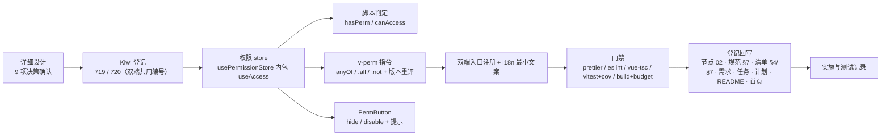

# 权限指令实施记录

> 前端组件库 · 02 基础组件类 · 06 基础类横切底座 · 嵌套 02 权限指令 · 实施记录

[文档首页](../../../../../../文档首页.md) › [02-6 基础类横切底座](../02_基础组件类_06_基础类横切底座.md) › [02-6-2 权限指令](../02_基础组件类_06_基础类横切底座_02_权限指令/02_基础组件类_06_基础类横切底座_02_权限指令.md) › 01 实施　|　[← 父任务](../02_基础组件类_06_基础类横切底座.md)

## 1. 实施信息 

| 项 | 值 |
| --- | --- |
| 任务 | [02-6-2 权限指令](../02_基础组件类_06_基础类横切底座_02_权限指令/02_基础组件类_06_基础类横切底座_02_权限指令.md)（3h） |
| 对应需求 | [02-6](../../../../需求/02_需求_基础组件类.md#r02-6) |
| 详细设计 | [01 详细设计](../设计/01_详细设计_06_02_权限指令.md) |
| 实施日期 | 2026-09-16（父任务窗口 2026-09-22 ~ 2026-09-23，提前交付） |
| 实施人 | minjian |
| 实施环境 | Linux 开发机（mjpc）；Node v24.20.0 / npm 11.19.0；`frontend/`、`frontend-mobile/`（Vue 3.5 + Vitest 5 + jsdom）；Kiwi TCMS 容器 `bms-kiwi` |
| 工时 | 3h |
| 提交 | 详细设计 `1c9ba2e1`；代码 / 用例 `2ea4fadb`（双端）；文档收口见 §3 第 9 步 |
| 结论 | 已完成（双端门禁全通过；指令 / 判定 / store / PermButton 齐备，权限集合唯一来源 `useAccess`） |

## 2. 实施概览 

结果小结：动作权限契约落地（双端同款）：`v-perm`（string / 数组 anyOf / `.all` / `.not`；无权限移除 DOM、注释锚点恢复、`permVersion` 版本监听重评）、`hasPerm` / `canAccess` 脚本判断、`usePermissionStore`（内包 `useAccess`，集合 / 判定 / 过滤唯一来源）、`PermButton`（hide / disable + 提示）；双端入口注册指令。双端各 197 条用例全绿（本任务新增 11 条），覆盖率 88.51 / 79.62 / 86.69 / 88.41。

## 3. 实施过程 

1. **上下文**：读任务 / 需求 02-6、权限指令设计节点全篇、规范 §7、`useAccess` 片段现状（无指令 / store / 守卫）。
2. **决策确认**（question 逐项，共 9 项 + 一轮冲突澄清）：① 建 `usePermissionStore` 内包 `useAccess`（回写任务第 3 条口径）；② `canAccess` 仅脚本判断（守卫遗留）；③ anyOf + `.all` + `.not`；④ 版本监听重评；⑤ 交付 `PermButton`；⑥ 补 i18n 最小文案；⑦ 双端同款 + 双端注册；⑧ Kiwi 2 条；⑨ 回写节点口径。
3. **Kiwi 登记（先登记后编码）**：`register_cases.py`（输入 `scripts/kiwi/cases/2026-09-16_阶段四02-06-02_权限指令.json`），回读得 **719 / 720**。
4. **权限 store**：`usePermissionStore`（codes / menus / permVersion / loaded / loading / loader；`configureLoader` / `load` / `reset` / `setCodes`；判定与过滤委托 `useAccess`；占位不请求）。
5. **脚本判定**：`hasPerm`（anyOf / all；空数组不限制）/ `canAccess`（码 / 数组 / 节点对象 / public / null）。
6. **指令**：`v-perm`（归一码值 → anyOf / `.all` / `.not`；移除 DOM + 注释锚点；`mounted` 建 `effectScope` 监听 `permVersion`（`flush: 'post'`）；`updated` 重评；`unmounted` 清理）。
7. **PermButton 与入口**：框架无关按钮（`fallback: hide / disable` + `title` 提示 + 禁用拦截点击）；i18n 补 `common.noPermission` / `common.forbidden`；双端 `main.ts` 注册 `app.directive('perm', vPerm)`。
8. **双端与验证**：`diff` 比对源码与用例一致；双端门禁全通过（frontend 94.5 / 71.7 KB、mobile 77.4 / 77.0 KB，均在预算内）。
9. **回写与提交**：任务 02-6-2 第 3 条口径 + 状态、父 02_06（嵌套表 / 工时）、域总览、计划（84h / 剩余 4h、§3.1 第 24 ~ 26 行）、README / 首页、需求 02-6 注块、节点 02、规范 §7、清单 §4 / §7。

## 4. 问题与处置 

| # | 问题 / 现象 | 原因 | 处置与落点 |
| --- | --- | --- | --- |
| 1 | 指令「移除 DOM」断言误判 | VTU `find` 对**组件根元素**引用仍可命中（元素已脱离 DOM） | 用例改 `attachTo` + `document.querySelector` 断言真实 DOM（用例代码） |
| 2 | `.all` 用例期望错误（`['a']` 仍满足「全持有」） | 断言设计错误 | 改为 `['a','c']`（c 未持有）验证移除 |
| 3 | 空串权限码被当作码值（`v-perm=""` 误移除） | `codesOf` 仅对数组过滤空串 | 字符串 / 数组统一过滤空串与空白（指令代码） |
| 4 | 设计节点与任务口径冲突（`usePermissionStore` vs「不另建权限存储」） | 文档演进 | 拍板：建 store 内包 `useAccess`；回写**任务第 3 条**（store 仅应用态汇聚，判定唯一来源片段）与节点实现口径 |
| 5 | TS：`permVersion` 联合类型自增报错 | `string \| number` 联合 | 数值自增 / 否则取时间戳（store 代码） |

## 5. 验证结果 

双端逐条命令与结果见[测试记录](../测试/01_测试_06_02_权限指令.md) §3；结论：`prettier` / `eslint` / `vue-tsc` / `vitest run --coverage` / `build` / `budget` 双端全通过（各 26 个用例文件 / 197 条用例；`src/directives` 覆盖 95.65% 语句；构建体积 frontend 94.5 KB（预算 100）、frontend-mobile 77.4 KB（预算 83））。

## 6. 偏差与遗留 

| # | 项 | 归口 / 去向 |
| --- | --- | --- |
| 1 | 路由守卫注册（登录态 + `meta.perm` + 403 跳转） | 登录页 / 菜单任务（计划 §3.1 第 24 行）；本轮只交脚本 `canAccess` |
| 2 | 菜单 / 权限接口接入（`configureLoader` 注入） | 认证 / 菜单任务（计划 §3.1 第 25 行）；当前占位空集 |
| 3 | `PermButton` 皮肤包装（Element Plus 按钮） | 组件任务（计划 §3.1 第 26 行） |
| 4 | 任务第 3 条口径调整（store 包 useAccess） | 本次已回写任务文档与节点实现口径 |
| 5 | 移动端指令同款交付（节点 §9 原「不用 PC 指令」按拍板调整） | 本次已回写节点实现口径 |

- **处理偏差与遗留（2026-09-16 闭环）**：计划 §3.1 新增第 24 ~ 26 行（出处 `02_06_02`）；需求 02-6 注块补齐嵌套 02 口径与遗留；父任务 `02_06` 状态维持「部分完成」（嵌套 01 / 02 完成 11h，剩余 4h）；域总览 / README / 首页同步。
- **结论**：本任务偏差已记录、遗留已全部登记去向或闭环，偏差与遗留处理完成。

> 本文档依《[文档生成规范](../../../../../../规范/文档生成规范.md)》编写
