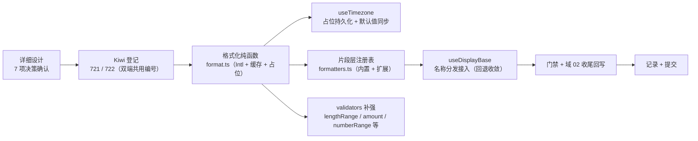

# 格式化工具实施记录

> 前端组件库 · 02 基础组件类 · 06 基础类横切底座 · 嵌套 03 格式化工具 · 实施记录

[文档首页](../../../../../../../文档首页.md) › [02-6 基础类横切底座](../../02_基础组件类_06_基础类横切底座.md) › [02-6-3 格式化工具](../../02_基础组件类_06_基础类横切底座_03_格式化工具/02_基础组件类_06_基础类横切底座_03_格式化工具.md) › 01 实施　|　[← 父任务](../../02_基础组件类_06_基础类横切底座.md)

## 1. 实施信息 

| 项 | 值 |
| --- | --- |
| 任务 | [02-6-3 格式化工具](../../02_基础组件类_06_基础类横切底座_03_格式化工具/02_基础组件类_06_基础类横切底座_03_格式化工具.md)（4h；**域 02 收尾**） |
| 对应需求 | [02-6](../../../../../需求/02_需求_基础组件类.md#r02-6) |
| 详细设计 | [01 详细设计](../设计/01_详细设计_06_03_格式化工具.md) |
| 实施日期 | 2026-09-16（父任务窗口 2026-09-22 ~ 2026-09-23，提前交付） |
| 实施人 | minjian |
| 实施环境 | Linux 开发机（mjpc）；Node v24.20.0 / npm 11.19.0；`apps/desktop/`、`frontend-mobile/`（Vue 3.5 + Vitest 5 + jsdom）；Kiwi TCMS 容器 `bms-kiwi` |
| 工时 | 4h |
| 提交 | 详细设计 `98c7f59b`；代码 / 用例 `8e5e1d87`（双端）；文档收口见 §3 第 9 步 |
| 结论 | 已完成（双端门禁全通过；格式化 / 时区 / 注册表 / 校验器齐备，`02_04` 名义格式化器遗留收敛；**域 02 全部收口**） |

## 2. 实施概览 

结果小结：格式化纯函数（日期时间时区 / 数值 / 金额（只格式化不运算）/ 百分比 / 文件大小 / 时长 / 相对时间 / 脱敏；`Intl` 实例缓存、空值占位）、`useTimezone`（占位持久化 + 默认基准同步）、片段层名义格式化器注册表（内置 6 类 + `registerFormatter`）并接入 `useDisplayBase`（`02_04` 未注册回退遗留收敛）、`validators` 补 7 类规则。双端各 211 条用例全绿（本任务新增 14 条，另有 `base-domain-display` 既有断言随收敛更新），覆盖率 88.9 / 80.18 / 87.02 / 88.82。

## 3. 实施过程 

1. **上下文**：读任务 / 需求 02-6、格式化工具设计节点全篇（含原型）、现有 `validators` / `useTabs` / `useLocale` 片段、`useDisplayBase` 名义回退点、i18n 与布局设计时间格式口径。
2. **决策确认**（question 逐项，共 7 项）：① 三项 + `useTimezone`；② 注册表落**片段层**；③ 注入式默认值；④（边界：金额不运算 / 占位 / 缓存）；⑤ Kiwi 2 条；⑥ 双端同款；⑦ 常规回写面 + 域 02 收尾。
3. **Kiwi 登记（先登记后编码）**：`register_cases.py`（输入 `scripts/kiwi/cases/2026-09-16_阶段四02-06-03_格式化工具.json`），回读得 **721 / 722**。
4. **格式化纯函数**（`utils/format.ts`）：`configureFormatDefaults` / `getFormatDefaults` / `resetFormatDefaults`；`formatDateTime`（token 组装 `yyyy-MM-dd HH:mm[:ss]`、自定义 pattern、时区参数）、`formatDate` / `formatDateRange` / `formatRelativeTime`（刚刚 / 分钟 / 小时 / 昨天 HH:mm / 日期）、`formatNumber` / `formatAmount` / `formatPercent` / `formatFileSize` / `formatDuration` / `maskValue`；`Intl` 实例按 `{locale, timezone, options}` 缓存。
5. **时区组合式**（`utils/useTimezone.ts`）：初始优先级（入参 > localStorage `bms_timezone` > 浏览器）、`setTimezone` 同步默认基准（`flush: 'sync'`）与占位标记。
6. **注册表与展示接入**：`components/base/formatters.ts`（内置 amount / number / percent / date / datetime / boolean；`registerFormatter` / `resolveFormatter` / `resetFormatters`）；`useDisplayBase` 增加 `locale` / `timezone` 选项并接入注册表（未注册仍回退 `String`）。
7. **校验器补强**（`utils/validators.ts`）：`FieldRule` 增可选 `validator`；补 `lengthRange` / `email` / `phone` / `url` / `amount`（精度 + 区间）/ `numberRange` / `codePattern`（空值跳过，`pattern` + `validator` 双消费面）。
8. **i18n 与双端**：补 `common.justNow` / `yesterday` / `yes` / `no` / `hour` / `minute` / `second`（中英）；双端同款复制与 `diff` 校验；`base-domain-display` 既有断言随注册表收敛更新（`amount` 命中 `¥5.00`，`ghost` 回退 `String`）。
9. **回写与提交**：任务 02-6-3 与父 02_06（**已完成**）、域总览（06 已完成）、计划（**已完成 6 项 / 88h，剩余 0h**；§3.1 新增第 27 ~ 29 行）、README / 首页（域 02 全部完成）、需求 02-6（状态 + 注块 + 收尾说明）、节点 03（实现口径）、规范 §10（实现口径）、清单 §4 / §7（格式化层）；平台用例 **710 正文**随收敛修订（内置注册表）。

## 4. 问题与处置 

| # | 问题 / 现象 | 原因 | 处置与落点 |
| --- | --- | --- | --- |
| 1 | 日期格式化输出原样 token（`yyyy-MM-dd HH:mm`） | `formatToParts` 键为 `year` / `month` 等，与 pattern token 不一致 | `timeParts` 归一为 `yyyy` / `MM` / `dd` / `HH` / `mm` / `ss` |
| 2 | 「昨天」分支误判（所有历史日期都判昨天） | `dateKeyOf` 误取 `year/month/day`（实际键为 token 形式） | 改取 `yyyy/MM/dd` |
| 3 | `en-US` 基准下时长仍输出中文单位 | 时长标签取自 i18n 当前 locale，未随 `formatDefaults.locale` | 标签读取按 `options.locale ?? defaults.locale` 取语言包消息（`getLocaleMessage` 遍历） |
| 4 | `email` / `phone` / `url` 规则单测失败 | 规则仅带 `pattern`（由 el-form async-validator 消费），框架无关断言未覆盖 | 引入 `regexRule`（`pattern` + `validator` 双消费面），规则自洽可测 |
| 5 | `useDisplayBase` 名称分发失效（TS 报错） | 局部函数 `resolveFormatter` 与导入同名遮蔽 | 导入重命名 `resolveNamedFormatter` |
| 6 | `useTimezone.setTimezone` 持久化断言失败 | `watch` 默认异步 flush，断言在 watcher 前执行 | `flush: 'sync'`（变更即同步默认基准与持久化） |
| 7 | 既有 `base-domain-display` 断言（未注册回退）失效 | 注册表收敛后 `amount` 命中 | 用例断言更新为 `¥5.00` + `ghost` 回退；平台 710 正文同步修订 |

## 5. 验证结果 

双端逐条命令与结果见[测试记录](../测试/01_测试_06_03_格式化工具.md) §3；结论：`prettier` / `eslint` / `vue-tsc` / `vitest run --coverage` / `build` / `budget` 双端全通过（各 28 个用例文件 / 211 条用例；`src/utils` 覆盖 97.4% 语句；构建体积 apps/desktop 94.6 KB（预算 100）、frontend-mobile 77.5 KB（预算 83））。

## 6. 偏差与遗留 

| # | 项 | 归口 / 去向 |
| --- | --- | --- |
| 1 | 用户时区 / locale 偏好接口（`sys_user.timezone` / `locale`） | 认证 / 个人中心任务（计划 §3.1 第 27 行）；当前占位 localStorage / 浏览器 |
| 2 | `useTabs` UI / 路由联动与 dirty 拦截 | 布局任务（计划 §3.1 第 28 行）；阶段一基础实现复用 |
| 3 | 字段组件格式化接入（日期 / 金额字段展示与校验） | 字段类任务（计划 §3.1 第 29 行） |
| 4 | 枚举文本分发（依赖选项源数据） | 字段 / 展示任务接入注册表 |
| 5 | 平台用例 710 正文修订（内置注册表收敛） | 本次已修订（台账留痕） |

- **处理偏差与遗留（2026-09-16 闭环）**：计划 §3.1 新增第 27 ~ 29 行（出处 `02_06_03`）；需求 02-6 注块补齐嵌套 03 口径与遗留；父任务 `02_06` 与域总览改「已完成」；计划 / README / 首页记「域 02 全部完成（6 项 / 88h）」。
- **结论**：本任务偏差已记录、遗留已全部登记去向或闭环；**域 02 基础组件类（02_01 ~ 02_06）全部收口**。

> 本文档依《[文档生成规范](../../../../../../../规范/文档生成规范.md)》编写
