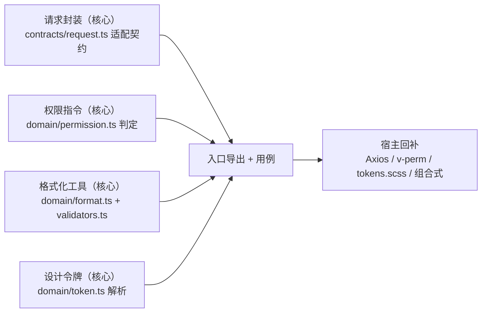

# 06 实施 · 基础类横切底座

> 前端组件库 · 02 基础组件类 · 子任务 06（需求 02-6）· 实施记录

[文档首页](../../../../../文档首页.md) › [02 基础组件类](../../02_基础组件类.md) › [06 基础类横切底座](../02_基础组件类_06_基础类横切底座.md) › 实施记录　|　[← 任务](../02_基础组件类_06_基础类横切底座.md)

## 1. 实施信息 

| 项 | 值 |
| --- | --- |
| 任务 | [06 基础类横切底座](../02_基础组件类_06_基础类横切底座.md) |
| 对应需求 | [02-6](../../../需求/02_需求_基础组件类.md#r02-6) |
| 详细设计 | [06 详细设计](../设计/06_详细设计_01_基础类横切底座.md) |
| 实施日期 | 2026-09-18 |
| 实施人 | minjian |
| 实施环境 | 本地开发机（Node v24.20.0 / npm 11.19.0，npmmirror） |
| 提交 | 设计 `27354000`；代码 核心 `031d1506`、宿主骨架 `69f7db43` |
| 结论 | 完成（核心 + PC 宿主交付；移动端本阶段范围外） |

## 2. 实施概览 

## 3. 实施过程 

1. **请求封装（核心）**：`contracts/request.ts` 落 `ApiResponse` / `PageResponse` / `RequestConfig` / `RequestAdapter` 与 `request()` 占位（未注入适配器抛 `BaseError(19001)`）。
2. **权限指令（核心）**：`domain/permission.ts` 落 `evaluatePermission(codes, required, mode)`（`any` / `all` / `not`）。
3. **格式化工具（核心）**：`domain/format.ts`（日期 / 金额 / 数值 / 百分比 / 文件大小 / 时长 / 相对时间 / 脱敏，走 `Intl`、空值占位）；`domain/validators.ts`（必填 / 长度 / 邮箱 / 手机 / URL / 金额 / 数值范围 / 编码格式）。
4. **设计令牌（核心）**：`domain/token.ts` 落 `resolveToken`（类型已由 `capabilities/design-token.ts` 承载）。
5. **宿主体（PC）**：建 `frontend/packages/vue`（`useValue` / `useAccess` 投影 + testing 入口）与 `frontend/apps/desktop`（Vue3 + Vite + Element Plus）——`src/api`（Axios 适配器 / token / 统一响应解包 / 错误基座继承 / 请求入口）、`src/directives/perm.ts`（`v-perm`）、`src/utils`（`perm` / `format` 基准注入 / `useRequest` / `useListPage`）、`src/styles/tokens.scss`（基础令牌五组 + 档位属性选择器 + 状态类 + EP 映射）、路由与 403/404；根四包门禁挂回 `core + vue`。
6. CI 适配：`deploy/ci/Dockerfile.frontend` 与 `build-base.sh` 改为按现有包（core / vue / apps/desktop）装配。
7. 验证：根 `npm run check`（core + vue）与 `apps/desktop` 的 `lint` / `test:cov` / `build` / `budget` 全绿。

## 4. 问题与处置 

| # | 问题 / 现象 | 原因 | 处置 |
| --- | --- | --- | --- |
| 1 | `evaluatePermission` 空要求下 `not` 返回 false | 空要求统一按 `mode === 'all'` 处理 | 改为 `mode !== 'any'`（`all` / `not` 空要求均为 true） |
| 2 | 注释齐备护栏拦下 `DEFAULT_LOCALE` / `DEFAULT_TIMEZONE` | 模块级常量未写 JSDoc | 补 JSDoc |

## 5. 验证结果 

| 验证点 | 方法 | 结果 |
| --- | --- | --- |
| 类型检查 | `npm run core:typecheck` | 通过 |
| Lint（零告警，含注释齐备护栏） | `npm run core:lint` / `guard-jsdoc` | 通过 |
| 单测（核心） | `npm run core:test` | 22 文件 / 116 用例全通过 |
| 单测（vue 绑定） | `npm run vue:test` | 1 文件 / 2 用例全通过 |
| 单测（宿主） | `apps/desktop` `npm run test:cov` | 6 文件 / 19 用例全通过；覆盖率 97.95%（≥70） |
| 宿主 Lint / 构建 / 预算 | `apps/desktop` `npm run lint` / `build` / `budget` | 全绿（gzip 合计 50.7 KB） |
| 门禁串联 | 根 `npm run check` | 全绿 |

## 6. 偏差与遗留 

- **偏差**：无（按详细设计实施；宿主体按「核心可落部分先落、宿主随后」策略在 PC 宿主落地）。
- **遗留**：① 移动端宿主与 `ui-vant` 插件本阶段范围外（另算）；② 401 刷新处理器与提示 / 路由跳转的实际注入随认证 / 登录页任务；③ 用户时区 / locale 偏好远端持久化随个人中心任务。

> 本文档依《[文档生成规范](../../../../../规范/文档生成规范.md)》编写
