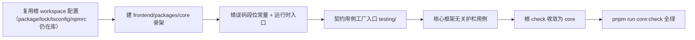

# 07 实施 · 框架无关核心工程与契约保障

> 前端组件库 · 02 基础组件类 · 子任务 07（需求 02-7）· 实施记录

[文档首页](../../../../../../文档首页.md) › [02 基础组件类](../../02_基础组件类.md) › [07 框架无关核心工程与契约保障](../02_基础组件类_07_框架无关核心工程与契约保障.md) › 实施记录　|　[← 任务](../02_基础组件类_07_框架无关核心工程与契约保障.md)

## 1. 实施信息 

| 项 | 值 |
| --- | --- |
| 任务 | [07 框架无关核心工程与契约保障](../02_基础组件类_07_框架无关核心工程与契约保障.md) |
| 对应需求 | [02-7](../../../../需求/02_需求_基础组件类.md#r02-7) |
| 详细设计 | [07 详细设计](../设计/07_详细设计_01_框架无关核心工程与契约保障.md) |
| 实施日期 | 2026-09-18 |
| 实施人 | minjian |
| 实施环境 | 本地开发机（Node v24.20.0 / pnpm 11.x，依赖走 npmmirror） |
| 提交 | 设计 `2d7a41e5`；代码 `5f9a6176` |
| 结论 | 完成（工程骨架 + 核心护栏 + 错误码段位 + 契约工厂入口 + 契约 5 套件 + 清单对账护栏；收口记录见 §7） |

## 2. 实施概览 

- 复用未随前端清空删除的根 workspace 配置（`package.json` / `pnpm-lock.yaml` / `tsconfig.base.json` / `.npmrc`），本期未新增依赖、**未改 `pnpm-lock.yaml`**（不触发 `ci-base-build`）。
- 新建 `frontend/packages/core` 最小可跑骨架，落错误码段位常量（`BaseError` 本体归 `02_05`）、契约用例工厂入口、核心框架无关护栏。
- 根 `package.json` 的 `lint` / `check` 本期收敛为 core（`vue` / `ui-ep` / `ui-vant` 随后补）。

## 3. 实施过程 

1. **复用根配置核对**：确认根 `package.json`（workspaces `frontend/packages/*`）、`pnpm-lock.yaml`（含 `frontend/packages/core` 条目，无依赖）、`tsconfig.base.json`、`.npmrc` 均未删除。
2. **核心包骨架**：建 `frontend/packages/core/{package.json,tsconfig.json,eslint.config.js,vitest.config.ts}`；`package.json` 无 `dependencies` / `peerDependencies`，`exports` 源码直出（`.` 与 `./testing`）。
3. **错误码段位**：`src/mechanisms/error-codes.ts` 落 `ErrorCodes`（`10001` / `10002` / `10003` / `10005` / `30001` / `19001`）与保留子段判定；`src/index.ts` 导出。
4. **契约用例工厂**：`testing/index.ts` 落 `describeContract(name, define)` 统一登记入口。
5. **核心护栏**：`tests/guard-core-framework-agnostic.spec.ts` 三段——源码零框架依赖、包依赖面为空、fixture 拦截。
6. **根门禁收敛**：根 `package.json` `lint` → `core:lint`、`check` → `core:check`。
7. **本地验证**：`pnpm run core:check`（typecheck + lint + test）全绿，5 用例通过。

## 4. 问题与处置 

| # | 问题 / 现象 | 原因 | 处置 |
| --- | --- | --- | --- |
| 1 | 根 `check` 枚举四包，仅 core 时会失败 | 前端清空后 `vue` / `ui-ep` / `ui-vant` 尚未重建 | `lint` / `check` 本期收敛为 core；四包脚本保留，随各包落地挂回（详细设计 §4.4） |
| 2 | `deploy/ci/build-base.sh` / `Dockerfile.frontend` 仍引用已清空的 `frontend/apps/{desktop,mobile}/pnpm-lock.yaml` | 前端整体重建中 | 不改 CI 脚本、不改根 `pnpm-lock.yaml`（避免触发 `ci-base-build`）；登记为阶段级遗留（见 §6） |

## 5. 验证结果 

| 验证点 | 方法 | 结果 |
| --- | --- | --- |
| 类型检查 | `pnpm run core:typecheck` | 通过 |
| Lint（零告警） | `pnpm run core:lint` | 通过 |
| 单测 | `pnpm run core:test`（Vitest） | 2 文件 / 5 用例全通过 |
| 门禁串联 | `pnpm run core:check` | 全绿 |

## 6. 偏差与遗留 

- **偏差**：无（按详细设计实施）。
- **遗留**：
  1. 契约用例工厂**具体契约套件**（值 / 字段 / 输入 / 确认 / 权限 / 容器件 / 反馈件等）随 `02_03` / `02_04` / `02_05` 就位补齐（归口对应任务）。
  2. **清单对账护栏**（实现侧登记 ↔《前端基类清单》↔ 插件导出 ↔ 组件清单）随基类域收口（归口 `02_03` / `02_04`）。
  3. **渲染插件 / 宿主骨架**与根四包脚本挂回随后续需求域（归口域 03+ / 域 10）。
  4. **CI 基础镜像**（`ci-base-build` / `build-base.sh`）引用已清空的 apps 锁文件，属阶段级遗留，随宿主包重建闭环。

## 7. 收口记录（2026-09-18） 

- **契约用例工厂 5 套件**：`describeValueContract` / `describePermissionContract` / `describeFeedbackContract` / `describeContainerContract` / `describeConfirmContract`（`frontend/packages/core/testing/index.ts`；契约面为**结构化接口**，实现侧可用基类实例或投影适配器接入）。
- **实现侧跑通**：核心最小实现（值 / 权限 / 反馈 / 容器）、Vue 绑定投影（`useValue` / `useAccess`）、PC 插件（`useConfirm` / `useFeedback` / `useBaseContainer`）——「同一契约多实现」断言真正执行。
- **清单对账护栏（三重 + 防僵尸）**：`core/tests/guard-manifest.spec.ts` 校验能力文件 `identifier` ↔ `CAPABILITY_MANIFEST` ↔《[前端基类清单](../../../../../../前端基类清单.md)》「已交付」；回补 16 个能力登记（`container` / `layout` / `modal-shell` / `table` / `tree-data` / `input` / `display` / `feedback` / `notification` / `list` / `media-content` / `column-config` / `query-scheme` / `field-shell` / `field-perm` / `form-container`）。
- **根四包脚本挂回**：`core + vue + ui-ep` 已在根 `check` / `lint` 与 CI 挂回；`ui-vant` / `apps/mobile` 属移动端范围外，仅登记。
- **扩展流程演练**：域 03 已交付组件与后续域组件均按「《前端基类清单》登记 → `manifest.ts` 登记 → 契约用例」执行。
- **CI 锁文件遗留闭环**：`frontend/apps/desktop/pnpm-lock.yaml` 存在且被 `deploy/ci/{Dockerfile.frontend,build-base.sh}` 有效引用。
- **提交**：`a1b4ddb9`。

> 本文档依《[文档生成规范](../../../../../../规范/文档生成规范.md)》编写
