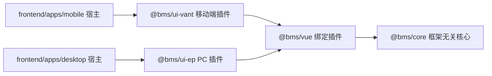

# ui-vant 插件与移动端收口详细设计

> 前端组件库 · 02 基础组件类 · 02-7 框架无关核心重构 · S4 详细设计（决策确认版）

[文档首页](../../../../../../文档首页.md) › [02 基础组件类](../../02_基础组件类.md) › [02-7 框架无关核心重构](../02_基础组件类_07_框架无关核心重构.md) › 详细设计　|　[← 任务文档](../02_基础组件类_07_框架无关核心重构.md)

## 1. 概述 <a id="overview"></a>

本设计定义专项 `02_07` S4 阶段（`ui-vant` 插件与移动端收口）的目标、分批、契约与落点：建立 `frontend/packages/ui-vant` 移动端实现插件（9 件：8 容器件 + `PermButton`），把移动端工程收口为 `frontend/apps/mobile/` 宿主（全量切 `@bms/*`、删除旧基座与旧能力层），并以「同接口多实现 + 契约测试同一套断言」落定双端一致性。上游依据见《[架构设计 · 前端组件体系](../../../../../../设计/架构设计/05_架构设计_前端组件体系.md)》「框架无关核心与插件架构」节；对应需求 [02-3](../../../../需求/02_需求_基础组件类.md#r02-3)（能力机制与预置能力类）与域 02 各层需求的框架无关口径重做。

目标依赖方向：



分批（每批一份实施记录 17 / 18 / 19）：

| 批 | 内容 | 关键产物 |
| --- | --- | --- |
| S4a | 共享逻辑与契约机制：容器共享纯逻辑下沉 `@bms/core`、注入契约与共享工厂、`@bms/core/testing` 契约用例工厂、`useVirtualRange` 迁 `@bms/vue`、`ui-ep` 改造引用 | core `domain/` + `contracts/` + `testing/`；`@bms/vue` 新投影；ui-ep 无本地产权逻辑 |
| S4b | `ui-vant` 插件：包骨架 + 9 件迁入 + 注入实现 + 组件契约工厂 + CI / 镜像扩展 | `frontend/packages/ui-vant/`；`core-check` 覆盖 ui-vant；`ci-frontend` 镜像根依赖 |
| S4c | 移动端宿主收口与结构迁移：移动端归位 `frontend/apps/mobile/`、宿主全量切流、旧件删除、`@bms/vue` 两个新投影、审计重跑与文档回写 | `frontend/apps/mobile/`；旧层删除；台账 / 审计 / 清单回写 |

## 2. 确认口径（2026-09-17 启动确认） <a id="decisions"></a>

| # | 决策点 | 结论 |
| --- | --- | --- |
| 1 | S4 首版组件范围 | **9 件一次全量**（8 容器件 + `PermButton`） |
| 2 | 容器共享逻辑 | 纯 TS 下沉 `@bms/core`；`useVirtualRange` 投影移入 `@bms/vue`；`ui-ep` 同步改造引用 |
| 3 | 注入点归属 | 契约类型在 core（纯 TS）；注入存储 + `configureXxx` + 默认实现留各插件 |
| 4 | 契约测试 | core 出「契约用例工厂」，`ui-ep` / `ui-vant` 各传 adapter 跑同一套断言 |
| 5 | 结构迁移 | 随 S4 同步移动端归位 `frontend/apps/mobile/`（镜像路径 `/opt/ci/frontend-mobile`、job 名 `frontend-mobile-check` 保持） |
| 6 | 宿主收口 | 全量：宿主切 `@bms/*`；旧基座层 + 31 能力 + 9 旧件 + 旧 spec 删除；Kiwi 对账 |
| 7 | CI job | 并入 `core-check`（根 `check` 加 `ui-vant:check`） |
| 8 | CI 依赖 | 扩展 `ci-frontend` 镜像（workspace 根 `npm ci`，含 vant）；`build-base.sh` 哈希输入加根锁文件 |
| 9 | 缺失件 | 严格同构；反馈件等另立「移动端缺口清单」批次 |
| 10 | Vant 深度 | 契约驱动按需用；结构件保持 Vue + CSS |
| 11 | 执行粒度 | 分 3 批（S4a / S4b / S4c）+ 实施记录 + 分批提交 |
| 12 | Kiwi | 随 S4 对账台账（`test/test文档/用例/Kiwi用例台账.md`）；平台置 DISABLED 清单交用户执行 |
| 13 | 纯逻辑落点 | `frontend/packages/core/src/domain/`（新建，架构预留层） |
| 14 | 契约工厂入口 | `@bms/core/testing` 子路径导出（仅测试消费，运行时入口不引入 vitest） |
| 15 | 注入实现层次 | core 附共享工厂（`createConfirmService` / `createPermissionGate` 等，插件各建实例） |
| 16 | 注入契约迁移范围 | **四个全迁**（`confirm` / `permission` / `menuSource` / `viewResolver`）；`viewResolver` 用泛型 `TView` 去掉 Vue 类型 |
| 17 | `@bms/vue` 新投影 | 新增 `useAccess` / `useFrontendBase` 两个最小投影（mobile 宿主消费） |

## 3. 目标结构与交付物 <a id="tree"></a>

```text
frontend/packages/core/
├── src/
│   ├── contracts/
│   │   ├── confirm.ts             # 新增：确认服务契约类型（ConfirmOptions / ConfirmHandler）
│   │   ├── permission.ts          # 新增：权限判定契约类型（PermissionMode / PermissionChecker）
│   │   ├── menu-source.ts         # 新增：菜单状态契约类型（MenuItem / MenuSourceProvider，自 ui-ep 迁入）
│   │   └── view-resolver.ts       # 新增：视图解析契约类型（ViewResolver<TView = unknown>）
│   ├── domain/                    # 新增：框架无关领域 / 工具逻辑（纯 TS）
│   │   ├── scroll-position.ts     # 迁入：滚动位置存储（内存 / session 适配器 + 工厂 + 类型）
│   │   ├── size.ts                # 迁入：尺寸解析（resolveSize）
│   │   ├── virtual-range.ts       # 迁入纯化：前缀和 + 二分 + 可视区计算（纯函数）
│   │   ├── confirm-service.ts     # 新增：确认服务共享工厂（覆盖 / 恢复语义）
│   │   ├── permission-gate.ts     # 新增：权限判定共享工厂
│   │   ├── menu-source-service.ts # 新增：菜单状态共享工厂
│   │   └── view-resolver-service.ts # 新增：视图解析共享工厂
│   └── index.ts                   # 扩展：契约与领域导出
├── testing/                       # 新增：契约用例工厂（`@bms/core/testing`，仅测试消费）
│   ├── index.ts
│   ├── confirm.ts                 # describeConfirmContract
│   ├── permission.ts              # describePermissionContract
│   └── components.ts              # 组件契约工厂（S4b：容器件 / 权限按钮）
└── package.json                   # 扩展：exports 加 "./testing"

frontend/packages/vue/src/bindings/
├── useVirtualRange.ts             # 迁入：可视区投影（API 与旧件同构）
├── useAccess.ts                   # 新增：权限上下文投影（S4c 宿主用）
└── useFrontendBase.ts             # 新增：根系投影（S4c 宿主用）

frontend/packages/ui-vant/         # 新增：移动端实现插件（Vant）
├── src/
│   ├── components/
│   │   ├── common/PermButton.vue
│   │   └── container/{8 件 + index.ts}
│   ├── confirm.ts                 # Vant 默认实现（showConfirmDialog）+ 共享工厂实例
│   ├── permission.ts              # 共享工厂实例（未注入 = 无权限）
│   └── index.ts                   # 插件出口（组件 + 注入点 + 共享逻辑转出）
├── tests/                         # 契约套件 + 组件行为用例（Kiwi 号沿用）
├── env.d.ts · vitest.config.ts · tsconfig.json · package.json
└── README.md（按需）

frontend/apps/mobile/              # 宿主装配（git 历史保留）
```

删除清单（S4c，均在 `frontend/apps/mobile/`；实施修正见实施记录 19 §5）：

```text
旧基座层                           # 12 文件（切 @bms/core / @bms/vue）
旧能力层                           # 31 能力 + 清单 / 出口文件 + 4 域包装件（mobile 无消费）
旧容器组件层                       # 8 件 + scrollPosition / size / useVirtualRange / types
旧权限按钮 PermButton.vue
tests/ 旧层 spec                   # 28 个（base-* 14 / guard-* 4 / format-registry 1 / container-* 9，容器件迁 ui-vant）随旧层删除
```

> 实施修正（2026-09-17）：`src/utils/perm.ts` **保留**（与 `frontend/apps/desktop` 同口径的宿主侧 `checkPerm` 包装 + `canAccess`，判定源切 `@bms/ui-vant`）；`permission` store 保留 host 侧 `filterRoutes` 实现（保 Kiwi 720 第 ⑮ 条覆盖）。

## 4. 分批设计 <a id="batches"></a>

### 4.1 S4a 共享逻辑与契约机制 <a id="s4a"></a>

| 块 | 内容 |
| --- | --- |
| core 领域层 | `src/domain/`（新）：`scroll-position` / `size` / `virtual-range` 三模块（`ui-ep` 与 mobile 现为同源双份，收敛为单实现）；四个注入共享工厂 |
| core 契约层 | `src/contracts/`：`confirm` / `permission` / `menu-source` / `view-resolver` 类型；`menu-source` 形状自 `ui-ep` 照迁，`view-resolver` 泛型化去 Vue |
| core 测试工具 | `testing/`（新入口）：`describeConfirmContract` / `describePermissionContract`；组件契约工厂随 S4b 补 |
| `@bms/vue` | `useVirtualRange` 投影迁入（对旧件 API 同构：`MaybeRefOrGetter` 入参 / `ComputedRef` 出参 / `setViewport`） |
| `ui-ep` 改造 | 删除本地 `scrollPosition.ts` / `size.ts` / `useVirtualRange.ts` / `types.ts`；组件与出口改引用 core / vue；四个注入模块改用 core 共享工厂；出口 API 不变 |
| 验证 | `npm run check`（core + vue + ui-ep）全绿；无 CI 结构变化 |

### 4.2 S4b ui-vant 插件 <a id="s4b"></a>

| 块 | 内容 |
| --- | --- |
| 包骨架 | 对齐 `ui-ep`：`package.json`（deps `@bms/core` / `@bms/vue` / `vant`；peer `vue` / `vue-i18n` / `vue-router`）、`tsconfig`、`vitest.config.ts`（jsdom + `vant` inline）、`env.d.ts` |
| 组件迁入 | 9 件自 mobile 照迁：改 import 源（`@bms/vue` / `@bms/core` / `@bms/ui-vant` 内相对路径）、显式导入 Vant 组件与按需样式；类名钩子（`bms-*`）与 props / emits / 暴露方法契约不变 |
| 注入实现 | `confirm.ts`：Vant `showConfirmDialog` 默认实现；`permission.ts`：共享工厂（mobile 未注入判定 = 无权限，与 PC 语义一致） |
| 组件契约工厂 | `@bms/core/testing/components.ts`：结构性不变量 + 关键交互（约 9 组）；`@bms/vue/testing` 提供 mount adapter（结构接口，不引入 Vue 类型进 core） |
| CI / 镜像 | 根 `check` 加 `ui-vant:check`；`core-check` job 内 `npm run check` 自然覆盖；`Dockerfile.frontend` 增加 workspace 根 `npm ci`（含 vant）；`build-base.sh` 哈希输入加根 `package-lock.json` |
| 验证 | ui-vant typecheck + test 全绿；core / vue / ui-ep 无回归；`npm run check` 全绿 |

### 4.3 S4c 移动端宿主收口与结构迁移 <a id="s4c"></a>

| 块 | 内容 |
| --- | --- |
| 结构迁移 | 移动端归位 `frontend/apps/mobile/`（git 历史保留）；vite / tsconfig / scripts / CI / 文档全链引用更新；镜像内路径 `/opt/ci/frontend-mobile` 与 job 名保持 |
| 宿主切流 | `vite.config.ts` 加 `@bms/*` alias（同 `frontend/apps/desktop` 口径）+ 手动分包；`main.ts` 接线；`src/adapters/ui-bootstrap.ts`（`configurePermissionChecker` ← 权限 store）；stores / api / directives / views / dev 页切 `@bms/*` |
| `@bms/vue` 补投影 | `useAccess`（core `BaseAccess` ↔ 响应式；`codes` / `has` / `hasAny` / `hasAll`）、`useFrontendBase`（core `BaseFrontend` ↔ 组合式；`log` / `reportError` / `getConfig` / `dispose`） |
| 旧件删除 | 删除清单见第 3 节；旧 spec 随层删除；`container-*` 用例已随 S4b 迁入 `ui-vant/tests/` |
| 宿主测试改造 | 保留并改造 `request` / `http` / `home` / `directive-perm` / `permission` 等宿主用例；覆盖率不低于现状 |
| 台账与回写 | Kiwi 台账 §2.1 mobile 侧对账 + 平台置 DISABLED 清单；前端基类清单 §9 / §10、审计文档、计划 §3、任务状态、会话交接 |

## 5. 契约设计 <a id="contract"></a>

### 5.1 `frontend/packages/core/src/domain/` <a id="domain"></a>

**`scroll-position.ts`**（自原容器件 `scrollPosition.ts` 照迁，行为不变）

```ts
export interface ScrollStorage { getItem(key: string): string | null; setItem(key: string, value: string): void; removeItem(key: string): void }
export interface ScrollPositionStore { get(key: string): number | undefined; set(key: string, top: number): void; remove(key: string): void }
export interface ScrollMetrics { scrollTop: number; scrollHeight: number; clientHeight: number }

export function createMemoryScrollStorage(): ScrollStorage
export const defaultScrollStorage: ScrollStorage
export function createSessionScrollStorage(prefix = 'bms:scroll:'): ScrollStorage
export function createScrollPositionStore(storage: ScrollStorage = defaultScrollStorage): ScrollPositionStore
```

**`size.ts`**

```ts
export function resolveSize(value: number | string | undefined): string | undefined
```

**`virtual-range.ts`**（由 `useVirtualRange` 纯化：Vue 响应式留在 `@bms/vue` 投影）

```ts
export interface VirtualScrollMetrics extends ScrollMetrics { startIndex: number; endIndex: number }
export interface VirtualRangeInput {
  itemCount: number
  itemHeight: number
  buffer: number
  heights?: readonly (number | undefined)[] | null
  estimated?: number
  scrollTop: number
  viewportHeight: number
}
export interface VirtualRangeResult {
  readonly startIndex: number
  readonly endIndex: number
  readonly offsetY: number
  readonly totalHeight: number
  offsetOf(index: number): number
  indexAt(top: number): number
}
export function computeVirtualRange(input: VirtualRangeInput): VirtualRangeResult
```

语义（与旧实现逐条等价）：兜底与夹取（`itemHeight ≥ 1`、`buffer ≥ 0`、`count ≥ 0`）；前缀和长度 `count + 1`；定高走公式（`heights` 缺省）与动态走二分（`offsets[i] <= top` 最大 i）；空列表 `indexAt` 返回 0、范围 0/0；`endIndex` 含缓冲且不超过 `count`。

**注入共享工厂**

```ts
// confirm-service.ts
export interface ConfirmService { configure(next: ConfirmHandler | undefined): void; confirm(options: ConfirmOptions): Promise<boolean> }
export function createConfirmService(defaultHandler: ConfirmHandler): ConfirmService

// permission-gate.ts
export interface PermissionGate { configure(next: PermissionChecker | undefined): void; check(code: string | string[] | null | undefined, mode?: PermissionMode): boolean }
export function createPermissionGate(): PermissionGate

// menu-source-service.ts
export interface MenuSourceService { configure(next: MenuSourceProvider | undefined): void; get(): MenuSourceProvider | undefined }
export function createMenuSourceService(): MenuSourceService

// view-resolver-service.ts
export interface ViewResolverService<TView = unknown> { configure(next: ViewResolver<TView> | undefined): void; resolve(name: string): TView | null }
export function createViewResolverService<TView = unknown>(): ViewResolverService<TView>
```

语义：未覆盖 → 默认实现在场（`confirm`）/ 未注入语义（`permission` 空码放行、非空拒绝；`menuSource` / `viewResolver` 未注入返回空 / `null`）；覆盖传 `undefined` 即恢复；覆盖实现的 rejection 原样传播（默认实现自捕获取消）。

### 5.2 `frontend/packages/core/src/contracts/` <a id="contracts"></a>

```ts
// confirm.ts
export interface ConfirmOptions { title?: string; message: string; confirmText?: string; cancelText?: string; danger?: boolean }
export type ConfirmHandler = (options: ConfirmOptions) => Promise<boolean>

// permission.ts
export type PermissionMode = 'any' | 'all'
export type PermissionChecker = (codes: readonly string[], mode: PermissionMode) => boolean

// menu-source.ts（形状自 ui-ep 照迁）
export interface MenuItem { /* 现 ui-ep 形状照迁 */ }
export interface MenuSourceProvider {
  visibleMenus(): MenuItem[]
  expandedKeys(): string[]
  setExpanded(key: string, open: boolean): void
  expandByPath(path: string): void
}

// view-resolver.ts（去 Vue：TView 泛型化，插件侧专化为 Component）
export type ViewResolver<TView = unknown> = (name: string) => TView | null
```

`ui-ep` 侧保持对外类型名不变：`export type ViewResolver = CoreViewResolver<Component>`；`nameComponent`（Vue 专有）留在 `ui-ep`。

### 5.3 `@bms/core/testing` 契约用例工厂 <a id="testing"></a>

```ts
// testing/confirm.ts
export interface ConfirmContractSubject { configure(next: ConfirmHandler | undefined): void; confirm(options: ConfirmOptions): Promise<boolean> }
export function describeConfirmContract(subject: ConfirmContractSubject): void

// testing/permission.ts
export interface PermissionContractSubject { configure(next: PermissionChecker | undefined): void; check(code: string | string[] | null | undefined, mode?: PermissionMode): boolean }
export function describePermissionContract(subject: PermissionContractSubject): void

// testing/components.ts（S4b 使用）
export interface ComponentMountOptions { props?: Record<string, unknown>; slots?: Record<string, unknown> }
export interface ScrollMetricsStub { scrollHeight?: number; clientHeight?: number; scrollTop?: number }
export interface ComponentViewHandle {
  html(): string
  text(): string
  has(selector: string): boolean
  count(selector: string): number
  attr(selector: string, name: string): string | undefined
  trigger(selector: string, event: string): Promise<void>
  stubMetrics(selector: string, metrics: ScrollMetricsStub): Promise<void>
  flushRender(): Promise<void>
  emitted(event: string): unknown[][]
  exposed<T = Record<string, unknown>>(): T
  unmount(): void
}
export interface ComponentContractKit {
  mount(name: string, options?: ComponentMountOptions): ComponentViewHandle
  configurePermissionChecker(next: PermissionChecker | undefined): void
}
export function describeContainerComponentsContract(kit: ComponentContractKit): void
export function describePermButtonContract(kit: ComponentContractKit): void
```

断言范围与边界：

- 挂载适配在 `@bms/vue/testing`：`createContractKit({ mount, components, configurePermissionChecker, global? })` 把 `@vue/test-utils` wrapper 适配为上述结构接口（核心不引入 Vue 类型；`global` 供 i18n 等插件注入）；

- `confirm`：覆盖生效（收到完整 `options`、`true` / `false` 透传、reject 原样传播）；多次覆盖取最后一次；`configure(undefined)` 后覆盖探针不再被调用（真实默认 UI 不触发，默认实现行为由各插件自测）；
- `permission`：未注入语义（空码放行 / 非空拒绝）；注入后 `string` 归一为单元素数组、`mode` 透传、返回值透传；`configure(undefined)` 回未注入语义；
- 组件（S4b）：结构性不变量（根类名钩子、插槽渲染、关键 props 语义）+ 关键交互（懒加载降级、加载态、虚拟切片、全屏切换、权限按钮显隐）；细粒度行为保留在各插件自有 spec；
- 契约套件属「实现一致性护栏」（类比核心护栏与契约用例），向 Kiwi 平台不单独登记编号；组件行为用例沿用既有 Kiwi 编号（mobile 侧 `742 ~ 750` 等随迁）。

### 5.4 `@bms/vue` 绑定 <a id="vue"></a>

```ts
// bindings/useVirtualRange.ts（迁入；API 与旧件同构）
export interface VirtualRangeOptions {
  itemCount: MaybeRefOrGetter<number>
  itemHeight: MaybeRefOrGetter<number>
  buffer: MaybeRefOrGetter<number>
  heights?: MaybeRefOrGetter<(number | undefined)[] | null>
  estimated?: MaybeRefOrGetter<number | undefined>
}
export interface VirtualRangeReturn {
  readonly startIndex: ComputedRef<number>
  readonly endIndex: ComputedRef<number>
  readonly offsetY: ComputedRef<number>
  readonly totalHeight: ComputedRef<number>
  offsetOf(index: number): number
  indexAt(top: number): number
  setViewport(scrollTop: number, viewportHeight: number): void
}
export function useVirtualRange(options: VirtualRangeOptions): VirtualRangeReturn

// bindings/useAccess.ts（S4c；core BaseAccess 投影，最小面）
export interface UseAccessOptions { codes?: MaybeRefOrGetter<readonly string[]> }
export interface UseAccessReturn {
  readonly codes: readonly string[]
  has(code: string): boolean
  hasAny(codes: readonly string[]): boolean
  hasAll(codes: readonly string[]): boolean
}
export function useAccess(options?: UseAccessOptions): UseAccessReturn

// bindings/useFrontendBase.ts（S4c；core BaseFrontend 投影）
export interface UseFrontendBaseOptions {
  ns?: string
  identifier?: string
  version?: string
  logger?: FrontendLogger
  config?: FrontendConfigReader
  errorReporter?: (error: unknown, context?: Record<string, unknown>) => void
}
export interface UseFrontendBaseReturn {
  readonly ns: string
  readonly identifier: string
  readonly version: string
  log(level: LogLevel, message: string, meta?: Record<string, unknown>): void
  reportError(error: unknown, meta?: Record<string, unknown>): void
  getConfig<T = unknown>(key: string, fallback?: T): T
  dispose(): void
}
export function useFrontendBase(options?: UseFrontendBaseOptions): UseFrontendBaseReturn
```

`useAccess` / `useFrontendBase` 与旧件行为同构（日志前缀含 `identifier`，上报出口一致）；`access.version` 与 `filterRoutes` 不再由投影提供（版本由宿主 store 自持；`filterRoutes` 现无消费方，移动端菜单运行时随后续任务再定）。

### 5.5 `ui-vant` 注入实现与组件口径 <a id="uivant"></a>

- `confirm.ts`：`createConfirmService(async (options) => { /* Vant showConfirmDialog */ })`；`danger` 映射确定按钮危险色；取消 / 关闭返回 `false`；导出 `configureConfirm` / `confirm` 与类型；**Vant 对话框与样式按需加载**（动态 import，控宿主包体，实施调整）；
- `permission.ts`：`createPermissionGate()`；导出 `checkPerm` / `configurePermissionChecker` 与类型；
- 组件：结构件（宽高比 / 自适应 / 懒加载 / 虚拟 / 区域 / 滚动）保持 Vue + CSS（类名钩子与 PC 同构：`bms-<组件>-*`）；仅视觉 / 交互点用 Vant（如 `LoadingContainer` 加载态 `van-loading`）；`PermButton` 视觉对齐 Vant 按钮语义（按需引入）。

## 6. 测试设计 <a id="tests"></a>

| 批 | 用例 | 覆盖 |
| --- | --- | --- |
| S4a | `frontend/packages/core/tests/domain-*.spec.ts` 新增 + 契约工厂探针自测 | 滚动位置存储（内存 / session / 非法值）、`resolveSize`、虚拟区计算（定高 / 动态 / 二分 / 空列表）、四个共享工厂（覆盖 / 恢复 / 透传） |
| S4a | `frontend/packages/core/tests/contracts/*.spec.ts`（工厂自身）+ `frontend/packages/ui-ep/tests/contracts.spec.ts`（跑工厂） | confirm / permission 契约对 `ui-ep` 实现全绿 |
| S4a | `frontend/packages/vue/tests`（`useVirtualRange` 迁移 2 条）+ `frontend/packages/ui-ep/tests/container-*.spec.ts` | 投影行为与旧件一致（原断言不变） |
| S4b | `frontend/packages/ui-vant/tests/`：随迁 mobile `container-*.spec.ts`（Kiwi 742 ~ 750 等）+ 契约套件执行 | 9 件行为 + 双端契约一致 |
| S4c | `frontend/apps/mobile` 宿主用例改造（request / http / home / directive-perm / permission 等） | 宿主切流无回归；覆盖率不低于现状（语句 89.17% / 分支 79.88%） |

- jsdom 缺口沿用现状处置：无 `ResizeObserver` / 无真实布局 / 无 Fullscreen API → stub 或降级路径；
- 契约与护栏用例不登记 Kiwi；需求行为用例编号以平台自增为准，mobile 侧随迁后与 desktop 侧做双端对账。

## 7. 实施步骤 <a id="steps"></a>

1. **S4a**：core `domain/`（纯逻辑 + 共享工厂）→ `core/testing`（契约工厂）→ `@bms/vue` 投影迁入 → `ui-ep` 改造引用与用例 → `npm run check` 全绿 → 实施记录 17；回写《前端基类清单》相关条目（core 层新增领域 / 契约）。
2. **S4b**：`frontend/packages/ui-vant` 骨架 → 9 件迁入 + 注入实现 → 组件契约工厂（core/testing/components + vue/testing adapter）→ 用例迁入 → 根 `check` / CI / 镜像与锁文件更新 → 实施记录 18。
3. **S4c**：`git mv` 结构迁移 + 全链引用 → 宿主切流（含 `@bms/vue` 两投影）→ 旧件与旧 spec 删除 → 宿主用例改造 → 台账对账 / 审计重跑 / 文档回写（清单 / 计划 / 任务 / 规范 / 会话交接）→ 实施记录 19。
4. 提交分笔：代码（`feat` / `refactor`）与文档（`docs`）分开；推送按两级指令独立确认。

## 8. 验收映射 <a id="accept-map"></a>

| 完成标准（任务 §3 与 S4 行） | 本设计对应 |
| --- | --- |
| `frontend/packages/ui-vant` 插件就位且可替换 | S4b：9 件同契约实现 + 注入点 + 出口；契约套件对 ui-ep / ui-vant 同一套断言全绿 |
| 移动端宿主接入（移动端工程可复用部分迁移） | S4c：`frontend/apps/mobile` 全量切 `@bms/*`；旧件删除 |
| 契约测试同一套断言 | S4a：`@bms/core/testing` 工厂；S4b：双实现执行 |
| 工程门禁全通过 | S4a / S4b / S4c：`vue-tsc` / ESLint / Vitest / 构建 / 预算；CI `core-check` / `frontend-mobile-check` / `frontend-mobile-build` 全绿 |
| 审计重跑通过 | S4c：基类与能力合规审计（mobile 侧口径）重跑 |
| 文档回写 | S4c：清单 / 计划 / 任务 / 会话交接 / Kiwi 台账对账 |

## 9. 边界与开放项 <a id="boundary"></a>

| # | 项 | 处置 |
| --- | --- | --- |
| 1 | `frontend/apps/desktop` 旧基座层与能力层（4 域包装件）仍在消费 | 本批不动（S4 口径为移动端收口）；建议另立收口批次按 mobile 同口径处置，登记为后续遗留 |
| 2 | `menuSource` / `viewResolver` 契约迁 core 后仅 desktop 消费 | mobile 无侧边菜单 / 标签需求；未来出现需求直接消费 core 契约，不重复建 |
| 3 | 移动端缺失件（`EmptyState` / `LoadingMask` / `SkeletonBlock` / `ErrorPage` 等） | 另立「移动端缺口清单」批次处理（本次确认严格同构） |
| 4 | Kiwi 平台侧旧件用例置 `DISABLED` | 随 S4c 输出执行清单，平台操作由用户执行 |
| 5 | `access.filterRoutes` 移动端无消费方 | 不再迁入投影；移动端菜单运行时随后续任务再定 |
| 6 | 4 域包装件（`BaseTree` / `BaseEditor` / `BaseDisplay` / `BaseInput`）mobile 侧无消费 | 随旧层删除；core 能力类保留，未来移动端需要时复用 |
| 7 | 构建预算 | mobile 现 78.1 / 83 KB；切流后按实测调整 `budget.json`（只降不升原则评估） |

## 10. 对齐记录 <a id="align"></a>

| # | 事项 | 设计与确认 | 依据 |
| --- | --- | --- | --- |
| 1 | 首批 9 件全量、严格同构 | 8 容器件 + `PermButton`；缺失件另立项 | 启动确认（用户，2026-09-17） |
| 2 | 共享逻辑单实现 | 纯 TS 下沉 core；`useVirtualRange` 投影入 `@bms/vue` | 启动确认（用户） |
| 3 | 注入点归属 | 契约在 core、实现在插件；core 附共享工厂 | 启动确认（用户）+ 落点确认（用户） |
| 4 | 契约测试组织形式 | core 契约用例工厂（`@bms/core/testing` 子路径） | 启动确认（用户） |
| 5 | 结构迁移时机 | 随 S4 同步（不改镜像路径与 job 名） | 启动确认（用户） |
| 6 | 宿主收口范围 | 全量（含旧基座 / 能力层删除与 KiB 台账对账） | 启动确认（用户） |
| 7 | CI 结构 | 并入 `core-check`；镜像根依赖扩展 | 启动确认（用户） |
| 8 | 注入契约四全迁 | `viewResolver` 泛型 `TView` 去 Vue，`ui-ep` 专化为 `Component` | 设计确认（用户） |
| 9 | `@bms/vue` 新投影 | `useAccess` / `useFrontendBase` 最小面 | 设计确认（用户） |
| 10 | desktop 旧能力层不动 | S4 只收口 mobile；desktop 收口另立遗留 | 设计取舍（边界开放项 1） |

> 本文档依《[文档生成规范](../../../../../../规范/文档生成规范.md)》编写
