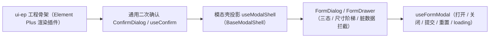

# 01 实施 · 弹窗抽屉表单

> 前端组件库 · 03 布局组件类 · 子任务 01（需求 03-1）· 实施记录

[文档首页](../../../../../文档首页.md) › [03 布局组件类](../../03_布局组件类.md) › [01 弹窗抽屉表单](../03_布局组件类_01_弹窗抽屉表单.md) › 实施记录　|　[← 任务](../03_布局组件类_01_弹窗抽屉表单.md)

## 1. 实施信息 

| 项 | 值 |
| --- | --- |
| 任务 | [01 弹窗抽屉表单](../03_布局组件类_01_弹窗抽屉表单.md) |
| 对应需求 | [03-1](../../../需求/03_需求_布局组件类.md#r03-1) |
| 详细设计 | [01 详细设计](../设计/01_详细设计_01_弹窗抽屉表单.md) |
| 实施日期 | 2026-09-18 |
| 实施人 | minjian |
| 实施环境 | 本地开发机（Node v24.20.0 / npm 11.19.0，npmmirror） |
| 提交 | 设计 `0779da03`；`ui-ep` 骨架与二次确认 `e4b7a8b8`；弹窗表单件 `5bb4b034` |
| 结论 | 完成 |

## 2. 实施概览 

## 3. 实施过程 

1. **`ui-ep` 骨架**：建 `frontend/packages/ui-ep`（package.json / tsconfig / eslint / vitest + `src/components/<族>/`）；根 `check` / `lint` 与 CI 挂回 `core + vue + ui-ep`。
2. **通用二次确认**：`ConfirmDialog.vue` + `useConfirm()`（Promise 结算）；供页签 / 菜单关闭复用。
3. **模态壳投影**：`useModalShell()` 实例化核心 `BaseModalShell`（派生链 `BaseModalShell → BaseOverlay → BaseSized → BaseComponent → BasePluggable → BaseCapability → BaseObject`），投影为响应式 `visible` + `requestClose` + `setBeforeClose`。
4. **弹窗表单件**：`FormDialog.vue`（对话框，尺寸 sm/md/lg = 420/480/520）、`FormDrawer.vue`（抽屉，sm/md/lg/xl = 400/480/640/720）；三态标题按 `mode` + 对象名组合，`detail` 态隐藏提交；脏数据经 `beforeClose` 拦截；提交复用宿主请求组合式（页面注入）。
5. **组合式**：`useFormModal()`（打开 / 关闭 / 提交 / 重置 / `loading` / `markDirty`）。
6. 验证：根 `npm run check`（core + vue + ui-ep）全绿。

## 4. 问题与处置 

| # | 问题 / 现象 | 原因 | 处置 |
| --- | --- | --- | --- |
| 1 | 组件测试中 `ElDialog` / `ElDrawer` 内容默认 Teleport 到 body，`find` 取不到 | 弹窗内容 teleport | 测试以 stub 替换 `ElDialog` / `ElDrawer` / `ElButton`（保留 `title` 渲染与插槽） |
| 2 | `FormDialog` 关闭被拦截时不得误发 `update:modelValue=false` | 关闭须经 `beforeClose` | 关闭统一走 `requestClose`；被拦截时核心 `open` 不变，不触发 `update` |

## 5. 验证结果 

| 验证点 | 方法 | 结果 |
| --- | --- | --- |
| 类型检查 / Lint | 根 `npm run check`（含 ui-ep typecheck + lint） | 通过 |
| 单测（ui-ep） | `npm run ui-ep:test` | 3 文件 / 11 用例全通过 |
| 门禁串联 | 根 `npm run check` | 全绿 |

## 6. 偏差与遗留 

- **偏差**：无（按详细设计实施）。
- **遗留**：① 真实字段表单与校验接入随字段类需求（域 06）；② `useConfirm` / `useFormModal` 在页签 / 菜单关闭场景的接线归 `03_03` / `03_04`；③ 移动端 `ui-vant` 本阶段范围外。

> 本文档依《[文档生成规范](../../../../../规范/文档生成规范.md)》编写
