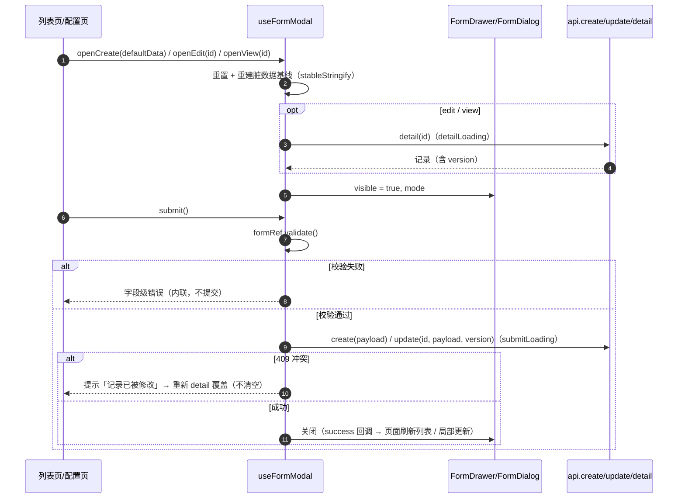
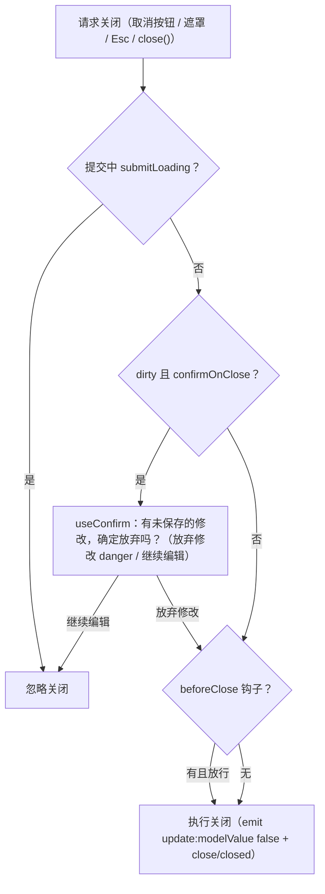

# 弹窗抽屉表单详细设计

> 前端组件库 · 03 布局组件类 · 01 弹窗抽屉表单 · 详细设计

[文档首页](../../../../../../文档首页.md) › [03-1 弹窗抽屉表单](../03_布局组件类_01_弹窗抽屉表单.md) › 01 详细设计　|　[← 父任务](../03_布局组件类_01_弹窗抽屉表单.md)

## 1. 概述 <a id="overview"></a>

- **目标**：落地 PC 管理端弹窗 / 抽屉表单容器与确认能力（仅 `frontend/apps/desktop/`）：表单抽屉 `FormDrawer`、表单对话框 `FormDialog`、确认对话框 `ConfirmDialog`、弹窗表单组合式 `useFormModal`、确认组合式 `useConfirm`——三态（新增 / 编辑 / 详情）、尺寸阶梯、生命周期、脏数据拦截与提交前确认统一口径。
- **范围**：任务 [03-1](../03_布局组件类_01_弹窗抽屉表单.md)（需求 [03-1](../../../../需求/03_需求_布局组件类.md#r03-1)）；组件与用例；登记回写（弹窗 html 关闭 / 未保存拦截口径）。
- **依据**：《组件设计》[01_组件设计_弹窗抽屉表单](../../../../../../设计/组件设计/04_容器组件类/01_组件设计_弹窗抽屉表单/01_组件设计_弹窗抽屉表单.md)（契约基准，含可交互原型）、《布局设计》[10_布局设计_弹窗](../../../../../../设计/布局设计/10_布局设计_弹窗.html)、[08_布局设计_表单页](../../../../../../设计/布局设计/08_布局设计_表单页.html)、《[前端开发规范](../../../../../../规范/前端开发规范.md)》§3（组件根 + 能力）/ §5（SFC 约定）/ §9（样式令牌）、《[前端基类清单](../../../../../../前端基类清单.md)》。
- **前置契约（已交付）**：域 02 基类体系（2026-09-16）——组件根 `useComponentBase`、容器能力 `useContainer`、`useRequest` / `stableStringify` / `hasPerm` / `v-perm` / `useAccess`；基础令牌（`03_06`，2026-09-16）——`--bms-*` 与 EP 映射（颜色 / 圆角 / 字体自动统一）。
- **边界**：不含字段真实渲染（字段控件与 `layout-effective` 元数据，随字段类任务）；不含导入映射 / 批量配置专用表单（导入导出任务）；不含移动端（需求范围外，mobile 以 `van-popup` 另算）；不含表单页 / FormFrame（`03-5`）。

## 2. 现状与差距 <a id="gap"></a>

| # | 项 | 现状 | 差距 / 动作 |
| --- | --- | --- | --- |
| 1 | 弹窗组件 | `frontend/packages/ui-ep/src/components/modal/` 不存在 | 新建 `FormDrawer.vue` / `FormDialog.vue` / `ConfirmDialog.vue` + 域出口 `index.ts` |
| 2 | 组合式 | `src/utils/` 无 `useFormModal` / `useConfirm` | 新建两件（`src/utils/`，节点 §2 指定落点） |
| 3 | EP 依赖 | element-plus 2.14.5 已装、`unplugin-vue-components` 按需导入已配置 | 模板直接 `<el-drawer>` / `<el-dialog>` / `<el-form>`；命令式 `ElMessageBox` 显式导入 + 样式导入 |
| 4 | 令牌 | 基础令牌与 EP 映射已交付（`03_06`） | 弹窗宽度 / 间距 / 分隔线消费令牌；EP 组件经映射自动取令牌色与圆角 |
| 5 | 脏数据 / 提交 | `stableStringify`（阶段一）、`useRequest`（`02_06`）已交付 | `useFormModal` 直接复用，不重复实现 |
| 6 | 权限 | `hasPerm` / `v-perm` / `useAccess` 已交付（`02_06`） | `submitPerm` / `deleteHandler` 显隐复用；无权限不渲染保存 / 删除按钮 |
| 7 | i18n | `src/i18n/{zh-CN,en-US}.ts` 已有 `common` / `error` 节 | 补 `common.save` 等与 `modal.*` 文案键（双语言） |

## 3. 交付物清单 <a id="tree"></a>

```text
frontend/packages/ui-ep/src/components/modal/
├── FormDrawer.vue                       # 新增：表单抽屉（el-drawer 壳 + 三态 + 拦截链）
├── FormDialog.vue                       # 新增：表单对话框（el-dialog 壳，共用契约）
├── ConfirmDialog.vue                    # 新增：确认对话框（自定义正文 / danger / 禁遮罩与 Esc）
├── useModalShell.ts                     # 新增：容器共享壳（宽度阶梯 / 拦截链 / 页脚动作，内部组合式）
└── index.ts                             # 新增：域出口（三件 + 类型）

frontend/apps/desktop/src/utils/
├── useFormModal.ts                      # 新增：弹窗表单状态机（开关 / 三态 / 校验 / 提交 / 脏数据 / 409）
└── useConfirm.ts                        # 新增：确认组合式（ElMessageBox 封装 + onConfirm loading）

frontend/apps/desktop/src/i18n/
├── zh-CN.ts                             # 修改：common 补操作文案；新增 modal 节
└── en-US.ts                             # 修改：同款英文

frontend/packages/ui-ep/tests/
└── modal.spec.ts                        # 新增：容器用例（Kiwi N1）

frontend/apps/desktop/tests/
└── modal-composables.spec.ts            # 新增：组合式用例（Kiwi N2）
```

```text
bms文档/
├── 设计/布局设计/10_布局设计_弹窗.html       # 修改：补「关闭规则与未保存拦截」节（登记项①）
├── 项目/04_前端组件库/需求/03_需求_布局组件类.md  # 修改：03-1 注块（实现期要点 + 用例编号）
├── 项目/04_前端组件库/计划/01_计划_前端组件库.md  # 修改：03_01 完成回写（§1/§2/§3/§4）
├── 项目/04_前端组件库/README.md              # 修改：基线状态（03_01 完成）
├── 文档首页.md                              # 修改：§5.11 / §5.12 进度
└── 项目/04_前端组件库/任务/03_布局组件类/
    ├── 03_布局组件类.md                     # 修改：子任务清单 01 行状态
    └── 03_布局组件类_01_弹窗抽屉表单/        # 修改：任务信息表状态 / 完成日期
        ├── 03_布局组件类_01_弹窗抽屉表单.md
        ├── 实施/01_实施_01_弹窗抽屉表单.md    # 新增：实施记录
        └── 测试/01_测试_01_弹窗抽屉表单.md    # 新增：测试记录
```

## 4. 契约设计 <a id="contract"></a>

### 4.1 共用契约（`FormDrawer` / `FormDialog`，节点 §4） <a id="shared-contract"></a>

Props（`withDefaults`，两容器同款签名）：

| 属性 | 类型 | 默认 | 说明 |
| --- | --- | --- | --- |
| `modelValue` | boolean | false | 显隐（v-model） |
| `mode` | 'create' \| 'edit' \| 'view' | 'create' | 三态 |
| `title` | string \| null | null | 对象名；标题 = i18n 动作词 + 对象名 |
| `width` | 'sm' \| 'md' \| 'lg' \| 'xl' \| number \| string | 'md' | 档位或显式值（见 4.2） |
| `submitLoading` | boolean | false | 提交中（页脚按钮 loading，禁止关闭） |
| `confirmOnClose` | boolean | true | 脏数据关闭拦截 |
| `closeOnClickModal` | boolean | false | 点遮罩关闭（表单类默认关闭） |
| `closeOnPressEscape` | boolean | true | Esc 关闭（走同一拦截链） |
| `destroyOnClose` | boolean | true | 关闭即销毁内容（EP 同名映射） |
| `lockScroll` | boolean | true | 锁背景滚动（EP 同名映射） |
| `showFooter` | boolean | true | 是否渲染页脚 |
| `submitText` / `cancelText` | string | '' | 页脚文案（缺省 i18n `common.save` / `common.cancel`） |
| `submitPerm` | string \| null | null | 保存动作权限码（无权限不渲染保存按钮） |
| `showDelete` / `deleteText` / `deleteHandler` | boolean / string / ((mode) => void) \| null | false / '' / null | `view` / `edit` 态可选删除入口（danger 确认由使用方或 `useConfirm` 承载） |
| `beforeClose` | ((done: () => void) => void) \| null | null | 自定义关闭前钩子（脏数据拦截之后串联） |
| `dirty` | boolean | false | **实现补充**（节点 props 表外）：页面由 `useFormModal` 取得脏状态传入；容器据此拦截并转发 `dirty-change` |

事件（节点 §4.2）：`update:modelValue` / `open` / `opened` / `submit` / `success` / `cancel` / `close` / `closed` / `dirty-change`（`dirty` prop 变化时由容器发出）。

插槽（节点 §4.3）：默认（表单内容）/ `title` / `tips` / `footer-extra` / `footer`。

暴露方法（节点 §4.4，`defineExpose`）：`submit()`（触发内部校验入口并请求提交，即发出 `submit`）/ `close()`（走完整拦截链，经 EP `handleClose` 统一触发）/ `resetFields()`（发 `reset-fields` 事件，校验态重置由页面 hook 完成）/ `setFormData(data)`（发 `set-form-data` 事件，回填由页面 hook 完成）。**实现补充事件**：`reset-fields` / `set-form-data` / `edit`（节点事件表外，配合 `expose` 与视图态入口转发）。

- 校验口径：容器内不内置 `el-form`（表单由默认插槽提供）；`submit()` 时经插槽表单的 `formRef` 校验由 `useFormModal` 驱动（见 4.5），容器仅发 `submit` 事件与 `submitLoading` 态。
- 删除入口：页脚「删除」按钮发出 `delete` 事件前先经 `useConfirm` danger 确认（`deleteHandler` 传入时执行，权限码 `business:delete` 缺省）。

### 4.2 三态与尺寸阶梯（节点 §3 / §5） <a id="sizes"></a>

| 容器 | 档位 → 宽度 | 缺省 |
| --- | --- | --- |
| `FormDrawer` | `sm` 400 / `md` 480 / `lg` 640 / `xl` 720（px） | `md`（480） |
| `FormDialog` | `sm` 420 / `md` 480 / `lg` 520（px）；`xl` 落 `lg`（520，对话框不承载大表单） | `md`（480） |

- 宽度经 EP `size`（抽屉）/ `width`（对话框）传入像素值；数值 / 字符串显式宽度按传入值（不强制阶梯，设计节点说明「不得随意填非阶梯宽度」由评审把关）。
- 三态表现（节点 §5）：`create` 默认值可编辑；`edit` 拉详情回填可编辑；`view` 全禁用 + 页脚「关闭」（持 `edit` 权限时显示「编辑」入口，权限码由 `submitPerm` 场景传入规则：`edit` 入口用 `submitPerm` 同码？——**口径**：view 态「编辑」入口由 `submitPerm` 存在与否决定（存在即显示，点击发 `edit` 事件由使用方切 mode））。
- 抽屉正文内部滚动、页脚固定；对话框按内容高度、超长正文内部滚动、页脚固定（EP 默认 + 页脚 slot 固定布局）。

### 4.3 生命周期与提交（节点 §6） <a id="lifecycle"></a>



- 提交 API 由使用方经 `useFormModal({ api })` 注入（`create` / `update` / `detail`），内部经 `useRequest` 执行（loading / 竞态 / 取消）；`edit` 提交携带 `version`（乐观锁）。
- 详情加载失败：保留弹窗显示错误占位（`tips` 插槽或字段区提示），**不允许空表单提交**（提交前校验 `detailLoaded` / `detailError` 守卫）。

### 4.4 关闭与未保存拦截链（节点 §7） <a id="dirty"></a>



- 触发统一：用户交互（EP `before-close`）与程序 `close()`（调 EP 实例 `handleClose()`）走同一链；`destroyOnClose` 由 EP 处理（关闭销毁内容）。
- 文案：`modal.unsavedTitle` / `modal.unsavedMessage`；确认按钮「放弃修改」（danger）、次按钮「继续编辑」。
- 查看态（`mode='view'`）：`confirmOnClose` 自动失效（无编辑无脏数据），直接关闭。

### 4.5 `useFormModal` 契约 <a id="form-modal"></a>

```ts
export interface FormModalApi<T extends Record<string, unknown>> {
  create?: (payload: T) => Promise<unknown>
  update?: (id: string | number, payload: T, version?: number) => Promise<unknown>
  detail?: (id: string | number) => Promise<T>
}

export interface UseFormModalOptions<T extends Record<string, unknown>> {
  api: FormModalApi<T>
  /** 打开前表单重置钩子（缺省调 formRef.resetFields） */
  onReset?: () => void
  /** 提交成功回调（页面刷新列表 / 局部更新） */
  onSuccess?: (data: unknown, mode: 'create' | 'edit') => void
  /** 打开（create）默认值工厂 */
  defaultData?: () => Partial<T> | T
}

export interface UseFormModalReturn<T extends Record<string, unknown>> {
  visible: Ref<boolean>
  mode: Ref<'create' | 'edit' | 'view'>
  /** 表单数据（默认值 / 详情回填；字段插槽绑定） */
  formData: Ref<T>
  /** el-form 实例（页面把 ref 绑到插槽内 el-form） */
  formRef: Ref<FormInstance | null>
  /** 记录 id（edit / view） */
  id: Ref<string | number | null>
  version: Ref<number | null>
  dirty: ComputedRef<boolean>
  detailLoading: Ref<boolean>
  submitLoading: Ref<boolean>
  detailError: Ref<unknown>
  /** 标题对象名（配合容器生成「动作 + 对象」） */
  title: Ref<string | null>
  openCreate(defaultData?: Partial<T>, objectTitle?: string): void
  openEdit(id: string | number, title?: string): Promise<void>
  openView(id: string | number, title?: string): Promise<void>
  submit(): Promise<boolean>
  resetFields(): void
  setFormData(data: Partial<T>): void
  close(): void
}
```

- **脏数据基线**：打开（含 `openCreate` / 详情回填完成）时以 `stableStringify(formData.value)` 记基线；`dirty = computed(() => stableStringify(formData.value) !== baseline.value)`。
- **提交**：`formRef.validate()` 失败 → 返回 false（字段内联错误由 el-form 呈现）；通过 → `create` / `update` 经 `useRequest`；成功 → `submitLoading` 复位 + `visible=false` + `onSuccess`；失败 → 保留弹窗与已填值（`ApiError.userMessage` 已由请求层提示）。
- **409**：捕获 `ApiError`（`code === 10003`？409 冲突码以请求层 `error.conflict` 口径为准）→ 提示 + 重新 `detail` 覆盖（不清空弹窗）。
- **校验失败与异步校验**：EP `el-form` 承载（时长 / 防抖由字段实现）；本任务字段插槽占位，仅验证「校验失败不提交」链路。

### 4.6 `useConfirm` 与 `ConfirmDialog` 契约 <a id="confirm"></a>

```ts
export interface ConfirmOptions {
  /** 标题（缺省 i18n modal.confirmTitle「操作确认」） */
  title?: string
  message: string
  confirmText?: string
  cancelText?: string
  /** 危险语义（确定按钮 danger，缺省 true——删除 / 危险操作） */
  danger?: boolean
  /** 确认后回调（异步时按钮 loading，完成后自动关闭） */
  onConfirm?: () => void | Promise<void>
  onCancel?: () => void
}

export function useConfirm(): {
  confirm: (options: ConfirmOptions | string) => Promise<boolean>
}
```

- 实现：`ElMessageBox.confirm`——统一 `type='warning'`、确定按钮 `el-button--danger`（`confirmButtonClass`）、`closeOnClickModal=false`、`closeOnPressEscape=false`；`beforeClose` 中确认时挂 `confirmButtonLoading` 等 `onConfirm()`；取消 / 关闭返回 `false`（不抛异常）。
- `ConfirmDialog.vue`（需自定义正文 / 二次输入确认）：props `modelValue` / `title` / `danger` / `confirmText` / `cancelText` / `loading` / `width`；emits `update:modelValue` / `confirm` / `cancel`；插槽默认（正文）/ `title`；确认规则同确认类（**强制**禁遮罩 / Esc）。确定按钮 `loading` 由使用方经 `loading` prop 控制（异步完成后自行关闭）。

### 4.7 权限 / i18n / 令牌消费 <a id="cooperate"></a>

- **权限**：`submitPerm` 存在且 `hasPerm(submitPerm)` 为假 → 不渲染保存按钮（页脚左「取消」仍显示）；`showDelete` 且 `business:delete` 无权限 → 不渲染删除入口。
- **i18n**（zh-CN / en-US 双补）：
  - `common`：`save` / `cancel` / `close` / `delete` / `edit` / `confirm`；
  - `modal`：`titleCreate` / `titleEdit` / `titleView`（「动作 + 对象」带 `{name}` 插值，缺省对象名时仅动作词）；`unsavedTitle` / `unsavedMessage` / `abandon` / `continueEdit`；`confirmTitle`（「操作确认」）；`deleteConfirm`（「删除后不可恢复，确定继续？」）；`detailFailed`（详情加载失败）。
- **令牌消费**：页脚分隔线 `--bms-color-border`、间距 / 内边距 `--bms-density-gap` / `--bms-space-*`、圆角 / 阴影经 EP 映射（`03_06`）；组件根 `rootAttrs()`（`data-size` / `data-density` / `data-test`）合并到 EP 容器根（teleport 场景落点以 EP 透传实测为准，测试断言 `data-test` 可达）。
- **提交中**：`submitLoading` 时保存按钮 loading、取消 / 关闭按钮禁用（`disabled`），拦截链忽略关闭请求。

## 5. 组件与组合式实现口径 <a id="impl"></a>

| 项 | 口径 |
| --- | --- |
| SFC 结构 | `<script setup lang="ts">`；`withDefaults` + 类型 props；`defineEmits` 显式；`defineExpose` 暴露四方法；样式 `<style scoped>` 且只消费令牌 |
| 组件根 | `useComponentBase({ ... })`：`rootAttrs()` 合并到 EP 容器；`nsClass('form-drawer')` 供测试 / 调试定位 |
| 容器能力 | `useContainer({ title, ... })`：`hasSlot` 决定头 / 尾渲染；`containerAttrs` 透传 `data-padding` 等 |
| EP 交互 | `before-close`（EP 回调式）接拦截链；`closeOnClickModal` / `closeOnPressEscape` / `destroyOnClose` / `lockScroll` 直传；提交中动态禁 Esc / 遮罩 |
| 页脚 | 自绘固定页脚（`footer` 插槽可覆盖）：左「取消」（+`footer-extra`）/ 右「删除（可选）+ 保存」；`showFooter=false` 不渲染 |
| 命令式导入 | `import { ElMessageBox } from 'element-plus'` + `import 'element-plus/es/components/message-box/style/css'`（useConfirm） |
| 域出口 | `frontend/packages/ui-ep/src/components/modal/index.ts` 统一导出三件与公共类型（宽度档位类型等） |

## 6. 测试设计（Kiwi 先行） <a id="tests"></a>

> 用例入 Kiwi TCMS（先登记后编码，编号平台顺延，预期 **724 / 725**）。

| # | 用例 | 文件 | 断言要点 |
| --- | --- | --- | --- |
| ① | 弹窗容器：三态 / 尺寸阶梯 / 拦截链 / 提交与权限（Kiwi 724） | `frontend/packages/ui-ep/tests/modal.spec.ts` | FormDrawer / FormDialog 打开渲染与标题（动作 + 对象）；尺寸档位映射（400 / 480 / 640 / 720；420 / 480 / 520；`xl`→对话框落 520）；`view` 态页脚无保存、有编辑入口逻辑；`submitPerm` 无权限不渲染保存（权限集经 store 注入）；提交中按钮 loading 且点关闭不触发（拦截）；`dirty=true` + 关闭 → 确认（mock `useConfirm`）→「继续编辑」不关 /「放弃修改」关闭；`beforeClose` 钩子串联顺序；`ConfirmDialog` 禁遮罩 / Esc 属性、danger 类、`confirm` 事件、`loading` 态 |
| ② | 弹窗组合式：`useFormModal` 状态机 / 脏数据 / 409 与 `useConfirm`（Kiwi 725） | `frontend/apps/desktop/tests/modal-composables.spec.ts` | `openCreate`（默认值 + 基线 + visible）/ `openEdit`（detail 回填 + version）/ `openView`；`dirty` 计算（改值变真、复位变假）；`submit` 校验失败不调 API；成功 → `submitLoading` 时序 + `visible=false` + `onSuccess`；API 失败保留 visible；409 → detail 重载；`close()` 复位 `submitLoading`；`useConfirm`（mock ElMessageBox）→ 确认 true / 取消 false、`onConfirm` 调用与 loading |

- 测试基座：`tests/helpers/mount.ts` 的 `mountWithPlugins`（Pinia + i18n + router）；EP 按需组件随 SFC 编译导入（`unplugin-vue-components` 在 Vitest 中由全局配置生效——**校验点**：若测试环境不生效则组件内显式 `import { ElDrawer, ... }`）。
- 覆盖率：两文件纳入前端覆盖率门禁（整体 ≥ 70%）。

## 7. 实施步骤 <a id="steps"></a>

1. 落详细设计（本文件）→ 提交（`docs`）。
2. 登记 Kiwi 用例 2 条（先在平台登记取得编号）。
3. 落 i18n 文案（zh-CN / en-US）→ `useConfirm` → `useFormModal` → 三容器 + 域出口。
4. 落用例两件；回填 Kiwi 编号。
5. 验证：`npm run lint` / `npx vue-tsc -b` / `npm run test:cov` / `npm run build` / `npm run budget`；真机（dev）人工核对弹窗视觉与令牌映射（登记遗留项）。
6. 登记回写（弹窗 html / 需求 03-1 注块 / 任务 / 计划 / README / 首页）。
7. 落实施与测试记录。
8. 提交（`feat` + `docs` 分开）；处理偏差与遗留。

## 8. 验收映射 <a id="accept-map"></a>

| 任务完成标准 | 达成路径 | 验证 |
| --- | --- | --- |
| 三态弹窗表单可用、脏数据拦截生效、尺寸阶梯与《布局设计》一致 | §4.1 ~ §4.4 实现 | 用例 ① |
| `useFormModal` 与 `useConfirm` 可被页面 / 其他组件直接调用 | §4.5 / §4.6 | 用例 ② |
| Vitest 覆盖三态与拦截行为 | §6 两用例 | `npm run test:cov` |
| `vue-tsc` / ESLint / Vitest 全通过 | §7-5 | 命令输出 |
| 《组件设计》节点与《前端基类清单》登记回写 | §9 | 回写提交 |

## 9. 登记回写清单 <a id="register"></a>

| # | 落点 | 内容 |
| --- | --- | --- |
| 1 | 《布局设计 · 弹窗》html | 补「关闭规则与未保存拦截」节（表单类默认禁遮罩 / Esc 走脏数据拦截 / 提交中禁关 / 未保存拦截文案与按钮；登记项①）；标注组件设计 04 类 01 为契约依据 |
| 2 | 需求 03-1 注块 | 实现期要点（落点 / 契约口径 / 用例编号 724 / 725）+ 遗留去向 |
| 3 | 任务 / 域总览 | 03_01 任务信息表状态 / 完成日期；域 03 子任务清单 01 行 |
| 4 | 计划 | 03_01 完成回写（§1 工时 / §2 / §3 / §4 甘特注释） |
| 5 | README / 文档首页 | 域 03 进度（03_01 完成） |
| 6 | 上游待补登记 | 《概要设计 · 表单定制》弹窗承载与字段子集、`sys_button` 页脚权限口径 → 计划 §3.1 新增行（归对应设计更新） |

## 10. 边界与开放项 <a id="boundary"></a>

| # | 项 | 归口 |
| --- | --- | --- |
| 1 | 字段真实渲染 / `layout-effective` 元数据 / 字段权限 | 字段类任务（回补波）与阶段八 |
| 2 | 弹窗字段子集（`layout_config.modal_fields`） | 概要设计 · 表单定制（上游待补，§9-6） |
| 3 | 页脚动作权限与 `sys_button` 挂接口径 | 概要设计 · 菜单管理（上游待补，§9-6） |
| 4 | 移动端弹窗（`van-popup` / `van-dialog`） | 移动端任务（需求范围外） |
| 5 | 真机视觉核对（EP 视觉 + 令牌映射 + teleport 属性落点） | 实施验证（dev 人工核对）+ `03_05` 组装时复核 |
| 6 | 异步校验（唯一性防抖）与动态校验对齐 | 字段类任务 + 阶段八（`layout-effective`） |

## 11. 对齐记录 <a id="align"></a>

| # | 事项 | 结论 | 来源 |
| --- | --- | --- | --- |
| 1 | 端范围 | 仅 `frontend/apps/desktop/`（移动端组件需求范围外） | 需求总览「范围外」 |
| 2 | 能力组合 | 组件根 `useComponentBase` + 容器能力 `useContainer`；不组合 `useFormContainer`（字段元数据未就绪，避免空转） | 用户确认（2026-09-16） |
| 3 | 用例拆分 | 2 条（容器 724 / 组合式 725） | 用户确认 |
| 4 | 回写范围 | 惯例 + 弹窗 html 关闭 / 拦截口径；概要设计两项登记上游待补 | 用户确认 |
| 5 | 容器 `dirty` prop | 节点 props 表外的**实现补充**（页面由 hook 取得脏状态传入；`dirty-change` 转发） | 本设计（节点契约兼容扩展，避免 hook / 容器重复检测） |
| 6 | 视图态「编辑」入口 | 由 `submitPerm` 存在与否决定显隐（点击发 `edit` 事件由使用方切 mode） | 本设计（节点 §5 只述表现，落点自定） |
| 7 | 容器内部共享壳 | 实施新增 `useModalShell.ts`（宽度阶梯 / 拦截链 / 页脚动作；FormDrawer 与 FormDialog 不各写一套） | 实施偏差回写（交付物清单已同步） |
| 8 | `openCreate` 标题参数 | 实施补充 `objectTitle?`（与 `openEdit` / `openView` 对齐，页面免于单独设 `title`） | 实施偏差回写（§4.5 已同步） |
| 9 | i18n 标题键 | 实施由 `action*` 改为 `title*`（带 `{name}` 插值，支持中英拼接差异） | 实施偏差回写（§4.7 已同步） |
| 10 | 测试基建 | `vitest.config.ts` 增 `server.deps.inline: ['element-plus']`（按需样式 CSS 处理）；EP Dialog 在 jsdom 下经 `setProps` 打开、关闭 emit 依赖真实过渡（`transition: false` + `vi.waitFor`） | 实施记录说明（不改产品行为） |

> 本文档依《[文档生成规范](../../../../../../规范/文档生成规范.md)》编写
