# 异常与空状态实施记录

> 前端组件库 · 03 布局组件类 · 02 异常与空状态 · 实施记录

[文档首页](../../../../../../文档首页.md) › [03-2 异常与空状态](../03_布局组件类_02_异常与空状态.md) › 01 实施　|　[← 父任务](../03_布局组件类_02_异常与空状态.md)

## 1. 实施信息 

| 项 | 值 |
| --- | --- |
| 任务 | [03-2 异常与空状态](../03_布局组件类_02_异常与空状态.md) |
| 对应需求 | [03-2](../../../../需求/03_需求_布局组件类.md#r03-2) |
| 详细设计 | [01 详细设计](../设计/01_详细设计_02_异常与空状态.md) |
| 实施日期 | 2026-09-16 |
| 实施人 | minjian |
| 实施环境 | Linux 开发机（mjpc）；Node v24.20.0 / npm 11.19.0；`frontend/apps/desktop/`（Vue 3.5 + Vite 8 + Vitest 5 + Element Plus 2.14.5 按需导入）；仅 PC 端 |
| 工时 | 8h（重估口径） |
| 提交 | 见本记录 §3 第 9 步（代码与文档分笔提交） |
| 结论 | 已完成（五件就位、路由接入、用例与门禁全绿；体积预算经拍板放宽并记录） |

```mermaid
flowchart LR
    D["详细设计<br/>九项口径确认"] --> A["插画 7 个 SVG<br/>empty-list/search/todo/message/403/404/500"]
    A --> F["组合式 useFeedback<br/>复用 useRequest"]
    F --> C["四组件 + 域出口<br/>ErrorPage / EmptyState / SkeletonBlock / LoadingMask"]
    C --> R["路由接入<br/>/403 /404 /500 + 未知路径兜底"]
    R --> K["Kiwi 登记<br/>726 ~ 730（register_cases.py）"]
    K --> T["用例五份<br/>feedback-*.spec.ts（24 条）"]
    T --> G["门禁<br/>eslint / vue-tsc / vitest+cov / build+budget（130/90）"]
    G --> W["登记回写<br/>异常空态 html · 规范 §9 · 架构 08 · 需求 · 任务 · 计划 · 入口；test 台账"]
    W --> L["实施与测试记录"]
```

## 2. 实施概览 

结果小结：异常与空状态五件（`ErrorPage` / `EmptyState` / `SkeletonBlock` / `LoadingMask` + `useFeedback`）与 7 个自绘插画落地；错误页独立路由 `/403` `/404` `/500` 与未知路径兜底 `/404` 接入（修复 `redirectToForbidden` 落点）；空态场景矩阵、`actionPerm` 权限按钮、`delay` 防闪、四态状态机全部生效。frontend/apps/desktop 全量 251 条用例全绿。

## 3. 实施过程 

1. **上下文**：按《AI开发规范》§2 顺序读规范（前端开发规范 §3 / §9、安全开发规范）→ 设计（[异常与空状态节点](../../../../../../设计/组件设计/07_展示类/05_组件设计_异常与空状态/05_组件设计_异常与空状态.md)、[布局设计 · 异常与空状态](../../../../../../设计/布局设计/12_布局设计_异常与空状态.html)）→ 项目（任务 03-2、计划、需求 03-2）→ 现状（`useRequest` / `useAsyncTask` / `useDisplayControl` 契约、`routes.ts`、`error.*` 文案、`src/assets` 缺失）。
2. **决策确认**（question 逐项 + 汇总回显）：① 能力组合 = 仅组件根（反馈组件无正交横切能力；`useFeedback` 复用 `useRequest`）；② 插画自绘极简 SVG；③ 错误页路由本次接入（含未知路径兜底）；④ 用例 5 条按组件切分；⑤ 错误页默认动作「直跳 + emit」。
3. **插画**：`src/assets/images/` 7 个自绘线性 SVG（`empty-list` / `empty-search` / `empty-todo` / `empty-message` / `empty-403` / `empty-404` / `empty-500`），`viewBox 96`、`currentColor`、不内联大段 SVG。
4. **i18n**：新增 `feedback` 节（三码标题 / 操作词 / 四场景空态 / 引导词 / 加载文案），zh-CN / en-US 双补。
5. **组合式** `useFeedback.ts`：状态机（`loading → ready / empty / error` + `retry`）；空判定缺省（数组 / `null` / 空对象）+ 可覆盖；错误归一（`ApiError` → code + `userMessage`）；内部复用 `useRequest`（竞态 / 取消）。
6. **组件**（`frontend/packages/ui-ep/src/components/feedback/`）：`ErrorPage`（缺省插画 / 文案 / 操作按 code；缺省动作直跳 + emit；`actions` 完全覆盖；不展示堆栈）、`EmptyState`（场景矩阵 / `actionPerm` 权限 / `size=small` / 自定义插画）、`SkeletonBlock`（四形态 / `rows` / `animated` / `loading` 插槽切换）、`LoadingMask`（`delay` 防闪 + 计时器清理 / `fullscreen` / 文案）；`types.ts` 公共类型 + `index.ts` 域出口。
7. **路由**：`routes.ts` 注册 `/403` `/404` `/500`（`ErrorPage` 懒加载 + `props.code`）与 `/:pathMatch(.*)*` → `/404` 兜底；修复 `02_06` 的 `redirectToForbidden()` 落点。
8. **Kiwi 登记（先登记后编码）**：经 test 仓 `register_cases.py` 正式登记 → 回读 **726 ~ 730**（分类「平台骨架」、P2、CONFIRMED、标签「自动化」）。
9. **用例**：`frontend/packages/ui-ep/tests/{feedback-perm,components}.spec.ts` 与 `frontend/apps/desktop/tests/feedback-composable.spec.ts`（24 条）。
10. **验证 → 回写 → 提交**：见 §5 / 测试记录；回写异常空态 html（组件契约与场景矩阵节）、规范 §9、架构 08（错误页路由）、需求注块、任务 / 计划 / README / 首页、test 台账；代码 `feat` 与文档 `docs` 分笔提交。

## 4. 问题与处置 

| # | 问题 / 现象 | 原因 | 处置与落点 |
| --- | --- | --- | --- |
| 1 | 「返回首页」点击后 `router.push('/')` 未被调用 | `getCurrentInstance()` 在事件回调（setup 已结束）中返回 `null` | `ErrorPage` 在 setup 顶层捕获 `instance`，`goHome` 经闭包读取（产品行为修正） |
| 2 | `useFeedback` 对 `loader` 返回 `null` 判定为取消而停留 `loading` | `result === null` 同时承载「取消」与「合法空数据」两义 | 移除短路：`null` 视为空数据走 `isEmpty`（取消场景由 `useRequest` 内部重发覆盖）；设计 §4.5 与对齐记录已同步 |
| 3 | 插画断言失败（`src` 为 `data:image/svg+xml,...` 而非文件路径） | Vite 对小 SVG 默认内联为 data URI（构建与测试一致） | 测试以「资源模块 mock 为可识别标识」精确断言映射（测试口径，产品代码不变） |
| 4 | 构建体积 108.0 KB / 单文件 76.24 KB 超出预算 100 / 75 | 错误页独立路由 chunk（含 EP 按钮样式）与 i18n 文案入产物 | 经用户拍板放宽至 **130 / 90 KB** 并记录于《前端开发规范》§14（评审可见） |
| 5 | 设计交付物未列 `types.ts` | `<script setup>` 内不可导出类型，公共类型需独立文件 | 实施新增并回写设计交付物清单与对齐记录 |

## 5. 验证结果 

frontend/apps/desktop 单端：`eslint`（`--max-warnings 0`）/ `vue-tsc -b` / `vitest run --coverage`（**251 / 251** 全绿；覆盖率语句 88.48% / 分支 79.74%）/ `build` / `budget`（合计 108.0 / 130 KB、最大单文件 73.7 / 90 KB）全部通过。逐条命令与输出摘要见[测试记录](../测试/01_测试_02_异常与空状态.md) §3。

## 6. 偏差与遗留 

| # | 项 | 归口 / 去向 |
| --- | --- | --- |
| 1 | 实施新增 `types.ts` 与 `loader` 返回 `null` 口径 | **已回写**设计（交付物清单 / §4.5 / 对齐记录 8~9） |
| 2 | 构建体积预算 100 / 75 → 130 / 90 KB | **已记录**《前端开发规范》§14（`03_02`）；`budget.json` 同步 |
| 3 | 全局运行时错误处理器（开发详报 / 生产监控日志） | 阶段十二（架构 08 已登记口径） |
| 4 | 表格内空态 / 骨架 / 局部 loading 触发、图表降级态 | 展示类通用表格 / 图表卡（回补波） |
| 5 | 移动端骨架 / 触底加载 / 下拉刷新 / 空态（Vant） | 移动端任务（需求范围外） |
| 6 | 断网 / 超时的本地缓存回显（草稿） | 关键页面任务（阶段十五）；本任务提供重试入口 |
| 7 | 插画真机视觉核对（尺寸 / 颜色 / 主题） | `03_05` 组装时 dev 人工核对 |
| 8 | 基类与能力合规审计修复（2026-09-16）：`EmptyState` / `ErrorPage` 插画尺寸 96px → 新增令牌 `--bms-illustration-size` | **已闭环**（[审计报告](../../../../审计/01_审计_前端基类与能力合规.md)） |

- **处理偏差与遗留**：设计三处偏差已同步回写；预算调整规范留痕；遗留已全部登记去向（阶段十二 / 回补波 / 移动端 / 页面任务 / `03_05`）。
- **结论**：本任务偏差已记录、遗留已全部登记去向，偏差与遗留处理完成。

> 本文档依《[文档生成规范](../../../../../../规范/文档生成规范.md)》编写
