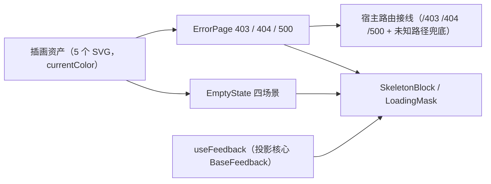

# 02 实施 · 异常与空状态

> 前端组件库 · 03 布局组件类 · 子任务 02（需求 03-2）· 实施记录

[文档首页](../../../../../文档首页.md) › [03 布局组件类](../../03_布局组件类.md) › [02 异常与空状态](../03_布局组件类_02_异常与空状态.md) › 实施记录　|　[← 任务](../03_布局组件类_02_异常与空状态.md)

## 1. 实施信息 

| 项 | 值 |
| --- | --- |
| 任务 | [02 异常与空状态](../03_布局组件类_02_异常与空状态.md) |
| 对应需求 | [03-2](../../../需求/03_需求_布局组件类.md#r03-2) |
| 详细设计 | [01 详细设计](../设计/02_详细设计_01_异常与空状态.md) |
| 实施日期 | 2026-09-18 |
| 实施人 | minjian |
| 实施环境 | 本地开发机（Node v24.20.0 / npm 11.19.0，npmmirror） |
| 提交 | 设计 `2096948c`；实施 `b7d228f0` |
| 结论 | 完成 |

## 2. 实施概览 

## 3. 实施过程 

1. **插画资产**：自绘 5 个线性 SVG（`empty-data` / `empty-result` / `empty-permission` / `empty-unselected` / `error`），`currentColor` 随主题；`src/env.d.ts` 声明 `*.svg` 模块。
2. **`ErrorPage`**：三码缺省文案 + 返回 / 重试；`retry` 追加显示重试（500 默认显示）；不展示技术堆栈。
3. **`EmptyState`**：四场景（`data` / `result` / `permission` / `unselected`）映射插画与缺省文案；`action` / `illustration` 插槽。
4. **`SkeletonBlock`**：列表 / 卡片 / 详情三形态（`el-skeleton`）。
5. **`LoadingMask`**：延迟展示防闪烁（缺省 200ms），卸载清理定时器。
6. **`useFeedback`**：实例化核心 `BaseFeedback`（派生链 `BaseFeedback → BaseNotice → BaseComponent → BasePluggable → BaseCapability → BaseObject`），经 `onLifecycle` 投影为响应式 `state`，四态与重试由核心承载。
7. **宿主接线**：`apps/desktop` 的 403 / 404 视图改用 `ErrorPage`，新增 500 视图（`/500`，重试重载），未知路径兜底 404；`@bms/ui-ep` 别名接入 vite / vitest / tsconfig。
8. 验证：根 `npm run check`、`apps/desktop` lint / 单测 / 构建 / 体积预算。

## 4. 问题与处置 

| # | 问题 / 现象 | 原因 | 处置 |
| --- | --- | --- | --- |
| 1 | `showRetry` 缺省时 500 不显示重试 | Vue 对未传布尔 prop 补齐 `false`，`??` 短路失效 | 改为追加语义 `retry?: boolean`（500 默认显示） |
| 2 | 模板传 `code="403"` 类型不合法 | 字面量为 `string` | 改绑定 `:code="403"`（`ErrorPageCode`） |

## 5. 验证结果 

| 验证点 | 方法 | 结果 |
| --- | --- | --- |
| 类型检查 / Lint | 根 `npm run check`（core / vue / ui-ep） | 通过 |
| 单测（ui-ep） | `npm run ui-ep:test` | 4 文件 / 20 用例全通过 |
| 宿主单测 | `apps/desktop` `npm run test:cov` | 6 文件 / 19 用例；覆盖率 97.95% |
| 宿主构建 | `npm run build` | 通过 |
| 体积预算 | `npm run budget` | 合计 61.5 KB（预算 260 KB） |

## 6. 偏差与遗留 

- **偏差**：无（按详细设计实施）。
- **遗留**：① 四态容器 `LoadingContainer` 随 `04_01`；② 骨架屏按真实页面结构的细化随 `04_01` / 域 05；③ 全局运行时错误处理器随阶段十二（宿主）。

> 本文档依《[文档生成规范](../../../../../规范/文档生成规范.md)》编写
