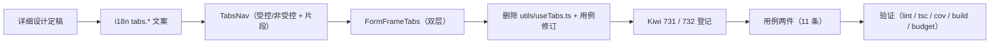

# 多标签导航实施记录

> 前端组件库 · 03 布局组件类 · 03 结构布局 · 03-3-1 多标签导航 · 实施记录

[文档首页](../../../../../../../文档首页.md) › [03-3 结构布局](../../03_布局组件类_03_结构布局.md) › 03-3-1 多标签导航 › 01 实施　|　[← 父任务](../../03_布局组件类_03_结构布局.md)

## 1. 实施信息 

| 项 | 值 |
| --- | --- |
| 任务 | [03-3-1 多标签导航](../03_布局组件类_03_结构布局_01_多标签导航.md) |
| 对应需求 | [03-3](../../../../../需求/03_需求_布局组件类.md#r03-3) |
| 详细设计 | [01 详细设计](../设计/01_详细设计_01_多标签导航.md) |
| 实施日期 | 2026-09-16 |
| 实施人 | minjian |
| 实施环境 | Linux 开发机（mjpc）；`frontend/`（Vue 3.5 + Vite 8 + Vitest 5 + Element Plus 2.14.5）；仅 PC 端 |
| 工时 | 9h（重估口径） |
| 结论 | 已完成（两件就位、过渡单例删除、用例与门禁通过） |

## 2. 实施概览 

结果小结：`TabsNav`（固定首签 / 打开激活 / 关闭激活相邻〔右 → 左〕/ 右键菜单五项 / 溢出滚动与自动滚入 / `maxOpen` LRU（非受控）/ `dirty` 关闭确认 / `refresh` emit / 受控回写）与 `FormFrameTabs`（列表固定 + 详情多开 + 关闭相邻计算）落地；状态核心经片段 `base/tabs/useTabs`（受控 / 非受控）；阶段一过渡单例 `utils/useTabs.ts` 删除并完成 Kiwi 23 正文修订留痕。

## 3. 实施过程 

1. 上下文：读片段 `base/tabs/useTabs`、`useConfirm`（`03_01`）、布局设计主框架 / 表单框架 / 响应式与节点 §4 / §5。
2. 决策确认（用户）：删过渡单例；不接 BasicLayout（`03_05` 编排）；用例 731 / 732。
3. 实现：i18n `tabs.*`（7 键）；`TabsNav.vue`（受控性 setup 时刻固定；右键菜单浮层；溢出 `scrollIntoView`；`maxOpen` 按 `lastActiveAt` LRU；`closeTab` 先算右邻再回写）；`FormFrameTabs.vue`（关闭详情计算相邻 → `update:activeKey`）；`confirmClose.ts`（双件共用确认）；`types.ts`；域出口 `index.ts`。
4. 删除 `utils/useTabs.ts`（无生产引用）；`utils.spec.ts` 移除 useTabs 段（Kiwi 23 正文修订，台账 §3 登记）。
5. Kiwi 登记（`register_cases.py`）：731 / 732。
6. 用例两件（11 条）；验证：lint / `vue-tsc -b` / `test:cov` / build / budget 全通过（详见测试记录）。

## 4. 问题与处置 

| # | 问题 / 现象 | 原因 | 处置与落点 |
| --- | --- | --- | --- |
| 1 | `useTabs` 片段 options 不接受 `undefined` 的 computed（TS 报错） | 受控时 `tabs`/`activeKey` 可能为 null | 条件展开构造 options（受控才传 `tabs`）；受控性固定为 setup 常量（设计对齐记录 8） |
| 2 | `TabNavItem` 从 SFC 导出失败 | `<script setup>` 不可 ES 导出 | 移入 `types.ts`（交付物清单已回写） |
| 3 | 非受控 `vm.openTab` 后 DOM 断言为空 | expose 调用后需渲染周期 | 测试 `await nextTick()`（测试口径） |
| 4 | 根类名输出 `bms-`（无短名） | `nsClass()` 无参只出前缀 | 全组件改 `nsClass('<kebab>')`（含回修 `03_01` / `03_02` 组件，实施记录说明） |
| 5 | 拖拽排序在非受控模式无落点 | 片段无整体写接口 | 拖拽仅受控生效（`update:tabs`）；设计对齐记录 9 |

## 5. 验证结果 

见[测试记录](../测试/01_测试_01_多标签导航.md) §3；frontend 全量 280 / 280 全绿（本嵌套新增 11 条）。

## 6. 偏差与遗留 

| # | 项 | 归口 / 去向 |
| --- | --- | --- |
| 1 | 类型 / 辅助文件新增、受控性与拖拽口径 | **已回写**设计（交付物清单 / 对齐记录 7~9） |
| 2 | 宿主编排（路由 watch 开签 / keep-alive 接线 / refresh 重挂载） | `03_05`（AppLayout） |
| 3 | 动态菜单路由白名单；标签图标 / 角标 | `03_04`；图标 / 通知任务（回补波） |
| 4 | 真实 keep-alive 效果核对 | `03_05` 组装时人工核对 |
| 5 | 基类与片段合规审计修复（2026-09-16）：`TabsNav` 徽标 `#fff` → `--bms-color-text-inverse`；标签内边距 4px → `--bms-space-1`；图标按钮 16px → `--bms-size-icon-default` | **已闭环**（[审计报告](../../../../../审计/01_审计_前端基类与片段合规.md)） |

> 本文档依《[文档生成规范](../../../../../../../规范/文档生成规范.md)》编写
