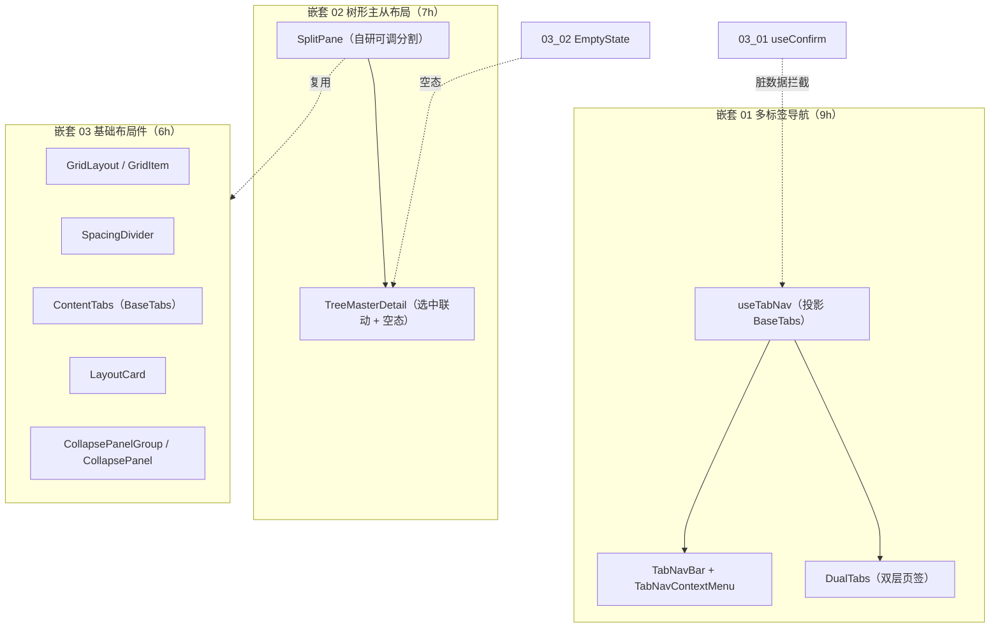

# 03 实施 · 结构布局

> 前端组件库 · 03 布局组件类 · 子任务 03（需求 03-3；含 3 个嵌套子任务）· 实施记录

[文档首页](../../../../../文档首页.md) › [03 布局组件类](../../03_布局组件类.md) › [03 结构布局](../03_布局组件类_03_结构布局.md) › 实施记录　|　[← 任务](../03_布局组件类_03_结构布局.md)

## 1. 实施信息 

| 项 | 值 |
| --- | --- |
| 任务 | [03 结构布局](../03_布局组件类_03_结构布局.md) |
| 对应需求 | [03-3](../../../需求/03_需求_布局组件类.md#r03-3) |
| 详细设计 | [01 多标签导航](../设计/01_详细设计_01_多标签导航.md) / [02 树形主从布局](../设计/02_详细设计_02_树形主从布局.md) / [03 基础布局件](../设计/03_详细设计_03_基础布局件.md) |
| 实施日期 | 2026-09-18 |
| 实施人 | minjian |
| 实施环境 | 本地开发机（Node v24.20.0 / npm 11.19.0，npmmirror） |
| 提交 | 设计 `ef1abdca`；实施 `84587791` |
| 结论 | 完成 |

## 2. 实施概览 

## 3. 实施过程 

### 3.1 嵌套 01 多标签导航（9h） 

1. `useTabNav()`：实例化核心 `BaseTabs` 派生状态类，投影 `tabs` / `activeKey` / `cachedKeys`，提供打开 / 激活 / 关闭（当前 / 其他 / 右侧 / 全部）/ 刷新 / 标记脏数据。
2. 关闭语义：`BaseTabs.close` 负责激活迁移（右邻 → 左邻）；固定页签（`closable: false`）拒绝关闭；脏数据经 `03_01` 的 `useConfirm` 二次确认。
3. keep-alive 名单 = 「路由 `meta.keepAlive`（页签项 `keepAlive`） ∩ 已打开页签」；`refresh` 临时移除缓存键并异步恢复以触发重建。
4. 持久化：`sessionStorage[storageKey]` 存 `{ tabs, activeKey }`，新实例恢复；隐私模式降级不抛错；脏数据不落库。
5. 组件：`TabNavBar`（页签 / 关闭按钮 / 超出折叠「更多」/ 右键菜单）+ `TabNavContextMenu`（刷新 / 关闭 / 关闭其他 / 关闭右侧 / 关闭全部，固定页签禁用关闭类）+ `DualTabs`（上下层，下层切换不改上层）。

### 3.2 嵌套 02 树形主从布局（7h） 

1. `SplitPane`：指针事件拖拽 + `[min, max]` 约束（含容器宽度，未测量时退化为 `max`）；键盘 `←` / `→`（或上下）微调；双击复位；禁用态不响应。
2. `TreeMasterDetail`：`SplitPane` + `el-tree`（`highlight-current` / `filter-node-method`）+ 过滤输入；选中联动 `select` / `update:selectedKey` / `tree-width-change`。
3. 空态：空树走 `EmptyState(type="data")`，未选中走 `EmptyState(type="unselected")`；`tree-header` / `tree` / 默认主区 / `empty` 插槽。

### 3.3 嵌套 03 基础布局件（6h） 

1. 六件均为 Element Plus 薄封装并沿用令牌属性协议：栅格（`GridLayout` / `GridItem`，24 栅 + 响应式断点）、间距分割线（`SpacingDivider`，间距档 `sm/md/lg` + 虚线）、分栏（复用嵌套 02 的 `SplitPane`）、内容页签（`ContentTabs`，状态经 `BaseTabs`）、卡片（`LayoutCard`，标题 / 附加区 / 页脚 / 标题栏折叠）、折叠面板（`CollapsePanelGroup` / `CollapsePanel`，手风琴与多项）。
2. 组合验证：栅格 + 卡片 + 折叠 + 分栏可组合挂载。

## 4. 问题与处置 

| # | 问题 / 现象 | 原因 | 处置 |
| --- | --- | --- | --- |
| 1 | `SplitPane` 首区尺寸计算 `computed<Record<string,string>>` 报类型错 | 三元分支产生可选属性 | 改用 `CSSProperties` |
| 2 | `el-tree` 过滤函数签名不匹配 `FilterNodeMethodFunction` | 参数逆变 | 过滤函数参数放宽为 `Record<string, unknown>` 后取值 |
| 3 | `el-tabs` 的 `type` 不含 `'line'` | EP 以空串表示 line | `tabType` 计算属性映射 `'line' → ''` |
| 4 | `el-collapse` 变更回调参数类型不匹配 | EP 使用 `CollapseModelValue` | 归一为 `string | string[]` 再派发 |
| 5 | jsdom 不支持向 `MouseEvent` 初始值写 `clientX` | 属性只读 | 用例以 `defineProperty` 构造指针事件并手动 `dispatchEvent` |

## 5. 验证结果 

| 验证点 | 方法 | 结果 |
| --- | --- | --- |
| 类型检查 / Lint | 根 `npm run check`（core / vue / ui-ep） | 通过 |
| 单测（ui-ep） | `npm run ui-ep:test` | 7 文件 / 49 用例全通过 |
| 宿主构建 / 体积 | `apps/desktop` `build` + `budget` | 通过；合计 61.5 KB（预算 260 KB） |

## 6. 偏差与遗留 

- **偏差**：无（按三份详细设计实施）。
- **遗留**：① 页签远端偏好同步（`sys_user_preference`）随阶段七 / 八；② 页签拖拽排序与下拉折叠交互优化随后续任务；③ 树节点懒加载 / 右键菜单随域 05 树类；④ 宿主路由接入 `useTabNav`（页签栏装配）随 `03_05 框架与容器`。

## 7. 基线整改（2026-09-18） 

- **问题**：本任务交付时部分件未挂继承链（纯 Element Plus 薄封装），与设计「派生 `BaseXxx`」口径不符；`ui-ep` 缺「组件须经基类」机器护栏。
- **整改**：组件统一接入 `ui-ep/src/composables/` 基类投影；新增护栏 `ui-ep/tests/guard-component-inheritance.spec.ts`（收紧为「须值引入 `Base*` 或基类投影，类型引入不算」）；《前端基类清单》§9 回写投影落点口径；提交 `df3f0e44`（代码）与本次文档回写。
+ **本任务整改点**：`useTabNav` 页签持久化改经 `useBasePersistedState`（`BasePersistedState`，本地即时状态 + 远端版本比对），`sessionStorage` 仅作存储 IO；布局族各件（栅格 / 分割线 / 分栏 / 卡片 / 折叠 / 页签导航 / 双层页签 / 右键菜单 / 侧边菜单）统一经 `useBaseLayout`（`BaseLayout`，含显隐）；`TreeMasterDetail` 另经 `useBaseTreeData`（`BaseTreeData`，节点 / 数据状态 / 过滤）。

- 整改后 `ui-ep` 全量：9 文件 / 57 用例（含组件继承链护栏 2 用例）。

> 本文档依《[文档生成规范](../../../../../规范/文档生成规范.md)》编写
