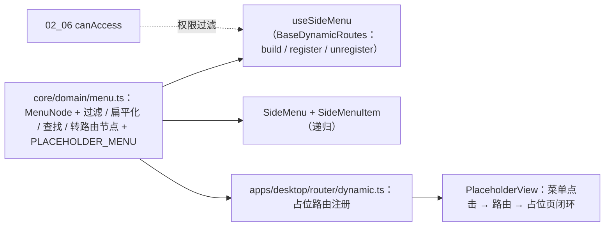

# 04 实施 · 侧边菜单

> 前端组件库 · 03 布局组件类 · 子任务 04（需求 03-4）· 实施记录

[文档首页](../../../../../../文档首页.md) › [03 布局组件类](../../03_布局组件类.md) › [04 侧边菜单](../03_布局组件类_04_侧边菜单.md) › 实施记录　|　[← 任务](../03_布局组件类_04_侧边菜单.md)

## 1. 实施信息 

| 项 | 值 |
| --- | --- |
| 任务 | [04 侧边菜单](../03_布局组件类_04_侧边菜单.md) |
| 对应需求 | [03-4](../../../../需求/03_需求_布局组件类.md#r03-4) |
| 详细设计 | [04 详细设计](../设计/04_详细设计_01_侧边菜单.md) |
| 实施日期 | 2026-09-18 |
| 实施人 | minjian |
| 实施环境 | 本地开发机（Node v24.20.0 / pnpm 11.x，npmmirror） |
| 提交 | 设计 `2207c931`；实施 `1acf6d8f` |
| 结论 | 完成 |

## 2. 实施概览 

## 3. 实施过程 

1. **菜单领域纯函数（核心）**：`core/src/domain/menu.ts` 提供 `MenuNode`、`filterMenuByPermission`（子节点全空且自身无权限的父节点剔除）、`filterMenuByKeyword`（命中保留祖先链 / 父命中保留子树）、`flattenMenu`、`findMenuByPath`、`toRouteNodes` 与 `PLACEHOLDER_MENU`（多级 / 徽标 / 权限项），并从核心入口导出。
2. **菜单组合式**：`useSideMenu()` 实例化核心 `BaseDynamicRoutes` 派生状态类，权限过滤后构建路由路径清单；`register` 去重保序、`unregister` 支持单路径与全量。
3. **侧边菜单件**：`SideMenu`（搜索框 + `el-menu` + 折叠 / 展开互斥）+ `SideMenuItem`（递归：`el-sub-menu` / `el-menu-item` + `el-badge` 徽标）；搜索本地过滤（复用核心关键词过滤）。
4. **宿主接线**：`apps/desktop/src/router/dynamic.ts` 实现 `installMenuRoutes` / `uninstallMenuRoutes` / `menuPaths`，跳过 `/` 与静态已存在路由，为占位菜单树其余路径注册指向 `PlaceholderView` 的占位路由；`main.ts` 挂载前安装。
5. **权限过滤**：菜单项 `permission` 码 + 宿主 `canAccess`（`utils/perm`，由会话权限码驱动），前端二次过滤与后端下发形成双保险。

## 4. 问题与处置 

| # | 问题 / 现象 | 原因 | 处置 |
| --- | --- | --- | --- |
| 1 | 核心用例 `describe is not defined` | 核心 Vitest 未开 globals | 显式从 `vitest` 引入 `describe` / `it` / `expect` |
| 2 | 权限全拒时父节点仍保留的用例预期错误 | 父节点下有公开子项（通知公告） | 修正用例：公开子项保留；另补「全权限子项 + 父无权限」剔除用例 |

## 5. 验证结果 

| 验证点 | 方法 | 结果 |
| --- | --- | --- |
| 类型检查 / Lint | 根 `pnpm run check`（core / vue / ui-ep） | 通过 |
| 单测（核心） | `core` `pnpm test` | 23 文件 / 126 用例全通过（新增 10） |
| 单测（ui-ep） | `pnpm run ui-ep:test` | 8 文件 / 55 用例全通过（新增 6） |
| 宿主单测 / Lint | `apps/desktop` `test:cov` / `lint` | 19 用例；覆盖率 97.95% |
| 宿主构建 / 体积 | `apps/desktop` `build` / `budget` | 通过；合计 64.5 KB（预算 260 KB） |

## 6. 偏差与遗留 

- **偏差**：无（按详细设计实施）。
- **遗留**：① 真实菜单树由后端按权限下发（认证 / RBAC 阶段），本期占位菜单树驱动；② 菜单图标资源登记随主题 / 图标任务；③ 主框架内菜单装配（折叠联动 / 与页签联动）随 `03_05`。

## 7. 基线整改（2026-09-18） 

- **问题**：本任务交付时部分件未挂继承链（纯 Element Plus 薄封装），与设计「派生 `BaseXxx`」口径不符；`ui-ep` 缺「组件须经基类」机器护栏。
- **整改**：组件统一接入 `ui-ep/src/composables/` 基类投影；新增护栏 `ui-ep/tests/guard-component-inheritance.spec.ts`（收紧为「须值引入 `Base*` 或基类投影，类型引入不算」）；《前端基类清单》§9 回写投影落点口径；提交 `df3f0e44`（代码）与本次文档回写。
+ **本任务整改点**：`SideMenu` 与递归子件 `SideMenuItem` 均经 `useBaseLayout`（`BaseLayout`）；`useSideMenu` 权限判定改经 `useBaseAccess`（`BaseAccess`，支持 `codes` / `setCodes`，缺省放行语义保留）。

- 整改后 `ui-ep` 全量：9 文件 / 57 用例（含组件继承链护栏 2 用例）。

> 本文档依《[文档生成规范](../../../../../../规范/文档生成规范.md)》编写
