# 框架与容器实施记录

> 前端组件库 · 03 布局组件类 · 05 框架与容器 · 实施记录

[文档首页](../../../../../../文档首页.md) › [03-5 框架与容器](../03_布局组件类_05_框架与容器.md) › 01 实施　|　[← 父任务](../03_布局组件类_05_框架与容器.md)

## 1. 实施信息 

| 项 | 值 |
| --- | --- |
| 任务 | [03-5 框架与容器](../03_布局组件类_05_框架与容器.md) |
| 对应需求 | [03-5](../../../../需求/03_需求_布局组件类.md#r03-5) |
| 详细设计 | [01 详细设计](../设计/01_详细设计_05_框架与容器.md) |
| 实施日期 | 2026-09-16 |
| 实施人 | minjian |
| 实施环境 | Linux 开发机（mjpc）；`frontend/apps/desktop/`（Vue 3.5 + Vue Router + Pinia + Vitest 5 + Element Plus 2.14.5） |
| 工时 | 10h（重估口径） |
| 结论 | 已完成（三壳 + 宿主编排就位，应用实际装配；用例与门禁通过；**域 03 收官**） |

```mermaid
flowchart LR
    D["详细设计定稿"] --> I["i18n layout.* 文案"]
    I --> R["router/routeComponent.ts（组件名约定 / 视图解析）"]
    R --> N["router/menuRoutes.ts + menuBootstrap.ts（菜单 → 路由注册 / 动态引导）"]
    N --> P["PlaceholderView + 占位菜单补 component"]
    P --> L["AppLayout（侧栏 + 顶栏 + 内容 + 标签）/ PageContainer"]
    L --> F["useFormFrame + FormFrame（列表固定 + 详情多开）"]
    F --> H["layouts/BasicLayout.vue 重写（keep-alive + 开签 + refresh）"]
    H --> M["main.ts 装配（mount + 动态菜单引导）"]
    M --> K["Kiwi 739 / 740 / 741 登记"]
    K --> T["用例三件（11 条）"]
```

## 2. 实施概览 

结果小结：三件壳与宿主编排落地——`AppLayout`（区域插槽 / 折叠 / 菜单 / 顶栏 / 内容 / 标签）、`PageContainer`（标题 / 描述 / 工具栏 / 底部）、`FormFrame` + `useFormFrame`（列表固定 + 详情多开（`drawer` / `page`）/ 组件映射（`key` → 打开方式）/ dirty 确认 / 刷新与关闭清理）；`BasicLayout` 重写为宿主（`AppLayout` 组合 `SideMenu` / `TabsNav` / keep-alive 内容区，路由变化开签，折叠持久化，refresh 版本重挂载，窄屏侧栏抽屉）；`routeComponent` / `menuRoutes` / `menuBootstrap`（组件名约定与视图解析、菜单 → 动态路由注册、引导动态导入）；`PlaceholderView` 占位；菜单叶子补齐 `component` 字段。

## 3. 实施过程 

1. 上下文：读节点 §3 / §4、布局设计主框架 / 表单框架 / 页面容器 / 导航、契约（`useTabs` / `useLayout` / `useAccess` / `MenuStore` 等均已交付）。
2. 决策确认（用户）：三件壳 + 宿主编排全量落地；菜单 → 路由注册统一经动态路由能力；未注册组件回退占位视图；keep-alive 精确缓存在实现层校验（`:include` 未命中则退 `:max`）。
3. 实现：`router/routeComponent.ts`（`nameComponent` / `resolveView` 经 `import.meta.glob` 懒加载）；`router/menuRoutes.ts`（`buildRoutes` 递归（目录 → 子路由，叶子 → 组件或占位）/ `addRoute` 幂等注册）；`router/menuBootstrap.ts`（占位 loader 注入 → `load()` → 注册，`main.ts` 动态导入）；`views/PlaceholderView.vue`；`components/layout/AppLayout.vue`、`PageContainer.vue`、`useFormFrame.ts`、`FormFrame.vue`（`index.ts` 追加导出）；`layouts/BasicLayout.vue` 重写；`main.ts` 装配（`app.mount` 后 `void import('./router/menuBootstrap')…`）；`config/placeholder-menu.ts` 叶子补 `component`；`components/menu/types.ts` 补 `component?: string`；`routes.ts` 首页包装为 `BasicLayout` 子路由（`name: 'Workbench'`）。
4. keep-alive 口径：`:max="12"`（= 标签上限 maxOpen）LRU + 内容 key（`contentKey = (route.name ?? route.path) + '#' + (refreshVersions[name] ?? 0)`）——`refresh` 变更即重挂载；`:include` 按组件名精确缓存在 router-view + 插槽场景未命中（根因未定位，登记优化项）。
5. Kiwi 登记（`register_cases.py`）：739 / 740 / 741；用例三件（11 条，4 / 4 / 3）；全量验证通过。

## 4. 问题与处置 

| # | 问题 / 现象 | 原因 | 处置与落点 |
| --- | --- | --- | --- |
| 1 | keep-alive `:include`（组件名）未命中，切回标签页面重挂载 | **复盘修正（2026-09-16）**：测试装置层级错位——直接 mount 路由组件使内部 `router-view` 成为根级（keep-alive 缓存的是内层布局组件而非页面组件）；另首渲染 `include=[]`（空数组）被判定为「不匹配」，首签不缓存 | 实现：`:include`（已开标签签，宿主维护 `openedKeys`：setup 预置首签 / 随路由开签 / 经 `TabsNav` 关闭事件重读清单）+ `:max` 兜底；关闭标签即时释放；列表空时传 `undefined`；用例装置改经根 router-view 挂载（对齐记录 6 / 9）；设计已回写 |
| 2 | 占位菜单叶子组件未注册（菜单数据带 `component` 但视图不存在） | 菜单 / 页面注册接线缺失 | `resolveView` 未命中回退 `PlaceholderView`（占位视图）；菜单叶子补 `component` 字段；设计含 |
| 3 | 详情关闭后列表刷新时 `listRef` 已卸载（ref 为空） | 详情与列表切换的挂载时序 | `onDetailSaved` / `onDetailDeleted` 改为 `void nextTick(refreshList)`；设计对齐记录 8 |
| 4 | 详情 key 中数字 id 经路由 / 标签传递后变字符串 | 标签键为字符串拼接 | `detailIdFromKey` 将纯数字串还原为 number（组件映射 props 契约） |
| 5 | 构建体积超预算（164.2 / 130 KB） | 宿主完整装配后守卫 / 基座 / axios 链与组件库代码进入产物（此前未被引用被 tree-shake） | 用户拍板预算 130 / 90 → **200 / 100 KB**（真实装配体积）；规范 §14 调整记录 |
| 6 | 菜单引导静态依赖使基座代码提升为应用入口共享 chunk | `main.ts` 顶层静态 `import` 菜单 store / 注册 | 抽 `router/menuBootstrap.ts` 并由 `main.ts` 动态导入（分包与体积口径）；设计已回写（对齐记录 7） |
| 7 | keep-alive 用例以 `mounted` 计数断言不稳定（缓存实现变更后失效） | 断言依赖挂载时序 | 改为 DOM 元素同一性断言（切回 `toBe` 同元素；refresh 后 `not.toBe`）；测试记录 §4 |
| 8 | `FormFrame` 模板属性顺序 lint 告警（`v-else-if` / `:is` / `:key`） | `vue/attributes-order` | 按规则顺序调整（`:is` → `v-else-if` → `:key`） |

## 5. 验证结果 

见[测试记录](../测试/01_测试_05_框架与容器.md) §3；全量 47 文件 / **301 用例全绿**（本任务新增 11 条）；覆盖率语句 87.5% / 分支 79.32%；构建与体积门禁通过（**164.3 / 200 KB**、49.1 / 100 KB）。

## 6. 偏差与遗留 

| # | 项 | 归口 / 去向 |
| --- | --- | --- |
| 1 | keep-alive 落地口径（`:include` 精确 + `:max` 兜底 + 内容 key）；菜单引导动态导入；刷新时序；路由组件类用例挂载装置 | **已回写**设计（§4.4 / 对齐记录 6~9） |
| 2 | ~~keep-alive 精确缓存与关闭标签即时释放~~ | **已闭环（2026-09-16 复盘后补齐，计划 §3.1-40）** |
| 3 | 真实菜单接口与权限下发（`configureMenuLoader` 注入） | 认证阶段（阶段七 ~ 八） |
| 4 | 登录页本体（守卫占位跳转的真实链路） | 页面任务 + 认证阶段 |
| 5 | 顶栏元素（语言 / 搜索 / 通知 / 用户）与 `IconDisplay` 图标渲染 | 回补波任务 |
| 6 | 详情表单本体（表单渲染器）与 `FormFrame` 的 `detail` 缓存即时释放、`drawer` / `page` 打开方式按需优化 | 表单渲染器任务 / 机会项 |
| 7 | 占位视图与占位菜单替换（真实页面 / 菜单接入） | 认证阶段 + 阶段十五页面任务（计划 §3.1-41） |
| 8 | 真机全站核对（域 03 收口核对项：主框架组装、菜单折叠 hover 弹层、标签与内容区缓存表现） | 域 03 收口核对（随登录页 / 页面任务复查） |

> 本文档依《[文档生成规范](../../../../../../规范/文档生成规范.md)》编写
