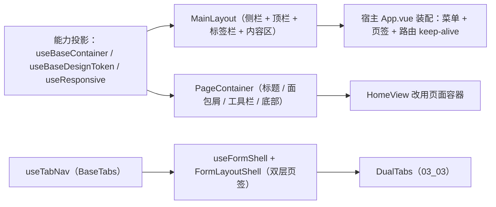

# 05 实施 · 框架与容器

> 前端组件库 · 03 布局组件类 · 子任务 05（需求 03-5）· 实施记录

[文档首页](../../../../../../文档首页.md) › [03 布局组件类](../../03_布局组件类.md) › [05 框架与容器](../03_布局组件类_05_框架与容器.md) › 实施记录　|　[← 任务](../03_布局组件类_05_框架与容器.md)

## 1. 实施信息 

| 项 | 值 |
| --- | --- |
| 任务 | [05 框架与容器](../03_布局组件类_05_框架与容器.md) |
| 对应需求 | [03-5](../../../../需求/03_需求_布局组件类.md) |
| 详细设计 | [05 详细设计](../设计/05_详细设计_01_框架与容器.md) |
| 实施日期 | 2026-09-18 |
| 实施人 | minjian |
| 实施环境 | 本地开发机（Node v24.20.0 / npm 11.19.0，npmmirror） |
| 提交 | 设计 `e4a8c5b6`；实施 `27111fbb` |
| 结论 | 完成 |

## 2. 实施概览 

## 3. 实施过程 

1. **能力投影**：`useBaseContainer`（`BaseContainer`：可折叠 / 折叠态 / 分栏）、`useBaseDesignToken`（`BaseDesignToken`：令牌 / 主题）、`useResponsive`（断点取 `BaseDesignToken.breakpoints`，`matchMedia` 优先、无则退化 `resize` / 宽屏）。
2. **主框架布局壳**：`MainLayout` 区域编排（侧栏 / 顶栏 / 标签栏 / 内容区）+ `logo` / `header-left` / `header-right` / 默认插槽；折叠经 `useBaseContainer` + `useBasePersistedState`（`sessionStorage`）持久化；窄屏（`< narrow`）自动折叠、移动端（`< mobile`）侧栏改 `el-drawer` 并在路由切换时收起；断点变化回传 `breakpoint-change`。
3. **页面容器**：`PageContainer` 标题 / 描述 / 面包屑 / 右上工具栏 / 内容 / 底部操作栏 / 返回；头部 `sticky`（缺省开启），内容区独立滚动，缺失区域不渲染空容器。
4. **表单框架壳**：`useFormShell` 基于 `useTabNav`（`BaseTabs`）管理「列表固定 + 详情多开」（同记录激活 / 不同记录新开 / `cacheDetail` 参与 keep-alive / 脏数据 / `refreshToken` 列表刷新信号）；`FormLayoutShell` 复用 `03_03` 的 `DualTabs` 渲染双层页签并归一为 `select(key)`。
5. **宿主装配**：`App.vue` 以 `MainLayout` 装配 `useSideMenu`（占位菜单树）+ `useTabNav`（会话恢复）+ `router-view` `keep-alive`（名单 = `meta.keepAlive` ∩ 已打开页签，按组件名缓存）；路由补 `meta.title` / `meta.keepAlive`（首页 `HomeView`）；`HomeView` 改用 `PageContainer`。
6. 验证：根 `npm run check`、宿主 lint / 单测 / 构建 / 体积预算。

## 4. 问题与处置 

| # | 问题 / 现象 | 原因 | 处置 |
| --- | --- | --- | --- |
| 1 | `vue/no-dupe-keys`：`collapsed` 与投影 ref 重名 | 组件内投影与 prop 同名 | 投影面改名 `collapsedState` |
| 2 | `vue-tsc` 认为模板 `:menu="menu"` 传的是 `Ref` | 解构出来的 ref 未在模板自动解包（vue-tsc 限制） | 改为 `sideMenu.menu.value` 显式取值 |
| 3 | `vue/multi-word-component-names`：`Home` 单词名 | 组件名规范要求多词 | 组件与路由名统一为 `HomeView`，标题仍为「工作台」 |

## 5. 验证结果 

| 验证点 | 方法 | 结果 |
| --- | --- | --- |
| 类型检查 / Lint | 根 `npm run check`（core / vue / ui-ep） | 通过 |
| 单测（ui-ep） | `npm run ui-ep:test` | 12 文件 / 70 用例全通过（新增 13） |
| 单测（核心 / 绑定） | `core` / `vue` | 126 / 2 用例通过 |
| 宿主 Lint / 单测 | `apps/desktop` `lint` / `test:cov` | 通过；19 用例，覆盖率 97.95% |
| 宿主构建 / 体积 | `apps/desktop` `build` / `budget` | 通过；合计 99.4 KB（预算 260 KB），最大单文件 84.4 KB（预算 150 KB） |

## 6. 偏差与遗留 

- **偏差**：无（按详细设计实施）。
- **遗留**：① 顶栏元素（通知 / 搜索 / 用户信息）以插槽占位，随交互类与主题任务；② 侧栏折叠远端偏好同步随偏好持久化能力就绪；③ 详情页签缓存上限淘汰随性能优化任务；④ 页面组件按「组件名 = 路由名 + `meta.keepAlive`」约定参与 keep-alive，真实页面接入时遵循。

> 本文档依《[文档生成规范](../../../../../../规范/文档生成规范.md)》编写
