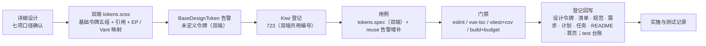

# 基础令牌落地实施记录

> 前端组件库 · 03 布局组件类 · 06 基础令牌落地 · 实施记录

[文档首页](../../../../../../文档首页.md) › [03-6 基础令牌落地](../03_布局组件类_06_基础令牌落地.md) › 01 实施　|　[← 父任务](../03_布局组件类_06_基础令牌落地.md)

## 1. 实施信息 

| 项 | 值 |
| --- | --- |
| 任务 | [03-6 基础令牌落地](../03_布局组件类_06_基础令牌落地.md) |
| 对应需求 | [02-2](../../../../需求/02_需求_基础组件类.md#r02-2)（基础令牌遗留收口） |
| 详细设计 | [01 详细设计](../设计/01_详细设计_06_基础令牌落地.md) |
| 实施日期 | 2026-09-16 |
| 实施人 | minjian |
| 实施环境 | Linux 开发机（mjpc）；Node v24.20.0 / npm 11.19.0；`frontend/apps/desktop/`、`frontend/apps/mobile/`（Vue 3.5 + Vite 8 + Vitest 5 + sass 1.104）；Kiwi TCMS 容器 `bms-kiwi` |
| 工时 | 4h（重估口径） |
| 提交 | 见本记录 §3 第 9 步（代码与文档分笔提交） |
| 结论 | 已完成（双端令牌落地、EP / Vant 映射生效、用例与门禁全绿） |

## 2. 实施概览 

结果小结：《布局设计 · 设计令牌》五组基础令牌（色彩 / 字体 / 间距 / 圆角 / 阴影）双端落地；`tokens.scss` 的 size 字号与 density 间距改为引用基础令牌（属性协议不变）；PC 端映射 Element Plus（五色 + 30 档色阶 `color-mix()` 运行时派生 + `-rgb` 三元组 + 圆角 + 字体）、移动端映射 Vant 四语义色；`BaseDesignToken` 补齐「未定义令牌开发态告警」契约（按名去重、显式回退不告警）。双端各 214 条用例全绿，门禁与体积预算达标。

## 3. 实施过程 

1. **上下文**：按《AI开发规范》§2 顺序读规范（前端开发规范 §3/§9、命名规范）→ 设计（[设计令牌](../../../../../../设计/布局设计/02_布局设计_设计令牌.html)、[主题与租户品牌化](../../../../../../设计/布局设计/03_布局设计_主题与租户品牌化.html)、[设计令牌片段节点 24](../../../../../../设计/组件设计/02_基础组件类/02_能力片段/24_组件设计_设计令牌片段/24_组件设计_设计令牌片段.md)）→ 项目（任务 03-6、计划 §3.1、需求 02-2 注块）→ 现状（双端 `tokens.scss`、`design-token.ts`、`main.ts` 导入顺序、tsconfig、既有用例与护栏）。
2. **决策确认**（question 逐项）：① 间距命名**数字步进** `--bms-space-{n}`（解释扩展性后定案，设计 html 补语义映射表）；② 字体四类全落；③ 阴影三档含建议值；④ EP 完整映射（含色阶 `color-mix()` 派生）；⑤ `BaseDesignToken` 告警本次补齐；⑥ Vant 一并映射（范围外补充项，仅 mobile 段）。
3. **双端 `tokens.scss`**：
   - 基础令牌五组：色彩 10（含 `bg-page` 页面灰 / `bg` 卡片面白）、字体 13（family / mono / size xs~xxl / weight normal~bold / line-height compact~loose）、间距 6（`1/2/3/4/6/8` = 4 / 8 / 12 / 16 / 24 / 32px）、圆角 3、阴影 3；
   - size / density 引用映射：字号 12 / 14 / 16 → `--bms-font-size-{xs,base,lg}`，间距 4 / 8 / 16 → `--bms-space-{1,2,4}`（控件高度 / 图标 / 行高保持直值）；属性协议选择器不变；
   - PC 段：`$ep-semantic-colors` + `@each` 生成五色 `--el-color-*` 与 `light-3/5/7/8/9`、`dark-2`（`color-mix()`，比例对齐 EP SCSS 生成口径）+ `-rgb` 五色静态三元组 + 圆角 small/base + `--el-font-family` / `--el-font-size-base`；
   - 移动端段：`--van-{primary,success,warning,danger}-color`（变量名按 vant@4.10.2 本地实测）。
4. **`design-token.ts`（双端）**：新增模块级 `warnedTokens` 去重集与 `warnUndefinedToken()`（`import.meta.env.DEV` 守卫 + `console.warn`，不依赖根系）；`token()` 在无显式回退且默认回退为空时告警；`spacing(n)` 读不到令牌时告警并回落计算值。
5. **Kiwi 登记（先登记后编码）**：经容器内 Django shell 登记（与 `register_cases.py` 等价），回读 **723**（分类「平台骨架」、P2、CONFIRMED、标签「自动化」）；test 仓补 `cases/2026-09-16_阶段四03-06_基础令牌.json` 幂等输入留痕。
6. **用例**：新增 `frontend/apps/{desktop,mobile}/tests/tokens.spec.ts`（双端，Kiwi 723，3 条——经 `sass.compile` 编译 tokens.scss 后断言：五组令牌 / 引用映射与属性协议 / 端映射与 `-rgb`）；`frontend/apps/{desktop,mobile}/tests/base-fragments-reuse.spec.ts` 的 design-token 用例增补告警断言（Kiwi 708 内：显式回退不告警 / 无回退告警一次 / 同名去重 / spacing 缺失告警）。
7. **同接口多实现**：基础令牌段与 `design-token.ts` 逐字同款；映射段按端差异（PC=EP、移动端=Vant，符合节点 24 §7「令牌集按端定义」）。
8. **验证**：见[测试记录](../测试/01_测试_06_基础令牌落地.md) §3（含构建产物覆盖顺序校验）。
9. **提交**：代码（`feat(前端)`）与文档（`docs(项目)`）分笔提交；test 仓（cases / 台账）独立提交。
10. **回写**：《布局设计 · 设计令牌》html（「工程命名映射」节 + 阴影具体值 + bg / bg-page 名序澄清 + `tokens.css` → `tokens.scss` 命名 + size / density 引用口径更新）、《[前端基类清单](../../../../../../前端基类清单.md)》§7、《[前端开发规范](../../../../../../规范/前端开发规范.md)》§9、需求 02-2 注块、计划（§1 工时 / §2 已完成 / §3 剩余 / §3.1 第 10、38 行 / §4 甘特注释）、任务 03-6 与域总览、阶段 README、文档首页 §5.11 / §5.12；test 仓台账（§2 第 23 行 / §3 最新批次 / §4 对账）。

## 4. 问题与处置 

| # | 问题 / 现象 | 原因 | 处置与落点 |
| --- | --- | --- | --- |
| 1 | EP 映射段为 SCSS `@each` 插值生成，源文件无 `--el-color-primary` 字面量 | 文本断言无法覆盖插值产物 | 用例改用 `sass.compile()` 编译产物断言（真实编译路径，兼验 SCSS 语法与插值展开） |
| 2 | EP 透明场景需 `--el-color-*-rgb` 三元组（设计未列） | EP 部分组件用 `rgba(var(--el-color-*-rgb), α)` | 实施期补全五色静态映射；详细设计 §4.3 与对齐记录第 8 条同步；租户动态跟随登记计划 §3.1 第 38 行（品牌化任务） |
| 3 | 设计 html bg / bg-page 名序与值对应存疑（`--color-bg` / `--color-bg-page` = 页面 / 卡片） | 原文表格名序与值疑似错位 | 按「命名与语义一致」落值（`bg-page` 页面灰 / `bg` 卡片白）并修正 html 表格名序（对齐记录第 7 条） |
| 4 | Kiwi 登记未走 test 仓 `register_cases.py`（以容器内 Django shell 直接登记） | 现场按部署说明模板直连登记 | 编号回读正确（723）；事后补 `cases/…json` 幂等输入留痕并在台账注明登记方式；后续批次统一走脚本 |

## 5. 验证结果 

双端 `eslint` / `vue-tsc -b` / `vitest run --coverage`（各 **214 / 214** 全绿，覆盖率语句 88.92% / 分支 80.24%）/ `build` / `budget`（PC 95.3 / 100 KB、移动端 77.9 / 83 KB）全通过；构建产物校验：`--el-color-primary:var(--bms-color-primary)` 位于 EP 默认声明之后（覆盖生效）、`color-mix` 30 处、`-rgb` 5 处、移动端 `--van-primary-color:var(--bms-color-primary)`。逐条命令与输出摘要见[测试记录](../测试/01_测试_06_基础令牌落地.md) §3。

## 6. 偏差与遗留 

| # | 项 | 归口 / 去向 |
| --- | --- | --- |
| 1 | 暗色主题 / 租户品牌覆盖（`[data-theme]` / `[data-tenant]`；色阶与 `-rgb` 动态跟随、衍生色生成） | 主题与租户品牌化任务（计划 §3.1 第 38 行） |
| 2 | EP 背景 / 文本 / 边框 / `fill-*` 与 Vant 其余变量映射 | 品牌化任务（同上） |
| 3 | `color-mix()` 浏览器基线真机确认（内网 PC 环境） | 构建期验证通过；真机视觉随 `03_01` ~ `03_05` 组件任务与页面任务核对 |
| 4 | 阴影 / 色彩的暗色模式适配值 | 品牌化任务 |
| 5 | 布局组件样式消费与硬编码回归 | `03_01` ~ `03_05` 各自用例 |

- **处理偏差与遗留**：
  - **计划 §3.1**：第 10 行（基础令牌）标记**已闭环**；新增第 38 行登记「`-rgb` 与色阶的租户动态覆盖」归品牌化任务（出处 `03_06`）。
  - **需求 02-2 注块**：基础令牌遗留标记已闭环（含映射与告警）。
  - **设计同步**：详细设计 §4.3 补 `-rgb`、对齐记录补第 7 / 8 条；设计 html 已完成命名映射登记。
  - **不处理的开放项**：EP / Vant 其余变量的静态映射不做（品牌化任务一次做全，避免半套）。
- **结论**：本任务偏差已记录、遗留已全部登记去向，偏差与遗留处理完成。

> 本文档依《[文档生成规范](../../../../../../规范/文档生成规范.md)》编写
