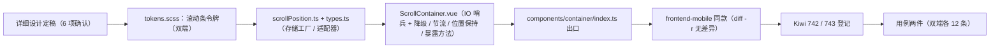

# 滚动容器实施记录

> 前端组件库 · 04 容器组件类 · 01 滚动容器 · 实施记录

[文档首页](../../../../../../文档首页.md) › [04 容器组件类](../../04_容器组件类.md) › [04-1 滚动容器](../04_容器组件类_01_滚动容器.md) › 01 实施　|　[← 任务文档](../04_容器组件类_01_滚动容器.md)

## 1. 实施信息 

| 项 | 值 |
| --- | --- |
| 任务 | [04-1 滚动容器](../04_容器组件类_01_滚动容器.md) |
| 对应需求 | [04-1](../../../../需求/04_需求_容器组件类.md#r04-1) |
| 详细设计 | [01 详细设计](../设计/01_详细设计_01_滚动容器.md) |
| 实施日期 | 2026-09-16 |
| 实施人 | minjian |
| 实施环境 | Linux 开发机（mjpc）；`frontend/` 与 `frontend-mobile/`（Vue 3.5 + Vitest 5；双端同款交付，`diff -r` 无差异） |
| 工时 | 4h（重估口径） |
| 结论 | 已完成（组件 / 位置存储 / 令牌就位；双端用例与门禁通过） |

## 2. 实施概览 

结果小结：`ScrollContainer` 落地——高度（`height` / `maxHeight` 数字按 px / 字符串原样 / `auto`）、滚动条（默认 CSS 样式化消费 `--bms-scrollbar-*`；`nativeScrollbar` 系统默认；移动端媒体查询隐藏）、触底 / 触顶（IntersectionObserver 哨兵 + `threshold` 预提前量；IO 不可用降级 scroll 计算；进入一次 / 离开重置）、`scroll` 节流（leading + trailing）、位置保持（`keepPosition` + `positionKey` 经可注入存储）、`header` / `footer` 固定插槽与暴露方法（`scrollTo*` / `scrollTop` / `el`）；`scrollPosition.ts`（内存单例默认 + `sessionStorage` 适配器预留）；滚动条令牌双端落地。

## 3. 实施过程 

1. 上下文：读节点《组件设计 · 滚动容器》§3 / §4 / §6 / §8、容器片段 `useContainer`（区域语义）、`useComponentBase` 约定与既有组件范文（`PageContainer`）。
2. 决策确认（用户 6 项）：IO + 降级 / CSS 样式化滚动条 / `positionKey` + 可注入存储 / 完整方法与事件 / `header`·`footer` 插槽 / 令牌与上游回写（见设计 §1 与 §10 对齐记录）。
3. 令牌：`tokens.scss` 增量滚动条令牌（`--bms-scrollbar-size/radius/thumb/thumb-hover/track`，双端同款）。
4. 实现：`types.ts`（`ScrollMetrics` / `ScrollStorage` / `ScrollPositionStore`）；`scrollPosition.ts`（内存适配器单例 / `sessionStorage` 适配器（可写探测 + 不可用回落）/ 存储工厂（取整 / 非法值忽略））；`ScrollContainer.vue`（模板 + IO / 降级 / 节流 / 位置保持 / 暴露方法）；`index.ts` 出口；`frontend-mobile/` 同款复制（`diff -r` 无差异）。
5. Kiwi 登记（`register_cases.py`）：**742**（滚动容器）/ **743**（滚动位置存储与保持）；双端用例两件（各 12 条）；双端全量门禁通过。

## 4. 问题与处置 

| # | 问题 / 现象 | 原因 | 处置与落点 |
| --- | --- | --- | --- |
| 1 | jsdom 未实现 `Element.scrollTo`（暴露方法用例报错） | 测试环境缺口 | 用例内以同步赋值模拟 `scrollTo`（`options.top` / 数字入参）；组件实现不变 |
| 2 | jsdom 无 `IntersectionObserver`（触底路径不可测） | 测试环境缺口 | 用例以 `IOStub` 记录回调与选项手动触发（进入 / 离开），并另测 `stubGlobal('IntersectionObserver', undefined)` 的 scroll 降级路径 |
| 3 | 「positionKey 变更」用例双实例交互断言不稳（真实语义混杂） | 用例设计过重 | 拆为「变更记录旧键」与「新键预置后挂载恢复」两段断言（组件行为未变） |
| 4 | 阈值 `threshold` 双用途（IO `rootMargin` 与 scroll 容差） | 设计简化取向 | 同一 prop 两路径共用；已在设计 §4.1 / §5 写明 |
| 5 | 位置恢复在内容异步渲染（高度未就绪）时偏差 | DOM 时序 | `nextTick` 后恢复 + 一次 `requestAnimationFrame` 重试；已知限制登记（设计 §9-4） |

## 5. 验证结果 

见[测试记录](../测试/01_测试_01_滚动容器.md) §3；双端全量：`frontend` **49 文件 / 313 用例**（本任务新增 12）、覆盖率语句 87.68% / 分支 79.36%、体积 164.3 / 200 KB；`frontend-mobile` **31 文件 / 226 用例**（本任务新增 12）、覆盖率语句 89.1% / 分支 80.33%、体积 78.0 / 83 KB。

## 6. 偏差与遗留 

| # | 项 | 归口 / 去向 |
| --- | --- | --- |
| 1 | 三项上游登记（布局设计 04「内容区」/ 设计令牌 02「滚动条令牌」/ 架构 08「组件分层」） | **已回写**（2026-09-16）；组件设计节点检查清单已勾选 |
| 2 | `sessionStorage` 位置持久化适配器 | 已交付未默认启用（设计 §4.5）；接持久化场景时经 `createScrollPositionStore(createSessionScrollStorage())` 启用 |
| 3 | 内容异步渲染下的位置恢复偏差 | 已知限制（`nextTick` + 一次 rAF 重试；设计 §9-4） |
| 4 | 移动端用例人工核对（双端同号 742 / 743；触屏滚动 / 上拉加载表现） | 域 04 收口核对项（随移动端页面任务复查） |
| 5 | 真机视觉核对（滚动条样式 / hover / 移动端隐藏） | 域 04 收口核对项 |
| 6 | 暗色主题下的滚动条令牌 | 品牌化 / 暗色任务（随主色体系） |

> 本文档依《[文档生成规范](../../../../../../规范/文档生成规范.md)》编写
